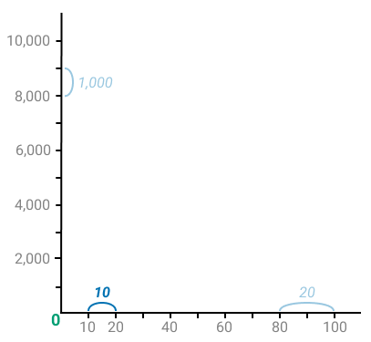
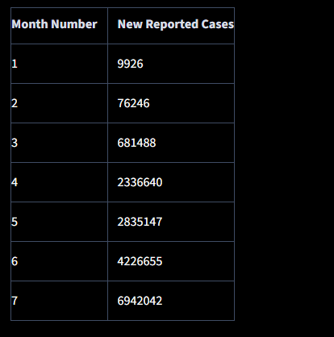
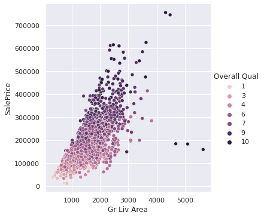
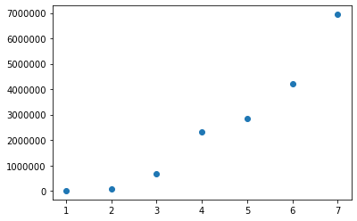
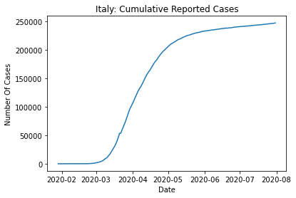
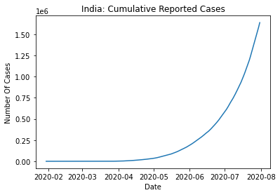
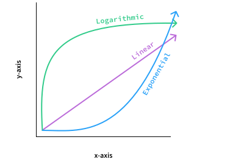
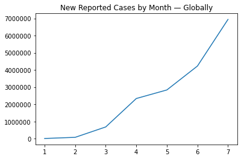
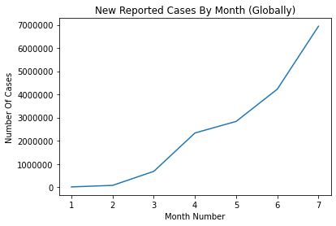
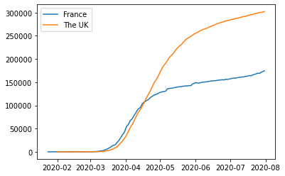

# Types of Visualization

At the heart of any data science workflow is data exploration. Most commonly, we explore data by using the following:

- Statistical methods (measuring averages, measuring variability, etc.)
- **Data visualization** (transforming data into a visual form)

This indicates that one of the central tasks of data visualization is to help us explore data.

The other central task is to help us communicate and explain the results we've found through exploring data. That being said, we have two kinds of data visualization:

- Exploratory data visualization: we build graphs for *ourselves* to explore data and find patterns.
- Explanatory data visualization: we build graphs for *others* to communicate and explain the patterns we've found through exploring data.


## Graphs

We can create a graph by drawing two lines at right angles to each other. Each line is called an **axis** — the horizontal line at the bottom is the **x-axis**, and the vertical line on the left is the **y-axis**. The point where the two lines intersect is called the **origin**.


Each axis has length — below, we see both axes marked with numbers, which represent unit lengths.


The length of the axes helps us precisely locate any point drawn on the graph. Point *A* on the graph below, for instance, is seven length units away from the y-axis and two units away from the x-axis.


The two numbers that represent the distances of a point from the x- and y-axis are called **coordinates**. Point *A* above has two coordinates: seven and two. Seven is the x-coordinate, and two is the y-coordinate.

The coordinates often appear in the form (x, y), with the x-coordinate first. So the coordinates of *A* are (7, 2). So, here's what we need to know about coordinates:

- The x-coordinate shows the distance in unit lengths relative to the y-axis.
- The y-coordinate shows the distance in unit lengths relative to the x-axis.

The unit lengths of the x- and y-axes doesn't have to be the same. Below, we see the unit of length on the x-axis is 10, while on the y-axis it is 1,000 (note that we can also hide some of the numbers to make the graph look better).




### Interpreting the graph

Below, we see a table showing the number of new COVID-19 infections reported world-wide for the first seven months of 2020:



Each row shows a pair of two connected data points:

1. The month number (where one means January, two means February, and so on)
2. The number of cases reported for that month

When we have a pair of two numbers, we can map it on a graph by using the two numbers as coordinates. Below, we added a point corresponding to the coordinates (5, 2835147) — this corresponds to the month of May. Behind the curtains, we generated the graph using Matplotlib, which we'll introduce on the next screen.



Let's now put all the data in the table on the graph following the same method:



When we graph how something changes over time, we connect all the points with a line — above, we graphed how the number of new COVID-19 cases changed month by month.


Because we use lines to connect the points, the graph above is a **line graph** (also known as a line plot, or line chart; the distinction between graph, plot and chart is ambiguous in the data visualization world, with different authors assigning slightly different meanings to these terms — in this course, we use all three synonymously).

When we create line graphs, it's common to hide the points on the line:


By looking at the line graph we built for our table above, we can see a few patterns.

Overall, the line shows an upward direction, which indicates the number of new reported cases has gone up month by month and has never decreased or stabilized. This is mostly a result of the virus spreading. Countries also started to test more people, which increased the number of new reported cases.

The line connecting January to March has a moderate upward steepness (the January-February line is almost horizontal), which indicates a moderate increase in the number of new reported cases. In that period, the virus was just starting to spread around the world, and many countries were testing people only when they got to the hospital.

The March-April line is very steep, indicating a surge in new reported cases. The April-May line shows a mild steepness, so the number of new cases remained high (around three million). However, the number didn't increase too much compared to April — this is most likely due to the worldwide lockdowns.

The May-July line is very steep, indicating another surge in the number of cases (from about three million to approximately seven million). This is most likely because of ending the lockdowns, which created the conditions for more virus spreading.


## Time Series

The rows in our dataset are listed in time order, starting with January 4 and ending with July 31. We call a series of data points that is listed in time order a **time series**.

Typically we visualize time series with line graphs. The time values are always plotted, by convention, on the x-axis.


## Types of growth

###  **Logarithmic growth**

*Generally, a quantity that increases very quickly in the beginning — and then it slows down more and more over time — has a **logarithmic growth**.*

Italy was the second epicenter of the pandemic after China. Let's see how the total number of cumulative cases (recall this is different from the number of new cases) evolved over the first seven months of 2020. In the code below, we begin by isolating the data for Italy, and then we create the plot.

```python
italy = who_time_series[who_time_series['Country'] == 'Italy']

plt.plot(italy['Date_reported'], italy['Cumulative_cases'])
plt.title('Italy: Cumulative Reported Cases')
plt.xlabel('Date')
plt.ylabel('Number Of Cases')
plt.show()
```

Copy



Until March, the number of cumulative cases stays very low. But then the number starts to grow very fast (the line on the graph goes upwards very rapidly in March), and it maintains that fast pace until May. The growth then starts to settle down, and on the graph, we see an almost horizontal line.

Generally, a quantity that increases very quickly in the beginning — and then it slows down more and more over time — has a **logarithmic growth**.

In the March-July period (thus excluding January and February), Italy had a logarithmic growth in the number of cumulative cases because there were many new cases in the March-April period, but then the number of new cases started to decrease. The line on the graph will become perfectly horizontal when there will be no more new cases.

### Exponential growth

*Generally, a quantity that increases slowly in the beginning — but then starts growing faster and faster over time — has **exponential growth**.*

If we look at India, we can see another type of growth:

```python
india = who_time_series[who_time_series['Country'] == 'India']

plt.plot(india['Date_reported'], india['Cumulative_cases'])
plt.title('India: Cumulative Reported Cases')
plt.xlabel('Date')
plt.ylabel('Number Of Cases')
plt.show()
```

Copy



The number of cumulative cases increases very slowly in the February-May period (the line is almost horizontal). But then the growth becomes fast (the line rapidly switches direction upwards), and it gets faster and faster over time, without showing any sign of slowing down.

Generally, a quantity that increases slowly in the beginning — but then starts growing faster and faster over time — has **exponential growth**.

India shows exponential growth for the data we have, but when the number of new cases will decrease, the growth (of cumulative cases) will become logarithmic.

If we look at Italy again, we can actually see an exponential growth too if we isolate only the February-May period. Overall, Italy has a slow growth in the beginning, followed by a fast growth in the March-May period, and then the growth slows down again. This sequence of growth rates is often described as logistic growth.

### Linear growth

*Generally, a quantity that increases constantly over time has **linear growth**.*


Now, let's plot a line graph for Poland to see another type of growth:

```python
poland = who_time_series[who_time_series['Country'] == 'Poland']

plt.plot(poland['Date_reported'], poland['Cumulative_cases'])
plt.title('Poland: Cumulative Reported Cases')
plt.xlabel('Date')
plt.ylabel('Number Of Cases')
plt.show()
```

Copy


If we look at the April-July period, we can see an approximately straight line. There are a few variations here and there, but no obvious curves like we see for Italy or India. The number of cases increases nonetheless, but it increases at a constant rate.

Generally, a quantity that increases constantly over time has **linear growth**.

### Summary

To sum up, these are the three types of growth we've learned in this screen:




### Irregularities

Change is not only about growth. A quantity can also decrease following a linear, exponential, or logarithmic pattern.


The data, however, rarely fits any of these patterns perfectly. Most often, our line graphs are only *approximately* linear, approximately exponential, or approximately logarithmic. Moreover, one portion of a single line graph can show an exponential change, another portion of the same graph can show a linear change, while another can show an irregular change that doesn't resemble any common pattern.

In practice, most of the line graphs we plot don't show any clear pattern. We need to pay close attention to what we see and try to extract meaning without forcing the data into some patterns we already know.

If we look at the evolution of new cases in Belarus, for instance, we see many irregularities on the line graph:

```
belarus = who_time_series[who_time_series['Country'] == 'Belarus']

plt.plot(belarus['Date_reported'], belarus['New_cases'])
plt.title('Belarus: New Reported Cases')
plt.xlabel('Date')
plt.ylabel('Number Of Cases')
plt.show()
```

Copy


In the April-July period, we see several spikes on the graph going either upward or downward. For some days, the number of new cases gets close to 2,000 (the upward spikes), while for others is zero (the downwards spikes). These large variations suggest that the reports didn't arrive daily — it may be that no one sent reports over the weekends or on national holidays. The number of new cases keeps increasing until the next report, and then we see one of those upward spikes.

When we see irregularities on a line graph, this doesn't mean we can't extract any meaning. By analyzing the irregularities, we can sometimes uncover interesting details.


# matplotlib

We can build this line graph ourselves using Matplotlib, a Python library specifically designed for creating visualizations. Let's start by importing Matplotlib.

```
import matplotlib.pyplot as plt
```

Copy

A quirk of Matplotlib is that we generally import the `pyplot` submodule instead of the whole module:`import matplotlib.pyplot` instead of `import matplotlib`.

When we import `matplotlib.pyplot`, we need to use the `plt` alias, by convention (`import matplotlib.pyplot as plt`).

The `pyplot` submodule is a collection of high-level functions we can use to generate graphs very quickly. To create our line graph above, we need to:

- Add the data to the [`plt.plot()` function](https://matplotlib.org/api/_as_gen/matplotlib.pyplot.plot.html#matplotlib-pyplot-plot).
- Display the plot using the [`plt.show()` function](https://matplotlib.org/stable/api/_as_gen/matplotlib.pyplot.show.html).

```
month_number = [1, 2, 3, 4, 5, 6, 7]
new_cases = [9926, 76246, 681488, 2336640,
             2835147, 4226655, 6942042]

plt.plot(month_number, new_cases)
plt.show()
```

Copy


We see a rather odd "1e6" sign on the top left section of the graph. This is scientific notation, and it tells us that the values on the y-axis are multiplied by 106. This means that a seven on the y-axis means 7 multiplied by 106, which is seven million — we'll get back to this on the next screen.

The `plt.plot()` function generates a line graph by default. All it needs is two arrays of data of the same length — these can be Python lists, pandas Series, NumPy arrays, etc. Above, we used two Python lists.

Notice the order of arguments in `plt.plot(month_number, new_cases)`: `month_number` comes first, followed by `new_cases`. The array that comes first gives the x-coordinates, and the second array gives the y-coordinates.


The two arrays must be equal in length, or some coordinates will remain unpaired, and Matplotlib will raise an error.

Let's create a new line graph in the exercise below. On the next screen, we'll learn more about customizing the graph: adding a title, axes labels, and removing the "1e6" notation.

## "1e6" sign

On the previous screen, we built a line graph showing the evolution of new cases by month:

```
month_number = [1, 2, 3, 4, 5, 6, 7]
new_cases = [9926, 76246, 681488, 2336640,
             2835147, 4226655, 6942042]

import matplotlib.pyplot as plt
plt.plot(month_number, new_cases)
plt.show()
```

Copy


On the top left side of the graph, we see an "1e6" sign — this is scientific notation. Matplotlib changes to scientific notation if one value on the axis needs to be one million or greater. If we want to remove scientific notation, we can use the [plt.ticklabel_format(axis, style) function](https://matplotlib.org/api/_as_gen/matplotlib.pyplot.ticklabel_format.html#matplotlib-pyplot-ticklabel-format).

```
plt.plot(month_number, new_cases)
plt.ticklabel_format(axis='y', style='plain')
plt.show()
```

Copy


The `axis` parameter defines which axis to configure — its arguments are the strings `'x'`, `'y'`, and `'both'`.

The `style` parameter controls the notation style (plain or scientific). Its arguments are `'sci'`, `'scientific'`, and `'plain'`.

## Title and Labels

The next thing we're going to do is use the [`plt.title()` function](https://matplotlib.org/api/_as_gen/matplotlib.pyplot.title.html#matplotlib-pyplot-title) to add a title to our line graph.

```
plt.plot(month_number, new_cases)
plt.ticklabel_format(axis='y', style='plain')
plt.title('New Reported Cases by Month — Globally')
plt.show()
```

Copy



The x-axis shows the month number, and the y-axis shows the number of new reported cases. We can show this on our graph by adding a **label** to each axis — a y-label and an x-label. To add axis labels, we use [`plt.xlabel()`](https://matplotlib.org/api/_as_gen/matplotlib.pyplot.xlabel.html#matplotlib-pyplot-xlabel) and [`plt.ylabel()`](https://matplotlib.org/api/_as_gen/matplotlib.pyplot.ylabel.html#matplotlib-pyplot-ylabel).

```
plt.plot(month_number, new_cases)
plt.ticklabel_format(axis='y', style='plain')
plt.title('New Reported Cases By Month (Globally)')
plt.xlabel('Month Number')
plt.ylabel('Number Of Cases')
plt.show()
```

Copy



Adding a title and axis labels is always a good thing — even if we're just exploring data for ourselves and no one else will ever see our work.

We create many graphs when we explore data, and we often lose track of what each graph describes. If we plot a graph now and then examine it again forty minutes later, the title and the axis labels will help us immediately determine what that graph is about.


## Two line graphs visualization

For instance, let's visualize the evolution of cumulative cases for France and the United Kingdom. Matplotlib allows us to have two line graphs sharing the same x- and y-axis:

```
france = who_time_series[who_time_series['Country'] == 'France']
uk = who_time_series[who_time_series['Country'] == 'The United Kingdom']

plt.plot(france['Date_reported'], france['Cumulative_cases'])
plt.plot(uk['Date_reported'], uk['Cumulative_cases'])
plt.show()
```

Copy


We see two lines of different colors above, but we can't tell which is for France and which is for the United Kingdom. To solve this problem, we're going to add a **legend** that shows which color corresponds to which country. In the code below, we first add a `label` argument to the `plt.plot()` function, and then we use the [`plt.legend()` function](https://matplotlib.org/api/_as_gen/matplotlib.pyplot.legend.html#matplotlib-pyplot-legend):

```
plt.plot(france['Date_reported'], france['Cumulative_cases'],
         label='France')
plt.plot(uk['Date_reported'], uk['Cumulative_cases'],
         label='The UK')
plt.legend()
plt.show()
```

Copy



When we use `plt.plot()` the first time, Matplotlib creates a line graph. When we use `plt.plot()` again, Matplotlib creates another line graph that shares the same x- and y-axis as the first graph. If we want Matplotlib to draw the second line graph separately, we need to close the first graph with the [`plt.show()` function](https://matplotlib.org/api/_as_gen/matplotlib.pyplot.show.html).

```
plt.plot(france['Date_reported'], france['Cumulative_cases'])
plt.title('France')
plt.show()

plt.plot(uk['Date_reported'], uk['Cumulative_cases'])
plt.title('The UK')
plt.show()
```

Copy


Looking at the two graphs above, the evolution of cumulative cases looks very similar if we only judge by the shape of the line. If we look on the y-axis, however, we see that the two graphs have different ranges, and the values for the UK are almost twice as large. It's much easier to compare these two visualizations if they share the same axes.

------

