# Useful articles

https://medium.com/analytics-vidhya/understanding-vectorization-in-numpy-and-pandas-188b6ebc5398

https://www.dataquest.io/blog/settingwithcopywarning/

https://pandas.pydata.org/docs/user_guide/dsintro.html

https://numpy.org/devdocs/user/absolute_beginners.html#welcome-to-numpy

# aVector

## In graphic

Design programs Adobe Illustrator and Adobe Animate are vector-based—the artwork you create in these programs are built of a series of points,  lines, curves and shapes that allows the artwork to scale without  quality deterioration, with the added benefit of keeping the size of the file small.

## In NumPy and Pandas

Vectors do operate on elements of an array or series datatype all at once, and also suggests that NumPy relies on the programming language C to do its  vectorization operations

## In mathematics

In mathematics, a vector is something that has magnitude and direction. 

## In programing

In programming and computer science, vectorization is the process of applying operations to an entire set of values at once.

# Vectorization

Vectorized processing, in contrast, may be applied when the order of processing does *not* matter. As suggested above, the built-in methods in NumPy and Pandas are built  with C, which allows for vectorization. Vectorization almost always  works faster as execution time is either constant, or grows at a much  slower rate with a larger number of elements.

## Parallel Processing

- In NumPy and Pandas, separate segments of arrays are processed amongst *all* of the processing cores of your computer. NumPy and Pandas operate on  their arrays and series in parallel, with a segment of each array being  worked on by a different core of your computer’s processor.

## Like-Datatypes

- NumPy arrays are set to a single datatype. Likewise with series in Pandas —  each column will be of type int, float, str, or datetime. This allows  for optimization of data processing, as the contents of these containers are certain to be able to be manipulated in like-manner.
  This is not the case with Python’s built-in container data-types, such as lists,  sets, and dictionaries. These types allow you to store a variety of  types within them at the same time. A list may contain strings, ints,  floats, other lists, etc.

## Locality

- NumPy takes your array matrix and stores it in *one area* of your memory. Contents being local to each other allow them to be operated on faster. 
  In contrast, Python lists may have its contents stored distant from each other within your memory.

## The Mechanism Behind Vectorization — SISD vs SIMD

Modern computer processors contain components that have particular computer  architecture classifications that are relevant to understanding  vectorization:

> SISD — Single Instruction, Single Data
>
> SIMD—Single Instruction, Multiple Data


Visualizing SISD vs SIMD component processes

- SISD: This is the structure for how Python for-loops are processed—One  instruction, per one data element, per one moment in time, in order to  produce one result. The neat (fajna) thing about this is that it is flexible —  you may implement any operation on your data. The drawback is that it is not optimum for processing large amounts of data.
- SIMD: This is the structure for how NumPy and Pandas vectorizations are processed—One instruction per *any number of* data elements per one moment in time, in order to produce *multiple* results. Contemporary CPUs have a component to process SIMD operations in *each of its cores,* allowing for parallel processing.

# NumPy

NumPy is very popular because it makes writing programs easy. Python is a high-level language, which means you don't have to allocate memory manually. With low-level languages, you have to define memory allocation and processing, which gives you more control over performance, but it also slows down your programming. NumPy gives you the best of both worlds: processing performance without all the allocation.


## **ndarray** and **n-dimensional array**

The core data structure in NumPy is the **ndarray** or **n-dimensional array**. In programming, **array** describes a collection of elements, similar to a list. The word **n-dimensional** refers to the fact that ndarrays can have one or more dimensions. We'll start by working with one-dimensional (1D) ndarrays.


## NumPy behind the scene

Ndarrays and the NumPy library make it easier to manipulate and analyze data. Let's explore why.

Using standard Python, we might consider using **lists of lists** to represent datasets. While lists of lists work with small datasets, they aren't very good for larger data sets.

Let's look at an example involving two columns of data. Each row contains two numbers we want to add together. Using standard Python, we could use a list-of-lists structure to store our data, and we could use **for loops** to iterate over that data:


In each iteration of our loop, Python turns our code into [bytecode](https://en.wikipedia.org/wiki/Bytecode), and the bytecode asks our computer's processor to add the two numbers together:


Our computer would take eight processor cycles to process the eight rows of our data.

The NumPy library takes advantage of a processor feature called **Single Instruction Multiple Data (SIMD)** to process data faster. SIMD allows a processor to perform the same operation on multiple data points in a single processor cycle:


As a result, using NumPy would only take two processor cycles — making it four times faster than standard Python alone. We call this concept of replacing for loops with operations applied to multiple data points at once **vectorization**, and ndarrays make vectorization possible.

We'll explore how vectorization makes our code faster and easier to execute throughout this lesson. On the next screen, we'll practice converting a real-world dataset from a list of lists to an ndarray.

## ndarray.shape

https://docs.scipy.org/doc/numpy-1.12.0/reference/generated/numpy.ndarray.shape.html#numpy.ndarray.shape

it's often useful to know the number of rows and columns in a ndarray. When we can't easily print the entire ndarray, we can use the [`ndarray.shape`](https://docs.scipy.org/doc/numpy-1.12.0/reference/generated/numpy.ndarray.shape.html#numpy.ndarray.shape) attribute instead:

```python
data_ndarray = np.array([[5, 10, 15], 
                         [20, 25, 30]])
print(data_ndarray.shape)
```

```
(2, 3)
```

The data type returned is called a **tuple**. Tuples are very similar to Python lists, but you can't modify them.


## NdArray select 

Next, let's compare working with ndarrays and list of lists to select one or more rows of data:


As we see above, we can select rows in ndarrays very similarly to lists of lists. In reality, what we're seeing is a kind of shortcut. For any 2D array, the full syntax for selecting data is the following:

```python
ndarray[row_index,column_index]

# or if you want to select all
# columns for a given set of rows
ndarray[row_index]
```

. . . where `row_index` defines the location along the row axis and `column_index` defines the location along the column axis.

Like lists, array slicing is from the first specified index up to — but not including — the second specified index. For example, to select the items at index `1`, `2`, and `3`, we'd need to use the slice `[1:4]`.

This is how we select a single item from a 2D ndarray:


With a list of lists, we use two separate pairs of square brackets back-to-back. With a NumPy ndarray, we use a single pair of brackets with comma-separated row and column locations.

## NdArray select more element

Let's continue by learning how to select one or more columns of data:


With a list of lists, we need to use a for loop to extract specific column(s) and append them back to a new list. With ndarrays, the process is much simpler. We again use single brackets with comma-separated row and column locations, but we use a colon (`:`) for the row locations, which gives us all of the rows.

If we want to select a partial 1D slice of a row or column, we can combine a single value for one dimension with a slice for the other dimension:


Lastly, if we want to select a 2D slice, we can use slices for both dimensions:


 


## NumPy vectorized operations (adding columns)

As we saw on the previous two screens, NumPy ndarrays allow us to select data much more easily. Beyond this, the selection is much faster when working with **vectorized operations** because the operations apply to multiple data points at once.

When we first talked about vectorized operations, we used the example of adding two columns of data. With data in a list of lists, we'd have to construct a for-loop and add each pair of values from each row individually:


At the time, we only talked about how vectorized operations make this faster; however, vectorized operations also make our code easier to execute. Here's how we would perform the same task above with vectorized operations:

```python
# convert the list of lists to an ndarray
my_numbers = np.array(my_numbers)

# select each of the columns - the result
# of each will be a 1D ndarray
col1 = my_numbers[:,0]
col2 = my_numbers[:,1]

# add the two columns
sums = col1 + col2
```

We could simplify this further if we wanted to:

```
sums = my_numbers[:,0] + my_numbers[:,1]
```

Here are some key observations about this code:

- When we selected each column, we used the syntax `ndarray[:,c]` where `c` is the column index we wanted to select. Like we saw in the previous screen, the colon selects all rows.
- To add the two 1D ndarrays, `col1` and `col2`, we simply use the addition operator (`+`) between them.

Here's what happened behind the scenes:


The result of adding two 1D ndarrays is a 1D ndarray of the same shape (or dimensions) as the original. In this context, we can also call ndarrays **vectors**, a term from linear algebra. We call adding two vectors together **vector addition**.


## NdArray methods

https://docs.scipy.org/doc/numpy-1.14.0/reference/arrays.ndarray.html#calculation


## methods vs functions

| Calculation                                                  | Function Representation | Method Representation             |
| ------------------------------------------------------------ | ----------------------- | --------------------------------- |
| Calculate the minimum value of `trip_mph`                    | `np.min(trip_mph)`      | `trip_mph.min()`                  |
| Calculate the maximum value of `trip_mph`                    | `np.max(trip_mph)`      | `trip_mph.max()`                  |
| Calculate the [mean average](https://en.wikipedia.org/wiki/Mean) value of `trip_mph` | `np.mean(trip_mph)`     | `trip_mph.mean()`                 |
| Calculate the [median average](https://en.wikipedia.org/wiki/Median) value of `trip_mph` | `np.median(trip_mph)`   | There is no ndarray median method |


To remember the right terminology, anything that starts with `np` (e.g., `np.mean()`) is a function, and anything expressed with an object (or variable) name first (e.g., `trip_mph.mean()`) is a method. When both exist, it's up to you to decide which to use, but it's much more common to use the method approach.

## max and min of a particular column or row

Next, we'll calculate statistics for 2D ndarrays. If we use the `ndarray.max()` method on a *2D ndarray* without any additional parameters, it will return a single value, just like a 1D array:


But what if we want to find the maximum value of each row? We need to use the `axis` parameter and specify a value of `1` to indicate that we want to calculate the maximum value for each row.


If we want to find the maximum value of each column, we'd use an `axis` value of `0`:


## NumPy datatype

NumPy chose the `float64` type, since it will allow most of the values from our CSV to be read. You can think of NumPy's `float64` type as identical to Python's `float` type (the "64" refers to the number of [bits](https://en.wikipedia.org/wiki/Bit) used to store the underlying value).


## Boolean arrays

Now, let's focus on arguably the most powerful method to index data: the Boolean array. A **Boolean array**, as the name suggests, is an array of Boolean values. We sometimes call Boolean arrays **Boolean vectors** or **Boolean masks**.

You may recall that the Boolean (or `bool`) type is a built-in Python type that can be one of two unique values:

- `True`
- `False`

We also use Boolean values when working with Python [comparison operators](https://docs.python.org/3.4/library/stdtypes.html#comparisons) like `==` (equal) `>` (greater than), `<` (less than), `!=` (not equal). Below are some examples of simple Boolean operations:

```
print(type(3.5) == float)
```

Copy

```
True
```

Copy

```
print(5 > 6)
```

Copy

```
False
```

Copy

When we're talking about vector math, an operation between a ndarray and a single value results in a new ndarray:

```
print(np.array([2,4,6,8]) + 10)
```

Copy

```
[12 14 16 18]
```

Copy

The `+ 10` operation applies to each value in the array.

Now, let's look at what happens when we perform a *Boolean operation* between an ndarray and a single value:

```
print(np.array([2,4,6,8]) < 5)
```

Copy

```
[ True  True False False]
```

Copy

A similar pattern occurs – each value in the array is compared to five. If the value is less than five, `True` is returned. Otherwise, `False` is returned.


## Boolen indexing

On the previous screen, we learned how to create Boolean arrays using vectorized Boolean operations. Next, we'll learn how to *index* (or select) using Boolean arrays, known as **Boolean indexing**. Let's use one of the examples from the previous screen.


To index using our new Boolean array, we simply insert it in the square brackets, just like we would do with our other selection techniques:


The Boolean array acts as a filter, so that the values corresponding to `True` become part of the result and the values corresponding to `False` are removed.

Let's use Boolean indexing to confirm the number of taxi rides in our data set from the month of January. First, let's select just the `pickup_month` column, which is the second column in the ndarray:

```
pickup_month = taxi[:,1]
```

Copy

Next, we use a Boolean operation to make a Boolean array, where the value `1` corresponds to January:

```
january_bool = pickup_month == 1
```

Copy

Then we use the new Boolean array to select only the items from `pickup_month` that have a value of `1`:

```
january = pickup_month[january_bool]
```

Copy

Finally, we use the `.shape` attribute to determine how many items are in our `january` ndarray, which is equal to the number of taxi rides from the month of January. We'll use `[0]` to extract the value from the tuple returned by `.shape`:

```
january_rides = january.shape[0]
print(january_rides)
```

Copy

```
800
```


## Boolean indexing cd

When working with 2D ndarrays, you can use Boolean indexing in combination with other indexing methods. The only limitation is that the Boolean array must have the same length as the dimension you're indexing. Let's look at some examples:


Because a Boolean array contains no information about its creation, we can use a Boolean array made from just one column of our array to index the entire array.

Let's use what we've learned to analyze the average speed of trips. Let's see if there are any issues with the data. We calculated the average travel speed as follows:

```
# calculate the average speed
trip_mph = taxi[:,7] / (taxi[:,8] / 3600)
```

Copy

Next, we'll check for trips with an average speed greater than 20,000 mph:

```
# create a boolean array for trips with average
# speeds greater than 20,000 mph
trip_mph_bool = trip_mph > 20000

# use the boolean array to select the rows for
# those trips, and the pickup_location_code,
# dropoff_location_code, trip_distance, and
# trip_length columns
trips_over_20000_mph = taxi[trip_mph_bool,5:9]

print(trips_over_20000_mph)
```

Copy

```
[[     2      2     23      1]
 [     2      2   19.6      1]
 [     2      2   16.7      2]
 [     3      3   17.8      2]
 [     2      2   17.2      2]
 [     3      3   16.9      3]
 [     2      2   27.1      4]]
```

Copy

We can see from the last column that most of these are very short rides — all have `trip_length` values of 4 seconds or fewer, which does not reconcile with the trip distances, all of which are more than 16 miles.


## Boolean arrays data manipulation

So far, we've learned how to retrieve data from ndarrays. Next, we'll use the same indexing techniques we've already learned to modify values within an ndarray. Here is the syntax we'll use (in pseudocode):

```
ndarray[location_of_values] = new_value
```

Copy

Let's see how that looks like in actual code. With our 1D array, we can specify one specific index location:

```
a = np.array(['red','blue','black','blue','purple'])
a[0] = 'orange'
print(a)
```

Copy

```
['orange', 'blue', 'black', 'blue', 'purple']
```

Copy

Or we can assign multiple values at once:

```
a[3:] = 'pink'
print(a)
```

Copy

```
['orange', 'blue', 'black', 'pink', 'pink']
```

Copy

With a 2D ndarray, as with a 1D ndarray, we can assign one specific index location:

```
ones = np.array([[1, 1, 1, 1, 1],
                 [1, 1, 1, 1, 1],
                 [1, 1, 1, 1, 1]])
ones[1,2] = 99
print(ones)
```

Copy

```
[[ 1,  1,  1,  1,  1],
 [ 1,  1, 99,  1,  1],
 [ 1,  1,  1,  1,  1]]
```

Copy

We can also assign a whole row...

```
ones[0] = 42
print(ones)
```

Copy

```
[[42, 42, 42, 42, 42],
 [ 1,  1, 99,  1,  1],
 [ 1,  1,  1,  1,  1]]
```


## 2D array values manipulation

Next, we'll look at an example of assignment using a Boolean array with *two* dimensions:


The `b > 4` Boolean operation produces a 2D Boolean array which then controls the values that the assignment applies to.

We can also use a 1D boolean array to perform assignment on a 2D array:


The `c[:,1] > 2` Boolean operation compares just one column's values and produces a 1D Boolean array. We then use that Boolean array as the row index for assignment, and `1` as the column index to specify the second column. Our Boolean array only applies to the second column, while all other values remain unchanged.

The pseudocode syntax for this code is as follows, first using an intermediate variable:

```python
bool = array[:, column_for_comparison] == value_for_comparison
array[bool, column_for_assignment] = new_value
```

. . . and then all in one line:

```python
array[array[:, column_for_comparison] == value_for_comparison, column_for_assignment] = new_value
```

------


# Pandas

The **pandas** library provides solutions to all of these pain points and more. Pandas is not a replacement for NumPy, but *extension* of NumPy. The underlying code for pandas uses the NumPy library extensively, which means the concepts you've been learning will come in handy as you begin to learn more about pandas.

The primary data structure in pandas is called a [**dataframe**](http://pandas.pydata.org/pandas-docs/stable/generated/pandas.DataFrame.html#pandas.DataFrame). Dataframes are the pandas equivalent of a Numpy 2D ndarray, with a few key differences:

- Axis values can have string **labels**, not just numeric ones.
- Dataframes can contain columns with **multiple data types**: including integer, float, and string.


## **Series vs DataFrame**

https://www.naukri.com/learning/articles/series-vs-dataframe-in-pandas/

Let’s summarize the difference between the two structures in a table:

| **Pandas Series**                                            | **Pandas DataFrame**                                         |
| ------------------------------------------------------------ | ------------------------------------------------------------ |
| One-dimensional                                              | Two-dimensional                                              |
| Homogenous – Series elements must be of the same data type.  | Heterogenous – DataFrame elements can have different data types. |
| Size-immutable – Once created, the size of a Series object cannot be changed. | Size-mutable – Elements can be dropped or added in an existing DataFrame. |


## **Pandas Series**

- **[Creating a Pandas Series Using Dictionary](https://www.naukri.com/learning/articles/series-vs-dataframe-in-pandas/#s1)**
- **[Creating a Pandas Series Using ndarray](https://www.naukri.com/learning/articles/series-vs-dataframe-in-pandas/#s2)**
- **[Creating a Pandas Series Using Scalar Values](https://www.naukri.com/learning/articles/series-vs-dataframe-in-pandas/#s3)**

As stated above, Pandas Series is a one-dimensional labeled array whose object size cannot be changed. You can also see it as the primary building block for a DataFrame, making up its rows and columns. 

Following is the basic method to create a Series:

```
#pandas.Seriesseries = pd.Series(data=None, index=None, dtype=None, name=None)Copy code
```

| **Index** | **Data**  |
| --------- | --------- |
| 0         | element 1 |
| 1         | element 2 |
| 2         | element 3 |
| 3         | element 4 |

The *data* parameter can take any of the following data types:

- Python dictionary (dict)
- ndarray
- A scalar value

The *index* parameter accepts list data type that allows you to label your index axis.

The *dtype* parameter sets the data type of the Series.

The *name* parameter allows you to name your Series.

### **Creating a Pandas Series Using Dictionary**

If *data* is of dict type and *index* is not specified, the dict keys will be the index labels.

```python
#Creating a Series from dictdata = {'Mon': 22, 'Tues': 23, 'Wed': 23, 'Thurs': 24, 'Fri': 23, 'Sat': 22, 'Sun': 21}
series = pd.Series(data=data, name='series_from_dict')
print(series)
```


### **Creating a Pandas Series Using ndarray**

If *data* is a ndarray, *the index* must be of the same length as the array. If *index* is not specified, it will be created automatically with values: [0, …, len(data) – 1].

NumPy library has a function **random.randint()** that produces a ndarray populated with random integers, let’s use that here:

```python
#Creating a Series from ndarraydata = np.random.randn(5)series = pd.Series(data=data,                    index=['one', 'two', 'three', 'four', 'five'],                   name='series_from_ndarray')print(series)Copy code
```


### **Creating a Pandas Series Using Scalar Values**

The *data* can be assigned a single value. The *index* has to be provided in this case. The given value will be repeated up to the length of the index.

```
#Creating a Series from a scalar valueseries = pd.Series(data=7.3,                    index=['a', 'b', 'c', 'd'],                   name='series_from_scalar')print(series)Copy code
```


### Series - Rename the value of index 

#### Convert day of week number to day string 

```python
# by_dayofweek['traffic_volume'] is a series datatype
by_dayofweek['traffic_volume'].rename(index = lambda x: calendar.day_name[x], inplace=True)    

```


## **Pandas DataFrame**

Pandas DataFrame, on the other hand, is a two-dimensional structure with columns and rows whose size can be changed. You can also think of it as a dictionary of Series objects. 

- **[Creating a Pandas DataFrame Using a Dictionary of Pandas Series](https://www.naukri.com/learning/articles/series-vs-dataframe-in-pandas/#c1)**
- **[Creating a Pandas DataFrame Using a Dictionary of Lists or ndarrays](https://www.naukri.com/learning/articles/series-vs-dataframe-in-pandas/#c2)**
- **[Creating a Pandas DataFrame Using a List of Dictionaries](https://www.naukri.com/learning/articles/series-vs-dataframe-in-pandas/#c3)**
- **[Creating a Pandas DataFrame Using a Series](https://www.naukri.com/learning/articles/series-vs-dataframe-in-pandas/#c4)**

Following is the basic method to create a DataFrame:

```
#pandas.DataFramedf = pd.DataFrame(data=None, index=None, columns=None, dtype=None)Copy code
```

| **Index** | **COlumn 1** | **COLUMN 2** |      |
| --------- | ------------ | ------------ | ---- |
| 0         | element 1    | element a    |      |
| 1         | element 2    | element b    |      |
| 2         | element 3    | element c    |      |
| 3         | element 4    | element d    |      |

The *data* parameter can take any of the following data types:

- Dictionary (dict) of – 1D ndarray, lists, or Series 
- 2D ndarray
- Pandas Series
- Another Pandas DataFrame

The *index* parameter can be passed optionally, and it accepts row labels.

The *columns* parameter can also be passed optionally, and it accepts column labels.

The *dtype* parameter sets the data type of the DataFrame.

### **Creating a Pandas DataFrame Using a Dictionary of Pandas Series**

The *index* must be the same length as the Series. If *index* is not specified, it will be created automatically with values: [0, …, len(data) – 1].

```
#Creating a DataFrame from a dictionary of Seriesdata = pd.DataFrame({    "Class 1": pd.Series([22, 33, 38], index=["math avg", "science avg",  "english avg"]),    "Class 2": pd.Series([45, 28, 36], index=["math avg", "science avg",  "english avg"]),    "Class 3": pd.Series([32, 41, 47], index=["math avg", "science avg",  "english avg"])}) data Copy code
```


### **Creating a Pandas DataFrame Using a Dictionary of Lists or ndarrays**

The ndarrays must all be of the same length. The *index* must be the same length as the arrays. If the *index* is not specified, the result will be range(n), where n is the array length.

Let’s create the same DataFrame, but this time using lists/ndarrays:

```
#Creating a DataFrame from a dictionary of listsdata = {    "Class 1": [22, 33, 38],    "Class 2": [45, 28, 36],     "Class 3": [32, 41, 47]}df = pd.DataFrame(data=data, index=['math avg', 'science avg', 'english avg']) dfCopy code
```


### **Creating a Pandas DataFrame Using a List of Dictionaries**

```
#Creating a DataFrame from a list of dictionariesdata = [{"col1": 1, "col2": 2}, {"col1": 5, "col2": 10, "col3": 20}] pd.DataFrame(data)Copy code
```


### **Creating a Pandas DataFrame Using a Series**

When you create a DataFrame using a Series, the resulting DataFrame will have one column whose name is the original name of the Series:

```
#Creating a DataFrame from a Seriesdata = pd.DataFrame({"Col1": pd.Series([22, 33, 38])})data Copy code
```


After the creation of a DataFrame, you can query it and select, add, or delete columns from it, i.e., perform [Data Manipulation](https://www.naukri.com/learning/articles/data-manipulation/). 

Pandas DataFrame can be queried in multiple ways – such as [loc[\] and iloc[] methods](https://www.naukri.com/learning/articles/difference-between-loc-and-iloc-in-pandas/) – *.iloc[]* can be used to query using the index/position of the value and *.loc[]* to query using the user-defined keys.


## head and tail methods

Let's verify this next. To view the first few rows of our dataframe, we can use the [`DataFrame.head()` method](http://pandas.pydata.org/pandas-docs/stable/generated/pandas.DataFrame.head.html). By default, it returns the first five rows of our dataframe. However, it also accepts an optional integer parameter, which specifies the number of rows:

```
f500.head(3)
```

|               | rank | revenues | revenue_change | profits | assets | profit_change |                 ceo |              industry |    sector | previous_rank | country |     hq_location |                website | years_on_global_500_list | employees | total_stockholder_equity |
| ------------: | ---: | -------: | -------------: | ------: | -----: | ------------: | ------------------: | --------------------: | --------: | ------------: | ------: | --------------: | ---------------------: | -----------------------: | --------: | -----------------------: |
|       Walmart |    1 |   485873 |            0.8 | 13643.0 | 198825 |          -7.2 | C. Douglas McMillon | General Merchandisers | Retailing |             1 |     USA | Bentonville, AR | http://www.walmart.com |                       23 |   2300000 |                    77798 |
|    State Grid |    2 |   315199 |           -4.4 |  9571.3 | 489838 |          -6.2 |             Kou Wei |             Utilities |    Energy |             2 |   China |  Beijing, China | http://www.sgcc.com.cn |                       17 |    926067 |                   209456 |
| Sinopec Group |    3 |   267518 |           -9.1 |  1257.9 | 310726 |         -65.0 |           Wang Yupu |    Petroleum Refining |    Energy |             4 |   China |  Beijing, China | http://www.sinopec.com |                       19 |    713288 |                   106523 |

Likewise, we can use the [`DataFrame.tail()` method](http://pandas.pydata.org/pandas-docs/stable/generated/pandas.DataFrame.tail.html) to show us the last rows of our dataframe:

```
f500.tail(3)
```

|                           | rank | revenues | revenue_change | profits | assets | profit_change |                ceo |             industry |             sector | previous_rank | country |         hq_location |                   website | years_on_global_500_list | employees | total_stockholder_equity |
| ------------------------: | ---: | -------: | -------------: | ------: | -----: | ------------: | -----------------: | -------------------: | -----------------: | ------------: | ------: | ------------------: | ------------------------: | -----------------------: | --------: | -----------------------: |
| Wm. Morrison Supermarkets |  498 |    21741 |          -11.3 |   406.4 |  11630 |          20.4 |     David T. Potts | Food and Drug Stores | Food & Drug Stores |           437 | Britain |   Bradford, Britain |  http://www.morrisons.com |                       13 |     77210 |                     5111 |
|                       TUI |  499 |    21655 |           -5.5 |  1151.7 |  16247 |         195.5 |  Friedrich Joussen |      Travel Services |  Business Services |           467 | Germany |    Hanover, Germany |   http://www.tuigroup.com |                       23 |     66779 |                     3006 |
|                AutoNation |  500 |    21609 |            3.6 |   430.5 |  10060 |          -2.7 | Michael J. Jackson |  Specialty Retailers |          Retailing |             0 |     USA | Fort Lauderdale, FL | http://www.autonation.com |                       12 |     26000 |                     2310 |


## dtypes

We can use the [`DataFrame.dtypes` attribute](http://pandas.pydata.org/pandas-docs/stable/generated/pandas.DataFrame.dtypes.html#pandas.DataFrame.dtypes) (similar to NumPy's [`ndarray.dtype` attribute](http://docs.scipy.org/doc/numpy-1.14.2/reference/generated/numpy.ndarray.dtype.html#numpy.ndarray.dtype)) to return information about the types of each column. Let's look at an example using a selection of data stored using the variable name `f500_selection`.


```python
print(f500_selection.dtypes)
```

```python
rank          int64
revenues      int64
profits     float64
country      object
dtype: object
```

We can see three different data types, or **dtypes**.

You may recognize the `float64` dtype from our work in NumPy. Pandas uses NumPy dtypes for numeric columns, including `integer64`. There is also a type we haven't seen before, `object`, which is used for columns that have data that doesn't fit into any other dtypes. This is normally used for columns containing string values.

When we import data, pandas attempts to guess the correct dtype for each column. Generally, pandas does well with this, which means we don't need to worry about specifying dtypes every time we start to work with data.

If we wanted an overview of all the dtypes used in our dataframe, along with its shape and other information, we could use the [`DataFrame.info()` method](http://pandas.pydata.org/pandas-docs/stable/generated/pandas.DataFrame.info.html#pandas.DataFrame.info). Note that `DataFrame.info()` prints the information, rather than returning it, so we can't assign it to a variable.

## select loc

Since our axis in pandas have labels, we can select data using those labels — unlike in NumPy, where we needed to know the exact index location. To do this, we can use the [`DataFrame.loc[\]` attribute](http://pandas.pydata.org/pandas-docs/stable/generated/pandas.DataFrame.loc.html#pandas.DataFrame.loc). The syntax for `DataFrame.loc[]` is:

```python
df.loc[row_label, column_label]
```

Notice that we use brackets (`[]`) instead of parentheses (`()`) when selecting by location.

Throughout our pandas lessons, you'll see `df` used in code examples as shorthand for a dataframe object. We use this convention because it's also used extensively in the official pandas documentation — getting used to reading it is important.

Let's look at an example next. We'll again work with just a selection of data stored as `f500_selection`:


Let's select a single column by specifying a **single label**:


Notice we used `:` to specify that we wish to select all rows. Also note that the new dataframe has the same row labels as the original.

We can use the following shortcut to select a single column:

```python
rank_col = f500_selection["rank"]
print(rank_col)
```

```python
Walmart                     1
State Grid                  2
Sinopec Group               3
China National Petroleum    4
Toyota Motor                5
Name: rank, dtype: int64
```

This style of selecting columns is very common. We will use it throughout our Dataquest lessons.

## **series object**

On the last screen, we observed that when you select just one column of a dataframe, you get a new pandas type: a **series object**. Series is the pandas type for one-dimensional objects. Anytime you see a 1D pandas object, it will be a series. Anytime you see a 2D pandas object, it will be a dataframe.

In fact, you can think of a dataframe as a collection of series objects, which is similar to how pandas stores the data behind the scenes.


## select by label

Next, let's learn how to select multiple columns. As a reminder, here's the selection of data we're working with:


Below, we use a **list of labels** to select specific columns:


Since the object returned is two-dimensional, it's a *dataframe*, not a series. Instead of `df.loc[:,["col1","col2"]]`, you can also use `df[["col1", "col2"]]` to select specific columns.

Let's finish by using **a slice object with labels** to select specific columns:


We again get a dataframe object, with all of the columns from the first up until — **and including** — the last column in our slice. There is no shortcut for selecting column slices.

A summary of the techniques we've learned so far is below:


## Select by LabelExplicit SyntaxCommon ShorthandSingle column

`df.loc[:,"col1"]``df["col1"]`List of columns`df.loc[:,["col1", "col7"]]``df[["col1", "col7"]]`Slice of columns`df.loc[:,"col1":"col4"]`

## select rows

Now that we've learned how to select columns by label, let's learn how to select *rows* using the labels of the **index** axis:


We use the same syntax to select rows from a dataframe as we do for columns:

```
df.loc[row_label, column_label]
```

We'll again use a selection of our data, stored as the variable `f500_selection`:


**Select a single row**

```python
single_row = f500_selection.loc["Sinopec Group"]
print(type(single_row))
print(single_row)
```

```python
class 'pandas.core.series.Series'

rank             3
revenues    267518
profits     1257.9
country      China
Name: Sinopec Group, dtype: object
```

Note the object returned is a *series* because it is one-dimensional. Since this series has to store integer, float, and string values, pandas uses the `object` dtype, since none of the numeric types could cater for all values.

**Select a list of rows**

```
list_rows = f500_selection.loc[["Toyota Motor", "Walmart"]]
print(type(list_rows))
print(list_rows)
```


```python
class 'pandas.core.frame.DataFrame'

              rank  revenues  profits country
Toyota Motor     5    254694  16899.3   Japan
Walmart          1    485873  13643.0     USA
```


**Select a slice object with labels**

For selection using slices, we can use the shortcut below. This is the reason we can't use this shortcut for columns - because it's reserved for use with rows:

```python
slice_rows = f500_selection["State Grid":"Toyota Motor"]
print(type(slice_rows))
print(slice_rows)
```

```python
class 'pandas.core.frame.DataFrame'

                          rank  revenues  profits country
State Grid                   2    315199   9571.3   China
Sinopec Group                3    267518   1257.9   China
China National Petroleum     4    262573   1867.5   China
Toyota Motor                 5    254694  16899.3   Japan
```


## Series.value_counts()

Since series and dataframes are two distinct objects, they have their own unique methods. Let's look at an example of a series method next - the [`Series.value_counts()` method](http://pandas.pydata.org/pandas-docs/stable/generated/pandas.Series.value_counts.html). This method displays each unique non-null value in a column and their counts in order.

First, we'll select just one column from the `f500` dataframe:

```python
sectors = f500["sector"]
print(type(sectors))
```

```
class 'pandas.core.series.Series'
```

Next, we'll substitute "Series" in `Series.value_counts()` with the name of our `sectors` series, like below:

```python
sectors_value_counts = sectors.value_counts()
print(sectors_value_counts)
```

```python
Financials                       118
Energy                            80
Technology                        44
Motor Vehicles & Parts            34
Wholesalers                       28
Health Care                       27
Food & Drug Stores                20
Transportation                    19
Telecommunications                18
Retailing                         17
Food, Beverages & Tobacco         16
Materials                         16
Industrials                       15
Aerospace & Defense               14
Engineering & Construction        13
Chemicals                          7
Media                              3
Household Products                 3
Hotels, Restaurants & Leisure      3
Business Services                  3
Apparel                            2
Name: sector, dtype: int64
```

In the resulting series, we can see each unique non-null value in the column and their counts.

Let's see what happens when we use the `Series.value_counts()` method with a dataframe. First, we'll select the `sector` and `industry` columns to create a dataframe named `sectors_industries`:

```python
sectors_industries = f500[["sector", "industry"]]
print(type(sectors_industries))
```

```
< class 'pandas.core.frame.DataFrame' >
```

Then, we'll use the `value_counts()` method:

```
si_value_counts = sectors_industries.value_counts()
print(si_value_counts)
```

Since `value_counts()` is a *series only* method, we get the following error:

```
AttributeError: 'DataFrame' object has no attribute 'value_counts'
```


## select summary

| Select by Label                 | Explicit Syntax             | Shorthand Convention   |
| ------------------------------- | --------------------------- | ---------------------- |
| Single column from dataframe    | `df.loc[:,"col1"]`          | `df["col1"]`           |
| List of columns from dataframe  | `df.loc[:,["col1","col7"]]` | `df[["col1","col7"]]`  |
| Slice of columns from dataframe | `df.loc[:,"col1":"col4"]`   |                        |
| Single row from dataframe       | `df.loc["row4"]`            |                        |
| List of rows from dataframe     | `df.loc[["row1", "row8"]]`  |                        |
| Slice of rows from dataframe    | `df.loc["row3":"row5"]`     | `df["row3":"row5"]`    |
| Single item from series         | `s.loc["item8"]`            | `s["item8"]`           |
| List of items from series       | `s.loc[["item1","item7"]]`  | `s[["item1","item7"]]` |
| Slice of items from series      | `s.loc["item2":"item4"]`    | `s["item2":"item4"]`   |


## describe() method

Next, we'll learn another method that can help us more quickly investigate this issue - the [`Series.describe()` method](http://pandas.pydata.org/pandas-docs/stable/generated/pandas.Series.describe.html#pandas.Series.describe). This method tells us how many non-null values are contained in the series, along with the mean, minimum, maximum, and other statistics we'll learn about later in this path.

Let's look at an example:

```python
assets = f500["assets"]
print(assets.describe())
```

```python
count    5.000000e+02
mean     2.436323e+05
std      4.851937e+05
min      3.717000e+03
25%      3.658850e+04
50%      7.326150e+04
75%      1.805640e+05
max      3.473238e+06
Name: assets, dtype: float64
```

Copy

You may notice that the values in the code segment above look a little bit different. Because the values for this column are too long to neatly display, pandas has displayed them in **E-notation**, a type of [scientific notation](https://en.wikipedia.org/wiki/Scientific_notation):

| Original Notation | Expanded Formula     | Result     |
| ----------------- | -------------------- | ---------- |
| `5.000000E+02`    | `5.000000 * 10 ** 2` | `500`      |
| `2.436323E+05`    | `2.436323 * 10 ** 5` | `243632.3` |

If we use `describe()` on a column that contains non-numeric values, we get some different statistics. Let's look at an example:

```python
country = f500["country"]
print(country.describe())
```

```python
count     500
unique     34
top       USA
freq      132
Name: country, dtype: object
```

The first statistic, `count`, is the same as for numeric columns, showing us the number of non-null values. The other three statistics are new:

- `unique`: Number of unique values in the series. In this case, it tells us that there are 34 different countries represented in the Fortune 500.
- `top`: Most common value in the series. The USA is the country that headquarters the most Fortune 500 companies.
- `freq`: Frequency of the most common value. Exactly 132 companies from the Fortune 500 are headquartered in the USA.


## dataframe statistics methods usage

Unlike their series counterparts, dataframe methods require an *axis parameter* so we know which axis to calculate across. While you can use integers to refer to the first and second axis, pandas dataframe methods also accept the strings `"index"` and `"columns"` for the axis parameter:

``

For instance, if we wanted to find the median (middle) value for the `revenues` and `profits` columns, we could use the following code:

```python
medians = f500[["revenues", "profits"]].median(axis=0)
# we could also use .median(axis="index")
print(medians)
```

```python
revenues    40236.0
profits      1761.6
dtype: float64
```

In fact, the default value for the axis parameter with these methods is `axis=0`. We could have just used the `median()` method without a parameter to get the same result!

get the max value for each numeric column

```python
max_f500 = f500.max(numeric_only=True)
```


## value assignment

Let's start by learning **assignment,** starting with the following example:

```
top5_rank_revenue = f500[["rank", "revenues"]].head()
print(top5_rank_revenue)
```

Copy

```python
_                         rank  revenues
Walmart                      1    485873
State Grid                   2    315199
Sinopec Group                3    267518
China National Petroleum     4    262573
Toyota Motor                 5    254694
```

```python
top5_rank_revenue["revenues"] = 0
print(top5_rank_revenue)
```

```python
_                        rank  revenues
Walmart                      1         0
State Grid                   2         0
Sinopec Group                3         0
China National Petroleum     4         0
Toyota Motor                 5         0
```

Just like in NumPy, the same techniques that we use to select data could be used for assignment. When we selected a whole column by label and used assignment, we assigned the value to every item in that column.

By providing labels for both axes, we can assign them to a single value within our dataframe.

```python
top5_rank_revenue.loc["Sinopec Group", "revenues"] = 999
print(top5_rank_revenue)
```

```python
_                         rank  revenues
Walmart                      1         0
State Grid                   2         0
Sinopec Group                3       999
China National Petroleum     4         0
Toyota Motor                 5         0
```


## Boolean indexing

Let's look at two examples of how boolean indexing works in pandas. For our example, we'll work with this dataframe of people and their favorite numbers:


Let's check which people have a favorite number of **8**. First, we perform a vectorized boolean operation that produces a boolean series:


We can use that series to index the whole dataframe, leaving us with the rows that correspond only to people whose favorite number is **8**:


Note that we didn't use `loc[]`. This is because boolean arrays use the same shortcut as slices to select along the index axis. We can also use the boolean series to index just one column of the dataframe:


In this case, we used `df.loc[]` to specify both axes.


## Boolean indexing and value assignment

Let's look at an example of how we combine these two operations together. For our example, we'll change the `'Motor Vehicles & Parts'` values in the `sector` column to `'Motor Vehicles and Parts'`– i.e. we will change the ampersand (`&`) to `and`.

First, we create a boolean series by comparing the values in the sector column to `'Motor Vehicles & Parts'`

```
ampersand_bool = f500["sector"] == "Motor Vehicles & Parts"
```

Next, we use that boolean series and the string `"sector"` to perform the assignment.

```
f500.loc[ampersand_bool,"sector"] = "Motor Vehicles and Parts"
```

Just like we saw in the NumPy lesson earlier in this course, we can remove the intermediate step of creating a boolean series, and combine everything into one line. This is the most common way to write pandas code to perform assignment using boolean arrays:

```
f500.loc[f500["sector"] == "Motor Vehicles & Parts","sector"] = "Motor Vehicles and Parts"
```

Now we can follow this pattern to replace the values in the `previous_rank` column. We'll replace these values with `np.nan`. Just like in NumPy, `np.nan` is used in pandas to represent values that can't be represented numerically, most commonly missing values.

To make comparing the values in this column before and after our operation easier, we've added the following line of code to the `script.py` codebox:

```
prev_rank_before = f500["previous_rank"].value_counts(dropna=False).head()
```

This uses `Series.value_counts()` and [`Series.head()`](http://pandas.pydata.org/pandas-docs/stable/reference/api/pandas.Series.head.html) to display the 5 most common values in the `previous_rank` column, but adds an additional `dropna=False` parameter, which stops the `Series.value_counts()` method from excluding null values when it makes its calculation, as shown in the [`Series.value_counts()` documentation](http://pandas.pydata.org/pandas-docs/stable/generated/pandas.Series.value_counts.html#pandas.Series.value_counts).


### Indexing by multiple column values


```python
all_individual_tasks_2022_filtered = all_individual_tasks_2022.loc[(all_individual_tasks_2022['Summary'] == 'Configure') | (all_individual_tasks_2022['Summary'] == 'Communicate')]

```


## select by index

Just like in NumPy, we can also use *integer* positions to select data using [`Dataframe.iloc[\]`](http://pandas.pydata.org/pandas-docs/stable/generated/pandas.DataFrame.iloc.html) and [`Series.iloc[\]`](http://pandas.pydata.org/pandas-docs/stable/generated/pandas.Series.iloc.html). It's easy to get `loc[]` and `iloc[]` confused at first, but the easiest way is to remember the first letter of each method:

- **l**oc: **l**abel based selection
- **i**loc: **integer** position based selection

Using `iloc[]` is almost identical to indexing with NumPy, with integer positions starting at `0` like ndarrays and Python lists. Let's look at how we would perform the selection above using `iloc[]`:


As you can see, `DataFrame.iloc[]` behaves similarly to `DataFrame.loc[]`. The full syntax for `DataFrame.iloc[]`, in pseudocode, is:

```
df.iloc[row_index, column_index]
```


## select slicing

Let's say we wanted to select just the first column from our `f500` dataframe. To do this, we use `:` (a colon) to specify all rows, and then use the integer `0` to specify the first column:

```
first_column = f500.iloc[:,0]
print(first_column)
```

```
0                        Walmart
1                     State Grid
2                  Sinopec Group
...
497    Wm. Morrison Supermarkets
498                          TUI
499                   AutoNation
Name: company, dtype: object
```

To specify a positional slice, we can take advantage of the same shortcut that we use with labels. Here's how we would select the rows between index positions one to four (inclusive):

```
second_to_sixth_rows = f500[1:5]
```


```
company  rank  revenues ... employees  total_stockholder_equity
1         State Grid     2    315199 ...    926067                    209456
2      Sinopec Group     3    267518 ...    713288                    106523
3  China National...     4    262573 ...   1512048                    301893
4       Toyota Motor     5    254694 ...    364445                    157210
```


In the example above, the row at index position `5` is not included, just as if we were slicing with a Python list or NumPy ndarray. Recall that `loc[]` handles slicing differently:

- With `loc[]`, the ending slice **is** included.
- With `iloc[]`, the ending slice **is not** included.

## iloc select summary

The table below summarizes how we can use `DataFrame.iloc[]` and `Series.iloc[]` to select by integer position:

| Select by integer position      | Explicit Syntax      | Shorthand Convention |
| ------------------------------- | -------------------- | -------------------- |
| Single column from dataframe    | `df.iloc[:,3]`       |                      |
| List of columns from dataframe  | `df.iloc[:,[3,5,6]]` |                      |
| Slice of columns from dataframe | `df.iloc[:,3:7]`     |                      |
| Single row from dataframe       | `df.iloc[20]`        |                      |
| List of rows from dataframe     | `df.iloc[[0,3,8]]`   |                      |
| Slice of rows from dataframe    | `df.iloc[3:5]`       | `df[3:5]`            |
| Single items from series        | `s.iloc[8]`          | `s[8]`               |
| List of item from series        | `s.iloc[[2,8,1]]`    | `s[[2,8,1]]`         |
| Slice of items from series      | `s.iloc[5:10]`       | `s[5:10]`            |

## iloc vs loc

|      | company               | rank | previous_rank |
| ---- | --------------------- | ---- | ------------- |
| 48   | Legal & General Group | 49   | NaN           |
| 90   | Uniper                | 91   | NaN           |
| 123  | Dell Technologies     | 124  | NaN           |

Above, we can see that index axis *labels* for this selection are `48`, `90`, and `123`.

If we wanted to select the first company from our new `null_previous_rank` dataframe by *integer position*, we can use `DataFrame.iloc[]`:

```
first_null_prev_rank = null_previous_rank.iloc[0]
print(first_null_prev_rank)
```

```
company          Legal & General Group
rank                                49
previous_rank                      NaN
Name: 48, dtype: object
```

Let's see what happens when we use `DataFrame.loc[]` instead of `DataFrame.iloc[]`:

```
first_null_prev_rank = null_previous_rank.loc[0]
```

```python
---------------------------------------------------------------------------
KeyError                                  Traceback (most recent call last)
/python3.4/site-packages/pandas/core/indexing.py in _has_valid_type(self, key, axis)
   1410                 if key not in ax:
-> 1411                     error()
   1412             except TypeError as e:

/python3.4/site-packages/pandas/core/indexing.py in error()
   1405                 raise KeyError("the label [%s] is not in the [%s]" %
-> 1406                                (key, self.obj._get_axis_name(axis)))
   1407 

KeyError: 'the label [0] is not in the [index]'
```

Copy

We get an error, telling us that the `the label [0] is not in the [index]` (the actual traceback for this error is much longer than this). Recall that `DataFrame.loc[]` is used for *label* based selection:

- **l**oc: **l**abel based selection
- **i**loc: **integer** position based selection

Because there is no row with a `0` label in the index, we got the error above. If we wanted to select a row using `loc[]`, we'd have to use the integer label for the first row — `48`.

Always think carefully about whether you want to select by *label* or *integer position*. Use `DataFrame.loc[]` or `DataFrame.iloc[]` accordingly.


## adding tow dataframes with different shape

We can then create a `rank_change` column by subtracting the `rank` column from the `previous_rank` column:

```
rank_change = previously_ranked["previous_rank"] - previously_ranked["rank"]
print(rank_change.shape)
print(rank_change.tail(3))
```

Copy

```
(467,)
496   -70.0
497   -61.0
498   -32.0
dtype: float64
```

Copy

Above, we can see that our `rank_change` series has 467 rows. Since the last integer index label is 498, we know that our index labels no longer align with the integer positions.

Suppose now we decided to add the `rank_change` series to the `f500` dataframe as a new column. Its index labels no longer match the index labels in `f500`, so how could this be done?

Another powerful aspect of pandas is that almost every operation will **align on the index labels**. Let's look at an example – below we have a dataframe named `food` and a series named `alt_name`:


The `food` dataframe and the `alt_name` series not only have a different number of items, but they also only have two of the same index labels - `corn` and `eggplant` - and they're in different orders. If we wanted to add `alt_name` as a new column in our `food` dataframe, we can use the following code:

```
food["alt_name"] = alt_name
```

Copy

When we do this, pandas will ignore the order of the `alt_name` series, and align on the index labels:


Pandas will also:

- Discard any items that have an index that doesn't match the dataframe (like `arugula`).
- Fill any remaining rows with `NaN`.

Below is the result:


The pandas library will align on index at every opportunity, no matter if our index labels are strings or integers - this makes working with data from different sources or working with data when we have removed, added, or reordered rows much easier than it would be otherwise.


## combine arrays with boolean indexing

Boolean indexing is a powerful tool which allows us to select or exclude parts of our data based on their values. However, to answer more complex questions, we need to learn how to combine boolean arrays.

To recap, boolean arrays are created using any of the Python standard **comparison operators**: `==` (equal), `>` (greater than), `<` (less than), `!=` (not equal).

We combine boolean arrays using **boolean operators**. In Python, these boolean operators are `and`, `or`, and `not`. In pandas, the operators are slightly different:

| pandas  | Python equivalent | Meaning                                             |
| ------- | ----------------- | --------------------------------------------------- |
| `a & b` | `a and b`         | `True` if both `a` and `b` are `True`, else `False` |
| `a | b` | `a or b`          | `True` if either `a` or `b` is `True`               |
| `~a`    | `not a`           | `True` if `a` is `False`, else `False`              |


Let's look at an example using `f500_sel`, a small selection of our `f500` dataframe:


Suppose we wanted to find the companies in `f500_sel` with more than 265 billion in revenue that are headquartered in China. We'll start by performing two boolean comparisons to produce two separate boolean arrays (the revenue column is already in millions).


We then use the `&` operator to combine the two boolean arrays using boolean "and" logic:


Lastly, we use the combined boolean array to perform selection on our dataframe:


The result gives us two companies from `f500_sel` that are both Chinese and have over 265 billion in revenue.


## boolean operators table

| pandas  | Python equivalent | Meaning                                             |
| ------- | ----------------- | --------------------------------------------------- |
| `a & b` | `a and b`         | `True` if both `a` and `b` are `True`, else `False` |
| `a | b` | `a or b`          | `True` if either `a` or `b` is `True`               |
| `~a`    | `not a`           | `True` if `a` is `False`, else `False`              |


## sort values

Then, we can use the [`DataFrame.sort_values()` method](http://pandas.pydata.org/pandas-docs/stable/generated/pandas.DataFrame.sort_values.html) to sort the rows on the `employees` column. To do so, we pass the column name to the method:

```python
sorted_rows = selected_rows.sort_values("employees")
print(sorted_rows[["company", "country", "employees"]].head())
```


```python
_                               company country  employees
204                         Noble Group   China       1000
458             Yango Financial Holding   China      10234
438  China National Aviation Fuel Group   China      11739
128                         Tewoo Group   China      17353
182            Amer International Group   China      17852
```


By default, the `sort_values()` method will sort the rows in *ascending* order — from smallest to largest.

To sort the rows in *descending* order instead, so the company with the largest number of employees appears first, we can set the `ascending` parameter to `False`:

```python
sorted_rows = selected_rows.sort_values("employees", ascending=False)
print(sorted_rows[["company", "country", "employees"]].head())
```

```python
_                       company country  employees
3      China National Petroleum   China    1512048
118            China Post Group   China     941211
1                    State Grid   China     926067
2                 Sinopec Group   China     713288
37   Agricultural Bank of China   China     501368
```

Now, we can see that the Chinese company that employs the most people is China National Petroleum


## Data aggregation

### Aggregation

Aggregation is where we apply a statistical operation to groups of our data. Let's say that we wanted to calculate the average revenue for each country in the data set. Our process might look like this:

- Identify each unique country in the data set.
- For each country:
  - Select only the rows corresponding to that country.
  - Calculate the average revenue for those rows.

To identify the unique countries, we can use the [`Series.unique()` method](http://pandas.pydata.org/pandas-docs/stable/generated/pandas.Series.unique.html). This method returns an array of unique values from any series. Then, we can loop over that array and perform our operation. Here's what that looks like:

```python
# Create an empty dictionary to store the results
avg_rev_by_country = {}

# Create an array of unique countries
countries = f500["country"].unique()

# Use a for loop to iterate over the countries
for c in countries:
    # Use boolean comparison to select only rows that
    # correspond to a specific country
    selected_rows = f500[f500["country"] == c]
    # Calculate the mean average revenue for just those rows
    mean = selected_rows["revenues"].mean()
    # Assign the mean value to the dictionary, using the
    # country name as the key
    avg_rev_by_country[c] = mean
```

The resulting dictionary is below (we've shown just the first few keys):

```python
{'USA': 64218.371212121216,
 'China': 55397.880733944956,
 'Japan': 53164.03921568627,
 'Germany': 63915.0,
 'Netherlands': 61708.92857142857,
 'Britain': 51588.708333333336,
 'South Korea': 49725.6,
 ...
 }
```


### top employer by country


```python
top_employer_by_country = {}

unique_countries = f500["country"].unique()

for country in unique_countries:
    selected_rows = f500[f500["country"] == country]
    first_selected_row = selected_rows.sort_values("employees", ascending=False).iloc[0]
    top_employer_by_country[country] = first_selected_row["company"]
    
```


### The GroupBy Operation

Let's break down the code we wrote on the previous screen into three steps:

1. *split* the DataFrame into groups
2. *apply* a function to each group
3. *combine* the results into one data structure

```python
mean_happiness = {}
regions = happiness2015['Region'].unique()

for r in regions:
    #1. Split the DataFrame into groups.
    region_group = happiness2015[happiness2015['Region'] == r]
    #2. Apply a function to each group.
    region_mean = region_group['Happiness Score'].mean()
    #3. Combine the results into one data structure.
    mean_happiness[r] = region_mean
```


As with many other common tasks, pandas has a built-in operation for this process. The [`groupby` operation](https://pandas.pydata.org/pandas-docs/stable/groupby.html) performs the "split-apply-combine" process on a DataFrame, but it condenses it into two steps:

1. create a GroupBy object
2. call a function on the GroupBy object

The GroupBy object (distinct from a DataFrame or series object) allows us to split the DataFrame into groups, but only in an abstract sense. Nothing actually gets computed until a function is called on the GroupBy object.

You can think of the `groupby` operation like this. Imagine a DataFrame as a structure made of stacking blocks in all different colors and sizes.


You know you'll eventually want to group the blocks according to color, but you don't know yet what you want to do with them after. Using the `groupby` process, we would first create a mapping document, the GroupBy object, containing information on how to group the blocks by color and where each block is in the original structure.


Once we create the mapping document, we can use it to easily rearrange the blocks into different structures. For example, let's say our manager asks us first to build another structure using the biggest block from each color.


Then, she asks us to build another structure using the block size that appears most frequently in each color.


Creating the initial mapping document, or GroupBy object, allows us to optimize our work, because we no longer have to refer back to the original DataFrame. By working with the `groupby` operation, we make our code faster, more flexible, and easier to read.

### Creating GroupBy Objects

The first step in the groupby operation is to create a GroupBy object:


To create a GroupBy object, we use the [`DataFrame.groupby()` method](https://pandas.pydata.org/pandas-docs/stable/generated/pandas.DataFrame.groupby.html):

```
df.groupby('col')
```

Copy

`col` is the column you want to use to group the dataset. Note that you can also group the data set on multiple columns by passing a list into the `DataFrame.groupby()` method. However, for our purposes here, we'll focus on grouping the data by just one column in this lesson.

When choosing the column, think about which columns you could use to split the dataset into groups. To put it another way, look at columns with the same value for multiple rows.


We can see from the rows above that the `Region` column fits this criteria. Let's confirm the number of regions and the number of unique values in each region for the entire DataFrame with the `Series.value_counts()` method:

```python
happiness2015['Region'].value_counts()
```

```python
Sub-Saharan Africa                 40
Central and Eastern Europe         29
Latin America and Caribbean        22
Western Europe                     21
Middle East and Northern Africa    20
Southeastern Asia                   9
Southern Asia                       7
Eastern Asia                        6
Australia and New Zealand           2
North America                       2
Name: Region, dtype: int64
```

Since there's a small number of groups, and each group contains more than one unique value, we can confirm the Region column is a good candidate to group by.

Next, let's create a Groupby object and group the DataFrame by the `Region` column:

```
happiness2015.groupby('Region')
```

Finally, let's print the results:

```
print(happiness2015.groupby('Region'))
```

```
< pandas.core.groupby.groupby.DataFrameGroupBy object at 0x7f77882fa470 >
```

Don't be alarmed! This isn't an error. This is telling us that an object of type GroupBy was returned, just like we expected.

Before we start aggregating data, we'll build some intuition around GroupBy objects. We'll start by using the [`GroupBy.get_group()` method](https://pandas.pydata.org/pandas-docs/stable/reference/api/pandas.core.groupby.GroupBy.get_group.html) to select data for a certain group.

For example, to select the data for just the `North America` group, we'd pass `'North America'` into the `get_group()` method:

```python
grouped = happiness2015.groupby('Region')
grouped.get_group('North America')
```


### GroupBy.groups

We can also use the [`GroupBy.groups` attribute](https://pandas.pydata.org/pandas-docs/stable/reference/api/pandas.core.groupby.GroupBy.groups.html) to get more information about the GroupBy object:

```
grouped = happiness2015.groupby('Region')
grouped.groups
```


The result is a dictionary in which each key corresponds to a region name. See below for the first couple of keys:

```python
{'Australia and New Zealand': Int64Index([8, 9], dtype='int64'),
 'Central and Eastern Europe': Int64Index([ 30,  43,  44,  51,  53,  54,  55,  58,  59,  61,  63,  68,  69,
              72,  76,  79,  82,  85,  86,  88,  92,  94,  95, 103, 105, 110, 126, 129, 133], dtype='int64'),
 'Eastern Asia': Int64Index([37, 45, 46, 71, 83, 99],dtype='int64'),
 'Latin America and Caribbean': Int64Index([ 11,  13,  15,  22,  24,  26,  29,  31,  32,  39,  40,  41,  42,
              47,  50,  52,  56,  57,  64,  97, 104, 118], dtype='int64'),
 'Middle East and Northern Africa': Int64Index([ 10,  19,  21,  27,  34,  38,  48,  62,  67,  75,  81,  91, 
              102, 106, 107, 109, 111, 134, 135, 155],dtype='int64'),
 'North America': Int64Index([4, 14], dtype='int64'),
 ...
 }
```

Notice that the values include the index for each row in the original `happiness2015` DataFrame with the corresponding region name. To prove this, let's again look at the data for the Australia and New Zealand group:

```
'Australia and New Zealand': Int64Index([8, 9], dtype='int64')
```

Then, let's filter on indices 8 and 9 in `happiness2015`:

```
happiness2015.iloc[8:10]
```


|      | Country     | Region                    | Happiness Rank | Happiness Score | Standard Error | Economy (GDP per Capita) | Family  | Health (Life Expectancy) | Freedom | Trust (Government Corruption) | Generosity | Dystopia Residual |
| ---- | ----------- | ------------------------- | -------------- | --------------- | -------------- | ------------------------ | ------- | ------------------------ | ------- | ----------------------------- | ---------- | ----------------- |
| 8    | New Zealand | Australia and New Zealand | 9              | 7.286           | 0.03371        | 1.25018                  | 1.31967 | 0.90837                  | 0.63938 | 0.42922                       | 0.47501    | 2.26425           |
| 9    | Australia   | Australia and New Zealand | 10             | 7.284           | 0.04083        | 1.33358                  | 1.30923 | 0.93156                  | 0.65124 | 0.35637                       | 0.43562    | 2.26646           |

And we see that those rows correspond to Australia and New Zealand! Notice that the `get_group()` method also returned the same DataFrame above.


### Common Aggregation Methods with Groupby

In the previous exercise, we confirmed that the values for the "North America" group returned by `grouped.groups` *do* correspond to the countries in North_America in the `happiness2015` DataFrame.

Now that we have a good understanding of GroupBy objects, let's use them to aggregate our data. In order to aggregate our data, we must call a function on the GroupBy object.


A basic example of aggregation is computing the number of rows for each of the groups. We can use the `GroupBy.size()` method to confirm the size of each region group:

```python
grouped = happiness2015.groupby('Region')
grouped.size()
```

```python
Region
Australia and New Zealand           2
Central and Eastern Europe         29
Eastern Asia                        6
Latin America and Caribbean        22
Middle East and Northern Africa    20
North America                       2
Southeastern Asia                   9
Southern Asia                       7
Sub-Saharan Africa                 40
Western Europe                     21 
dtype: int64
```

Notice that the result is a Series and contains just one value for each group. Each value represents the number of rows in each group. For example, the "Australia and New Zealand" group contains two rows.

Pandas has built in a number of other [common aggregation methods](https://pandas.pydata.org/pandas-docs/stable/groupby.html):

| Methods | Description                               |
| ------- | ----------------------------------------- |
| mean()  | Calculates the mean of groups.            |
| sum()   | Calculates the sum of group values.       |
| size()  | Calculates the size of the groups.        |
| count() | Calculates the count of values in groups. |
| min()   | Calculates the minimum of group values.   |
| max()   | Calculates the maximum of group values.   |


### Aggregating Specific Columns with Groupby

You may have noticed that `Region` appears in a different row than the rest of the column names. Because we grouped the DataFrame by region, the unique values in `Region` are used as the index. Up until now, we've mostly worked with DataFrames with a numeric index.


In some cases, we may want to only aggregate one particular column in the original DataFrame. GroupBy objects actually support column indexing, just like DataFrames. You can select specific columns for a GroupBy object the same way you would for a DataFrame:

| **Select by Label** | **Syntax**                |
| ------------------- | ------------------------- |
| Single column       | GroupBy["col1"]           |
| List of columns     | GroupBy[["col1", "col2"]] |


### Introduction to the Agg() Method

https://pandas.pydata.org/pandas-docs/stable/user_guide/groupby.html

However, if we want to apply *more than one* kind of aggregation to a column at a time?

For example, suppose we want to calculate *both* the mean and the maximum happiness score for each region. Using what we've learned so far, we'd first have to calculate the mean, like we did above, and then calculate the maximum separately.

Luckily, however, the [`GroupBy.agg()` method](https://pandas.pydata.org/pandas-docs/version/0.22/generated/pandas.core.groupby.DataFrameGroupBy.agg.html) can perform both aggregations at once. We can use the following syntax:


Note that when we pass the functions into the `agg()` method as arguments, we don't use parentheses after the function names. For example, when we use `np.mean`, we refer to the function object itself and treat it like a variable, whereas `np.mean()` would be used to call the function and get the returned value.

We can also pass the function names in as strings, but we won't cover that in this lesson. (You can refer to [this documentation](https://pandas.pydata.org/pandas-docs/stable/groupby.html) for more information on this topic.)

```python
import numpy as np
grouped = happiness2015.groupby('Region')
happy_grouped = grouped['Happiness Score']
def dif(group):
    return (group.max() - group.mean())

happy_mean_max = happy_grouped.agg([np.mean, np.max])
mean_max_dif = happy_grouped.agg(dif)
```


### Computing Multiple and Custom Aggregations with the Agg() Method


To compute multiple aggregations at once, we passed a list of the function names into the `agg` method:

```python
import numpy as np
grouped = happiness2015.groupby('Region')
happy_grouped = grouped['Happiness Score']
happy_mean_max = happy_grouped.agg([np.mean, np.max])
```

|                                 | mean     | amax  |
| ------------------------------- | -------- | ----- |
| Region                          |          |       |
| Australia and New Zealand       | 7.285000 | 7.286 |
| Central and Eastern Europe      | 5.332931 | 6.505 |
| Eastern Asia                    | 5.626167 | 6.298 |
| Latin America and Caribbean     | 6.144682 | 7.226 |
| Middle East and Northern Africa | 5.406900 | 7.278 |
| North America                   | 7.273000 | 7.427 |
| Southeastern Asia               | 5.317444 | 6.798 |
| Southern Asia                   | 4.580857 | 5.253 |
| Sub-Saharan Africa              | 4.202800 | 5.477 |
| Western Europe                  | 6.689619 | 7.587 |

Our result is a DataFrame containing *both* the mean and maximum happiness scores for each region. Note that the columns are named for the functions themselves. Because `np.max` is an alias for [`np.amax`](https://docs.scipy.org/doc/numpy/reference/generated/numpy.amax.html), the column for the maximum is named `amax`.

We also used a custom function to aggregate the data:

```python
def dif(group):
    return(group.max() - group.mean())
happy_grouped.agg(dif)
```

```python
Region
Australia and New Zealand          0.001000
Central and Eastern Europe         1.172069
Eastern Asia                       0.671833
Latin America and Caribbean        1.081318
Middle East and Northern Africa    1.871100
North America                      0.154000
Southeastern Asia                  1.480556
Southern Asia                      0.672143
Sub-Saharan Africa                 1.274200
Western Europe                     0.897381
Name: Happiness Score, dtype: float64
```

Above, we calculated the difference between the mean and maximum values for each region. Because the `agg()` method allows us to create custom aggregation functions, it gives us much more flexibility in how we can transform our data.

Up until this point, we've deliberately split creating the GroupBy object and calling a function into separate steps to make it easier to understand. However, if you read through other teaching resources, you may see instances when the statements are combined:

```
happiness2015.groupby('Region')['Happiness Score'].agg(dif)
```

Both approaches will return the same result. However, if you plan on computing multiple aggregations with the same GroupBy object, we recommend that you save the object to a variable first. (You may want to save it to a variable in every cases to make your code easier to understand. As we compute more complex aggregations, the syntax can become confusing!)


### Aggregation with Pivot Tables

In the previous exercise, we tried to predict the results of the following code:

```python
happiness_means = happiness2015.groupby('Region')['Happiness Score'].mean()
```


When you printed `happiness_means`, you should've seen that the values in the `Region` column are the index of the resulting series and the `Happiness Score` column contained the values that would be aggregated:


`Index` and `values` are actually arguments used in another method used to aggregate data — the [`DataFrame.pivot_table()` method](https://pandas.pydata.org/pandas-docs/stable/generated/pandas.DataFrame.pivot_table.html). This `df.pivot_table()` method can perform the same kinds of aggregations as the `df.groupby` method and make the code for complex aggregations easier to read.

If you're an Excel user, you may have already drawn comparisons between the groupby operation and Excel pivot tables. If you've never used Excel, don't worry! You don't need to know Excel for this lesson. We'll demonstrate the `pivot_table()` method next.

Below, we use the `df.pivot_table()` method to perform the same aggregation as above.

```python
happiness2015.pivot_table(values='Happiness Score', index='Region', aggfunc=np.mean)
```


|                                 | Happiness Score |
| ------------------------------- | --------------- |
| Region                          |                 |
| Australia and New Zealand       | 7.285000        |
| Central and Eastern Europe      | 5.332931        |
| Eastern Asia                    | 5.626167        |
| Latin America and Caribbean     | 6.144682        |
| Middle East and Northern Africa | 5.406900        |
| North America                   | 7.273000        |
| Southeastern Asia               | 5.317444        |
| Southern Asia                   | 4.580857        |
| Sub-Saharan Africa              | 4.202800        |
| Western Europe                  | 6.689619        |

Keep in mind that this method returns a DataFrame, so we can apply normal DataFrame filtering and methods to the result. For example, let's use the `DataFrame.plot()` method to create a visualization. Note that we exclude `aggfunc` below because the mean is the default aggregation function of `df.pivot_table()`.

```python
pv_happiness = happiness2015.pivot_table('Happiness Score', 'Region')
pv_happiness.plot(kind='barh', title='Mean Happiness Scores by Region', xlim=(0,10), legend=False)
```


### Aggregating Multiple Columns and Functions with Pivot Tables

In the previous exercise, we learned that when we set the `margins` parameter equal to `True`, `All` will be added to the index of the resulting DataFrame and the corresponding value will be the result of applying the aggregation method to the entire column. In our example, `All` is the mean of the `Happiness Score` column.


The `pivot_table` method also allows us to aggregate multiple columns and apply multiple functions at once.

Below, we aggregate both the "Happiness Score" and "Family" columns in `happiness2015` and group by the "Region" column:

```python
happiness2015.pivot_table(['Happiness Score', 'Family'], 'Region')
```


|                                 | Family   | Happiness Score |
| ------------------------------- | -------- | --------------- |
| Region                          |          |                 |
| Australia and New Zealand       | 1.314450 | 7.285000        |
| Central and Eastern Europe      | 1.053042 | 5.332931        |
| Eastern Asia                    | 1.099427 | 5.626167        |
| Latin America and Caribbean     | 1.104720 | 6.144682        |
| Middle East and Northern Africa | 0.920490 | 5.406900        |
| North America                   | 1.284860 | 7.273000        |
| Southeastern Asia               | 0.940468 | 5.317444        |
| Southern Asia                   | 0.645321 | 4.580857        |
| Sub-Saharan Africa              | 0.809085 | 4.202800        |
| Western Europe                  | 1.247302 | 6.689619        |

To apply multiple functions, we can pass a list of the functions into the aggfunc parameter:

```python
happiness2015.pivot_table('Happiness Score', 'Region', aggfunc=[np.mean, np.min , np.max], margins=True)
```


|                                 | mean            | amin            | amax            |
| ------------------------------- | --------------- | --------------- | --------------- |
|                                 | Happiness Score | Happiness Score | Happiness Score |
| Region                          |                 |                 |                 |
| Australia and New Zealand       | 7.285000        | 7.284           | 7.286           |
| Central and Eastern Europe      | 5.332931        | 4.218           | 6.505           |
| Eastern Asia                    | 5.626167        | 4.874           | 6.298           |
| Latin America and Caribbean     | 6.144682        | 4.518           | 7.226           |
| Middle East and Northern Africa | 5.406900        | 3.006           | 7.278           |
| North America                   | 7.273000        | 7.119           | 7.427           |
| Southeastern Asia               | 5.317444        | 3.819           | 6.798           |
| Southern Asia                   | 4.580857        | 3.575           | 5.253           |
| Sub-Saharan Africa              | 4.202800        | 2.839           | 5.477           |
| Western Europe                  | 6.689619        | 4.857           | 7.587           |
| All                             | 5.375734        | 2.839           | 7.587           |


## Combining Data Using Pandas

https://pandas.pydata.org/pandas-docs/stable/user_guide/merging.html

### Adding columns to data frame

```python
happiness2015['Year'] = 2015
happiness2016['Year'] = 2016
happiness2017['Year'] = 2017
```

```python
#inserting at specific index
happiness2015.insert(12, 'Year', 2015, allow_duplicates=True)
happiness2016.insert(13, 'Year', 2016, allow_duplicates=True)
happiness2017.insert(12, 'Year', 2017, allow_duplicates=True)
```


### Combining Dataframes with the Concat Function

Let's start by exploring the [`pd.concat()` function](https://pandas.pydata.org/pandas-docs/stable/generated/pandas.concat.html). The `concat()` function combines dataframes one of two ways:

1. Stacked: Axis = 0 (This is the default option.)


1. Side by Side: Axis = 1


Since `concat` is a function, not a method, we use the syntax below:


### Combining Dataframes with Different Shapes Using the Concat Function

In the last exercise, we saw that the analogy of "gluing" dataframes together doesn't fully describe what happens when concatenating dataframes of different shapes. Instead, the function combined the data according to the corresponding column names:


Note that because the `Standard Error` column didn't exist in `head_2016`, `NaN` values were created to signify those values are missing. By default, the `concat` function will keep ALL of the data, no matter if missing values are created.

Also, notice again the indexes of the original dataframes didn't change. If the indexes aren't meaningful, it can be better to reset them. This is especially true when we create duplicate indexes, because they could cause errors as we perform other data cleaning tasks.

Luckily, the `concat` function has a parameter, `ignore_index`, that can be used to clear the existing index and reset it in the result. Let's practice using it next.

```python
concat_update_index = pd.concat([head_2015, head_2016], ignore_index=True)
```


### Joining Dataframes with the Merge Function

Next, we'll explore the [`pd.merge()` function](https://pandas.pydata.org/pandas-docs/stable/reference/api/pandas.merge.html) - a function that can execute high performance database-style joins. Note that unlike the `concat` function, the `merge` function only combines dataframes horizontally (axis=1) and can only combine two dataframes at a time. However, it can be valuable when we need to combine very large dataframes quickly and provides more flexibility in terms of how data can be combined, as we'll see in the next couple screens.

With the `merge()` function, we'll combine dataframes on a **key**, a shared index or column. When choosing a key, it's good practice to use keys with unique values to avoid duplicating data.

You can think of keys as creating a link from one dataframe to another using the common values or indexes. For example, in the diagram below, we linked the dataframes using common values in the `Country` columns.


In the diagram below, we use those common country values to join or merge the dataframes.


We'll use the following syntax:


### Joining on Columns with the Merge Function

Joining `three_2015` and `three_2016` in the last exercise resulted in a dataframe with just one row:

```
pd.merge(left=three_2015, right=three_2016, on='Country')
```

Copy

|      | Country | Happiness Rank_x | Year_x | Happiness Rank_y | Year_y |
| ---- | ------- | ---------------- | ------ | ---------------- | ------ |
| 0    | Norway  | 4                | 2015   | 4                | 2016   |

Let's look back to `three_2015` and `three_2016` to understand why. Since we joined the dataframes on the `Country` column, or used it as the key, the `merge()` function looked to match elements in the `Country` column in BOTH dataframes.


The one country returned in `merged` was "Norway", the only element that appeared in the `Country` column in BOTH `three_2015` and `three_2016`.

This way of combining, or *joining*, data is called an *inner* join. An inner join returns only the intersection of the keys, or the elements that appear in both dataframes with a common key.

The term "join" originates from SQL (or structured query language), a language used to work with databases. If you're a SQL user, you'll recognize the following concepts. If you've never used SQL, don't worry! No prior knowledge is neccessary for this lesson, but we will learn SQL later in this path.

There are actually four different types of joins:

1. **Inner**: only includes elements that appear in both dataframes with a common key
2. **Outer**: includes all data from both dataframes
3. **Left**: includes all of the rows from the "left" dataframe along with any rows from the "right" dataframe with a common key; the result retains all columns from both of the original dataframes
4. **Right**: includes all of the rows from the "right" dataframe along with any rows from the "left" dataframe with a common key; the result retains all columns from both of the original dataframes

If the definition for *outer* joins sounds familiar, it's because we've already seen examples of outer joins! Recall that when we combined data using the `concat` function, it kept all of the data from all dataframes, no matter if missing values were created.

Since it's much more common to use inner and left joins for database-style joins, we'll focus on these join types for the remainder of the lesson, but encourage you to explore the other options on your own.


```python
merged_left = pd.merge(left=three_2015, right=three_2016, on='Country', how='left')
merged_left_updated = pd.merge(left=three_2016, right=three_2015, on='Country', how='left')
```


### Left Joins with the Merge Function

Recall that a left join includes all of the rows from the "left" dataframe along with any rows from the "right" dataframe with a common key.


Since the `Country` column was used as the key, only countries that appear in BOTH dataframes have a value in every column. "Norway" was the only value in the `Country` column in BOTH dataframes, so it's the only row with a value in every column.

When we interchanged the "left" and the "right" dataframes, the values changed:

```
pd.merge(left=three_2016, right=three_2015, how='left', on='Country')
```

Copy

|      | Country | Happiness Rank_x | Year_x | Happiness Rank_y | Year_y |
| ---- | ------- | ---------------- | ------ | ---------------- | ------ |
| 0    | Iceland | 3                | 2016   | NaN              | NaN    |
| 1    | Norway  | 4                | 2016   | 4.0              | 2015.0 |
| 2    | Finland | 5                | 2016   | NaN              | NaN    |

This time, we kept all of the rows from `three_2016`. "Norway" was still the only value in the `Country` column in BOTH dataframes, so it's the only row with a value in every column.


In summary, we'd use a left join when we don't want to drop any data from the *left* dataframe.

Note that a *right join* works the same as a left join, except it includes all of the rows from the "right" dataframe. Since it's far more common in practice to use a left join, we won't cover right joins in detail.

You may have also noticed above that the `merge` function added a suffix of either `_x` or `_y` to columns of the same name to distinguish between them.

|      | Country | Happiness Rank_x | Year_x | Happiness Rank_y | Year_y |
| ---- | ------- | ---------------- | ------ | ---------------- | ------ |
|      |         |                  |        |                  |        |

### Join on Index with the Merge Function

Now that we have a good understanding of how to join dataframes on specific columns, let's look at another way to join dataframes - on the index.


In this screen, we'll work with the following two subsets of `happiness2015` and `happiness2016`:

```
four_2015 = happiness2015[['Country','Happiness Rank','Year']].iloc[2:6]
```

Copy

|      | Country | Happiness Rank | Year |
| ---- | ------- | -------------- | ---- |
| 2    | Denmark | 3              | 2015 |
| 3    | Norway  | 4              | 2015 |
| 4    | Canada  | 5              | 2015 |
| 5    | Finland | 6              | 2015 |

```
three_2016 = happiness2016[['Country','Happiness Rank','Year']].iloc[2:5]
```

Copy

|      | Country | Happiness Rank | Year |
| ---- | ------- | -------------- | ---- |
| 2    | Iceland | 3              | 2016 |
| 3    | Norway  | 4              | 2016 |
| 4    | Finland | 5              | 2016 |

We'll join `happiness2015` and `happiness2016` on index using an *inner* join, so that the result contains only the elements in the key that appear in BOTH dataframes. First, though, let's make a prediction. How many rows and columns do you think the result will have? Write down your answer before you continue reading.

To join on the index, we'll set the `left_index` and `right_index` parameters to `True`:

```python
pd.merge(left=four_2015, right=three_2016, left_index=True, right_index=True, suffixes=('_2015','_2016'))
```

Below is the result:

|      | Country_2015 | Happiness Rank_2015 | Year_2015 | Country_2016 | Happiness Rank_2016 | Year_2016 |
| ---- | ------------ | ------------------- | --------- | ------------ | ------------------- | --------- |
| 2    | Denmark      | 3                   | 2015      | Iceland      | 3                   | 2016      |
| 3    | Norway       | 4                   | 2015      | Norway       | 4                   | 2016      |
| 4    | Canada       | 5                   | 2015      | Finland      | 5                   | 2016      |

Was your prediction correct? Based on our experience with joining on columns, you may have predicted the output would have just two rows, since only "Finland" and "Norway" appear in both dataframes. When we join on index, however, our result will contain only common *indexes*.


### pd.contact and pd.merge summary

Let's summarize what we learned in this lesson:

|                                                              | **pd.concat()**                                              | **pd.merge()**                                               |
| ------------------------------------------------------------ | ------------------------------------------------------------ | ------------------------------------------------------------ |
| Default Join Type                                            | Outer                                                        | Inner                                                        |
| Can Combine More Than Two Dataframes at a Time?              | Yes                                                          | No                                                           |
| Can Combine Dataframes Vertically (axis=0) or Horizontally (axis=1)? | Both                                                         | Horizontally                                                 |
| Syntax                                                       | **Concat (Vertically)** concat([df1,df2,df3])  **Concat (Horizontally)** concat([df1,df2,df3], axis = 1) | **Merge (Join on Columns)** merge(left = df1, right = df2, how = 'join_type', on = 'Col')  **Merge (Join on Index)** merge(left = df1, right = df2, how = 'join_type', left_index = True, right_index = True) |


------


## Transforming Data with Pandas

https://www.jstatsoft.org/article/view/v059i10

### Apply a Function Element-wise Using the Map and Apply Methods

n the last exercise, we created a function that calculates the percentage of 'High' and 'Low' values in each column and applied it to `factors_impact`:

```python
def v_counts(col):
    num = col.value_counts()
    den = col.size
    return num/den
v_counts_pct = factors_impact.apply(v_counts)
```


The result is a dataframe containing the percentage of 'High' and 'Low' values in each column:

|      | Economy  | Family   | Health   | Freedom | Trust | Generosity |
| ---- | -------- | -------- | -------- | ------- | ----- | ---------- |
| High | 0.417722 | 0.563291 | 0.012658 | NaN     | NaN   | NaN        |
| Low  | 0.582278 | 0.436709 | 0.987342 | 1.0     | 1.0   | 1.0        |

In general, we should only use the `apply()` method when a vectorized function does not exist. Recall that pandas uses *vectorization*, the process of applying operations to whole series at once, to optimize performance. When we use the `apply()` method, we're actually looping through rows, so a vectorized method can perform an equivalent task faster than the `apply()` method.

Next, we'll compare two different ways of performing an analysis task. First, we'll use the `df.apply()` method to transform the data. Then, we'll look at an alternate way to perform the same task with vectorized methods.

One thing you probably didn't notice about the factor columns is that the sum of the six factors and the `Dystopia Residual` column equals the happiness score:

```python
#Calculate the sum of the factor columns in each row.
happiness2015['Factors Sum'] = happiness2015[['Economy', 'Family', 'Health', 'Freedom', 'Trust', 'Generosity', 'Dystopia Residual']].sum(axis=1)

#Display the first five rows of the result and the Happiness Score column.
happiness2015[['Happiness Score', 'Factors Sum']].head()
```


|      | Happiness Score | Factors Sum |
| ---- | --------------- | ----------- |
| 0    | 7.587           | 7.58696     |
| 1    | 7.561           | 7.56092     |
| 2    | 7.527           | 7.52708     |
| 3    | 7.522           | 7.52222     |
| 4    | 7.427           | 7.42694     |

The values we calculated in the `Factors Sum` column are slightly different than the values in the `Happiness Score` column, but the differences are so minor that we can attribute them to rounding. Because the sum of the seven columns equal the happiness score, we can convert them to percentages and analyze them as proportions of the happiness score instead.


### Reshaping Data with the Melt Function

In the last exercise, we used the `df.apply()` method to convert the six factor columns and the `Dystopia Residual` column to percentages. Below are the first five rows of the result:

|      | Economy   | Family    | Health    | Freedom  | Trust    | Generosity | Dystopia Residual |
| ---- | --------- | --------- | --------- | -------- | -------- | ---------- | ----------------- |
| 0    | 18.406617 | 17.787136 | 12.408462 | 8.772506 | 5.532885 | 3.911691   | 33.180177         |
| 1    | 17.224177 | 18.545563 | 12.535908 | 8.315963 | 1.870784 | 5.770401   | 35.736146         |
| 2    | 17.609672 | 18.075993 | 11.620035 | 8.627342 | 6.424472 | 4.535539   | 33.108011         |
| 3    | 19.396437 | 17.694097 | 11.768280 | 8.903616 | 4.852832 | 4.613002   | 32.774661         |
| 4    | 17.857681 | 17.808132 | 12.193753 | 8.522553 | 4.437458 | 6.168170   | 33.011445         |

However, it would be easier to convert these numbers into percentages, plot the results, and perform other data analysis tasks if we first reshaped the dataframe so that one column holds the values for all six factors and the `Dystopia Residual` column. We can accomplish this with the [`pd.melt()` function](https://pandas.pydata.org/pandas-docs/version/0.22/generated/pandas.melt.html).

To demonstrate this function, let's just work with a subset of `happiness2015` called `happy_two`.

|      | Country     | Happiness Score | Economy | Family  | Health  |
| ---- | ----------- | --------------- | ------- | ------- | ------- |
| 0    | Switzerland | 7.587           | 1.39651 | 1.34951 | 0.94143 |
| 1    | Iceland     | 7.561           | 1.30232 | 1.40223 | 0.94784 |

Below, we use the `melt` function to reshape `happy_two` so that the values for `Economy`, `Family`, and `Health` reside in the same column:

```
pd.melt(happy_two, id_vars=['Country'], value_vars=['Economy', 'Family', 'Health'])
```

Copy

Below are the results:

|      | Country     | variable | value   |
| ---- | ----------- | -------- | ------- |
| 0    | Switzerland | Economy  | 1.39651 |
| 1    | Iceland     | Economy  | 1.30232 |
| 2    | Switzerland | Family   | 1.34951 |
| 3    | Iceland     | Family   | 1.40223 |
| 4    | Switzerland | Health   | 0.94143 |
| 5    | Iceland     | Health   | 0.94784 |

Now, we can use vectorized operations to transform the `value` column at once!

Here's a summary of the syntax we used to work with the `melt` function:


------


## Working with Strings In Pandas

https://pandas.pydata.org/pandas-docs/stable/user_guide/text.html

### Vectorized String Methods Overview

In the last exercise, we extracted the last word of each element in the `CurrencyUnit` column using the `Series.apply()` method. However, we also learned in the last lesson that we should use built-in vectorized methods (if they exist) instead of the `Series.apply()` method for performance reasons.

Instead, we could've split each element in the `CurrencyUnit` column into a list of strings with the [`Series.str.split()` method](https://pandas.pydata.org/pandas-docs/stable/generated/pandas.Series.str.split.html), the vectorized equivalent of Python's `string.split()` method:


In fact, pandas has built in a number of vectorized methods that perform the same operations for strings in series as Python string methods.

Below are some common vectorized string methods, but you can find the full list [here](https://pandas.pydata.org/pandas-docs/stable/text.html#method-summary):

| Method               | Description                                                  |
| -------------------- | ------------------------------------------------------------ |
| Series.str.split()   | Splits each element in the Series.                           |
| Series.str.strip()   | Strips whitespace from each string in the Series.            |
| Series.str.lower()   | Converts strings in the Series to lowercase.                 |
| Series.str.upper()   | Converts strings in the Series to uppercase.                 |
| Series.str.get()     | Retrieves the ith element of each element in the Series.     |
| Series.str.replace() | Replaces a regex or string in the Series with another string. |
| Series.str.cat()     | Concatenates strings in a Series.                            |
| Series.str.extract() | Extracts substrings from the Series matching a regex pattern. |

We access these vectorized string methods by adding a `str` between the Series name and method name:


The `str` attribute indicates that each object in the Series should be treated as a string, without us having to explicitly change the type to a string like we did when using the `apply` method.

Note that we can also slice each element in the Series to extract characters, but we'd still need to use the `str` attribute. For example, below we access the first five characters in each element of the `CurrencyUnit` column:

```python
merged['CurrencyUnit'].str[0:5]
```

```
0    Swiss
1    Icela
2    Danis
3    Norwe
4    Canad
Name: CurrencyUnit, dtype: object
```

It's also good to know that vectorized string methods can be *chained*. For example, suppose we needed to split each element in the `CurrencyUnit` column into a list of strings using the `Series.str.split()` method *and* capitalize the letters using the `Series.str.upper()` method. You can use the following syntax to apply more than one method at once:

```python
merged['CurrencyUnit'].str.upper().str.split()
```

However, don't forget to include `str` before each method name, or you'll get an error!

Below are the first five rows of the result:

```python
0    [AFGHAN, AFGHANI]
1      [ALBANIAN, LEK]
2    [ALGERIAN, DINAR]
3       [U.S., DOLLAR]
4               [EURO]
```


### Exploring Missing Values with Vectorized String Methods

We learned that using vectorized string methods results in:

1. Better performance
2. Code that is easier to read and write

Let's explore another benefit of using vectorized string methods next. Suppose we wanted to compute the length of each string in the `CurrencyUnit` column. If we use the `Series.apply()` method, what happens to the missing values in the column?

First, let's use the [`Series.isnull()` method](https://pandas.pydata.org/pandas-docs/stable/generated/pandas.Series.isnull.html) to confirm if there are any missing values in the column:

```python
merged['CurrencyUnit'].isnull().sum()
```

```
13
```

So, we know that the `CurrencyUnit` column has 13 missing values.

Next, let's create a function to return the length of each currency unit and apply it to the `CurrencyUnit` column:

```python
def compute_lengths(element):
    return len(str(element))
lengths_apply = merged['CurrencyUnit'].apply(compute_lengths)
```

Then, we can check the number of missing values in the result by setting the `dropna` parameter in the `Series.value_counts()` method to False:

```python
lengths_apply.value_counts(dropna=False)
```

```
14    21
4     20
12    17
13    14
3     13
15    13
16    12
18     9
17     9
11     8
22     7
25     5
19     3
9      2
26     1
20     1
23     1
10     1
39     1
Name: CurrencyUnit, dtype: int64
```

Since the original column had 13 missing values and *`NaN` doesn't appear in the list of unique values above*, we know our function must have treated `NaN` as a string and returned a length of `3` for each `NaN` value. This doesn't make sense - missing values shouldn't be treated as strings. They should instead have been *excluded* from the calculation.

If we wanted to exclude missing values, we'd have to update our function to something like this:

```python
def compute_lengths(element):
    if pd.isnull(element):
        pass
    else:
        return len(str(element))
lengths_apply = merged['CurrencyUnit'].apply(compute_lengths)
```


`value_counts` contains `NaN`s, it means the `Series.str.len()` method *excluded* them and didn't treat them as strings.


```python
lengths = merged['CurrencyUnit'].str.len()
value_counts = lengths.value_counts(dropna=False)
```


### Finding Specific Words in Strings

In the last exercise, we identified a third benefit of using vectorized string methods - they exclude missing values:

1. Better performance
2. Code that is easier to read and write
3. Automatically excludes missing values

Now that we know the benefits of using vectorized string methods, let's practice using them for specific data cleaning tasks.

Suppose we needed to parse the elements of a Series to find a string or substring that doesn't appear in the same position in each string. For example, let's look at the `SpecialNotes` column. A number of rows mention "national accounts", but the words appear in different places in each comment:

```
April 2013 database update: Based on IMF data, national accounts data were revised for 2000 onward; the **base year** changed to 2002.
Based on IMF data, national accounts data have been revised for 2005 onward; the new base year is 2005.
```


If we wanted to determine how many comments contain this phrase, could we split them into lists? Since the formats are different, how could we tell which element contains the "national accounts" phrase?

We can handle problems like this with **regular expressions**, or **regex** for short. A regular expression is a sequence of characters that describes a search pattern, used to match characters in a string:


In pandas, regular expression is integrated with vectorized string methods to make finding and extracting patterns of characters easier. However, the rules for creating regular expressions can be quite complex, so don't worry about memorizing them. In this lesson, we'll provide guidance on how to create the regex we need to use for the exercises, but you can also follow along using [this documentation](https://docs.python.org/3.4/library/re.html).


```python
pattern = r"[Nn]ational accounts"
national_accounts = merged['SpecialNotes'].str.contains(pattern)
national_accounts.head()
```


### Finding Specific Words in Strings Continued

In the last screen, we used the `Series.str.contains()` method to see if a specific phrase appeared in a series. The result was a series containing `True`, `False`, and missing values:

```
national_accounts = merged['SpecialNotes'].str.contains(r"[Nn]ational accounts")

#Return the value counts for each value in the Series, including missing values.
national_accounts.value_counts(dropna=False)
```

```
NaN      65
True     54
False    39
Name: SpecialNotes, dtype: int64
```

Now, we should be able to use boolean indexing to return only the rows that contain "national accounts" or "National accounts" in the `SpecialNotes` column:

```
merged[national_accounts]
```

```
...
ValueError: cannot index with vector containing NA / NaN values
```

It looks like we got an error now because of the `NaN` values! One way we could fix this is to change the `NaN` values to False in `national_accounts`.


Let's practice a way we can easily make this change.

```python
pattern = r"[Nn]ational accounts"
national_accounts = merged['SpecialNotes'].str.contains(pattern, na=False)
merged_national_accounts = merged[national_accounts]
merged_national_accounts.head()
```


### Extracting Substrings from a Series

In the last screen, we learned how to use regular expressions and the `Series.str.contains()` method to search for patterns of characters in a column and index the dataframe based on the matches. Let's continue exploring the versatility of regular expressions while learning a new task - extracting characters from strings.

Suppose we wanted to extract any year mentioned in the `SpecialNotes` column. Notice that the characters in a year follow a specific pattern:


The first digit can be either `1` or `2`, while the last three digits can be any number between `0` and `9`.

With regular expressions, we use the following syntax to indicate a character could be a range of numbers:

```python
pattern = r"[0-9]"
```

And we use the following syntax to indicate a character could be a range of letters:

```python
#lowercase letters
pattern1 = r"[a-z]"

#uppercase letters
pattern2 = r"[A-Z]"
```

We could also make these ranges more restrictive. For example, if we wanted to find a three character substring in a column that starts with a number between 1 and 6 and ends with two letters of any kind, we could use the following syntax:

```
pattern = r"[1-6][a-z][a-z]"
```

If we have a pattern that repeats, we can also use curly brackets `{` and `}` to indicate the number of times it repeats:

```
pattern = r"[1-6][a-z][a-z]" = r"[1-6][a-z]{2}"
```

Let's use what we've learned to explore the [`Series.str.extract()` method](https://pandas.pydata.org/pandas-docs/stable/generated/pandas.Series.str.extract.html).

```python
pattern =r"([1-2][0-9]{3})"
years = merged['SpecialNotes'].str.extract(pattern)
```


### Extracting Substrings from a Series Continued

In the last exercise, we learned how to identify more complex patterns with regular expressions and extract substrings from a column using that pattern.

When we used the `Series.str.extract()` method, we enclosed our regular expression in parentheses. The parentheses indicate that only the character pattern matched should be extracted and returned in a series. We call this a **capturing group**.


If the capturing group doesn't exist in a row (or there is no match) the value in that row is set to `NaN` instead. As a result, the Series returned looked like this:


### Extracting All Matches of a Pattern from a Series

In the last couple of screens, we learned we could use the `Series.str.extract()` method to extract a pattern of characters from a column as a dataframe. However, the `Series.str.extract()` method will only extract the *first* match of the pattern. If we wanted to extract all of the matches, we can use the [`Series.str.extractall()` method](http://pandas.pydata.org/pandas-docs/stable/reference/api/pandas.Series.str.extractall.html).

We'll demonstrate this method but, first, let's make the results easier to read by using the [`df.set_index()` method](https://pandas.pydata.org/pandas-docs/stable/generated/pandas.DataFrame.set_index.html) to set the `Country` column as the index.

```
merged = merged.set_index('Country')
```

Next, let's use the same regular expression from the last screen to extract all the years from the `Special Notes` column, except this time, we'll use a **named capturing group**. Using a named capturing group means that we can refer to the group by the specified name instead of just a number. We can use the following syntax to add a name: `(?P<Column_Name>...)`.

Below, we name the capturing group `Years`:

```python
pattern = r"(?P<years>[1-2][0-9]{3})"
merged['SpecialNotes'].str.extractall(pattern)
</years>
```

Below are the first five rows of the output:


Let's look at the `IESurvey` column next. This column has years in two different formats:

```python
Integrated household survey (IHS), 2012
Integrated household survey (IHS), 2010/11
```

Let's test the code above on this column to see if we can extract all of the years from the `IESurvey` column.

### Extracting All Matches of a Pattern from a Series (extractAll)

In the last couple of screens, we learned we could use the `Series.str.extract()` method to extract a pattern of characters from a column as a dataframe. However, the `Series.str.extract()` method will only extract the *first* match of the pattern. If we wanted to extract all of the matches, we can use the [`Series.str.extractall()` method](http://pandas.pydata.org/pandas-docs/stable/reference/api/pandas.Series.str.extractall.html).

We'll demonstrate this method but, first, let's make the results easier to read by using the [`df.set_index()` method](https://pandas.pydata.org/pandas-docs/stable/generated/pandas.DataFrame.set_index.html) to set the `Country` column as the index.

```python
merged = merged.set_index('Country')
```

Next, let's use the same regular expression from the last screen to extract all the years from the `Special Notes` column, except this time, we'll use a **named capturing group**. Using a named capturing group means that we can refer to the group by the specified name instead of just a number. We can use the following syntax to add a name: `(?P<Column_Name>...)`.

Below, we name the capturing group `Years`:

```python
pattern = r"(?P<years>[1-2][0-9]{3})"
merged['SpecialNotes'].str.extractall(pattern)
</years>
```

Below are the first five rows of the output:


Let's look at the `IESurvey` column next. This column has years in two different formats:

```
Integrated household survey (IHS), 2012
Integrated household survey (IHS), 2010/11
```

Let's test the code above on this column to see if we can extract all of the years from the `IESurvey` column.


```python
pattern = r"(?P<Years>[1-2][0-9]{3})"
years = merged['IESurvey'].str.extractall(pattern)
value_counts = years['Years'].value_counts()
print(value_counts)
```


### Extracting More Than One Group of Patterns from a Series

When we tried to extract all of the years from the `IESurvey` column using the `extractall` method in the last exercise, we were unsuccessful because some of our years had the following format:


Because our regular expression only accounted for the pattern highlighted below, we created a dataframe with just the first year in each row:


If we wanted to extract the second, abbreviated year, we'd have to specify two more groups - one to extract the `/` and one to extract the last two digits.


Let's add those two groups to our regex and try to extract them again:

```python
pattern = r"(?P<first_year>[1-2][0-9]{3})(/)?(?P<second_year>[0-9]{2})?"
years = merged['IESurvey'].str.extractall(pattern)
</second_year></first_year>
```

Note that we also added a question mark, `?`, after each of the two new groups to indicate that a match for those groups is optional. This allows us to extract years listed in the `yyyy` format AND the `yyyy/yy` format at once.

Below are the first five rows:

|      |       | First_Year | 1    | Second_Year |
| ---- | ----- | ---------- | ---- | ----------- |
|      | match |            |      |             |
| 0    | 0     | 2004       | NaN  | NaN         |
| 1    | 0     | 2010       | NaN  | NaN         |
| 2    | 0     | 2010       | NaN  | NaN         |
| 3    | 0     | 2010       | NaN  | NaN         |
| 4    | 0     | 2010       | NaN  | NaN         |

If we sort the values, we can confirm that we also extracted years in the `yyyy/yy` format:

```
years.sort_values('Second_Year')
```


|      |       | First_Year | 1    | Second_Year |
| ---- | ----- | ---------- | ---- | ----------- |
|      | match |            |      |             |
| 124  | 0     | 2005       | /    | 06          |
| 136  | 0     | 2008       | /    | 09          |
| 93   | 0     | 2008       | /    | 09          |
| 77   | 0     | 2009       | /    | 10          |
| 137  | 0     | 2009       | /    | 10          |

The dataframe returned has three columns - one for each capturing group specified in `pattern`. Because we didn't name the second group, `(/)`, the capturing group number, `1`, was used as the column name.

In the next exercise, we'll extract just the years from the `IESurvey` column. Then, we'll reformat the second year so that it contains all four digits of the year, not just the last two, so that it looks like the dataframe below:

|            |       | First_Year | Second_Year |
| ---------- | ----- | ---------- | ----------- |
| Country    | match |            |             |
| Nigeria    | 0     | 2009       | 2010        |
| Azerbaijan | 0     | 2011       | 2012        |
| Pakistan   | 0     | 2010       | 2011        |
| Mozambique | 0     | 2008       | 2009        |
| Albania    | 0     | 2011       | 2012        |

Let's complete this task next.


```python
pattern = r"(?P<First_Year>[1-2][0-9]{3})/?(?P<Second_Year>[0-9]{2})?"
years = merged['IESurvey'].str.extractall(pattern)
first_two_year = years['First_Year'].str.slice(0,2)
years['Second_Year'] = first_two_year + years['Second_Year']
```


### Challenge: Clean a String Column, Aggregate the Data, and Plot the Results

Let's summarize what we learned about the `Series.str.extractall()` method and pandas string operations in the last exercise:

1. If part of the regex isn't grouped using parantheses, `()`, it won't be extracted.
2. When we add a string to a column using the plus sign, `+`, pandas will add that string to every value in the column. Note that the strings will be added together without any spaces.

Unfortunately, there are too many possible string cleaning tasks for us to review each one in detail. However, now that we have a general understanding of how string methods operate, we can apply our knowledge to tasks we haven't covered explicitly in this lesson.

Next, we'll group `merged` by the `IncomeGroup` column and plot the results. First, however, we would like to clean the values in the `IncomeGroup` column to a standardized format shown in the table below.

| Current Values       | Updated Values |
| -------------------- | -------------- |
| Upper middle income  | UPPER MIDDLE   |
| Lower middle income  | LOWER MIDDLE   |
| High income: OECD    | HIGH OECD      |
| Low income           | LOW            |
| High income: nonOECD | HIGH NONOECD   |

After, we'll create a pivot table:

```
pv_incomes = merged.pivot_table(values='Happiness Score', index='IncomeGroup')
```


|              | Happiness Score |
| ------------ | --------------- |
| IncomeGroup  |                 |
| HIGH OECD    | 6.674000        |
| HIGH NONOECD | 6.250765        |
| LOW          | 3.925625        |
| LOWER MIDDLE | 4.927971        |
| UPPER MIDDLE | 5.426718        |

Finally, we'll plot the results as follows:

```
pv_incomes.plot(kind='bar', rot=30, ylim=(0,10))
```


The result should match the bar chart below:


Let's use some of the vectorized string methods below to update the values in the `IncomeGroup` column next:

| Method               | Description                                                  |
| -------------------- | ------------------------------------------------------------ |
| Series.str.split()   | Splits each element in the Series.                           |
| Series.str.strip()   | Strips whitespace from each string in the Series.            |
| Series.str.lower()   | Converts strings in the Series to lowercase.                 |
| Series.str.upper()   | Converts strings in the Series to uppercase.                 |
| Series.str.get()     | Retrieves the ith element of each element in the Series.     |
| Series.str.replace() | Replaces a regex or string in the Series with another string. |
| Series.str.cat()     | Concatenates strings in a Series.                            |
| Series.str.extract() | Extracts substrings from the Series matching a regex pattern. |


```python
merged['IncomeGroup'] = merged['IncomeGroup'].str.replace(' income', '').str.replace(':','').str.upper()

pv_incomes = merged.pivot_table(values='Happiness Score', index='IncomeGroup')
pv_incomes.plot(kind='bar', rot=30, ylim=(0,10))
plt.show()
```


------

## Date column manipulation


### to_datetime

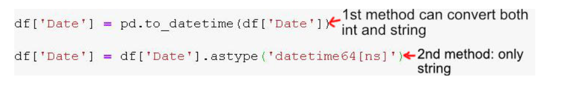


------


## Calculating **Pearson correlation coefficient**

To calculate the Pearson's r between any two columns, we can use the [`Series.corr()` method](https://pandas.pydata.org/pandas-docs/stable/reference/api/pandas.Series.corr.html). For instance, this is how we can calculate the two correlations above:

```
bike_sharing['temp'].corr(bike_sharing['cnt'])
```

```
0.6274940090334918
```

```
bike_sharing['windspeed'].corr(bike_sharing['cnt'])
```

```
-0.23454499742167
```

The order of columns doesn't matter when we use `Series.corr()`. Below, the r values are the same, although we use the columns in reverse order:

```
# Previously: bike_sharing['temp'].corr(bike_sharing['cnt'])
bike_sharing['cnt'].corr(bike_sharing['temp'])
```

```
0.6274940090334918
```

```python
# Previously: bike_sharing['windspeed'].corr(bike_sharing['cnt'])
bike_sharing['cnt'].corr(bike_sharing['windspeed'])
```


```python
-0.23454499742167
```

`Series.corr()` uses a math formula that only works with numbers. This means that `Series.corr()` only works with numerical columns — if we use string or datetime columns, we'll get an error.

As a side note, teaching the math behind Pearson's r is beyond the scope of this visualization lesson. Here, we focus on how to interpret and visualize correlation.

The `Series.corr()` method only allows us to calculate the correlation between two numerical columns. We can get an overview of correlations using the [`DataFrame.corr()` method](https://pandas.pydata.org/pandas-docs/stable/reference/api/pandas.DataFrame.corr.html), which calculates the Pearson's r between all pairs of numerical columns.

```python
bike_sharing.corr()
```

|            | instant   | season    | yr        | mnth      | holiday   | weekday   | workingday | weathersit | temp      | atemp     | hum       | windspeed | casual    | registered | cnt       |
| ---------- | --------- | --------- | --------- | --------- | --------- | --------- | ---------- | ---------- | --------- | --------- | --------- | --------- | --------- | ---------- | --------- |
| instant    | 1.000000  | 0.412224  | 0.866025  | 0.496702  | 0.016145  | -0.000016 | -0.004337  | -0.021477  | 0.150580  | 0.152638  | 0.016375  | -0.112620 | 0.275255  | 0.659623   | 0.628830  |
| season     | 0.412224  | 1.000000  | -0.001844 | 0.831440  | -0.010537 | -0.003080 | 0.012485   | 0.019211   | 0.334315  | 0.342876  | 0.205445  | -0.229046 | 0.210399  | 0.411623   | 0.406100  |
| yr         | 0.866025  | -0.001844 | 1.000000  | -0.001792 | 0.007954  | -0.005461 | -0.002013  | -0.048727  | 0.047604  | 0.046106  | -0.110651 | -0.011817 | 0.248546  | 0.594248   | 0.566710  |
| mnth       | 0.496702  | 0.831440  | -0.001792 | 1.000000  | 0.019191  | 0.009509  | -0.005901  | 0.043528   | 0.220205  | 0.227459  | 0.222204  | -0.207502 | 0.123006  | 0.293488   | 0.279977  |
| holiday    | 0.016145  | -0.010537 | 0.007954  | 0.019191  | 1.000000  | -0.101960 | -0.253023  | -0.034627  | -0.028556 | -0.032507 | -0.015937 | 0.006292  | 0.054274  | -0.108745  | -0.068348 |
| weekday    | -0.000016 | -0.003080 | -0.005461 | 0.009509  | -0.101960 | 1.000000  | 0.035790   | 0.031087   | -0.000170 | -0.007537 | -0.052232 | 0.014282  | 0.059923  | 0.057367   | 0.067443  |
| workingday | -0.004337 | 0.012485  | -0.002013 | -0.005901 | -0.253023 | 0.035790  | 1.000000   | 0.061200   | 0.052660  | 0.052182  | 0.024327  | -0.018796 | -0.518044 | 0.303907   | 0.061156  |
| weathersit | -0.021477 | 0.019211  | -0.048727 | 0.043528  | -0.034627 | 0.031087  | 0.061200   | 1.000000   | -0.120602 | -0.121583 | 0.591045  | 0.039511  | -0.247353 | -0.260388  | -0.297391 |
| temp       | 0.150580  | 0.334315  | 0.047604  | 0.220205  | -0.028556 | -0.000170 | 0.052660   | -0.120602  | 1.000000  | 0.991702  | 0.126963  | -0.157944 | 0.543285  | 0.540012   | 0.627494  |
| atemp      | 0.152638  | 0.342876  | 0.046106  | 0.227459  | -0.032507 | -0.007537 | 0.052182   | -0.121583  | 0.991702  | 1.000000  | 0.139988  | -0.183643 | 0.543864  | 0.544192   | 0.631066  |
| hum        | 0.016375  | 0.205445  | -0.110651 | 0.222204  | -0.015937 | -0.052232 | 0.024327   | 0.591045   | 0.126963  | 0.139988  | 1.000000  | -0.248489 | -0.077008 | -0.091089  | -0.100659 |
| windspeed  | -0.112620 | -0.229046 | -0.011817 | -0.207502 | 0.006292  | 0.014282  | -0.018796  | 0.039511   | -0.157944 | -0.183643 | -0.248489 | 1.000000  | -0.167613 | -0.217449  | -0.234545 |
| casual     | 0.275255  | 0.210399  | 0.248546  | 0.123006  | 0.054274  | 0.059923  | -0.518044  | -0.247353  | 0.543285  | 0.543864  | -0.077008 | -0.167613 | 1.000000  | 0.395282   | 0.672804  |
| registered | 0.659623  | 0.411623  | 0.594248  | 0.293488  | -0.108745 | 0.057367  | 0.303907   | -0.260388  | 0.540012  | 0.544192  | -0.091089 | -0.217449 | 0.395282  | 1.000000   | 0.945517  |
| cnt        | 0.628830  | 0.406100  | 0.566710  | 0.279977  | -0.068348 | 0.067443  | 0.061156   | -0.297391  | 0.627494  | 0.631066  | -0.100659 | -0.234545 | 0.672804  | 0.945517   | 1.000000  |

Most often, we're only interested in finding the correlation for just a few columns. For example, what if we only want to see the correlation for the `cnt`, `casual`, and `registered` columns? The `DataFrame.corr()` method returns a `DataFrame`, which means we can select the `cnt`, `casual`, and `registered` columns directly.

```
bike_sharing.corr()[['cnt', 'casual', 'registered']]
```

|            | cnt       | casual    | registered |
| ---------- | --------- | --------- | ---------- |
| instant    | 0.628830  | 0.275255  | 0.659623   |
| season     | 0.406100  | 0.210399  | 0.411623   |
| yr         | 0.566710  | 0.248546  | 0.594248   |
| mnth       | 0.279977  | 0.123006  | 0.293488   |
| holiday    | -0.068348 | 0.054274  | -0.108745  |
| weekday    | 0.067443  | 0.059923  | 0.057367   |
| workingday | 0.061156  | -0.518044 | 0.303907   |
| weathersit | -0.297391 | -0.247353 | -0.260388  |
| temp       | 0.627494  | 0.543285  | 0.540012   |
| atemp      | 0.631066  | 0.543864  | 0.544192   |
| hum        | -0.100659 | -0.077008 | -0.091089  |
| windspeed  | -0.234545 | -0.167613 | -0.217449  |
| casual     | 0.672804  | 1.000000  | 0.395282   |
| registered | 0.945517  | 0.395282  | 1.000000   |
| cnt        | 1.000000  | 0.672804  | 0.945517   |


## pandas.DataFrame.corr

`DataFrame.corr()` method is used to calculate the correlation between all pairs of numerical columns. You apply it to a DataFrame, there`re no required arguments to pass. The output is a DataFrame, like the one from the [previous screen](https://app.dataquest.io/m/521/scatter-plots-and-correlations/7/measuring-pearsons-r):

```python
df.corr()
```

If you need to know the correlation between some of the columns of the dataframe and not all of them, you can select them after applying the method. So, this code `bike_sharing.corr()[['cnt', 'casual', 'registered']]` actually consists of 2 steps:
**1 step**: calculate the correlations between all pairs of numerical columns of the dataframe `bike_sharing`
**2 step**: select the `['cnt', 'casual', 'registered']` columns from the correlation dataframe.
We could express the same in 2 lines instead of 1:

```python
correlation_df = bike_sharing.corr()
correlation_df[['cnt', 'casual', 'registered']]
```

The difference between the `bike_sharing.corr()[['cnt', 'casual', 'registered']]` and the `bike_sharing.corr()['workingday'][['casual', 'registered']]`is that the former one returns the correlation between the selected 3 columns and all the columns of the dataframe and the latter one returns only the correlation of the `workingday` column with 2 other columns, the `casual` and the `registered`.


## Frequency Intervals

However, if we generate a frequency table for the `cnt` column (which describes the total number of bike rentals), it's almost impossible to distinguish any pattern. And that's because `cnt` has 696 unique values (below, we see a truncated table).

```
bike_sharing['cnt'].value_counts()
```

```python
5119    2
4401    2
1977    2
6824    2
5191    2
       ..
6273    1
5501    1
4760    1
1683    1
4097    1
Name: cnt, Length: 696, dtype: int64
```

To solve this problem, we can group the unique values into equal intervals. Below, we group the table into ten equal intervals by using the `bins=10` argument inside the `Series.value_counts()` method:

```
bike_sharing['cnt'].value_counts(bins=10)
```

```python
(4368.0, 5237.2]    137
(3498.8, 4368.0]    122
(5237.2, 6106.4]     81
(6975.6, 7844.8]     79
(6106.4, 6975.6]     76
(2629.6, 3498.8]     73
(1760.4, 2629.6]     71
(891.2, 1760.4]      62
(7844.8, 8714.0]     17
(13.307, 891.2]      13
Name: cnt, dtype: int64
```

The unique values are now number intervals. `(4368.0, 5237.2]` is a number interval. The `(` character indicates that the starting number is not included, while the `]` indicates that the ending number is included. The interval `(4368.0, 5237.2]` contains all numbers greater than 4368.0 and less than or equal to 5237.2.

We can better understand the structure of the table above if we sort the intervals in ascending order.

```
bike_sharing['cnt'].value_counts(bins=10).sort_index()
```

```python
(13.307, 891.2]      13
(891.2, 1760.4]      62
(1760.4, 2629.6]     71
(2629.6, 3498.8]     73
(3498.8, 4368.0]    122
(4368.0, 5237.2]    137
(5237.2, 6106.4]     81
(6106.4, 6975.6]     76
(6975.6, 7844.8]     79
(7844.8, 8714.0]     17
Name: cnt, dtype: int64
```


## Filtering Results

https://towardsdatascience.com/8-ways-to-filter-pandas-dataframes-d34ba585c1b8


------

# Data Frame and SQL

## groupby()

https://realpython.com/pandas-groupby/


------


# Data  Cleaning

## remove whitespace from column names

```python
new_columns = []

for column in laptops.columns:
    new_columns.append(column.strip())
    
laptops.columns = new_columns 
```


## example function to clear columns labels

```python
def clean_column(col):
    if col.find('Operating System') != -1:
        col = col.replace('Operating System', 'os')
    col = col.strip()
    col = col.replace(" ", "_")
    col = col.replace("(","")
    col = col.replace(")","")
    col = col.lower()
return col  
```


## convert string data to numeric data

Let's convert the `screen_size` column to numeric next. Whenever we convert text to numeric data, we can follow this data cleaning workflow:


The first step is to **explore the data**. One of the best ways to do this is to use the [`Series.unique()` method](http://pandas.pydata.org/pandas-docs/stable/generated/pandas.Series.unique.html) to view all of the unique values in the column:

```python
print(laptops["screen_size"].dtype)
print(laptops["screen_size"].unique())
```

```python
object

['13.3"', '15.6"', '15.4"', '14.0"', '12.0"', '11.6"',
 '17.3"', '10.1"', '13.5"', '12.5"', '13.0"', '18.4"',
 '13.9"', '12.3"', '17.0"', '15.0"', '14.1"',
 '11.3"']
```

Our next step is to **identify patterns and special cases**. We can observe the following:

- All values in this column follow the same pattern - a series of digit and period characters, followed by a quote character (`"`).
- There are no special cases. Every value matches the same pattern.
- We'll need to convert the column to a `float` dtype, as the `int` dtype won't be able to store the decimal values.


## remove str characters from vectorized data

The pandas library contains dozens of [vectorized string methods](https://pandas.pydata.org/pandas-docs/stable/user_guide/text.html#method-summary) we can use to manipulate text data, many of which perform the same operations as Python string methods. Most vectorized string methods are available using the [`Series.str` accessor](http://pandas.pydata.org/pandas-docs/stable/api.html#string-handling), which means we can access them by adding `str` between the series name and the method name:


In this case, we can use the [`Series.str.replace()` method](http://pandas.pydata.org/pandas-docs/stable/generated/pandas.Series.str.replace.html), which is a vectorized version of the Python `str.replace()` method we used in the previous screen, to remove all the quote characters from every string in the `screen_size` column:

```python
laptops["screen_size"] = laptops["screen_size"].str.replace('"','')
print(laptops["screen_size"].unique())
```

```python
['13.3', '15.6', '15.4', '14.0', '12.0', '11.6', '17.3',
 '10.1', '13.5', '12.5', '13.0', '18.4', '13.9', '12.3',
 '17.0', '15.0', '14.1', '11.3']
```


## convert to int or float

```python
laptops["ram"] = laptops["ram"].str.replace('GB','').astype(int)
```


## rename column

To stop us from losing information that helps us understand the data, we can use the [`DataFrame.rename()` method](http://pandas.pydata.org/pandas-docs/stable/generated/pandas.DataFrame.rename.html) to rename the column from `screen_size` to `screen_size_inches`.

Below, we specify the `axis=1` parameter so pandas knows that we want to rename labels in the column axis:

```python
laptops.rename({"screen_size": "screen_size_inches"}, axis=1, inplace=True)
print(laptops.dtypes)
```

```python
manufacturer           object
model_name             object
category               object
screen_size_inches    float64
screen                 object
cpu                    object
ram                    object
storage                object
gpu                    object
os                     object
os_version             object
weight                 object
price_euros            object
dtype: object
```

Note that we can either use `inplace=True` or assign the result back to the dataframe - both will give us the same results.


## extract part of the string and assign to a new column

Sometimes, it can be useful to extract non-numeric values from within strings. Let's look at the first five values from the `gpu` (graphics processing unit) column:

```python
print(laptops["gpu"].head())
```

```python
0    Intel Iris Plus Graphics 640
1          Intel HD Graphics 6000
2           Intel HD Graphics 620
3              AMD Radeon Pro 455
4    Intel Iris Plus Graphics 650
Name: gpu, dtype: object
```

The information in this column seems to be a manufacturer (Intel, AMD) followed by a model name/number. Let's extract the manufacturer by itself so we can find the most common ones.

Because each manufacturer is followed by a whitespace character, we can use the [`Series.str.split()` method](http://pandas.pydata.org/pandas-docs/stable/generated/pandas.Series.str.split.html) to extract this data:


This method splits each string on the whitespace; the result is a series containing individual Python lists. Also note that we used parentheses to method chain over multiple lines, which makes our code easier to read.

Just like with lists and ndarrays, we can use bracket notation to access the elements in each list in the series. With series, however, we use the `str` accessor followed by `[]` (brackets):

```python
print(laptops["gpu"].head().str.split().str[0])
```

Above, we used `0` to select the *first* element in each list. Below is the result:

```python
0    Intel
1    Intel
2    Intel
3      AMD
4    Intel
Name: gpu, dtype: object
```

Let's use this technique to extract the manufacturer from the `cpu` column as well. Here are the first 5 rows of the `cpu` column:

```python
print(laptops["cpu"].head())
```

```python
0          Intel Core i5 2.3GHz
1          Intel Core i5 1.8GHz
2    Intel Core i5 7200U 2.5GHz
3          Intel Core i7 2.7GHz
4          Intel Core i5 3.1GHz
Name: cpu, dtype: object
```


## using map() to correct column values

If your data has been scraped from a webpage or if there was manual data entry involved at some point, you may end up with inconsistent values. Let's look at an example from our `os` column:

```python
print(laptops["os"].value_counts())
```

```python
Windows      1125
No OS          66
Linux          62
Chrome OS      27
macOS          13
Mac OS          8
Android         2
Name: os, dtype: int64
```

We can see that there are two variations of the Apple operating system — macOS — in our dataset: `Mac OS` and `macOS`. One way we can fix this is with the [`Series.map()` method](http://pandas.pydata.org/pandas-docs/stable/generated/pandas.Series.map.html). The `Series.map()` method is ideal when we want to change multiple values in a column, but we'll use it now as an opportunity to learn how the method works.

The most common way to use `Series.map()` is with a dictionary. Let's look at an example using a series of misspelled fruit:

```python
print(s)
```

```python
0       pair
1     oranje
2    bananna
3     oranje
4     oranje
5     oranje
dtype: object
```

We'll create a dictionary called `corrections` and pass that dictionary as an argument to `Series.map()`:

```python
corrections = {
    "pair": "pear",
    "oranje": "orange",
    "bananna": "banana"
}
s = s.map(corrections)
print(s)
```

```python
0       pear
1     orange
2     banana
3     orange
4     orange
5     orange
dtype: object
```

We can see that each of our corrections were made across our series. One important thing to remember with `Series.map()` is that if a value from your series doesn't exist as a key in your dictionary, it will convert that value to `NaN`. Let's see what happens when we run map one more time:

```python
s = s.map(corrections)
print(s)
```

```python
0    NaN
1    NaN
2    NaN
3    NaN
4    NaN
5    NaN
dtype: object
```

Because none of the corrected values in our series existed as keys in our dictionary, all values became `NaN`! It's a very common occurence, especially when working in Jupyter notebook, where you can easily re-run cells.


## dropping null values

In pandas, null values will be indicated by either `NaN` or `None`.

Recall that we can use the [`DataFrame.isnull()` method](http://pandas.pydata.org/pandas-docs/stable/generated/pandas.DataFrame.isnull.html) to identify missing values, which returns a boolean dataframe. We can then use the `DataFrame.sum()` method to give us a count of the `True` values for each column:

```python
print(laptops.isnull().sum())
```

```python
manufacturer            0
model_name              0
category                0
screen_size_inches      0
screen                  0
cpu                     0
ram_gb                  0
storage                 0
gpu                     0
os                      0
os_version            170
weight_kg               0
price_euros             0
cpu_manufacturer        0
screen_resolution       0
cpu_speed               0
dtype: int64
```

It's now clear that we have only one column with null values, `os_version`, which has 170 missing values.

There are a few options for handling missing values:

- Remove any rows that have missing values.
- Remove any columns that have missing values.
- Fill the missing values with some other value.
- Leave the missing values as is.

The first two options are often used to prepare data for machine learning algorithms, which are unable to be used with data that includes null values. We can use the [`DataFrame.dropna()` method](http://pandas.pydata.org/pandas-docs/stable/generated/pandas.DataFrame.dropna.html) to remove or **drop** rows and columns with null values.

The `DataFrame.dropna()` method accepts an `axis` parameter, which indicates whether we want to drop along the column or index axis. Let's look at an example:


The default value for the `axis` parameter is `0`, so `df.dropna()` returns an identical result to `df.dropna(axis=0`):


The rows with labels `x` and `z` contain null values, so those rows are dropped. Let's look at what happens when we use `axis=1` to specify the column axis:


Only the column with label `C` contains null values, so, in this case, just one column is removed.

## replace null values

While dropping rows or columns is the easiest approach to deal with missing values, it may not always be the *best* approach. For example, removing a disproportionate amount of one manufacturer's laptops could change our analysis.

Because of this, it's a good idea to explore the missing values in the `os_version` column before making a decision. We can use `Series.value_counts()` to explore all of the values in the column, but we'll use a parameter we haven't seen before:

```python
print(laptops["os_version"].value_counts(dropna=False))
```

```python
10      1072
NaN      170
7         45
X          8
10 S       8
Name: os_version, dtype: int64
```

Because we set the `dropna` parameter to `False`, the result includes null values. We can see that the majority of values in the column are `10` and missing values are the next most common.

Let's also explore the `os` column, since it's is closely related to the `os_version` column. We'll only look at rows in which the `os_version` is missing:

```python
os_with_null_v = laptops.loc[laptops["os_version"].isnull(),"os"]
print(os_with_null_v.value_counts())
```

```python
No OS        66
Linux        62
Chrome OS    27
macOS        13
Android       2
Name: os, dtype: int64
```

Immediately, we can observe a few things:

- The most frequent value is "No OS". This is important to note because if there is no os, there *shouldn't* be a version defined in the `os_version` column.
- Thirteen of the laptops that come with macOS do not specify the version. We can use our knowledge of [MacOS](https://en.wikipedia.org/wiki/MacOS) to confirm that `os_version` should be equal to `X`.

In both of these cases, we can fill the missing values to make our data more correct. For the rest of the values, it's probably best to leave them as missing so we don't remove important values.

We can use assignment with a boolean comparison to perform this replacement, like below:

```python
laptops.loc[laptops["os"] == "macOS", "os_version"] = "X
```

For rows with `No OS` values, let's replace the missing value in the `os_version` column with the value `Version Unknown`.


# Working With Missing And Duplicate Data

https://pandas.pydata.org/pandas-docs/stable/user_guide/missing_data.html

## Identifying Missing Values

In the last exercise, we confirmed that each data set contains the same number of rows.

Recall that the dataframes were updated so that each contains the same countries, even if the happiness score, happiness rank, etc. were missing. However, that also means that each likely contains missing values, like the one we reviewed in the previous screen:

|      | Country                  | Region | Happiness Rank | Happiness Score | Lower Confidence Interval | Upper Confidence Interval | Economy (GDP per Capita) | Family | Health (Life Expectancy) | Freedom | Trust (Government Corruption) | Generosity | Dystopia Residual | Year |
| ---- | ------------------------ | ------ | -------------- | --------------- | ------------------------- | ------------------------- | ------------------------ | ------ | ------------------------ | ------- | ----------------------------- | ---------- | ----------------- | ---- |
| 157  | Central African Republic | NaN    | NaN            | NaN             | NaN                       | NaN                       | NaN                      | NaN    | NaN                      | NaN     | NaN                           | NaN        | NaN               | 2016 |

In pandas, missing values are generally represented by the `NaN` value, as seen in the dataframe above, or the `None` value.

However, it's good to note that pandas will not automatically identify values such as `n/a`, `-`, or `--` as `NaN` or `None`, but they may also indicate data is missing. See [here](https://stackoverflow.com/questions/40011531/in-pandas-when-using-read-csv-how-to-assign-a-nan-to-a-value-thats-not-the#answer-40011736) for more information on how to use the `pd.read_csv()` function to read those values in as `NaN`.

Once we ensure that all missing values were read in correctly, we can use the [`Series.isnull()` method](https://pandas.pydata.org/pandas-docs/stable/generated/pandas.Series.isnull.html) to identify rows with missing values:

```python
missing = happiness2015['Happiness Score'].isnull()
happiness2015[missing]
```

|      | Country           | Region | Happiness Rank | Happiness Score | Standard Error | Economy (GDP per Capita) | Family | Health (Life Expectancy) | Freedom | Trust (Government Corruption) | Generosity | Dystopia Residual | Year |
| ---- | ----------------- | ------ | -------------- | --------------- | -------------- | ------------------------ | ------ | ------------------------ | ------- | ----------------------------- | ---------- | ----------------- | ---- |
| 158  | Belize            | NaN    | NaN            | NaN             | NaN            | NaN                      | NaN    | NaN                      | NaN     | NaN                           | NaN        | NaN               | 2015 |
| 160  | Namibia           | NaN    | NaN            | NaN             | NaN            | NaN                      | NaN    | NaN                      | NaN     | NaN                           | NaN        | NaN               | 2015 |
| 161  | Puerto Rico       | NaN    | NaN            | NaN             | NaN            | NaN                      | NaN    | NaN                      | NaN     | NaN                           | NaN        | NaN               | 2015 |
| 162  | Somalia           | NaN    | NaN            | NaN             | NaN            | NaN                      | NaN    | NaN                      | NaN     | NaN                           | NaN        | NaN               | 2015 |
| 163  | Somaliland Region | NaN    | NaN            | NaN             | NaN            | NaN                      | NaN    | NaN                      | NaN     | NaN                           | NaN        | NaN               | 2015 |
| 164  | South Sudan       | NaN    | NaN            | NaN             | NaN            | NaN                      | NaN    | NaN                      | NaN     | NaN                           | NaN        | NaN               | 2015 |

However, when working with bigger data sets, it's easier to get a summary of the missing values as follows:

```python
happiness2015.isnull().sum()
```

```python
Country                          0
Region                           6
Happiness Rank                   6
Happiness Score                  6
Standard Error                   6
Economy (GDP per Capita)         6
Family                           6
Health (Life Expectancy)         6
Freedom                          6
Trust (Government Corruption)    6
Generosity                       6
Dystopia Residual                6
Year                             0
dtype: int64
```

The result is a series in which:

- The index contains the names of the columns in `happiness2015`.
- The corresponding value is the number of null values in each column.

In `happiness2015`, all columns except for the `Country` and `Year` columns have six missing values.

Let's confirm the number of missing values in `happiness2016` and `happiness2017` next.


## Correcting Data Cleaning Errors that Result in Missing Values

In the previous exercise, you should've confirmed that `happiness2016` and `happiness2017` also contain missing values in all columns except for `Country` and `Year`. It's good to check for missing values *before* transforming data to make sure we don't unintentionally introduce missing values.

If we *do* introduce missing values after transforming data, we'll have to determine if the data is really missing or if it's the result of some kind of error. As we progress through this lesson, we'll use the following workflow to clean our missing values, starting with checking for errors:

1. Check for errors in data cleaning/transformation.
2. Use data from additional sources to fill missing values.
3. Drop row/column.
4. Fill missing values with reasonable estimates computed from the available data.

Let's return to a task we completed in a previous lesson - combining the 2015, 2016, and 2017 World Happiness Reports. Recall that we can use the [`pd.concat()` function](https://pandas.pydata.org/pandas-docs/stable/reference/api/pandas.concat.html) to combine them:

```python
combined = pd.concat([happiness2015, happiness2016, happiness2017], ignore_index=True)
```

Next, let's check for missing values in `combined`:

```python
combined.isnull().sum()
```

```python
Country                            0
Region                           177
Happiness Rank                   177
Happiness Score                  177
Standard Error                   334
Economy (GDP per Capita)         177
Family                            22
Health (Life Expectancy)         177
Freedom                           22
Trust (Government Corruption)    177
Generosity                        22
Dystopia Residual                177
Year                               0
Lower Confidence Interval        335
Upper Confidence Interval        335
Happiness.Rank                   337
Happiness.Score                  337
Whisker.high                     337
Whisker.low                      337
Economy..GDP.per.Capita.         337
Health..Life.Expectancy.         337
Trust..Government.Corruption.    337
Dystopia.Residual                337
dtype: int64
```

We can see above that our dataframe has many missing values and these missing values follow a pattern. Most columns fall into one of the following categories:

- 177 missing values (about 1/3 of the total values)
- 337 missing values (about 2/3 of the total values)

You may have also noticed that some of the column names differ only by punctuation, which caused the dataframes to be combined incorrectly:

```python
Trust (Government Corruption)
Trust..Government.Corruption.
```

In the next exercise, we'll update the column names to make them uniform and combine the dataframes again. To clean the column names, we recommend using a technique we haven't covered yet, described in [this Stack Overflow answer](https://stackoverflow.com/questions/39741429/pandas-replace-a-character-in-all-column-names).

As you start to work on more data cleaning tasks, you'll inevitably encounter scenarios you don't know specifically how to handle. Stack Overflow is a great place to reference to get answers for these questions, as other people have likely already asked the same question and solicited answers.

As a reminder, below is a list of common string methods you can use to clean the columns:

| Method               | Description                                                  |
| -------------------- | ------------------------------------------------------------ |
| Series.str.split()   | Splits each element in the Series.                           |
| Series.str.strip()   | Strips whitespace from each string in the Series.            |
| Series.str.lower()   | Converts strings in the Series to lowercase.                 |
| Series.str.upper()   | Converts strings in the Series to uppercase.                 |
| Series.str.get()     | Retrieves the ith element of each element in the Series.     |
| Series.str.replace() | Replaces a regex or string in the Series with another string. |
| Series.str.cat()     | Concatenates strings in a Series.                            |
| Series.str.extract() | Extracts substrings from the Series matching a regex pattern. |

Let's clean the column names next.

```python
happiness2017.columns = happiness2017.columns.str.replace('.', ' ').str.replace('\s+', ' ').str.strip().str.upper()

happiness2015.columns = happiness2015.columns.str.strip().str.upper().str.replace('(','').str.replace(')','')
happiness2016.columns = happiness2016.columns.str.strip().str.upper().str.replace('(','').str.replace(')','')

combined = pd.concat([happiness2015, happiness2016, happiness2017], ignore_index=True)
missing = combined.isnull().sum()
```


## Visualizing Missing Data

In the last exercise, we corrected some of the missing values by fixing the column names. Note that we *could* have cleaned the column names without changing the capitalization. It's good practice, however, to make the capitalization uniform, because a stray uppercase or lowercase letter could've reintroduced missing values.

We also confirmed there are still values missing:

```
COUNTRY                          0
DYSTOPIA RESIDUAL               22
ECONOMY GDP PER CAPITA          22
FAMILY                          22
FREEDOM                         22
GENEROSITY                      22
HAPPINESS RANK                  22
HAPPINESS SCORE                 22
HEALTH LIFE EXPECTANCY          22
LOWER CONFIDENCE INTERVAL      335
REGION                         177
STANDARD ERROR                 334
TRUST GOVERNMENT CORRUPTION     22
UPPER CONFIDENCE INTERVAL      335
WHISKER HIGH                   337
WHISKER LOW                    337
YEAR                             0
dtype: int64
```

We can learn more about where these missing values are located by visualizing them with a [**heatmap**](https://seaborn.pydata.org/generated/seaborn.heatmap.html), a graphical representation of our data in which values are represented as colors. We'll use the seaborn library to create the heatmap.

Note below that we first reset the index to be the `YEAR` column so that we'll be able to see the corresponding year on the left side of the heatmap:

```
import seaborn as sns
combined_updated = combined.set_index('YEAR')
sns.heatmap(combined_updated.isnull(), cbar=False)
```

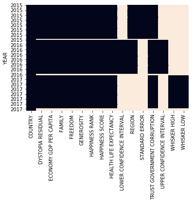

To understand this visualization, imagine we took `combined`, highlighted missing values in light gray and all other values in black, and then shrunk it so that we could easily view the entire dataframe at once.

Since we concatenated `happiness2015`, `happiness2016`, and `happiness2017` by stacking them, note that the top third of the dataframe corresponds to the 2015 data, the second third corresponds to the 2016 data, and the bottom third corresponds to the 2017 data.

We can make the following observations:

- No values are missing in the `COUNTRY` column.
- There are some rows in the 2015, 2016, and 2017 data with missing values in all columns EXCEPT the `COUNTRY` column.
- Some columns only have data populated for one year.
- It looks like the `REGION` data is missing for the year 2017.

Let's check that the last statement is correct in the next exercise.

```python
regions_2017 = combined[combined['YEAR'] == 2017]['REGION']
type(combined[combined['YEAR'] == 2017]['REGION'])
missing = regions_2017.isnull().sum()
```


## Visualizing Missing Data with Plots

Earlier, we used a table of numbers to understand the number of missing values in our dataframe. A different approach we can take is to use a plot to visualize the missing values. The function below uses `seaborn.heatmap()` to represent null values as light squares and non-null values as dark squares:

```
def plot_null_matrix(df, figsize=(18,15)):
    # initiate the figure
    plt.figure(figsize=figsize)
    # create a boolean dataframe based on whether values are null
    df_null = df.isnull()
    # create a heatmap of the boolean dataframe
    sns.heatmap(~df_null, cbar=False, yticklabels=False)
    plt.xticks(rotation=90, size='x-large')
    plt.show()
```

Copy

Let's look at how the function works by using it to plot just the first row of our `mvc` dataframe. We'll display the first row as a table immediately below so it's easy to compare:

```
plot_null_matrix(mvc.head(1), figsize=(18,1))
```

Copy

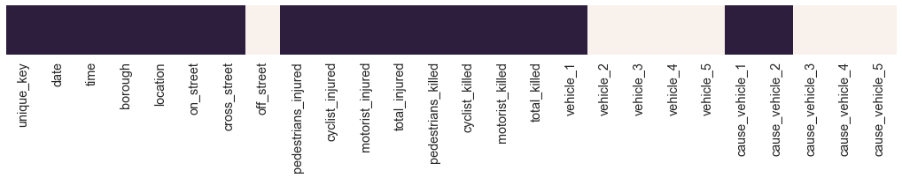

```
print(mvc.head(1))
```

Copy

|      | unique_key | date       | time  | borough   | location               | on_street      | cross_street | off_street | pedestrians_injured | cyclist_injured | motorist_injured | total_injured | pedestrians_killed | cyclist_killed | motorist_killed | total_killed | vehicle_1         | vehicle_2 | vehicle_3 | vehicle_4 | vehicle_5 | cause_vehicle_1       | cause_vehicle_2 | cause_vehicle_3 | cause_vehicle_4 | cause_vehicle_5 |
| ---- | ---------- | ---------- | ----- | --------- | ---------------------- | -------------- | ------------ | ---------- | ------------------- | --------------- | ---------------- | ------------- | ------------------ | -------------- | --------------- | ------------ | ----------------- | --------- | --------- | --------- | --------- | --------------------- | --------------- | --------------- | --------------- | --------------- |
| 0    | 3869058    | 2018-03-23 | 21:40 | MANHATTAN | (40.742832, -74.00771) | WEST 15 STREET | 10 AVENUE    | NaN        | 0                   | 0               | 0                | 0.0           | 0                  | 0              | 0               | 0.0          | PASSENGER VEHICLE | NaN       | NaN       | NaN       | NaN       | Following Too Closely | Unspecified     | NaN             | NaN             | NaN             |

Each value is represented by a dark square, and each missing value is represented by a light square.

Let's look at what a plot matrix looks like for the whole dataframe:

```
plot_null_matrix(mvc)
```

Copy


We can make some immediate interpretations about our dataframe:

- The first three columns have few to no missing values.
- The next five columns have missing values scattered throughout, with each column seeming to have its own density of missing values.
- The next eight columns are the `injury` and `killed` columns we just cleaned, and only have a few missing values.
- The last 10 columns seem to break into two groups of five, with each group of five having similar patterns of null/non-null values.

Let's examine the pattern in the last 10 columns a little more closely. We can calculate the relationship between two sets of columns, known as **correlation**. To calculate this we use the [`dataframe.corr()` method](http://pandas.pydata.org/pandas-docs/stable/reference/api/pandas.DataFrame.corr.html) (You'll learn more about correlation in a later course). Here's what that looks like:

```python
cols_with_missing_vals = mvc.columns[mvc.isnull().sum() > 0]
missing_corr = mvc[cols_with_missing_vals].isnull().corr()
print(missing_corr)
```

|                 | borough   | location  | on_street | cross_street | off_street | total_injured | total_killed | vehicle_1 | vehicle_2 | vehicle_3 | vehicle_4 | vehicle_5 | cause_vehicle_1 | cause_vehicle_2 | cause_vehicle_3 | cause_vehicle_4 | cause_vehicle_5 |
| --------------- | --------- | --------- | --------- | ------------ | ---------- | ------------- | ------------ | --------- | --------- | --------- | --------- | --------- | --------------- | --------------- | --------------- | --------------- | --------------- |
| borough         | 1.000000  | 0.190105  | -0.350190 | 0.409107     | 0.362189   | -0.001632     | 0.005582     | -0.018325 | -0.077516 | -0.061932 | -0.020406 | -0.010733 | -0.012115       | -0.058596       | -0.060542       | -0.020158       | -0.011348       |
| location        | 0.190105  | 1.000000  | -0.073975 | -0.069719    | 0.084579   | -0.002951     | 0.015496     | -0.010466 | -0.033842 | -0.000927 | 0.004655  | -0.005797 | -0.003458       | -0.021373       | 0.000684        | 0.004604        | -0.004841       |
| on_street       | -0.350190 | -0.073975 | 1.000000  | 0.557767     | -0.991030  | 0.001143      | -0.002344    | -0.001889 | 0.119647  | 0.020867  | 0.004172  | -0.002768 | 0.001307        | 0.087374        | 0.017426        | 0.002737        | -0.003107       |
| cross_street    | 0.409107  | -0.069719 | 0.557767  | 1.000000     | -0.552763  | 0.001451      | 0.004112     | -0.017018 | 0.043799  | -0.049910 | -0.021137 | -0.012003 | -0.009102       | 0.031189        | -0.052159       | -0.022074       | -0.013455       |
| off_street      | 0.362189  | 0.084579  | -0.991030 | -0.552763    | 1.000000   | -0.001233     | 0.002323     | 0.001812  | -0.121129 | -0.022404 | -0.004074 | 0.002492  | -0.001738       | -0.088187       | -0.019120       | -0.002580       | 0.002863        |
| total_injured   | -0.001632 | -0.002951 | 0.001143  | 0.001451     | -0.001233  | 1.000000      | -0.000046    | 0.039382  | 0.013522  | -0.010366 | 0.001222  | 0.000620  | 0.056627        | 0.012968        | -0.009910       | 0.001263        | 0.000636        |
| total_killed    | 0.005582  | 0.015496  | -0.002344 | 0.004112     | 0.002323   | -0.000046     | 1.000000     | -0.000327 | 0.008017  | 0.001057  | 0.000462  | 0.000234  | -0.000229       | 0.009888        | 0.001091        | 0.000477        | 0.000240        |
| vehicle_1       | -0.018325 | -0.010466 | -0.001889 | -0.017018    | 0.001812   | 0.039382      | -0.000327    | 1.000000  | 0.151516  | 0.019972  | 0.008732  | 0.004425  | 0.604281        | 0.180678        | 0.020624        | 0.009022        | 0.004545        |
| vehicle_2       | -0.077516 | -0.033842 | 0.119647  | 0.043799     | -0.121129  | 0.013522      | 0.008017     | 0.151516  | 1.000000  | 0.131813  | 0.057631  | 0.029208  | 0.106214        | 0.784402        | 0.132499        | 0.058050        | 0.029264        |
| vehicle_3       | -0.061932 | -0.000927 | 0.020867  | -0.049910    | -0.022404  | -0.010366     | 0.001057     | 0.019972  | 0.131813  | 1.000000  | 0.437214  | 0.221585  | 0.014000        | 0.106874        | 0.961316        | 0.448525        | 0.225067        |
| vehicle_4       | -0.020406 | 0.004655  | 0.004172  | -0.021137    | -0.004074  | 0.001222      | 0.000462     | 0.008732  | 0.057631  | 0.437214  | 1.000000  | 0.506810  | 0.006121        | 0.046727        | 0.423394        | 0.963723        | 0.515058        |
| vehicle_5       | -0.010733 | -0.005797 | -0.002768 | -0.012003    | 0.002492   | 0.000620      | 0.000234     | 0.004425  | 0.029208  | 0.221585  | 0.506810  | 1.000000  | 0.003102        | 0.023682        | 0.214580        | 0.490537        | 0.973664        |
| cause_vehicle_1 | -0.012115 | -0.003458 | 0.001307  | -0.009102    | -0.001738  | 0.056627      | -0.000229    | 0.604281  | 0.106214  | 0.014000  | 0.006121  | 0.003102  | 1.000000        | 0.131000        | 0.014457        | 0.006324        | 0.003186        |
| cause_vehicle_2 | -0.058596 | -0.021373 | 0.087374  | 0.031189     | -0.088187  | 0.012968      | 0.009888     | 0.180678  | 0.784402  | 0.106874  | 0.046727  | 0.023682  | 0.131000        | 1.000000        | 0.110362        | 0.048277        | 0.024322        |
| cause_vehicle_3 | -0.060542 | 0.000684  | 0.017426  | -0.052159    | -0.019120  | -0.009910     | 0.001091     | 0.020624  | 0.132499  | 0.961316  | 0.423394  | 0.214580  | 0.014457        | 0.110362        | 1.000000        | 0.437440        | 0.220384        |
| cause_vehicle_4 | -0.020158 | 0.004604  | 0.002737  | -0.022074    | -0.002580  | 0.001263      | 0.000477     | 0.009022  | 0.058050  | 0.448525  | 0.963723  | 0.490537  | 0.006324        | 0.048277        | 0.437440        | 1.000000        | 0.503805        |
| cause_vehicle_5 | -0.011348 | -0.004841 | -0.003107 | -0.013455    | 0.002863   | 0.000636      | 0.000240     | 0.004545  | 0.029264  | 0.225067  | 0.515058  | 0.973664  | 0.003186        | 0.024322        | 0.220384        | 0.503805        | 1.000000        |

Each value is between −1−1 and 11, and represents the relationship between two columns. A number close to −1−1 or 11 represents a strong relationship, where a number in the middle (close to 00) represents a weak relationship.

If you look closely, you can see a diagonal line of 11s going from top left to bottom right. These values represent each columns relationship with *itself*, which of course is a perfect relationship. The values on the top/right of this "line of 11s" mirror the values on the bottom/left of this line: The table actually repeats every value twice!

Correlation tables can be hard to interpret. We can convert our table into a plot which will make this a lot easier. Let's see what this plot looks like:


In our correlation plot:

- The "line of 11s" and the repeated values are removed so that it's not visually overwhelming.
- Values very close to 00, where there is little to no relationship, aren't labeled.
- Values close to 11 are dark blue and values close to −1−1 are dark red — the depth of color represents the strength of the relationship.

We provided a helper function to create correlation plots. Let's create a correlation plot of just those last 10 columns to see if we can more closely identify the pattern we saw earlier in the matrix plot.


import matplotlib.pyplot as plt
import seaborn as sns

def plot_null_correlations(df):
    # create a correlation matrix only for columns with at least
    # one missing value
    cols_with_missing_vals = df.columns[df.isnull().sum() > 0]
    missing_corr = df[cols_with_missing_vals].isnull().corr()
    
```python
# create a mask to avoid repeated values and make
# the plot easier to read
missing_corr = missing_corr.iloc[1:, :-1]
mask = np.triu(np.ones_like(missing_corr), k=1)

# plot a heatmap of the values
plt.figure(figsize=(20,14))
ax = sns.heatmap(missing_corr, vmin=-1, vmax=1, cbar=False,
                 cmap='RdBu', mask=mask, annot=True)

# format the text in the plot to make it easier to read
for text in ax.texts:
    t = float(text.get_text())
    if -0.05 < t < 0.01:
        text.set_text('')
    else:
        text.set_text(round(t, 2))
    text.set_fontsize('x-large')
plt.xticks(rotation=90, size='x-large')
plt.yticks(rotation=0, size='x-large')

plt.show()

veh_cols = mvc[[col for col in mvc.columns if 'vehicle' in col]]

plot_null_correlations(veh_cols)
```


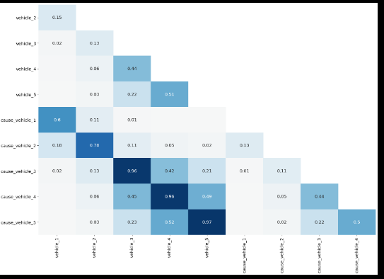


## Using Data From Additional Sources to Fill in Missing Values

In the last exercise, we confirmed that the `REGION` column is missing from the 2017 data. Since we need the regions to analyze our data, let's turn our attention there next.

Before we drop or replace any values, let's first see if there's a way we can use other available data to correct the values.

1. Check for errors in data cleaning/transformation.
2. *Use data from additional sources to fill missing values.*
3. Drop row/column.
4. Fill missing values with reasonable estimates computed from the available data.

Recall once more that each year contains the same countries. Since the regions are fixed values - the region a country was assigned to in 2015 or 2016 won't change - we should be able to assign the 2015 or 2016 region to the 2017 row.

In order to do so, we'll use the following strategy:

1. Create a dataframe containing all of the countries and corresponding regions from the `happiness2015`, `happiness2016`, and `happiness2017` dataframes.
2. Use the [`pd.merge()` function](https://pandas.pydata.org/pandas-docs/stable/reference/api/pandas.DataFrame.merge.html) to assign the `REGION` in the dataframe above to the corresponding country in `combined`.
3. The result will have two region columns - the original column with missing values will be named `REGION_x`. The updated column without missing values will be named `REGION_y`. We'll drop `REGION_x` to eliminate confusion.

Note that there *are* other ways to complete this task. We encourage you to explore them on your own.


```python
combined = pd.merge(left=combined, right=regions, on='COUNTRY', how='left')
combined = combined.drop('REGION_x', axis=1)
missing = combined.isnull().sum()
```


## Identifying Duplicates Values

In the previous screen, we used the 2015 and 2016 data to fill in the missing region values for the 2017 data. Note that we renamed the corrected region column to `REGION` separately to avoid confusion in the following exercises.

Before we decide how to handle the rest of our missing values, let's first check our dataframe for duplicate rows.

We'll use the [`DataFrame.duplicated()` method](https://pandas.pydata.org/pandas-docs/stable/generated/pandas.DataFrame.duplicated.html) to check for duplicate values. If no parameters are specified, the method will check for any rows in which **all** columns have the same values.

Since we should only have one country for each year, we can be a little more thorough by defining rows with ONLY the same country and year as duplicates. To accomplish this, let's pass a list of the `COUNTRY` and `YEAR` column names into the `df.duplicated()` method:

```
dups = combined.duplicated(['COUNTRY', 'YEAR'])
combined[dups]
```

|      | COUNTRY | DYSTOPIA RESIDUAL | ECONOMY GDP PER CAPITA | FAMILY | FREEDOM | GENEROSITY | HAPPINESS RANK | HAPPINESS SCORE | HEALTH LIFE EXPECTANCY | LOWER CONFIDENCE INTERVAL | REGION | STANDARD ERROR | TRUST GOVERNMENT CORRUPTION | UPPER CONFIDENCE INTERVAL | WHISKER HIGH | WHISKER LOW | YEAR |
| ---- | ------- | ----------------- | ---------------------- | ------ | ------- | ---------- | -------------- | --------------- | ---------------------- | ------------------------- | ------ | -------------- | --------------------------- | ------------------------- | ------------ | ----------- | ---- |
|      |         |                   |                        |        |         |            |                |                 |                        |                           |        |                |                             |                           |              |             |      |

Since the dataframe is empty, we can tell that there are no rows with exactly the same country AND year.

However, one thing to keep in mind is that the `df.duplicated()` method will only look for *exact* matches, so if the capitalization for country names isn't exactly the same, they won't be identified as duplicates. To be extra thorough, we can first standardize the capitalization for the `COUNTRY` column and then check for duplicates again.

```python
combined['COUNTRY'] = combined['COUNTRY'].str.upper()
dups = combined.duplicated(['COUNTRY', 'YEAR'])
combined[dups]
dups.sum()
```


## Correcting Duplicates Values

In the previous screen, we standardized the capitalization of the values in the `COUNTRY` column and identified that we actually do have three duplicate rows!

```python
combined['COUNTRY'] = combined['COUNTRY'].str.upper()
dups = combined.duplicated(['COUNTRY', 'YEAR'])
```

|      | COUNTRY           | DYSTOPIA RESIDUAL | ECONOMY GDP PER CAPITA | FAMILY | FREEDOM | GENEROSITY | HAPPINESS RANK | HAPPINESS SCORE | HEALTH LIFE EXPECTANCY | LOWER CONFIDENCE INTERVAL | REGION             | STANDARD ERROR | TRUST GOVERNMENT CORRUPTION | UPPER CONFIDENCE INTERVAL | WHISKER HIGH | WHISKER LOW | YEAR |
| ---- | ----------------- | ----------------- | ---------------------- | ------ | ------- | ---------- | -------------- | --------------- | ---------------------- | ------------------------- | ------------------ | -------------- | --------------------------- | ------------------------- | ------------ | ----------- | ---- |
| 162  | SOMALILAND REGION | NaN               | NaN                    | NaN    | NaN     | NaN        | NaN            | NaN             | NaN                    | NaN                       | Sub-Saharan Africa | NaN            | NaN                         | NaN                       | NaN          | NaN         | 2015 |
| 326  | SOMALILAND REGION | NaN               | NaN                    | NaN    | NaN     | NaN        | NaN            | NaN             | NaN                    | NaN                       | Sub-Saharan Africa | NaN            | NaN                         | NaN                       | NaN          | NaN         | 2016 |
| 489  | SOMALILAND REGION | NaN               | NaN                    | NaN    | NaN     | NaN        | NaN            | NaN             | NaN                    | NaN                       | Sub-Saharan Africa | NaN            | NaN                         | NaN                       | NaN          | NaN         | 2017 |

Let's inspect all the rows for `SOMALILAND REGION` in `combined`.

```python
combined[combined['COUNTRY'] == 'SOMALILAND REGION']
```


|      | COUNTRY           | DYSTOPIA RESIDUAL | ECONOMY GDP PER CAPITA | FAMILY  | FREEDOM | GENEROSITY | HAPPINESS RANK | HAPPINESS SCORE | HEALTH LIFE EXPECTANCY | LOWER CONFIDENCE INTERVAL | REGION             | STANDARD ERROR | TRUST GOVERNMENT CORRUPTION | UPPER CONFIDENCE INTERVAL | WHISKER HIGH | WHISKER LOW | YEAR |
| ---- | ----------------- | ----------------- | ---------------------- | ------- | ------- | ---------- | -------------- | --------------- | ---------------------- | ------------------------- | ------------------ | -------------- | --------------------------- | ------------------------- | ------------ | ----------- | ---- |
| 90   | SOMALILAND REGION | 2.11032           | 0.18847                | 0.95152 | 0.46582 | 0.50318    | 91.0           | 5.057           | 0.43873                | NaN                       | Sub-Saharan Africa | 0.06161        | 0.39928                     | NaN                       | NaN          | NaN         | 2015 |
| 162  | SOMALILAND REGION | NaN               | NaN                    | NaN     | NaN     | NaN        | NaN            | NaN             | NaN                    | NaN                       | Sub-Saharan Africa | NaN            | NaN                         | NaN                       | NaN          | NaN         | 2015 |
| 260  | SOMALILAND REGION | 2.43801           | 0.25558                | 0.75862 | 0.39130 | 0.51479    | 97.0           | 5.057           | 0.33108                | 4.934                     | Sub-Saharan Africa | NaN            | 0.36794                     | 5.18                      | NaN          | NaN         | 2016 |
| 326  | SOMALILAND REGION | NaN               | NaN                    | NaN     | NaN     | NaN        | NaN            | NaN             | NaN                    | NaN                       | Sub-Saharan Africa | NaN            | NaN                         | NaN                       | NaN          | NaN         | 2016 |
| 488  | SOMALILAND REGION | NaN               | NaN                    | NaN     | NaN     | NaN        | NaN            | NaN             | NaN                    | NaN                       | Sub-Saharan Africa | NaN            | NaN                         | NaN                       | NaN          | NaN         | 2017 |
| 489  | SOMALILAND REGION | NaN               | NaN                    | NaN     | NaN     | NaN        | NaN            | NaN             | NaN                    | NaN                       | Sub-Saharan Africa | NaN            | NaN                         | NaN                       | NaN          | NaN         | 2017 |

Now, we can see that there are two rows for 2015, 2016, and 2017 each.

Next, let's use the [`df.drop_duplicates()` method](https://pandas.pydata.org/pandas-docs/stable/generated/pandas.DataFrame.drop_duplicates.html) to drop the duplicate rows. Like the `df.duplicated()` method, the `df.drop_duplicates()` method will define duplicates as rows in which **all** columns have the same values. We'll have to specify that rows with the same values in only the `COUNTRY` and `YEAR` columns should be dropped.

It's also important to note that by default, the `drop_duplicates()` method will only keep the *first* duplicate row. To keep the last duplicate row, set the `keep` parameter to `'last'`. Sometimes, this will mean sorting the dataframe *before* dropping the duplicate rows.

In our case, since the second duplicate row above contains more missing values than the first row, we'll keep the first row.

```python
combined['COUNTRY'] = combined['COUNTRY'].str.upper()
combined = combined.drop_duplicates(['COUNTRY', 'YEAR'], keep='first')
```


## Handle Missing Values by Dropping Columns

Now that we've corrected the duplicate values in the dataframe, let's turn our attention back to the rest of our missing values. So far, to correct missing values we:

1. Corrected the errors we made when combining our dataframes.
2. Used the 2015 and 2016 region values to fill in the missing regions for 2017.

Many of the methods in pandas are designed to exclude missing values without removing them, so at this point, we *could* leave the rest of the missing values as is, depending on the question we're trying to answer.

However, leaving missing values in the dataframe could cause issues with other transformation tasks and change the distribution of our data set. Also note that missing data has to be dropped or replaced to work with machine learning algorithms, so if you're interested in continuing in the data science path, it's important to know how to handle them.

Next, we'll consider dropping columns with missing data:

1. Check for errors in data cleaning/transformation.
2. Use data from additional sources to fill missing values.
3. *Drop row/column.*
4. Fill missing values with reasonable estimates computed from the available data.

First, let's confirm how many missing values are now left in the dataframe:

```
combined.isnull().sum()
```

```python
COUNTRY                          0
REGION                           0
HAPPINESS RANK                  19
HAPPINESS SCORE                 19
STANDARD ERROR                 331
ECONOMY GDP PER CAPITA          19
FAMILY                          19
HEALTH LIFE EXPECTANCY          19
FREEDOM                         19
TRUST GOVERNMENT CORRUPTION     19
GENEROSITY                      19
DYSTOPIA RESIDUAL               19
YEAR                             0
LOWER CONFIDENCE INTERVAL      332
UPPER CONFIDENCE INTERVAL      332
WHISKER HIGH                   334
WHISKER LOW                    334
dtype: int64
```

We can see above that a couple columns contain over 300 missing values. Let's start by analyzing these columns since they account for most of the missing values left in the dataframe.

When deciding if you should drop a row or column, carefully consider whether you'll lose information that could alter your analysis. Instead of just saying, *"If x percentage of the data is missing, we'll drop it."*, it's better to also ask the following questions:

1. Is the missing data needed to accomplish our end goal?
2. How will removing or replacing the missing values affect our analysis?

To answer the first question, let's establish our end goal:

- End Goal: We want to analyze happiness scores and the factors that contribute to happiness scores by year and region.

Since missing values make up more than half of the following columns and we don't need them to accomplish our end goal, we'll drop them:

- `STANDARD ERROR`
- `LOWER CONFIDENCE INTERVAL`
- `UPPER CONFIDENCE INTERVAL`
- `WHISKER HIGH`
- `WHISKER LOW`

We'll use the [`DataFrame.drop()` method](https://pandas.pydata.org/pandas-docs/stable/generated/pandas.DataFrame.drop.html) to drop them next.


## Handle Missing Values by Dropping Columns Continued

In the last exercise, we used the `df.drop()` method to drop columns we don't need for our analysis.

However, as you start working with bigger datasets, it can sometimes be tedious to create a long list of column names to drop. Instead we can use the [`DataFrame.dropna()` method](https://pandas.pydata.org/pandas-docs/stable/generated/pandas.DataFrame.dropna.html) to complete the same task.

By default, the `dropna()` method will drop *rows* with *any* missing values. To drop columns, we can set the `axis` parameter equal to `1`, just like with the `df.drop()` method:

```python
df.dropna(axis=1)
```

However, this would result in dropping columns with *any* missing values - we only want to drop certain columns. Instead, we can also use the `thresh` parameter to only drop columns if they contain below a certain number of *non-null* values.

So far, we've used the `df.isnull()` method to confirm the number of *missing* values in each column. To confirm the number of values that are NOT missing, we can use the [`DataFrame.notnull()`method](https://pandas.pydata.org/pandas-docs/stable/reference/api/pandas.DataFrame.notnull.html):

```
combined.notnull().sum().sort_values()
```

```
WHISKER LOW                    155
WHISKER HIGH                   155
LOWER CONFIDENCE INTERVAL      157
UPPER CONFIDENCE INTERVAL      157
STANDARD ERROR                 158
HEALTH LIFE EXPECTANCY         470
DYSTOPIA RESIDUAL              470
ECONOMY GDP PER CAPITA         470
FAMILY                         470
FREEDOM                        470
GENEROSITY                     470
HAPPINESS RANK                 470
HAPPINESS SCORE                470
TRUST GOVERNMENT CORRUPTION    470
COUNTRY                        489
REGION                         489
YEAR                           489
dtype: int64
```

Above, we can see that the columns we'd like to drop - `LOWER CONFIDENCE INTERVAL`, `STANDARD ERROR`, `UPPER CONFIDENCE INTERVAL`, `WHISKER HIGH`, and `WHISKER LOW` - only contain between 155 and 158 non null values. As a result, we'll set the `thresh` parameter equal to 159 in the `df.dropna()` method to drop them.

## Analyzing Missing Data

In the last exercise, we dropped columns we don't need for our analysis and confirmed that a couple columns still have missing values:

```
combined.isnull().sum()
```

```
COUNTRY                         0
REGION                          0
HAPPINESS RANK                 19
HAPPINESS SCORE                19
ECONOMY GDP PER CAPITA         19
FAMILY                         19
HEALTH LIFE EXPECTANCY         19
FREEDOM                        19
TRUST GOVERNMENT CORRUPTION    19
GENEROSITY                     19
DYSTOPIA RESIDUAL              19
YEAR                            0
dtype: int64
```

Copy

To make a decision about how to handle the rest of the missing data, we'll analyze if it's better to just drop the rows or replace the missing values with other values.

Let's return to the following questions:

1. Is the missing data needed to accomplish our end goal?
   - Yes, we need the data to accomplish our goal of analyzing happiness scores and contributing factors by region and year.
2. How will removing or replacing the missing values affect our analysis?

Let's break the second question down into a couple more specific questions:

1. What percentage of the data is missing?
2. Will dropping missing values cause us to lose valuable information in other columns?
3. Can we identify any patterns in the missing data?

*Question: What percentage of the data is missing?*

As we saw when looking at the results of `combined.isnull().sum()` above, if missing values exist in a column of our dataframe, they account for about 4 percent of the total values (19 missing out of 489 values per column).

Generally speaking, the lower the percentage of missing values, the less likely dropping them will significantly impact the analysis.

*Question: Will dropping missing values cause us to lose valuable information in other columns?*

To answer this question, let's visualize the missing data once more. Note below that before we create the heatmap, we first set the index of `combined` to the `REGION` column and sort the values:

```python
sorted = combined.set_index('REGION').sort_values(['REGION', 'HAPPINESS SCORE'])
sns.heatmap(sorted.isnull(), cbar=False)
```

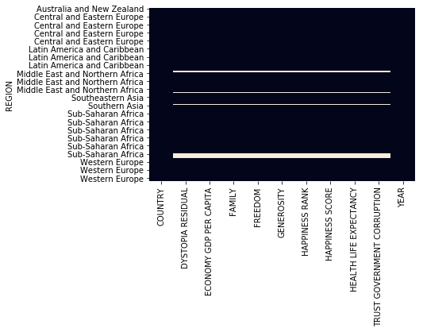

As a reminder, in the heatmap above, the missing values are represented with light gray and all other values with black. From this visualization, we can confirm that if the data is missing, it's missing in almost every column. We'll conclude that dropping the missing values won't cause us to lose valuable information in other columns.

*Question: Can we identify any patterns in the missing data?*

From the visualization above, we can also identify that only three regions contain missing values:

- Sub-Saharan Africa
- Middle East and Northern Africa
- Latin America and Carribbean

The Sub-Saharan Africa region contains the most missing values, accounting for about 9 percent of that regions's values. Since we'd like to analyze the data according to region, we should also think about how these values impact the analysis for this region specifically.


## Handling Missing Values with Imputation

In the last screen, we confirmed:

- Only about 4 percent of the values in each column are missing.
- Dropping rows with missing values won't cause us to lose information in other columns.

As a result, it *may* be best to drop the remaining missing values.

However, before we make a decision, let's consider handling the missing values by replacing them with estimated values, also called *imputation*.

1. Check for errors in data cleaning/transformation.
2. Use data from additional sources to fill missing values.
3. Drop row/column.
4. *Fill missing values with reasonable estimates computed from the available data.*

There are many options for choosing the replacement value, including:

- A constant value
- The mean of the column
- The median of the column
- The mode of the column

For non-numeric columns, common replacement values include the most frequent value or a string like "Unknown" that is used to treat missing values as a separate category.

For numeric columns, it's very common to replace missing values with the mean. Since the rest of the columns in `combined` with missing data are all numeric, we'll explore this option next.

First, let's build some intuition around this technique by analyzing how replacing missing values with the mean affects the distribution of the data. In order to do so, we'll use the [`Series.fillna()` method](https://pandas.pydata.org/pandas-docs/stable/reference/api/pandas.Series.fillna.html) to replace the missing values with the mean.

Note that we must pass the replacement value into the `Series.fillna()` method. For example, if we wanted to replace all of the missing values in the `HAPPINESS SCORE` column with `0`, we'd use the following syntax:

```
combined[`HAPPINESS SCORE`].fillna(0)
```

Next, let's replace the missing happiness scores with the mean.


```python
happiness_mean = combined['HAPPINESS SCORE'].mean()
combined['HAPPINESS SCORE UPDATED'] = combined['HAPPINESS SCORE'].fillna(happiness_mean)
print(combined['HAPPINESS SCORE UPDATED'].mean)
```


## Dropping Rows

In the last exercise, we confirmed that replacing missing values with the Series mean doesn't change the mean of the Series.

If we were to plot the distributions before and after replacing the missing values with the mean, we'd see that the shape of the distribution changes as more values cluster around the mean. Note that the mean is represented with the red and green lines in the plots below:

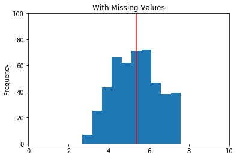

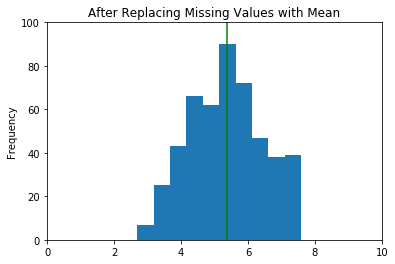

As we decide to use this approach, we should ask the following questions - are the missing happiness scores *likely* to be close to the mean? Or is it more likely that the scores are very high or very low? If the missing values lie at extremes, the mean won't be a good estimate for them.


Recall that when we visualized the missing data, we determined that the Sub-Saharan Africa region contained the most missing values. Since we'd like to analyze the data according to region, let's look more closely at the means for each region:

```python
combined.pivot_table(index='REGION', values='HAPPINESS SCORE', margins=True)
```

|                                 | HAPPINESS SCORE |
| ------------------------------- | --------------- |
| REGION                          |                 |
| Australia and New Zealand       | 7.302500        |
| Central and Eastern Europe      | 5.371184        |
| Eastern Asia                    | 5.632333        |
| Latin America and Caribbean     | 6.069074        |
| Middle East and Northern Africa | 5.387879        |
| North America                   | 7.227167        |
| Southeastern Asia               | 5.364077        |
| Southern Asia                   | 4.590857        |
| Sub-Saharan Africa              | 4.150957        |
| Western Europe                  | 6.693000        |
| All                             | 5.370728        |

As a reminder, the `All` row in the table above represents the mean happiness score for the whole world - the value that we used to replace our missing values. We can see that the world mean happiness score, 5.370728, is over 1 point higher than the mean happiness score for the Sub-Saharan Africa region, 4.150957.

Also, if we think about the reasons why a country may not have participated in the happiness survey - war, natural disaster, etc - many of them would likely result in a lower happiness score than even the region's mean. We'll conclude that the mean for the whole world wouldn't be a good estimate for them.

As a result, we'll decide that of these two options, it's better to drop the rows with missing values. Let's do that next.

## Drooping particular columns by index range

```python
date_survey_updated = date_survey.drop(date_survey.columns[28:49], axis=1)
```


## Next steps

In the last step, we concluded that in this case, it was better to drop the remaining rows with missing values rather than replace the missing values with the mean.

However, it's also good to know that other techniques for handling missing values *do* exist. Since this lesson is meant to be an introduction to this topic, we didn't cover them, but if you're interested in learning more, you can start [here](https://pandas.pydata.org/pandas-docs/stable/user_guide/missing_data.html).

Although there is no perfect way to handle missing values and each situation is different, now we know the basic techniques and built some intuition around them to better inform our decisions. Below is the workflow we used to clean missing values:

1. Check for errors in data cleaning/transformation.
2. Use data from additional sources to fill missing values.
3. Drop row/column.
4. Fill missing values with reasonable estimates computed from the available data.

We also started to set a more defined data cleaning workflow, in which we:

- Set a goal for the project.
- Researched and tried to understand the data.
- Determined what data was needed to complete our analysis.
- Added columns.
- Cleaned specific data types.
- Combined data sets.
- Removed duplicate values.
- Handled the missing values.


## Verifying the Total Null Columns

To give us a better picture of the null values in the data, let's calculate the percentage of null values in each column. Below, we divide the number of null values in each column by the total number of values in the data set:

```
null_counts_pct = null_counts / mvc.shape[0] * 100
```

We'll then add both the counts and percentages to a dataframe to make them easier to compare:

```
null_df = pd.DataFrame({'null_counts': null_counts, 'null_pct': null_counts_pct})
# Rotate the dataframe so that rows become columns and vice-versa
null_df = null_df.T.astype(int)

print(null_df)
```

|             | unique_key | date | time | borough | location | on_street | cross_street | off_street | pedestrians_injured | cyclist_injured | motorist_injured | total_injured | pedestrians_killed | cyclist_killed | motorist_killed | total_killed | vehicle_1 | vehicle_2 | vehicle_3 | vehicle_4 | vehicle_5 | cause_vehicle_1 | cause_vehicle_2 | cause_vehicle_3 | cause_vehicle_4 | cause_vehicle_5 |
| ----------- | ---------- | ---- | ---- | ------- | -------- | --------- | ------------ | ---------- | ------------------- | --------------- | ---------------- | ------------- | ------------------ | -------------- | --------------- | ------------ | --------- | --------- | --------- | --------- | --------- | --------------- | --------------- | --------------- | --------------- | --------------- |
| null_counts | 0          | 0    | 0    | 20646   | 3885     | 13961     | 29249        | 44093      | 0                   | 0               | 0                | 1             | 0                  | 0              | 0               | 5            | 355       | 12262     | 54352     | 57158     | 57681     | 175             | 8692            | 54134           | 57111           | 57671           |
| null_pct    | 0          | 0    | 0    | 35      | 6        | 24        | 50           | 76         | 0                   | 0               | 0                | 0             | 0                  | 0              | 0               | 0            | 0         | 21        | 93        | 98        | 99        | 0               | 15              | 93              | 98              | 99              |

About a third of the columns have no null values, with the rest ranging from less than 1% to 99%!

To make things easier, let's start by looking at the group of columns that relate to people killed in collisions.

We'll use list comprehension to reduce our summary dataframe to just those columns:

```
killed_cols = [col for col in mvc.columns if 'killed' in col]
print(null_df[killed_cols])
```

|             | pedestrians_killed | cyclist_killed | motorist_killed | total_killed |
| ----------- | ------------------ | -------------- | --------------- | ------------ |
| null_counts | 0                  | 0              | 0               | 5            |
| null_pct    | 0                  | 0              | 0               | 0            |

We can see that each of the individual categories have no missing values, but the `total_killed` column has five missing values.

One option for handling this would be to remove – or drop – those five rows. This would be a reasonably valid choice since it's a tiny portion of the data, but let's think about what other options we have first.

If you think about it, the total number of people killed should be the sum of each of the individual categories. We might be able to "fill in" the missing values with the sums of the individual columns for that row. The technical name for filling in a missing value with a replacement value is called **imputation**.

Let's look at how we could explore the values where the `total_killed` isn't equal to the sum of the other three columns. We'll illustrate this process using a series of diagrams. The diagrams won't contain values, they'll just show a grid to represent the values.

Let's start with a dataframe of just the four columns relating to people killed:


We then select just the first three columns, and manually sum each row:


We then compare the manual sum to the original total column to create a boolean mask where equivalent values are *not* equal:


Lastly, we use the boolean mask to filter the original dataframe to include only rows where the manual sum and original aren't equal:


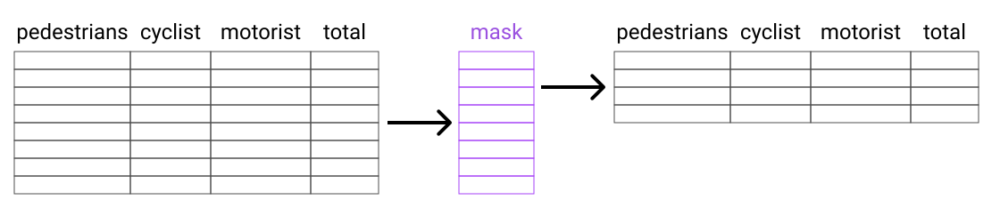

```python
killed_cols = [col for col in mvc.columns if 'killed' in col]
killed = mvc[killed_cols].copy()

killed_manual_sum = killed.iloc[:,0:3].sum(axis=1)
killed_mask = killed_manual_sum != killed['total_killed']
killed_non_eq = killed[killed_mask]
```


## Using Series.mask 

The `killed_non_eq` dataframe we created in the previous exercise contained six rows:

|       | pedestrians_killed | cyclist_killed | motorist_killed | total_killed |
| ----- | ------------------ | -------------- | --------------- | ------------ |
| 3508  | 0                  | 0              | 0               | NaN          |
| 20163 | 0                  | 0              | 0               | NaN          |
| 22046 | 0                  | 0              | 1               | 0.0          |
| 48719 | 0                  | 0              | 0               | NaN          |
| 55148 | 0                  | 0              | 0               | NaN          |
| 55699 | 0                  | 0              | 0               | NaN          |

We can categorize these into two categories:

1. Five rows where the `total_killed` is not equal to the sum of the other columns because the total value is missing.
2. One row where the `total_killed` is less than the sum of the other columns.

From this, we can conclude that filling null values with the sum of the columns is a fairly good choice for our imputation, given that only six rows out of around 58,000 don't match this pattern.

We've also identified a row that has suspicious data - one that doesn't sum correctly. Once we have imputed values for all rows with missing values for `total_killed`, we'll mark this suspect row by setting its value to `NaN`.

In order to execute this, we'll learn to use the [`Series.mask()` method](http://pandas.pydata.org/pandas-docs/stable/reference/api/pandas.Series.mask.html). `Series.mask()` is useful when you want to replace certain values in a series based off a boolean mask. The syntax for the method is:

```
Series.mask(bool_mask, val_to_replace)
```

Let's look at an example with some simple data. We'll start with a series called `fruits`:


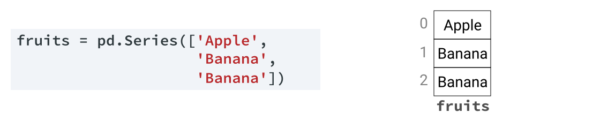


Next, we create a boolean series that matches values equal to the string `Banana`:


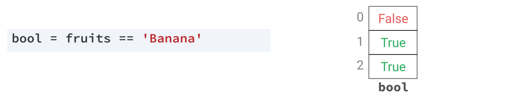


Lastly, we use `Series.mask()` to replace all the values that match the boolean series with a new value, `Pear`:


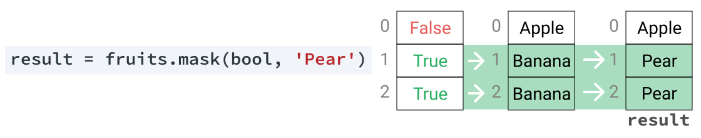


If we wanted to describe the logic of the code above, we'd say *For each value in the "fruits" series, if the corresponding value in the "bool" series is true, update the value to "Pear," otherwise leave the original value*.

In the first example above, we updated a single value, but we can also update with the matching value from a series that has identical index labels, like this `nums` series:


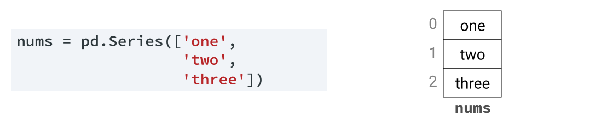


Let's look at how we can update the matching values in `fruit` with the corresponding values in `nums`:


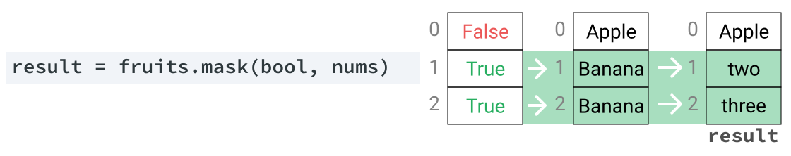


If we wanted to describe the logic of the code above, we'd say *For each value in the "fruits" series, if the corresponding value in the "bool" series is true, update the value to the corresponding value from "nums," otherwise leave the original value*.

Let's look at how we'd use this technique to update the values in the `total_killed` column. First, we'll replace all null values with the equivalent values from our `killed_manual_sum` series:

```
killed_null = killed['total_killed'].isnull()
killed['total_killed'] = killed['total_killed'].mask(killed_null, killed_manual_sum)
```

Next, we'll replace any values where the manual sum and the total column aren't equal with `np.nan`. This time we'll define the boolean series directly into `Series.mask()`:

```
killed['total_killed'] = killed['total_killed'].mask(killed['total_killed'] != killed_manual_sum, np.nan)
```

Now let's look at the values we've changed:

```
print(killed[killed_mask])
```

|       | pedestrians_killed | cyclist_killed | motorist_killed | total_killed |
| ----- | ------------------ | -------------- | --------------- | ------------ |
| 3508  | 0                  | 0              | 0               | 0.0          |
| 20163 | 0                  | 0              | 0               | 0.0          |
| 22046 | 0                  | 0              | 1               | NaN          |
| 48719 | 0                  | 0              | 0               | 0.0          |
| 55148 | 0                  | 0              | 0               | 0.0          |
| 55699 | 0                  | 0              | 0               | 0.0          |

We've gone from five null values to one, and flagged some suspicious data. Let's do the same for the injured columns.


## Analysis Part

### Analyzing missing data after Series.Mask operation

Let's summarize the count of null values before and after our changes:

```python
summary = {
    'injured': [
        mvc['total_injured'].isnull().sum(),
        injured['total_injured'].isnull().sum()
    ],
    'killed': [
        mvc['total_killed'].isnull().sum(),
        killed['total_killed'].isnull().sum()
    ]
}
print(pd.DataFrame(summary, index=['before','after']))
```

|        | injured | killed |
| ------ | ------- | ------ |
| before | 1       | 5      |
| after  | 21      | 1      |

For the `total_killed` column, the number of values has gone down from 5 to 1. For the `total_injured` column, the number of values has actually gone up — from 1 to 21. This might sound like we've done the opposite of what we set out to do, but what we've actually done is fill all the null values **and** identify values that have suspect data. This will make any analysis we do on this data more accurate in the long run.

Let's assign the values from the `killed` and `injured` dataframe back to the main `mvc` dataframe:

### Analyzing Correlations in Missing Data


The plot you produced on the previous screen is below:


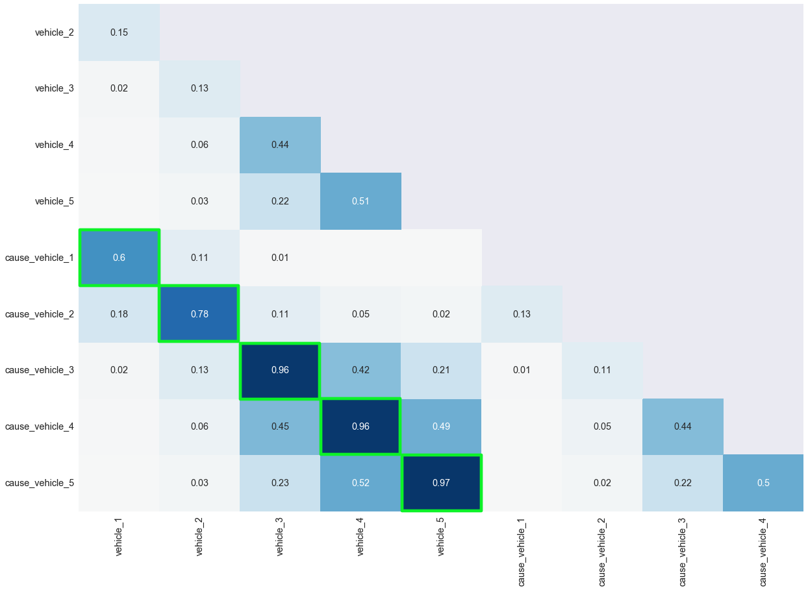


We outlined a diagonal strip of five squares in green that have a higher correlation than the rest. The pairs of column names that make up these five correlations are:

1. `vehicle_1` and `cause_vehicle_1`
2. `vehicle_2` and `cause_vehicle_2`
3. `vehicle_3` and `cause_vehicle_3`
4. `vehicle_4` and `cause_vehicle_4`
5. `vehicle_5` and `cause_vehicle_5`

If you think about it, this makes sense. When a vehicle is in an accident, there is likely to be a cause, and vice-versa.

Let's explore the variations in missing values from these five pairs of columns. We'll create a dataframe that counts, for each pair:

- The number of values where the vehicle is missing when the cause is not missing.
- The number of values where the cause is missing when the vehicle is not missing.

The final structure of our dataframe will look like this:

|      | v_number | vehicle_missing | cause_missing |
| ---- | -------- | --------------- | ------------- |
| 0    | 1        | [count]         | [count]       |
| 1    | 2        | [count]         | [count]       |
| 2    | 3        | [count]         | [count]       |
| 3    | 4        | [count]         | [count]       |
| 4    | 5        | [count]         | [count]       |


```python
col_labels = ['v_number', 'vehicle_missing', 'cause_missing']

vc_null_data = []

for v in range(1,6):
    v_col = 'vehicle_{}'.format(v)
    c_col = 'cause_vehicle_{}'.format(v)
    v_null = (mvc[v_col].isnull() & mvc[c_col].notnull()).sum()
    c_null = (mvc[c_col].isnull() & mvc[v_col].notnull()).sum()
    vc_null_data.append([v, v_null, c_null])
    
    
vc_null_df = pd.DataFrame(vc_null_data, columns=col_labels)
```


### Finding the Most Common Values Across Multiple Columns

The analysis we did on the previous screen indicates that there are roughly 4,500 missing values across the 10 columns. The easiest option for handling these would be to drop the rows with missing values. This would mean losing almost 10% of the total data, which is something we ideally want to avoid.

A better option is to impute the data, like we did earlier. Because the data in these columns is text data, we can't perform a numeric calculation to impute missing data like we did with the `injuries` and `killed` columns.

One common option when imputing is to use the most common value to fill in data. Let's look at the common values across these columns and see if we can use that to make a decision.

We've previously used the [`Series.value_counts()` method](http://pandas.pydata.org/pandas-docs/stable/reference/api/pandas.Series.value_counts.html) to find the most common values in a single column. In this case, we want to find the most common values across *multiple* columns. In order to do this, we first need to convert our dataframe of multiple columns into one single column, and then we can use `Series.value_counts()` to count the items.

To convert a dataframe to a single column of values, we use the [`DataFrame.stack()` method,](http://pandas.pydata.org/pandas-docs/stable/reference/api/pandas.DataFrame.stack.html#pandas.DataFrame.stack) which stacks a dataframe object into a Series object. Let's look at a diagram of how this works. We'll start with a simple dataframe with three columns containing words:


When we use `DataFrame.stack()`, the values become a series object, with the values from each row "stacked" on top of each other:


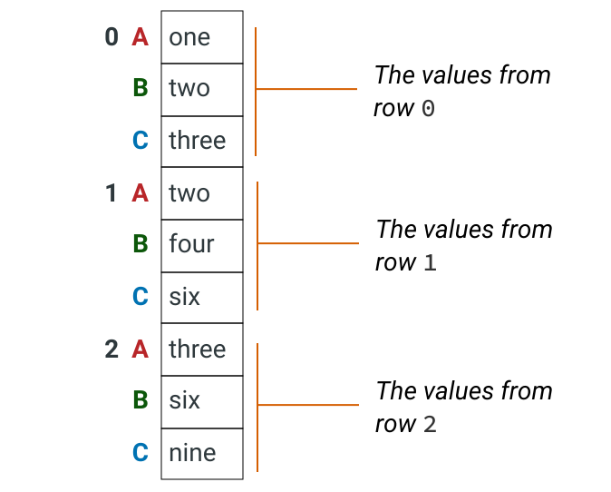


This series object actually has two row indexes. The first index is the original row index, and the second contains the columns that correspond to the value.

Once we have this stacked series, we can just use `Series.value_counts()` to count the values:


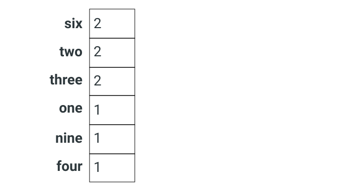


Let's use this technique to count the most common values for the cause set of columns. We'll start by selecting only the columns containing the substring `cause`.

```
cause_cols = [c for c in mvc.columns if "cause_" in c]
cause = mvc[cause_cols]
print(cause.head())
```

|      | cause_vehicle_1       | cause_vehicle_2     | cause_vehicle_3 | cause_vehicle_4 | cause_vehicle_5 |
| ---- | --------------------- | ------------------- | --------------- | --------------- | --------------- |
| 0    | Following Too Closely | Unspecified         | NaN             | NaN             | NaN             |
| 1    | Backing Unsafely      | Unspecified         | NaN             | NaN             | NaN             |
| 2    | Following Too Closely | Unspecified         | NaN             | NaN             | NaN             |
| 3    | Glare                 | Passing Too Closely | NaN             | NaN             | NaN             |
| 4    | Turning Improperly    | Unspecified         | NaN             | NaN             | NaN             |

Next, we'll stack the values into a single series object:

```
cause_1d = cause.stack()
print(cause_1d.head())
```

```
0  cause_vehicle_1    Following Too Closely
   cause_vehicle_2              Unspecified
1  cause_vehicle_1         Backing Unsafely
   cause_vehicle_2              Unspecified
2  cause_vehicle_1    Following Too Closely
dtype: object
```

You may notice that the stacked version omits null values - this is fine, as we're just interested in the most common non-null values.

Finally, we count the values in the series:

```
cause_counts = cause_1d.value_counts()
top10_causes = cause_counts.head(10)
print(top10_causes)
```

```
Unspecified                       57481
Driver Inattention/Distraction    17650
Following Too Closely              6567
Failure to Yield Right-of-Way      4566
Passing or Lane Usage Improper     3260
Passing Too Closely                3045
Backing Unsafely                   3001
Other Vehicular                    2523
Unsafe Lane Changing               2372
Turning Improperly                 1590
dtype: int64
```

The most common non-null value for the cause columns is `Unspecified`, which presumably indicates that the officer reporting the collision was unable to determine the cause for that vehicle.


### Filling Unknown Values with a Placeholder

Let's look at the values analysis we completed on the previous screen:

```
print(top10_vehicles)
```

```
Sedan                                  33133
Station Wagon/Sport Utility Vehicle    26124
PASSENGER VEHICLE                      16026
SPORT UTILITY / STATION WAGON          12356
Taxi                                    3482
Pick-up Truck                           2373
TAXI                                    1892
Box Truck                               1659
Bike                                    1190
Bus                                     1162
dtype: int64
```

```
print(top_10_causes)
```

```
Unspecified                       57481
Driver Inattention/Distraction    17650
Following Too Closely              6567
Failure to Yield Right-of-Way      4566
Passing or Lane Usage Improper     3260
Passing Too Closely                3045
Backing Unsafely                   3001
Other Vehicular                    2523
Unsafe Lane Changing               2372
Turning Improperly                 1590
dtype: int64
```

The top "cause" is an "Unspecified" placeholder. This is useful instead of a null value as it makes the distinction between a value that is missing because there were only a certain number of vehicles in the collision versus one that is because the contributing cause for a particular vehicle is unknown.

The vehicles columns don't have an equivalent, but we can still use the same technique. Here's the logic we'll need to do for each pair of vehicle/cause columns:

1. For values where the vehicle is null and the cause is non-null, set the vehicle to `Unspecified`.
2. For values where the cause is null and the vehicle is not-null, set the cause to `Unspecified`.

We can use `Series.mask()` to replace the values, just like we did earlier in the lesson. Let's look at code to perform this for the `vehicle_1` and `vehicle_cause_1` columns:

```
# create a mask for each column
v_missing_mask = mvc['vehicle_1'].isnull() & mvc['cause_vehicle_1'].notnull()
c_missing_mask = mvc['cause_vehicle_1'].isnull() & mvc['vehicle_1'].notnull()

# replace the values matching the mask for each column
mvc['vehicle_1'] =  mvc['vehicle_1'].mask(v_missing_mask, "Unspecified")
mvc['cause_vehicle_1'] =  mvc['cause_vehicle_1'].mask(c_missing_mask, "Unspecified")
```

Now let's use a loop to fill in these values across all columns. We've created a helper function `summarize_missing()` which contains the logic we used earlier to count missing values across the pairs of columns. Below is a quick demonstration on how it works:

```
print(summarize_missing())
```


|      | vehicle_number | vehicle_missing | cause_missing |
| ---: | -------------: | --------------: | ------------: |
|    0 |              1 |             204 |            24 |
|    1 |              2 |            3793 |           223 |
|    2 |              3 |             242 |            24 |
|    3 |              4 |              50 |             3 |
|    4 |              5 |              10 |             0 |


### Investigate Missing Data in the "Location" Columns

Let's view the work we've done across the past few screens by looking at the null correlation plot for the last 10 columns:

```python
veh_cols = [c for c in mvc.columns if 'vehicle' in c]
plot_null_correlations(mvc[veh_cols])
```

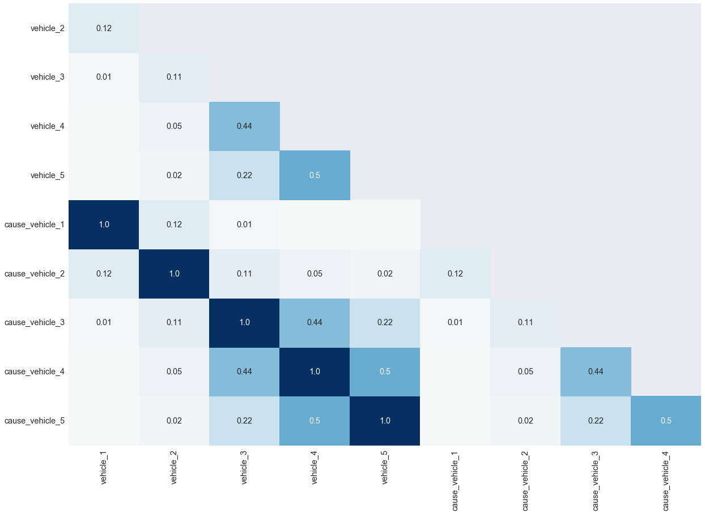

You can see the perfect correlation between each pair of vehicle/cause columns represented by 1.01.0 in each square, which means that there is a perfect relationship between the five pairs of vehicle/cause columns.

Let's now turn our focus to the final set of columns that contain missing values — the columns that relate to the location of the accident. We'll start by looking at the first few rows to refamiliarize ourselves with the data:

```python
loc_cols = ['borough', 'location', 'on_street', 'off_street', 'cross_street']
location_data = mvc[loc_cols]
print(location_data.head())
```


|      | borough   | location               | on_street      | off_street          | cross_street   |
| ---- | --------- | ---------------------- | -------------- | ------------------- | -------------- |
| 0    | MANHATTAN | (40.742832, -74.00771) | WEST 15 STREET | NaN                 | 10 AVENUE      |
| 1    | BROOKLYN  | (40.623714, -73.99314) | 16 AVENUE      | NaN                 | 62 STREET      |
| 2    | NaN       | (40.591755, -73.9083)  | BELT PARKWAY   | NaN                 | NaN            |
| 3    | QUEENS    | (40.73602, -73.87954)  | GRAND AVENUE   | NaN                 | VANLOON STREET |
| 4    | BRONX     | (40.884727, -73.89945) | NaN            | 208 WEST 238 STREET | NaN            |

Next, let's look at counts of the null values in each column:

```python
print(location_data.isnull().sum())
```

```
borough         20646
location         3885
on_street       13961
off_street      44093
cross_street    29249
dtype: int64
```

These columns have a lot of missing values! Keep in mind that all of these five columns represent the same thing — the location of the collision. We can potentially use the non-null values to impute some of the null values.

To see where we might be able to do this, let's look for correlations between the missing values:

```
plot_null_correlations(location_data)
```

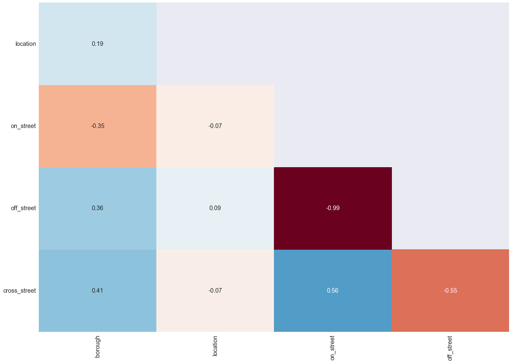

None of these columns have strong correlations except for `off_street` and `on_street` which have a near perfect *negative* correlation. That means for almost every row that has a null value in one column, the other has a non-null value and vice-versa.

The final way we'll look at the null values in these columns is to plot a null matrix, but we'll sort the data first. This will gather some of the null and non-null values together and make patterns more obvious:

```python
sorted_location_data = location_data.sort_values(loc_cols)
plot_null_matrix(sorted_location_data)
```

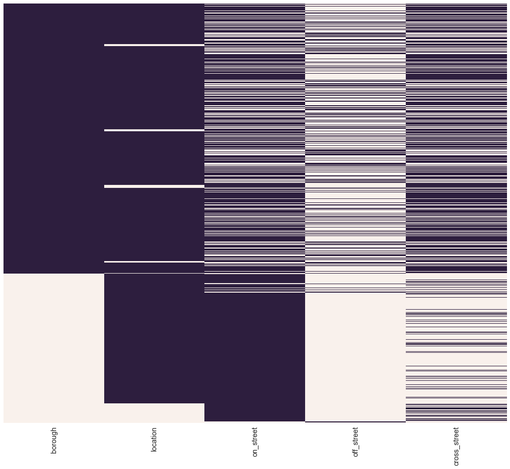

Let's make some observations about the missing values across these columns:

1. About two-thirds of rows have non-null values for `borough`, but of those values that are missing, most have non-null values for `location` and one or more of the street name columns.
2. Less than one-tenth of rows have missing values in the `location` column, but most of these have non-null values in one or more of the street name columns.
3. Most rows have a non-null value for either `on_street` or `off_street`, and some also have a value for `cross_street`.

Combined, this means that we will be able to impute a lot of the missing values by using the other columns in each row. To do this, we can use geolocation APIs that take either an address or location coordinates, and return information about that location.


### Imputing Location Data

We prepared the supplemental data using the [GeoPy](http://geopy.readthedocs.io/en/latest/) package, which makes working with Geocoding APIs like the Google Maps API easier. Here's the strategy we used to prepare the supplemental data:

- For rows with `location` values but missing values in either `borough` or the street name columns, we used geocoding APIs to look up the `location` coordinates to find the missing data.
- For rows with values in the street name columns missing `borough` and/or `location` data, we used geocoding APIs to look up the address to find the missing data.

You can learn more about working with APIs in our [APIs and Web Scraping](https://app.dataquest.io/course/apis-and-scraping) course.

The supplemental data is in a CSV called `supplemental_data.csv`, let's read this into a pandas dataframe and familiarize ourself with the data:

```
sup_data = pd.read_csv('supplemental_data.csv')
sup_data.head()
```

Copy

|      | unique_key | location | on_street    | off_street | borough  |
| ---- | ---------- | -------- | ------------ | ---------- | -------- |
| 0    | 3869058    | NaN      | NaN          | NaN        | NaN      |
| 1    | 3847947    | NaN      | NaN          | NaN        | NaN      |
| 2    | 3914294    | NaN      | BELT PARKWAY | NaN        | BROOKLYN |
| 3    | 3915069    | NaN      | NaN          | NaN        | NaN      |
| 4    | 3923123    | NaN      | NaN          | NaN        | NaN      |

The supplemental data has five columns from our original data set — the `unique_key` that identifies each collision, and four of the five location columns. The `cross_street` column is not included because the geocoding APIs we used don't include data on the nearest cross street to any single location.

Let's take a look at a null matrix for the supplemental data:

```
plot_null_matrix(sup_data)
```

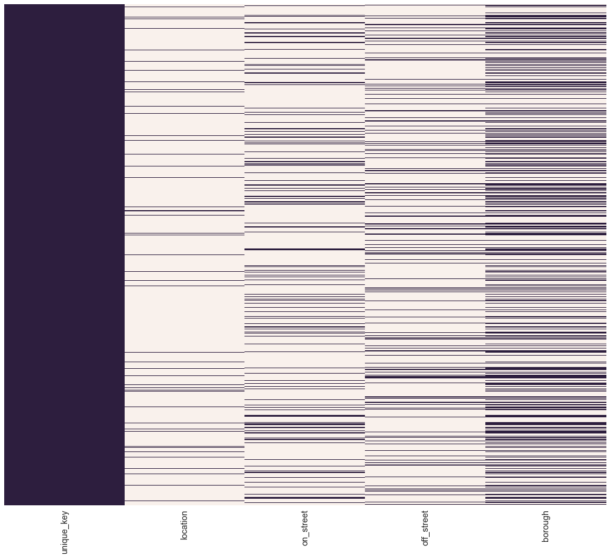

Apart from the `unique_key` column, you'll notice that there are a lot more missing values than our main data set. This makes sense, as we didn't prepare supplemental data where the original data set had non-null values.

If the `unique_key` column in both the original and supplemental data has the same values in the same order, we'll be able to use `Series.mask()` to add our supplemental data to our original data. We can check this using the [`Series.equals()` method](http://pandas.pydata.org/pandas-docs/stable/reference/api/pandas.Series.equals.html):

```
mvc_keys = mvc['unique_key']
sup_keys = sup_data['unique_key']

is_equal = mvc_keys.equals(sup_keys)
print(is_equal)
```

```
True
```

Now that we've verified the data, it's time to use it to impute missing values.


### How to check null values before and after imputation


```python
sup_data = pd.read_csv('supplemental_data.csv')

location_cols = ['location', 'on_street', 'off_street', 'borough']
null_before = mvc[location_cols].isnull().sum()

for location in location_cols:
    
    # if mvc[location].isnull().sum() > 0:
    #     print("columns {} contains missing values".format(location))
    location_null = mvc[location].isnull()
    mvc[location] = mvc[location].mask(location_null,sup_data[location])

null_after = mvc[location_cols].isnull().sum()   
```


## Data Cleaning - My Workflow

### For two similar data sets

1. Check for the columns if the contain the same data but only column names are different
2. DataFrame.info() check for the values in columns if the contain strange values like "Not Stated" which should be null
3. Check if all columns are necessary for the analysis

### How do the drop

To drop columns from a Pandas DataFrame, you can use the DataFrame.drop method. This method takes two main arguments:

labels: a single label or a list of labels to drop. These labels should correspond to the column names of the DataFrame.
axis: specifies whether to drop rows (0) or columns (1). By default, axis is set to 0, so you'll need to specify axis=1 to drop columns.
Here's an example of how you can use drop to remove a single column from a DataFrame:

```python
import pandas as pd

# Load a sample DataFrame
df = pd.read_csv('data.csv')

# Drop the 'Name' column
df = df.drop('Name', axis=1)
```


You can also use the drop method to remove multiple columns at once by passing a list of column labels to the labels argument. For example:

```python
import pandas as pd

# Load a sample DataFrame
df = pd.read_csv('data.csv')

# Drop the 'Name' and 'Age' columns
df = df.drop(['Name', 'Age'], axis=1)
```

Keep in mind that the drop method returns a new DataFrame with the specified columns removed, so you'll need to assign the result back to the original DataFrame variable if you want to modify the original DataFrame. If you want to remove columns in place, you can use the inplace parameter:

```python
import pandas as pd

# Load a sample DataFrame
df = pd.read_csv('data.csv')

# Drop the 'Name' and 'Age' columns in place
df.drop(['Name', 'Age'], axis=1, inplace=True)
```

### How to analyze columns to drop from datagram pandas

There are a few different strategies you can use to analyze which columns to drop from a Pandas DataFrame:

Remove columns with a high percentage of missing values: If a column has a high percentage of missing values (e.g., more than 50%), it may not be useful for analysis. You can use the DataFrame.isnull method to count the number of missing values in each column, and then divide by the total number of rows to calculate the percentage of missing values. You can then use the DataFrame.drop method to remove the columns with a high percentage of missing values.

Remove columns with low variance: If a column has very little variance (e.g., all values are the same or nearly the same), it may not be useful for analysis. You can use the DataFrame.var method to calculate the variance of each column, and then use the DataFrame.drop method to remove the columns with low variance.

Remove columns that are not relevant to the analysis: If a column is not relevant to the analysis you are conducting, you can drop it to simplify the DataFrame and make it easier to work with.

Remove columns with highly correlated values: If two or more columns are highly correlated (i.e., they have a high degree of linear dependence), you may want to remove one of the columns to avoid redundancy. You can use the DataFrame.corr method to calculate the correlation between columns, and then use the DataFrame.drop method to remove the columns with highly correlated values.

It's worth noting that you should be careful when dropping columns from a DataFrame, as removing certain columns may affect the validity of your analysis. Be sure to carefully consider the impact of dropping columns on your analysis before making any changes to your DataFrame.


------


# Pandas and JSON

## Reading JSON files into pandas

So far, we've worked with our JSON data using pure Python. One other option available to us is to convert the JSON to a pandas dataframe and then use pandas methods to manipulate it.

Pandas has the [`pandas.read_json()` function](http://pandas.pydata.org/pandas-docs/stable/reference/api/pandas.read_json.html), which is designed to read JSON from either a file or a JSON string. In our case, our JSON exists as Python objects already, so we don't need to use this function.

Because the structure of JSON objects can vary a lot, sometimes you will need to prepare your data in order to be able to convert it to a tabular form. In our case, our data is a list of dictionaries, which pandas is easily able to convert to a dataframe.

Let's look at an our example JSON again:

```python
jprint(json_obj)
```

```python
[
    {
        "age": 36,
        "favorite_foods": ["Pumpkin", "Oatmeal"],
        "name": "Sabine"
    },
    {
        "age": 40,
        "favorite_foods": ["Chicken", "Pizza", "Chocolate"],
        "name": "Zoe"
    },
    {
        "age": 40,
        "favorite_foods": ["Caesar Salad"],
        "name": "Heidi"
    }
]
```

Each of the dictionaries will become a row in the dataframe, with each key corresponding to a column name.


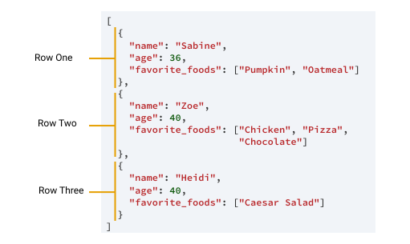


We can use the [`pandas.DataFrame()` constructor](http://pandas.pydata.org/pandas-docs/stable/reference/api/pandas.DataFrame.html#pandas.DataFrame) and pass the list of dictionaries directly to it to convert the JSON to a dataframe:

```python
json_df = pd.DataFrame(json_obj)
print(json_df)
```

```python
age                 favorite_foods    name
0   36             [Pumpkin, Oatmeal]  Sabine
1   40    [Chicken, Pizza, Chocolate]     Zoe
2   40                 [Caesar Salad]   Heidi
```

In this case, the `favorite_foods` column contains the list from the JSON. We'll see a similar thing with the `tags` column for our Hacker News data. We'll learn how to correct that on the next screen, but for now, let's convert our data to a pandas dataframe.


## Exploring Tags Using the Apply Function

Let's look at the first few rows of our new `hn_df` dataframe:

|      | author         | createdAt            | numComments | objectId | points | storyText | tags                                          | title                                                        | url                                                          |
| ---- | -------------- | -------------------- | ----------- | -------- | ------ | --------- | --------------------------------------------- | ------------------------------------------------------------ | ------------------------------------------------------------ |
| 0    | dragongraphics | 2014-05-29T08:07:50Z | 0           | 7815238  | 2      |           | [story, author_dragongraphics, story_7815238] | Are we getting too Sassy? Weighing up micro-optimisation vs. maintainability | http://ashleynolan.co.uk/blog/are-we-getting-too-sassy       |
| 1    | jcr            | 2014-05-29T08:05:58Z | 0           | 7815234  | 1      |           | [story, author_jcr, story_7815234]            | Telemba Turns Your Old Roomba and Tablet Into a Telepresence Robot | http://spectrum.ieee.org/automaton/robotics/home-robots/telemba-telepresence-robot |
| 2    | callum85       | 2014-05-29T08:05:06Z | 0           | 7815230  | 1      |           | [story, author_callum85, story_7815230]       | Apple Agrees to Buy Beats for $3 Billion                     | http://online.wsj.com/articles/apple-to-buy-beats-1401308971 |
| 3    | d3v3r0         | 2014-05-29T08:00:08Z | 0           | 7815222  | 1      |           | [story, author_d3v3r0, story_7815222]         | Don’t wait for inspiration                                   | http://alexsblog.org/2014/05/29/dont-wait-for-inspiration/   |
| 4    | timmipetit     | 2014-05-29T07:46:19Z | 0           | 7815191  | 1      |           | [story, author_timmipetit, story_7815191]     | HackerOne Get $9M In Series A Funding To Build Bug Tracking Bounty Programs | http://techcrunch.com/2014/05/28/hackerone-get-9m-in-series-a-funding-to-build-bug-tracking-bounty-programs/ |

Just like the `favorite_food` column in our example data on the previous screen, the `tags` column is a column where each item contains the list of data from our original JSON.

At first glance, it looks like each values in this JSON list contain three items:

1. The string `story`
2. The name of the author
3. The story ID

If that's the case, then the column doesn't contain any unique data, and we can remove it. We're going to analyze this column to make sure that's the case.

Let's start by exploring how pandas is storing that data. First, we'll extract the column as a series, and check its type:

```
tags = hn_df['tags']
print(tags.dtype)
```

```
object
```

The tags column is stored as an object type. Whenever pandas uses the object type, each item in the series uses a Python object to store the data. Most commonly we see this type used for string data.

We previously learned that we could use the [`Series.apply()` method](http://pandas.pydata.org/pandas-docs/stable/reference/api/pandas.Series.apply.html#pandas.Series.apply) to apply a function to every item in a series. Let's look at what we get when we pass the `type()` function as an argument to the column:

```
tags_types = tags.apply(type)
type_counts = tags_types.value_counts(dropna=False)
print(type_counts)
```

```
class 'list'    35806
Name: tags, dtype: int64
```

All 35,806 items in the column are a Python list type.

Next, let's use `Series.apply()` to check the length of each of those lists. If our hypothesis from earlier is correct, every row will have a list containing three items:

```
tags_types = tags.apply(len)
type_lengths = tags_types.value_counts(dropna=False)
print(type_lengths)
```

```
3    33459
4     2347
Name: tags, dtype: int64
```

While most of the item have three values in the list, about 2,000 values contain four values. Let's use a boolean mask to look at the items where the list has four items:


## Extracting Tags Using Apply with a Lambda Function

Let's look at the first few items in the `four_tags` series we just created:

```
print(four_tags.head())
```


```
43      [story, author_alamgir_mand, story_7813869, show_hn]
86           [story, author_cweagans, story_7812404, ask_hn]
104    [story, author_nightstrike789, story_7812099, ask_hn]
107    [story, author_ISeemToBeAVerb, story_7812048, ask_hn]
109           [story, author_Swizec, story_7812018, show_hn]
Name: tags, dtype: object
```

It looks like whenever there are four tags, the extra tag is the last of the four. In this final exercise of the lesson, we're going to use a lambda function to extract this fourth value in cases where there is one. To do this for any single list, we'll need to:

- Check the length of the list.
- If the length of the list is equal to four, return the last value.
- If the length of the list isn't equal to four, return a null value.

This is how we could create this as a standard function:

```
def extract_tag(l):
    if len(l) == 4:
        return l[-1]
    else:
        return None
```


We could use `Series.apply()` to apply this function as is, but to practice working with lambda functions, let's look at how we can complete this operation in a single line.

To achieve this, we'll have to use a special version of an if statement known as a **ternary operator**. You can use the ternary operator whenever you need to return one of two values depending on a boolean expression. The syntax is as follows:

```
[on_true] if [expression] else [on_false]
```

The diagram below shows our function using an if statement and its ternary operator equivalent:


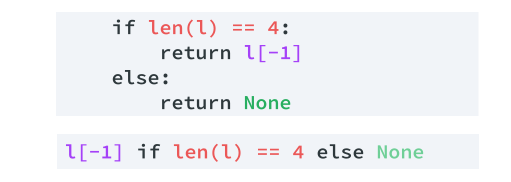


Let's finish by creating a lambda function version of this function and using apply to extract the tags.


```python
cleaned_tags = tags.apply(lambda x: x[-1] if len(x) == 4 else None)
hn_df['tags'] = cleaned_tags
```

