# Python doc search

https://docs.python.org/3/search.html

------


# Python Modules

Python contains many **standard modules** that help us perform various tasks, such as performing advanced mathematical operations, working with specific file formats and databases, and working with dates and times.

The `csv` module is a standard module. We can understand how its definitions work based on the documentation, and we don't need to worry about the complexity of how they actually function — similar to the built-in Python functions.

Whenever we use definitions from a module, we first need to **import** those definitions. There are a number of ways we can import modules and their definitions using the [`import` statement](https://docs.python.org/3/reference/simple_stmts.html#import):

**1. Import the whole module by name.** This is the most common method for importing a module.

```python
# import the module
import csv

# definitions are available using the format
# module_name.definition_name
csv.reader()
```

**2. Import the whole module with an alias.** This is especially useful if a module is long and we need to type it a lot.

```python
# import the module with an alias
import csv as c

# definitions are available using the format
# alias.definition_name
c.reader()
```

**3. Import one or more definitions from the module by name.** This technique is useful if you want only a single or select definitions and don't want to import everything.

```python
# import a single definition
from csv import reader

# the definition you imported is available
# by name
reader()
```

```python
# import multiple definitions
from csv import reader, writer

# the definitions you imported are available
# using the format definition_name
reader()
writer()
```

**4. Import all definitions with a wildcard.** This is useful if you want to import and use many definitions from a module.

```python
# import all definitions
from csv import *

# all definitions from the module are
# available using the format definition_name
reader()
writer()
get_dialect()
```

Choosing which option to use when importing is often a matter of taste, but it's good to think about how each choice can affect the readability of your code:

- If we're importing a long-name module by name and using it often, our code can become difficult to read.
- If we use an uncommon alias, it may not be clear in our code which module we are using.
- If we use the specific definition or wildcard approach, and the script is long or complex, it may not be immediately clear where a definition comes from. This can also be a problem if we use this approach with multiple modules.
- If we use the specific definition or wildcard approach, it's easier to accidentally overwrite an imported definition.

In the end, there is often more than one "correct" way, so the most important thing is to know the trade-offs when you make a decision on how to import definitions from modules.

## datetime module

The datetime module contains a number of classes, including the following:

- `datetime.datetime`: for working with date and time data
- `datetime.time`: for working with time data only
- `datetime.timedelta`: for representing time periods

You may have noticed that the first class, `datetime`, has the same name as the module. This can create confusion in our code. Let's look at a few different ways of importing and working with this first class, including the trade-offs of each:

**Import the whole module by name**


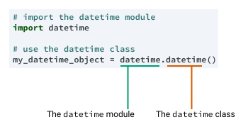


- *Pro:* it's clear whenever you use `datetime` whether you're referring to the module or the class
- *Con:* it has the potential to create long lines of code, which can be more difficult to read

**Import definitions via name or wildcard**


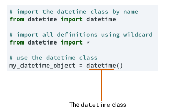


- *Pro:* shorter lines of code, which are easier to read
- *Con:* when we use `datetime`, it's not clear whether we are referring to the module or the class

**Import whole module by alias**


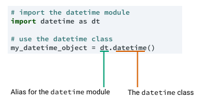


- *Pro:* there is no ambiguity between `dt` (alias for the module) and `dt.datetime` (the class).
- *Con:* the `dt` alias isn't a common convention, which would confuse other people reading our code

In the end, even though using an alias for the datetime module (the third option) is less common, it's a nice compromise between avoiding module versus class confusion, and it keeps our code easy to read


## datetime class

https://docs.python.org/3/library/datetime.html#strftime-strptime-behavior

https://strftime.org/

he [`datetime.datetime` class](https://docs.python.org/3/library/datetime.html#datetime.datetime) is the most commonly used class from the datetime module, and it has attributes and methods that work with data containing both the date and the time. The signature of the class is below (with some less-common parameters omitted):

```python
datetime.datetime(year, month, day, hour=0, minute=0, second=0)
```

The signature indicates that the `year`, `month`, and `day` arguments are necessary, and the time arguments are optional and set to the equivalent of midnight if omitted. The hour parameter is in 24 hour time, so `11` is 11 a.m., `12` is 12 p.m., `13` is 1 p.m., etc.

Let's look at an example of instantiating (creating) a datetime object. First, we'll import the datetime module and give it the alias `dt`.

```python
import datetime as dt
```


Next, we'll instantiate an object representing January 1, 2000:

```python
eg_1 = dt.datetime(2000, 1, 1)
print(eg_1)
```

```
2000-01-01 00:00:00
```

Because we didn't pass any time arguments, the object created represents midnight on the 1st of January, 2000. Let's instantiate a second object, this time with both a date and a time:

```python
eg_2 = dt.datetime(1985, 3, 13, 21, 26, 2)
print(eg_2)
```

```
1985-03-13 21:26:02
```

This object represents 26 minutes and 2 seconds past 9 p.m. on the 13th of March, 1985. We can specify some but not all time arguments — in the following example we pass a value for `hour` and `minute` but not for `second`:

```python
eg_3 = dt.datetime(1998, 7, 7, 8, 39)
print(eg_3)
```

```
1998-07-07 08:39:00
```


### striptime - convert string to datetime 

In order to better understand the format of this column. we would need to find rows with unambiguous values — where the day of the month is the 13th or later and the time is 1 p.m. or later.

We could try and view the first 10 rows or perhaps a random sample of rows until we find data to confirm the format. Because this dataset is in order of appointment date, we might be able to find values that help us in the final row:

```
print(potus[-1][2])
```

```
'12/18/15 16:30'
```

This date value indicates clearly that the format is *month/day/year*, and it confirms that the time is in 24-hour format.

Using what we know so far, we could convert these values into datetime objects by manually splitting the string, converting the variables to numeric types, and then instantiating a datetime object using the resultant values:


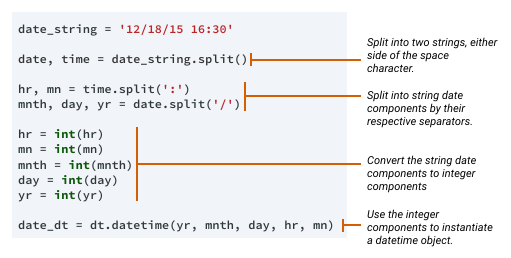


Luckily, there is an easier way — using a special **constructor**. The special `__init__()` method is also a constructor. Classes can also have additional constructors, so we can define objects in multiple ways. The datetime class has one of these that we can use to parse dates directly from strings.

The [`datetime.strptime()` constructor](https://docs.python.org/3/library/datetime.html#datetime.datetime.strptime) returns a datetime object defined using a special syntax system to describe date and time formats called **strftime**. (Note that the syntax system is *strftime* with an "f" versus the constructor which is *strptime* with a "p." We'll find out more about this later.) The syntax was originally developed in the 1980s as part of the C programming language, and it has become a de facto standard in many modern languages, including Python, R, and C++.

The strftime syntax uses a series of format codes consisting of a `%` character followed by a single character that specifies a date or time part in a particular format. Let's look at an example for parsing the date in the string `"24/12/1984"`:


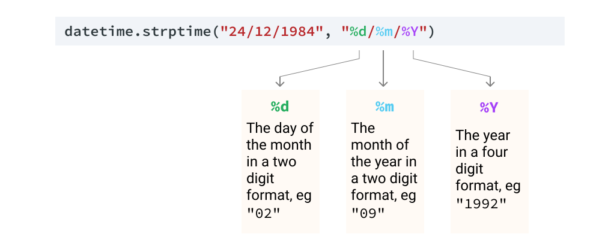


The first argument of the `datetime.strptime()` constructor is the string we want to parse, and the second argument is a string that specifies the format.

The `%d`, `%m`, and `%Y` format codes specify a two-digit day, two-digit month, and four-digit year, and the forward slashes between them specify the forward slashes in the original string. Let's use this example in code:

```python
date_1_str = "24/12/1984"
date_1_dt = dt.datetime.strptime(date_1_str, "%d/%m/%Y")
print(type(date_1_dt))
print(date_1_dt)
```

```
class 'datetime.datetime'
1984-12-24 00:00:00
```

We can see that the constructor returns a datetime object. Let's look at another example — `"12-24-1984"` – the same date, but in our string, a dash separates the date parts instead of a slash, and the day/month are in reverse order:


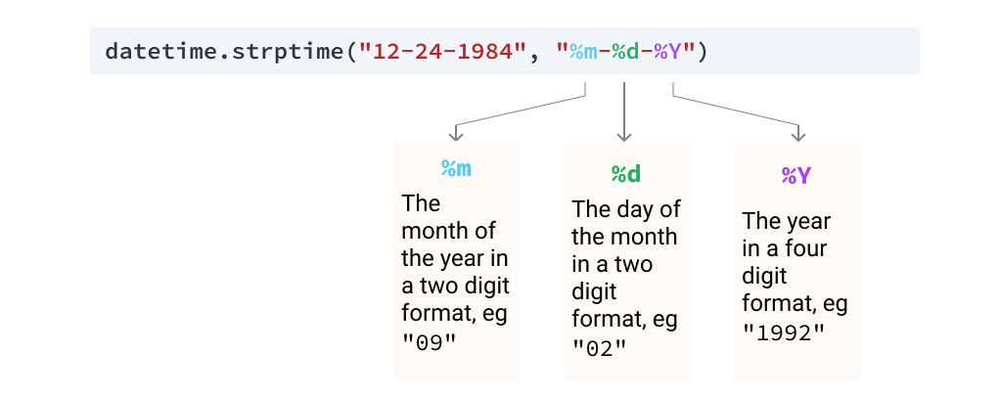


In this example, we use the same three format codes to designate the parts of the date; however, we have changed the order, and replaced the forward slashes with dashes to match the string we want to parse. Let's look at this example in code:

```
date_2_str = "12-24-1984"
date_2_dt = dt.datetime.strptime(date_2_str, "%m-%d-%Y")
print(date_2_dt)
```


```
1984-12-24 00:00:00
```


A table of the most common format codes is below. Don't worry that there are many of them — you don't need to try to remember them all. Instead, simply look them up in the [relevant section of the Python documentation](https://docs.python.org/3/library/datetime.html#strftime-strptime-behavior) when you need them, or you can use the handy micro-site [strftime.org](http://strftime.org/), which offers the same information but in a slightly easier-to-read format.

| Strftime Code | Meaning                                          | Examples                                                  |
| ------------- | ------------------------------------------------ | --------------------------------------------------------- |
| `%d`          | Day of the month as a zero-padded number1        | `04`                                                      |
| `%A`          | Day of the week as a word2                       | `Monday`                                                  |
| `%m`          | Month as a zero-padded number1                   | `09`                                                      |
| `%Y`          | Year as a four-digit number                      | `1901`                                                    |
| `%y`          | Year as a two-digit number with zero-padding1, 3 | `01` (2001) `88` (1988)                                   |
| `%B`          | Month as a word2                                 | `September`                                               |
| `%H`          | Hour in 24 hour time as zero-padded number1      | `05` (5 a.m.) `15` (3 p.m.)                               |
| `%p`          | a.m. or p.m.2                                    | `AM`                                                      |
| `%I`          | Hour in 12 hour time as zero-padded number1      | `05` (5 a.m., or 5 p.m. if `AM`/`PM` indicates otherwise) |
| `%M`          | Minute as a zero-padded number1                  | `07`                                                      |

*1. The strptime parser will parse non-zero padded numbers without raising an error.
\2. Date parts containing words will be interpreted using the locale settings on your computer, so strptime won't be able to parse "febrero" ("February" in Spanish) if your locale is set to an English language locale.
\3. Year values from 00-68 will be interpreted as 2000-2068, with values 69-99 interpreted as 1969-1999.*


### striftime - datetime object to string

With the `strftime()` method, we can use `%d`, `%m`, and `%Y` to represent the day, month, and year.

```python
dt_object = dt.datetime(1984, 12, 24)
dt_string = dt_object.strftime("%d/%m/%Y")
print(dt_string)
```

```
24/12/1984
```

We can also use `%B` to represent the month as a word:

```python
dt_string = dt_object.strftime("%B %d, %Y")
print(dt_string)
```


```
December 24, 1984
```


And we can use `%A`, `%I`, `%M`, and `%p` to represent the day of the week, the hour of the day, the minute of the hour, and a.m./p.m.:

```
dt_string = dt_object.strftime("%A %B %d at %I:%M %p")
print(dt_string)
```


```
Monday December 24 at 12:00 AM
```

### time class

On this screen and the next, we're going to analyze presidential appointment times. To do this, we're going to use the [`datetime.time` class](https://docs.python.org/3/library/datetime.html#datetime.time). Where the datetime class can hold values for dates and times, the time class holds only time data: hours, minutes, seconds, and microseconds.

The syntax to instantiate a time object is as follows:

```python
datetime.time(hour=0, minute=0, second=0, microsecond=0)
```

As the signature indicates, we can instantiate a time object without arguments and it will represent the time "0:00:00" (midnight). Otherwise, we can pass arguments for any or all of the hour, minute, second, and microsecond parameters. Let's look at an example for the time 2:30 p.m.:

```python
two_thirty = dt.time(14, 30)
print(two_thirty)
```

```
14:30:00
```

Notice that we provided the hours in 24-hour time — the hour argument requires an integer between `0` and `23`. Let's look at an example instantiating a time object for five seconds after 8 a.m.:

```
five_sec_after_8am = dt.time(8,0,5)
print(five_sec_after_8am)
```

```
08:00:05
```


We can also create a time object from a datetime object, using the `datetime.datetime.time()` method. This method returns a time object representing the time data from the datetime object.

```
jfk_shot_dt = dt.datetime(1963, 11, 22, 12, 30)
print(jfk_shot_dt)
```


```
1963-11-22 12:30:00
```


```
jfk_shot_t = jfk_shot_dt.time()
print(jfk_shot_t)
```


```
12:30:00
```


The time class doesn't have a `strptime()` constructor, but if we need to parse times in string form, we can use `datetime.strptime()` and then convert directly to a `time` object:

```python
time_str = "8:00"
time_dt = dt.datetime.strptime(time_str,"%H:%M")
print(time_dt)
```

```
1900-01-01 08:00:00
```

```
time_t = time_dt.time()
print(time_t)
```

```
08:00:00
```


Apart from having no strptime constructor, time objects behave similarly to datetime objects:

- They have attributes like `time.hour` and `time.second` that you can use to access individual time components.
- They have a `time.strftime()` method, which you can use to create a formatted string representation of the object.

A useful feature of time objects is that they support comparisons. We can test if one time is greater — or later — than another:

```
t1 = dt.time(15, 30)
t2 = dt.time(10, 45)

comparison = t1 > t2
print(comparison)
```


```
True
```


Because these comparison operations are supported, we can also use Python built-in functions like `min()` and `max()`:

```python
times = [
           dt.time(23, 30),
           dt.time(14, 45),
           dt.time(8, 0)
        ]

print(min(times))
```

```
08:00:00
```

```
print(max(times))
```

```
23:30:00
```

### timedelta

th mathematical operators like `-` and `+` to see if they work too, starting with `+`:

```
dt1 = dt.datetime(2022, 4, 14)
dt2 = dt.datetime(2022, 3, 29)
print(dt1 + dt2)
```

```python
---------------------------------------------------------------------------
TypeError                                 Traceback (most recent call last)
ipython-input-57-d458b47dd193 in module()
      1 dt1 = dt.datetime(2022, 4, 14)
      2 dt2 = dt.datetime(2022, 3, 29)
----> 3 print(dt1 + dt2)

TypeError: unsupported operand type(s) for +: 'datetime.datetime' and 'datetime.datetime'
```

If we try to add two date objects using the `+` operator, we get a TypeError that tells us the operator is not valid.

Let's try the `-` operator:

```
print(dt1 - dt2)
```

```
16 days, 0:00:00
```


When we use the `-` operator with two date objects, the result is the time difference between the two datetime objects. Let's look at the type of the resulting object:

```
diff = dt1 - dt2
print(type(diff))
```

```
class 'datetime.timedelta'
```


The resulting object is a [`datetime.timedelta` object](https://docs.python.org/3/library/datetime.html#datetime.timedelta). The timedelta type represents a period of time, compared to the other classes we've seen which represent a specific moment in time.

We observed that we can create an object of the timedelta class using the `-` operator, but we can also instantiate a timedelta class directly. Let's look at the syntax to do this:

```
datetime.timedelta(days=0, seconds=0, microseconds=0,
                   milliseconds=0, minutes=0, hours=0, weeks=0)
```


You might notice that the ordering of the parameters doesn't follow the order you might expect, and for this reason, it can be clearer to use keyword arguments when instantiating objects if we are using anything other than days:

```
two_days = dt.timedelta(2)
print(two_days)
```

```
2 days, 0:00:00
```

```
three_weeks = dt.timedelta(weeks=3)
print(three_weeks)
```

```
21 days, 0:00:00
```

```
one_hr_ten_mins = dt.timedelta(hours=1, minutes=10)
print(one_hr_ten_mins)
```

```
1:10:00
```


We can also use timedelta objects to add or subtract time from datetime objects. Let's look at the example below, where we look to find the date one week from a date object:

```
d1 = dt.date(1963, 2, 21)
d1_plus_1wk = d1 + dt.timedelta(weeks=1)
print(d1_plus_1wk)
```


```
1963-02-28
```


The table below shows some of the different operations that we can make between timedelta and datetime objects.

| Operation               | Explanation                                         | Resultant Type |
| ----------------------- | --------------------------------------------------- | -------------- |
| `datetime - datetime`   | Calculate the time between two specific dates/times | timedelta      |
| `datetime - timedelta`  | Subtract a time period from a date or time.         | datetime       |
| `datetime + timedelta`  | Add a time period to a date or time.                | datetime       |
| `timedelta + timedelta` | Add two periods of time together                    | timedelta      |
| `timedelta - timedelta` | Calculate the difference between two time periods.  | timedelta      |


------

# Loops

https://treyhunner.com/2016/04/how-to-loop-with-indexes-in-python/

### while

If we wanted to mimic the behavior of our traditional C-style `for` loop in Python, we could use a `while` loop:

```python
colors = ["red", "green", "blue", "purple"] i = 0 while i < len(colors):    print(colors[i])    i += 1 
```

This involves the same 4 steps as the `for` loops in other languages (note that we’re setting, checking, and incrementing `i`) but it’s not quite as compact.

This method of looping in Python is very uncommon.

### range of length

I often see new Python programmers attempt to recreate traditional `for` loops in a slightly more creative fashion in Python:

```python
colors = ["red", "green", "blue", "purple"] for i in range(len(colors)):    print(colors[i]) 
```

This first creates a range corresponding to the indexes in our list (`0` to `len(colors) - 1`). We can loop over this range using Python’s for-in loop (really a [foreach](https://en.wikipedia.org/wiki/Foreach_loop)).

This provides us with the index of each item in our `colors` list, which is the same way that C-style `for` loops work. To get the actual color, we use `colors[i]`.

### for-in: the usual way

Both the while loop and range-of-len methods rely on looping over indexes. But we don’t actually care about the indexes: we’re only using these indexes for the purpose of retrieving elements from our list.

Because we don’t actually care about the indexes in our loop, there is **a much simpler method of looping** we can use:


```python
colors = ["red", "green", "blue", "purple"] for color in colors:    print(color) 
```

So instead of retrieving the item indexes and looking up each element, we can just loop over our list using a plain for-in loop.

The other two methods we discussed are sometimes referred to as [anti-patterns](https://en.wikipedia.org/wiki/Anti-pattern) because they are programming patterns which are widely considered unidiomatic.

## What if we need indexes?

What if we actually need the indexes? For example, let’s say we’re printing out president names along with their numbers (based on list indexes).

### range of length

We could use `range(len(our_list))` and then lookup the index like before:

```python
presidents = ["Washington", "Adams", "Jefferson", "Madison", "Monroe", "Adams", "Jackson"] for i in range(len(presidents)):    print("President {}: {}".format(i + 1, presidents[i])) 
```

But there’s a more idiomatic way to accomplish this task: use the `enumerate` function.

### enumerate

Python’s built-in `enumerate` function allows us to loop over a list and retrieve both the index and the value of each item in the list:

```
presidents = ["Washington", "Adams", "Jefferson", "Madison", "Monroe", "Adams", "Jackson"] for num, name in enumerate(presidents, start=1):    print("President {}: {}".format(num, name)) 
```

The `enumerate` function gives us an iterable where each element is a tuple that contains the index of the item and the original item value.

This function is meant for solving the task of:

1. Accessing each item in a list (or another iterable)
2. Also getting the index of each item accessed

So whenever we need item indexes while looping, we should think of `enumerate`.

**Note**: the `start=1` option to `enumerate` here is optional. If we didn’t specify this, we’d start counting at `0` by default.

## What if we need to loop over multiple things?

Often when we use list indexes, it’s to look something up in another list.

### enumerate

For example, here we’re looping over two lists at the same time using indexes to look up corresponding elements:


```
colors = ["red", "green", "blue", "purple"] ratios = [0.2, 0.3, 0.1, 0.4] for i, color in enumerate(colors):    ratio = ratios[i]    print("{}% {}".format(ratio * 100, color)) 
```

Note that we only need the index in this scenario because we’re using it to lookup elements at the same index in our second list. What we really want is to loop over two lists simultaneously: the indexes just provide a means to do that.

### zip

We don’t actually care about the index when looping here. Our real goal is to loop over two lists at once. This need is common enough that there’s a special built-in function just for this.

Python’s `zip` function allows us to **loop over multiple lists at the same time**:


```python
colors = ["red", "green", "blue", "purple"] ratios = [0.2, 0.3, 0.1, 0.4] for color, ratio in zip(colors, ratios):    print("{}% {}".format(ratio * 100, color)) 
```

The `zip` function takes multiple lists and returns an iterable that provides a tuple of the corresponding elements of each list as we loop over it.

Note that `zip` with different size lists will stop after the shortest list runs out of items. You may want to look into [itertools.zip_longest](https://docs.python.org/3/library/itertools.html#itertools.zip_longest) if you need different behavior. Also note that `zip` in Python 2 returns a list but `zip` in Python 3 returns a lazy iterable. In Python 2, `itertools.izip` is equivalent to the newer Python 3 `zip` function.

## Looping cheat sheet

Here’s a very short looping cheat sheet that might help you remember the preferred construct for each of these three looping scenarios.

Loop over a single list with a regular for-in:

```
for n in numbers:    print(n) 
```

Loop over multiple lists at the same time with `zip`:

```python
for header, rows in zip(headers, columns):    print("{}: {}".format(header, ", ".join(rows))) 
```

Loop over a list while keeping track of indexes with `enumerate`:

```python
for num, line in enumerate(lines):    print("{0:03d}: {}".format(num, line)) 
```


------


# Strings

https://docs.python.org/3/library/stdtypes.html#string-methods

## str.replace()

In order to do this, we'll learn the [`str.replace()` method](https://docs.python.org/3/library/stdtypes.html#str.replace). The `str.replace()` method is like a "find and replace" tool for strings. Let's look at the individual steps required to change our string:

- We need to find all instances of the old substring, `"red"`.
- We need to replace each of those instances with the new substring, `"blue"`.

To achieve this using `str.replace()`, we need to provide two arguments:

1. `old`: the substring we want to find and replace.
2. `new`: the substring we want to replace `old` with.

Both of these are positional arguments, so we can use them without specifying their names. Let's look at how this looks in the diagram below:


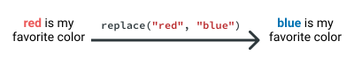


When we use `str.replace()`, we substitute the `str` for the variable name of the string we want to modify. Let's look at an example in code:

```python
fav_color = "red is my favorite color"
fav_color = fav_color.replace("red", "blue")
print(fav_color)
```


```
blue is my favorite color
```

## str.title()

The `str.title()` method returns a copy of the string with the first letter of each word transformed to uppercase (also known as **title case**).

Let's look at an example of this method in action with a simple string:

```python
my_string = "The cool thing about this string is that it has a CoMbInAtIoN of UPPERCASE and lowercase letters!"

my_string_title = my_string.title()
print(my_string_title)
```

```
The Cool Thing About This String Is That It Has A Combination Of Uppercase And Lowercase Letters!
```


## str.format()

The [`str.format()` method](https://docs.python.org/3/library/stdtypes.html#str.format) is a powerful tool that helps us write easy-to-read code while combining strings with other variables.

There are also extra things that `str.format()` can do with formatting numbers, but for now we'll focus on inserting values into strings.

We use the method with a string — which acts as a template — using the brace characters (`{}`) to signify where we want to insert any variables. We then pass those variables as arguments to the method. Let's look at a few examples:

```python
output = "{}'s favorite number is {}".format("Kylie", 8)
print(output)
```

```
Kylie's favorite number is 8
```

As you can see, our code is very easy to understand, and `str.format()` converts the integer to a string. The variables are inserted into the `{}` in the order we pass them as arguments.

If we want to specify ordering and/or repeat numbers, we can use integers:

```python
output = "{0}'s favorite number is {1}, {1} is {0}'s favorite number".format("Kylie", 8)
print(output)
```

```
Kylie's favorite number is 8, 8 is Kylie's favorite number
```

Lastly, if we want to make things clearer, we can give each variable a name — technically this is using keyword arguments.

When we use keyword arguments to pass values to `str.format()`, we can use those names inside our braces. Because our string is becoming long, we're going to create a separate template string, and call the `str.format()` directly on it:

```python
template = "{name}'s favorite number is {num}, {num} is {name}'s favorite number"
output = template.format(name="Kylie", num="8")
print(output)
```

```
Kylie's favorite number is 8, 8 is Kylie's favorite number
```

Choosing which way to use `str.format()` is largely a matter of taste, but we recommend thinking about readability. If what you're doing is complex, using numbers or names inside the braces definitely makes things easier!

## str.format() specification 

To indicate the precision of two, we specify `:.2f` after the name or position of our argument:


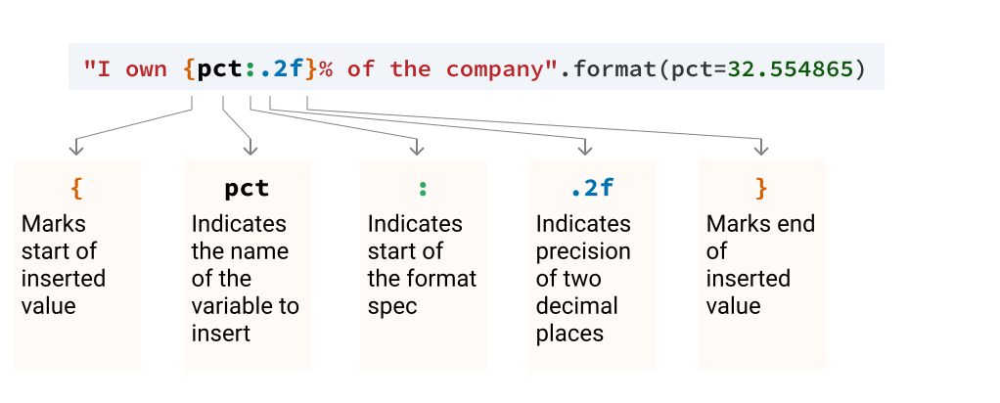


If you are not specifying a named/positional argument, you just leave that part out:


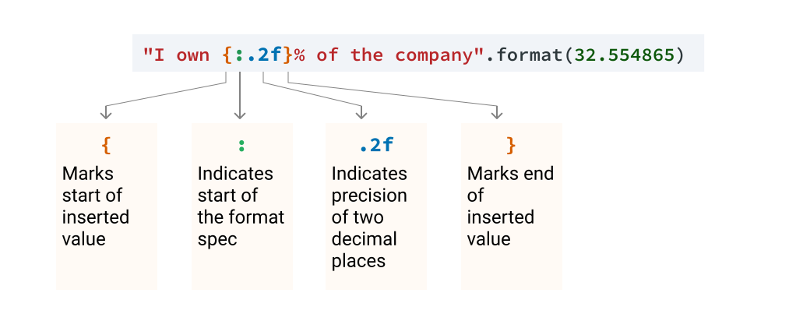


Another useful format specification is to add a comma as a thousands separator, which prevents large numbers from being hard to read, as in the example below:

```
print("The approximate population of {0} is {1}".format("India",1324000000))
```

```
The approximate population of India is 1324000000
```

To add a comma, you would use the syntax `:,` inside the brackets, after the number or name of the variable you're inserting:


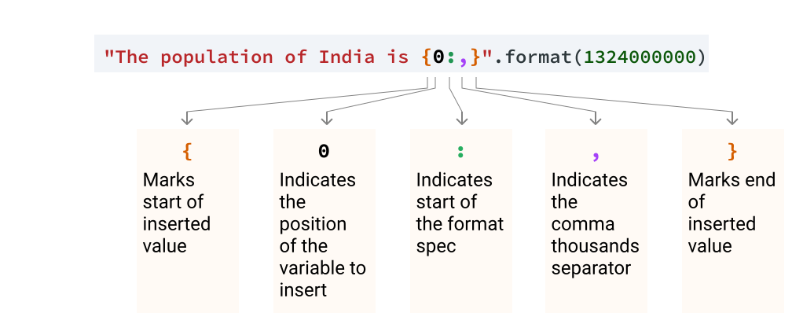


The output of this code is below:

```
The approximate population of India is 1,324,000,000
```

As you can see, this is much easier to read! We can also combine the thousands separator and the precision by specifying them in this order:


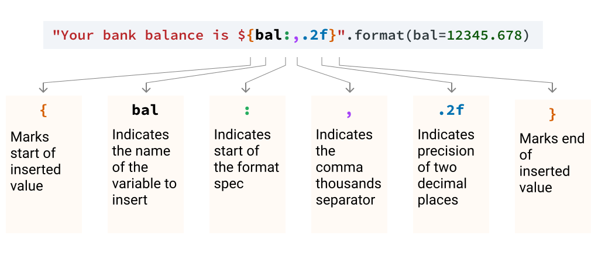


The output of this code is below:

```
Your bank balance is $12,345.68
```

Note that a specific order is necessary – If we don't follow this order, our code will return a `ValueError`:

1. The name or position of the variable
2. A colon (`:`) to start the format spec
3. The thousands separator
4. The precision

The easy way to remember this order is that in a number like `3,412.69`, the comma comes before the decimal point in the same way the thousands separator comes before the precision.

------


# list() Syntax

https://www.programiz.com/python-programming/methods/built-in/list

The syntax of `list()` is:

```
list([iterable])
```

------

## list() Parameters

The `list()` constructor takes a single argument:

- **iterable (optional)** - an object that could be a sequence ([string](https://www.programiz.com/python-programming/string), [tuples](https://www.programiz.com/python-programming/tuple)) or collection ([set](https://www.programiz.com/python-programming/set), [dictionary](https://www.programiz.com/python-programming/dictionary)) or any iterator object

## list() Return Value

The `list()` constructor returns a list.

- If no parameters are passed, it returns an empty list
- If iterable is passed as a parameter, it creates a list consisting of iterable's items.

------


# with statement

https://www.educative.io/edpresso/the-with-statement-in-python

https://towardsdatascience.com/what-is-behind-the-python-with-statement-89c74be3a6bd

https://realpython.com/python-with-statement/

https://docs.python.org/3/reference/compound_stmts.html#the-with-statement

The **`with` statement** in Python is used for resource management and exception handling. You’d most likely find it when working with file streams. For example, the statement ensures that the file stream process doesn’t block other processes if an exception is raised, but terminates properly.

The code block below shows the `try`-`finally` approach to file stream resource management.

```python
file = open('file-path', 'w') 
try: 
    file.write('Lorem ipsum') 
finally: 
    file.close() 
```

Normally, you’d want to use this method for writing to a file, but the `with` statement offers a cleaner approach:

```python
with open('file-path', 'w') as file: 
    file.write('Lorem ipsum') 
```

The `with` statement simplifies our `write` process to just two lines.

It is also used in database CRUD processes. This example was taken from [this site](https://mherman.org/blog/flask-for-node-developers/):

```python
def get_all_songs():
    with sqlite3.connect('db/songs.db') as connection:
        cursor = connection.cursor()
        cursor.execute("SELECT * FROM songs ORDER BY id desc")
        all_songs = cursor.fetchall()
        return all_songs
```

Here, `with` is used to query an SQLite database and return its content.

------


# Dictionaries

https://www.dataquest.io/blog/python-dictionary-tutorial/

Python dictionaries are immensely flexible because they allow anything to be stored as a value, from primitive types like strings and floats to more complicated types like objects and even other dictionaries (more on this later).

By contrast, there are limitations to what can be used as a key. A key is required to be an **immutable** object in Python, meaning that it cannot be alterable. This rule allows strings, integers, and tuples as keys, but excludes lists and dictionaries since they are **mutable**, or able to be altered. The rationale is simple: if any changes happen to a key without you knowing, you won’t be able to access the value anymore, rendering the dictionary useless. Thus, only immutable objects are allowed to be keys.

A key must also be unique within a dictionary. The key-value structuring of a dictionary is what makes it so powerful, and throughout this post we’ll delve into its basic operations, use cases, and their advantages and disadvantages.

## Creation and Deletion

To create an empty dictionary, we can either use the `dict()` function with no inputs, or assign a pair of curly brackets with nothing in between to a variable. We can confirm that both methods will produce the same result.

```python
empty = {}
also_empty = dict()
empty == also_empty
>>> True
```

```python
empty["First key"] = "First value"
empty["First key"]
>>> "First value"
```

Alternatively, you can also create a dictionary and pre-populate it with key-value pairs. There are two ways to do this. The first is to use brackets containing the key-value pairs. Each key and value are separated by a `:`, while individual pairs are separated by a comma.

While you can fit everything on one line, it’s better to split up your key-value pairs among different lines to improve readability.

```python
data = {
"beer_data": beers,
"brewery_data": breweries
}
```

The second way to create a Python dictionary is through the `dict()` method. You can supply the keys and values either as keyword arguments or as a list of tuples. We will recreate the `data` dictionary from above using the `dict()` methods and providing the key-value pairs appropriately.

```python
# Using keyword arguments
data2 = dict(beer_data=beers, brewery_data=breweries)
# Using a list of tuples
tuple_list = [("brewery_data", breweries), ("beer_data", beers)]
data3 = dict(tuple_list)
```


## `zip()`

https://realpython.com/python-zip-function/

 key. `zip()` is a function that takes two or more lists and makes tuples based off these lists.

The `zip()` function returns a zip object,  which is an iterator of tuples where the first item in each passed iterator is  paired together, and then the second item in each passed iterator are paired  together etc.

```python
keys = ("first_name", "last_name", "pesel", "nip")
values = ("Anna", "Nowak", "07280722588", "7588398117")
customer = dict(zip(keys, values))
print(customer)
```


## dict.get(key) vs dict[key]

A common debate among Python developers seems to stem from the  retrieval of dictionary values, which can be accomplished using either `dict[key]` or `dict.get(key)`.

Although you can achieve the same result using either one, `dict.get()` is usually preferred, as it accepts a second argument which acts as the default value shall the key not exist in the given dictionary. Due to  this property, `dict.get()` will always return a value, whereas `dict[key]` will raise a `KeyError` if the given key is missing.

```python
a = { 'max': 200 }
b = { 'min': 100, 'max': 250 }
c = { 'min': 50 }

a['min'] + b['min'] + c['min'] # throws KeyError
a.get('min', 0) + b.get('min', 0) + c.get('min', 0) # 150
```

------


# Tuple

Recall that the structure of the output `(20, 10)` is a **tuple**, which is a data type that is similar to a list.

```python
def sum_and_difference (a, b):
    a_sum = a + b
    difference = a - b
    return a_sum, difference
    # We switched the order of return values

sum_diff = sum_and_difference(15, 5)
print(type(sum_diff))
```

```python
Output
<class 'tuple'>
```

Just like a list, we usually use a tuple to store multiple values. Creating a tuple is like creating a list, except we need to use parentheses instead of brackets.

```python
a_list = [1, 'a', 10.5]
a_tuple = (1, 'a', 10.5)

print(a_tuple)
print(type(a_tuple))
```


```
Output
(1, 'a', 10.5)
<class 'tuple'>
```

Just like lists, tuples support positive and negative indexing.

```python
a_list = [1, 'a', 10.5]
a_tuple = (1, 'a', 10.5)

print(a_tuple[0])
print(a_list[0])
print(a_tuple[-1])
print(a_list[-1])
```


```
Output
1
1
10.5
10.5
```

The main difference between tuples and lists is whether we can modify the existing values or not. In the case of tuples, we can't modify the existing values, while in the case of lists, we can. Below, we're trying to modify the first value of a list and a tuple.

```python
a_list = [1, 'a', 10.5]
a_list[0] = 99
print(a_list)
```


```python
Output
[99, 'a', 10.5]
a_tuple = (1, 'a', 10.5)
a_tuple[0] = 99
print(a_tuple)
```


```
Output
TypeError: 'tuple' object does not support item assignment
```

We call tuples **immutable** data types, because we can't change their state after we've created them. We call lists **mutable** data types, because we can change their state after we've created them. The only way we could modify tuples and immutable data types is by recreating them. This is a list of all the mutable and immutable data types we've learned so far.


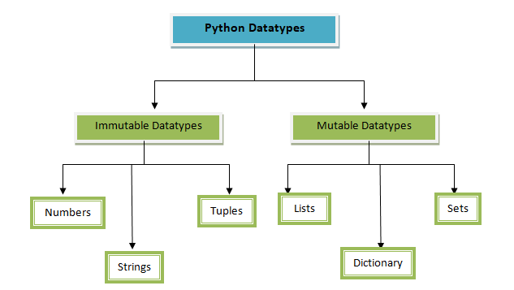

### How we can create tuple

When we create a tuple, surrounding the values with parentheses is optional. It's enough to write the individual values and separate each with a comma. Below, we see two ways of creating a tuple, with parentheses and without:

```python
a_tuple = (1, 'a')
print(a_tuple)
print(type(a_tuple))
```

```
Output
(1, 'a')
<class 'tuple'>
a_tuple = 1, 'a'
print(a_tuple)
print(type(a_tuple))
```

```
Output
(1, 'a')
<class 'tuple'>
```

### Returning tuple

With this in mind, remember the syntax we used in the `return` statement to return multiple values:

```python
def sum_and_difference (a, b):
    a_sum = a + b
    difference = a - b
    return a_sum, difference
    # Separate variable names with a comma

sum_diff = sum_and_difference(15, 5)
print(sum_diff)
```


```
Output
(20, 10)
```

When we use `return a_sum, difference`, Python thinks we want the tuple `a_sum, difference` returned. This is why multiple variables return as tuples. If we want to return a list instead of a tuple, we need to use brackets:

```python
def sum_and_difference (a, b):
    a_sum = a + b
    difference = a - b
    return [a_sum, difference]
    # Use brackets to return a list

sum_diff = sum_and_difference(15, 5)
print(sum_diff)
print(type(sum_diff))
```


```
Output
[20, 10]
<class 'list'>
```

When we work with tuples, we can assign their individual elements to separate variables in a single line of code.

### Assigning tuple to multiple variables


We can do the same with lists — we can assign individual list elements to separate variables in a single line of code:


We can use this variable assignment technique with functions that return multiple variables.

```python
def sum_and_difference(a, b, do_sum=True):
    a_sum = a + b
    difference = a - b
    return a_sum, difference

a_sum, a_diff = sum_and_difference(15, 5)
print(a_sum)
print(a_diff)
```


```
Output
20
10
```


# Set

https://www.freecodecamp.org/news/python-set-operations-explained-with-examples/

## What are sets in Python?

In Python, sets are exactly like lists except for the fact that their elements are *immutable* (that means you cannot change/mutate an element of a set once declared). However, you can add/remove elements from the set. 

If that was confusing, let me try and summarize:

> A set is a mutable, unordered group of elements, where the elements themselves are immutable.

Another characteristic of a set is that it may include elements of different  types. This means you can have a group of numbers, strings, and even  tuples, all in the same set!

## How to Add or Remove Elements in a Set

We already know that sets are mutable. This means you can add/remove elements in a set.

Here's an example of adding elements to a set using the `update()` function.

```py
>>> add_set = set((1, 2, 3, 4))
>>> add_set
{1, 2, 3, 4}
>>>
>>> add_set.update((1,))
>>> add_set
{1, 2, 3, 4}
>>> add_set.update(("cello", "violin"))
>>> add_set
{1, 2, 3, 4, 'violin', 'cello'}
```

But notice how nothing changes when we try to add "cello" to the set again:

```py
>>> add_set.update(("cello",))
>>> add_Set
{1, 2, 3, 4, 'violin', 'cello'}
```

This is because sets in Python *cannot* contain duplicates. So, when we tried to add `"cello"` again to the set, Python recognized we were trying to add a duplicate  element and didn't update the set. This is one caveat that  differentiates sets from lists.

Here's how you would remove elements from a set:

```py
>>> sub_set = add_set
>>> sub_set.remove("violin")
>>> sub_set
{1, 2, 3, 4, 'cello'}
```

The `remove(x)` function removes the element `x` from a set. It returns a `KeyError` if `x` is not part of the set:

```py
>>> sub_set.remove("guitar")
Traceback (most recent call last):
  File "<stdin>", line 1, in <module>
KeyError: 'guitar'
```

There are a couple of other ways to remove an element(s) from a set:

- the `discard(x)` method removes `x` from the set, but *doesn't* raise any error if `x` is not present in the set.
- the `pop()` method removes and returns a random element from the set.
- the `clear()` method removes all elements from a set

Here are some examples to illustrate:

```python
>>> m_set = set((1, 2, 3, 4))
>>> 
>>> m_set.discard(5) # no error raised even though '5' is not present in the set
>>>
>>> m_set.pop()
4
>>> m_set
{1, 2, 3}
>>>
>>> m_set.clear()
>>> m_set
set()
```

## Python set() Operations

If you remember your basic high school math, you'll probably recall mathematical set operations like *union*, *intersection*, *difference* and *symmetric difference*. Well, you can achieve the same thing with Python sets.

### 1. Set Union

The union of two sets is the set of *all the elements* of both the sets without duplicates. You can use the `union()` method or the `|` syntax to find the union of a Python set.

```python
>>> first_set = {1, 2, 3}
>>> second_set = {3, 4, 5}
>>> first_set.union(second_set)
{1, 2, 3, 4, 5}
>>>
>>> first_set | second_set     # using the `|` operator
{1, 2, 3, 4, 5}
```

### 2. Set Intersection

The intersection of two sets is the set of *all the common elements* of both the sets. You can use the `intersection()` method of the `&` operator to find the intersection of a Python set.

```python
>>> first_set = {1, 2, 3, 4, 5, 6}
>>> second_set = {4, 5, 6, 7, 8, 9}
>>> first_set.intersection(second_set)
{4, 5, 6}
>>>
>>> first_set & second_set     # using the `&` operator
{4, 5, 6}
```

### 3. Set Difference

The difference between two sets is the set of all the elements in first set that *are not* present in the second set. You would use the `difference()` method or the `-` operator to achieve this in Python.

```python
>>> first_set = {1, 2, 3, 4, 5, 6}
>>> second_set = {4, 5, 6, 7, 8, 9}
>>> first_set.difference(second_set)
{1, 2, 3}
>>>
>>> first_set - second_set     # using the `-` operator
{1, 2, 3}
>>>
>>> second_set - first_set
{8, 9, 7}
```

### 4. Set Symmetric Difference

The symmetric difference between two sets is the set of all the elements that are *either in* the first set *or* the second set *but not in both*. 

You have the choice of using either the `symmetric_difference()` method or the `^` operator to do this in Python.

```python
>>> first_set = {1, 2, 3, 4, 5, 6}
>>> second_set = {4, 5, 6, 7, 8, 9}
>>> first_set.symmetric_difference(second_set)
{1, 2, 3, 7, 8, 9}
>>>
>>> first_set ^ second_set     # using the `^` operator
{1, 2, 3, 7, 8, 9}
```


------


# Built-in Functions

https://docs.python.org/3/library/functions.html

------


# Functions

## Default arguments

When we initiate parameters with default arguments, passing arguments to those parameters when we call the function becomes optional. If we don't pass in an argument, Python uses the default argument. However, if a parameter doesn't have a default argument, we must pass in an argument — otherwise we'll get an error.

```python
def add_value(x, constant=10):
    return x + constant

print(add_value())
```


```python
Output
TypeError: add_value() missing 1 required positional argument: 'x'
```

Default arguments are easy to modify when we call a function:

```python
def add_value(x, constant=10):
    return x + constant

print(add_value(3, constant=50))
print(add_value(3, constant=26))
print(add_value(3, constant=97))
```

If all parameters have default arguments, then we can call a function without passing in an argument:

```python
def add_value(x=9, constant=10):
    return x + constant

print(add_value())
```


```python
Output
19
```

Default arguments come in handy when we anticipate that we'll use an argument frequently — this can save us some time when we reuse the functions. Default arguments are also very useful for building complex functions, as we'll see on the next screen.

## return statement

Note that there's more than one way to make the `sum_or_difference()` function work. Below, we redefine the function without using an `else` clause:

```python
def sum_or_difference(a, b, return_sum=True):
    if return_sum:
        return a + b

    return a - b

print(sum_or_difference(10, 5, return_sum=True))
print(sum_or_difference(10, 5, return_sum=False))
```


```python
Output
15
10
```

The above approach works because a function stops executing its definition code as soon as a `return` statement executes. If there's any remaining code after that `return` statement, it won't execute.

Above, if `return_sum` is `True`, then `return a + b` executes, so the function stops, and it doesn't execute any of the remaining code. If `return_sum` is `False`, then `return a + b` doesn't execute, so the function moves forward and eventually reaches the next `return` statement, which returns `a - b`.

## Returning multiple variables

Fortunately, Python allows us to build functions that return more than one variable. This means that we can create a function that returns a sum and a difference.

```python
def sum_and_difference (a, b):
    a_sum = a + b
    difference = a - b
    return a_sum, difference
    # Separate variable names with a comma

sum_diff = sum_and_difference(15, 5)
print(sum_diff)
```


```
Output
(20, 10)
```

Above, we passed `15` and `5` as arguments to the `sum_and_difference()` function. The function returned `(20, 10)`, where `20` is the sum, and `10` is the difference. The order of the returned values matches the order of the variables in the `return` statement.

```python
def sum_and_difference (a, b):
    a_sum = a + b
    difference = a - b
    return difference, a_sum
    # We switched the order of return values

sum_diff = sum_and_difference(15, 5)
print(sum_diff)
```


```
Output
(10, 20)
```

It may seem odd that the structure of the output `(20, 10)`. `(20, 10)` is a **tuple**, which is a data type that is very similar to a list (examples of data types include integers, strings, lists, dictionaries, etc.). 

## Functions without return

So far, we've been using parameters and `return` statements for all our functions. However parameters and `return` statements are optional:

```python
def print_constant():
    x = 3.14
    print(x)

print_constant()
```


```
Output
3.14
```

Functions without a `return` statement don't return any value. Strictly speaking, they return a `None` value which represents the absence of a value. The `None` value is an instance of the `NoneType` data type (just like `5.321` is an instance of the `float` data type).

```python
def print_constant():
    x = 3.14
    print(x)

j = print_constant()
print(j)
print(type(j))
```


```
Output
3.14
None
<class 'NoneType'>
```

We'll discuss more applications of the `None` value in the next course.

In the function above, notice that we assigned `3.14` to a variable named `x`. Although we clearly defined `x`, it turns out that we can't access `x` outside the function definition — Python raises a `NameError` and says that `x` isn't defined.

```python
def print_constant():
    x = 3.14
    print(x)

print(x)
```


```
Output
NameError: name 'x' is not defined
```

To debug the code above, let's start by mentioning that Python doesn't run the code we write inside a function's definition until we call that function. In the code example above, `x = 3.14` is never run. This behavior applies to every function we create. We'll discuss this in more detail soon. For now, let's practice what we've learned.


## lambda

https://realpython.com/python-lambda/

Here are a few examples to give you an appetite for some Python code, functional style.

The [identity function](https://en.wikipedia.org/wiki/Identity_function), a function that returns its argument, is expressed with a standard Python function definition using the [keyword](https://realpython.com/python-keywords/) `def` as follows:

```python
>>> def identity(x):
...     return x
```

`identity()` takes an argument `x` and returns it upon invocation.

In contrast, if you use a Python lambda construction, you get the following:

```python
>>> lambda x: x
```

In the example above, the expression is composed of:

- **The keyword:** `lambda`
- **A bound variable:** `x`
- **A body:** `x`

**Note**: In the context of this article, a **bound variable** is an argument to a lambda function.

In contrast, a **free variable** is not bound and may be referenced in the body of the expression. A free variable can be a constant or a variable defined in the enclosing [scope](https://realpython.com/python-namespaces-scope/) of the function.

You can write a slightly more elaborated example, a function that adds `1` to an argument, as follows:

```
>>> lambda x: x + 1
```

You can apply the function above to an argument by surrounding the function and its argument with parentheses:

```python
>>> (lambda x: x + 1)(2)
3
```

[Reduction](https://en.wikipedia.org/wiki/Reduction_strategy_(lambda_calculus)) is a lambda calculus strategy to compute the value of the expression. In the current example, it consists of replacing the bound variable `x` with the argument `2`:

```python
(lambda x: x + 1)(2) = lambda 2: 2 + 1
                     = 2 + 1
                     = 3
```

Because a lambda function is an expression, it can be named. Therefore you could write the previous code as follows:

```python
>>> add_one = lambda x: x + 1
>>> add_one(2)
3
```

The above lambda function is equivalent to writing this:

```python
def add_one(x):
    return x + 1
```

These functions all take a single argument. You may have noticed that, in the definition of the lambdas, the arguments don’t have parentheses around them. Multi-argument functions (functions that take more than one argument) are expressed in Python lambdas by listing arguments and separating them with a comma (`,`) but without surrounding them with parentheses:

```python
>>> full_name = lambda first, last: f'Full name: {first.title()} {last.title()}'
>>> full_name('guido', 'van rossum')
'Full name: Guido Van Rossum'
```

The lambda function assigned to `full_name` takes two arguments and returns a [string](https://realpython.com/python-strings/) interpolating the two parameters `first` and `last`. As expected, the definition of the lambda lists the arguments with no parentheses, whereas calling the function is done exactly like a normal Python function, with parentheses surrounding the arguments.


## Lists Comprehensions

https://www.pythonforbeginners.com/basics/list-comprehensions-in-python#htoc-syntax

To understand the list comprehension, imagine it like this: you’re going to perform an expression on each item in the list. The expression will determine what item is eventually stored in the output list. 

Not only can you perform expressions on an entire list in a single line of code, but, as we’ll see later, it’s possible to add conditional statements in the form of filters, which allows for more precision in the way lists are handled.

**Example: Creating a list with list comprehensions**

```python
# construct a basic list using range() and list comprehensions
# syntax
# [ expression for item in list ]
digits = [x for x in range(10)]
```

**Example: Using list comprehensions with strings**

```python
# a list of the names of popular authors
authors = ["Ernest Hemingway","Langston Hughes","Frank Herbert","Toni Morrison",
    "Emily Dickson","Stephen King"]

# create an acronym from the first letter of the author's names
letters = [ name[0] for name in authors ]
print(letters)
```


## Generator expressions vs list comprehensions

https://www.pythontutorial.net/advanced-python/python-generator-expressions/

The following shows how to use the list comprehension to generate square numbers from 0 to 4:

```python
square_list = [n** 2 for n in range(5)]
```

And this defines a square number generator:

```python
square_generator = (n** 2 for n in range(5))
```

### 1) Syntax

In terms of syntax, a generator expression uses parentheses `()` while a list comprehension uses the square brackets `[]`.

### 2) Memory utilization

A list comprehension returns a list while a generator expression returns a generator object.

It means that a list comprehension returns a complete list of elements upfront. However, a generator expression returns a list of elements, one at a time, based on request.

A list comprehension is eager while a generator expression is lazy.

In other words, a list comprehension creates all elements right away and loads all of them into the memory.

Conversely, a generator expression creates a single element based on request. It loads only one single element to the memory.

### 3) Iterable vs iterator

A list comprehension returns an [iterable](https://www.pythontutorial.net/python-basics/python-iterables/). It means that you can iterate over the result of a list comprehension again and again.

However, a generator expression returns an [iterator](https://www.pythontutorial.net/advanced-python/python-iterators/), specifically a lazy iterator. It becomes exhausting when you complete iterating over it.


------


# Scope

The error from the previous exercise may have been completely unexpected. After all, we called the `print_constant()` function, which means that `x = 3.14` must have executed. So why did we still get an error telling us that `x` is undefined?

```python
def print_constant():
    x = 3.14
    print(x)

print(x)
```


```
Output
NameError: name 'x' is not defined
```

When we call `print_constant()`, `x = 3.14` executes, but the quirk is that Python only saves the `x` variable *temporarily*. Python saves `x` into a kind of **temporary memory**, which is immediately *erased* after the `print_constant()` finishes running.

This explains why `x` is still undefined even after we call `print_constant()` — the temporary memory associated with `print_constant()` is immediately erased after the function finishes running and freed up for later use.

This kind of temporary memory storage doesn't apply to the code that is running outside function definitions. If we define `x = 3.14` in our **main program** (outside function definitions), we can use `x` later on without having to worry that it was erased from memory.

```python
x = 3.14

print('random code')
print('more random code')

print(x)
```


```
Output
random code
more random code
3.14
```

The temporary memory associated with a function is *isolated* from the memory associated with the main program. As a result, we can initialize a variable `x = 10` in the main program, and then execute `x = 3.14` in the body of a function without overwriting the `x` variable of the main program.

```python
x = 10

def print_constant():
    x = 3.14
    print(x)

print_constant()
print(x)
```


```
Output
3.14 # Function
10 # Main program
```

This memory isolation is useful because we don't have to worry about overwriting variables from the main program when we write functions — or vice-versa. This is especially helpful when it becomes difficult to remember all the variable names used while writing large programs.

This memory isolation also means that some variables can be accessed only from certain parts of a program. We've already seen in one of the examples above that we couldn't access `x` from the main program, because it was only defined in the function definition which is memory-isolated from the main program.

```python
def print_constant():
    x = 3.14
    print(x)

print_constant()
print(x)
```


```
Output
NameError: name 'x' is not defined
# There's no 'x' variable defined in the main program
```

We often call the part of a program where we can access a variable the **scope**. The variables defined in the main program are in the **global scope**, while the variables defined inside a function are in the **local scope**.

Let's practice scopes before resuming the discussion on the next screen. For the exercise below, we've already defined three variables in the code editor: `e`, `a_sum`, and `length`. We've also disabled answer-checking to encourage you to experiment more with running code.

------


# Errors

## unhashable type: 'list' python

https://careerkarma.com/blog/python-typeerror-unhashable-type-list/#:~:text=The%20%E2%80%9CTypeError%3A%20unhashable%20type%3A,a%20key%20for%20a%20dictionary.

The “TypeError: unhashable type: ‘list’” error is raised when you try to assign a list as a key in a dictionary. To solve this error, ensure you only assign a hashable object, such as a string or a tuple, as a key for a dictionary.


------


# OOP

## self 

Słowo kluczowe self oznacza obiekt, na rzecz którego następuje wywołanie danej metody.

https://www.programiz.com/article/python-self-why#:~:text=The%20self%20keyword%20is%20used,information%20for%20both%20these%20objects.

On the previous screen, we defined a class with a simple method, then created an instance named `my_instance` of that class:

```python
class MyClass:

    def first_method():
        print("This is my first method")

my_instance = MyClass()
```


Let's look at what happens when we call (run) that method:

```python
my_instance.first_method()
```


```python
---------------------------------------------------------------------
TypeError                           Traceback (most recent call last)
ipython-input-44-9e10ffed0a3f in module()
----> 1 my_instance.first_method()

TypeError: first_method() takes 0 positional arguments but 1 was given
```


This error is confusing. It says that one argument was given to `first_method()`, but when we called the method, we didn't provide any arguments. It seems like there is a "phantom" argument being inserted somewhere. To understand what's happening, let's look at what happens when we call a method. We'll start by looking at our `my_instance` object containing a single method:


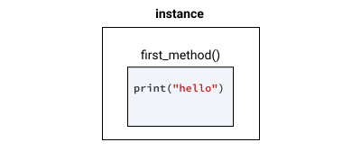


When we call the `first_method()` method belonging to the `my_instance` object, Python interprets that syntax and adds an argument representing the instance on which we're calling the method:


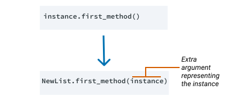


We can verify that this is the case by checking it with Python's built-in `str` type. We'll use `str.title()` to convert a string to title case.

```python
# create a str object
s = "MY STRING"

# call `str.title() directly
# instead of `s.title()`
result = str.title(s)
print(result)
```


```
My String
```


The extra argument that Python has added, which is the instance itself, is causing our error. You might be wondering if we can prove that the extra argument is the object itself? Let's see if we can:

We'll start by doing the following:

- Defining a `ExampleClass` class with a `print_self` method that takes one argument and then prints that argument
- Instantiating an object of that class and assigning it to `mc`

```python
class ExampleClass:

    def print_self(self):
        print(self)

mc = ExampleClass()
```


Next, let's print the `mc` object so we can understand what the object itself looks like when it prints:

```python
print(mc)
```

```
__main__.ExampleClass object at 0x108a7c518
```


Lastly, let's call our `print_self()` method to see whether the output is the same as when we printed the object itself:

```python
mc.print_self()
```

```
__main__.ExampleClass object at 0x108a7c518
```


The same output displayed both when we printed the object using the syntax `print(mc)` and when we printed the object inside the method using `print_self()` — which proves that this "phantom" argument is the object itself!

Technically, we can give this first argument — which passes to every method — any parameter name we like. However, the convention is to call the parameter `self`. This is an important convention because, without it, class definitions can become confusing.


## __init__

The init method — also called a **constructor** — is a special method that runs when we create an instance so we can perform any tasks to set up the instance.

The init method has a special name that starts and ends with two underscores: `__init__()`. Let's look at an example:

```python
class ExampleClass:

    def __init__(self, string):
        print(string)

mc = ExampleClass("Hola!")
```


```
Hola!
```


Let's see how it works:

- We defined the `__init__()` method inside our class as accepting two arguments: `self` and `string`.
- Inside the `__init__()` method, we called the `print()` function on the `string` argument.
- When we instantiated `mc` — our `ExampleClass` object — we passed `"Hola!"` as an argument. The init function ran immediately, displaying the text "Hola!"

It's unusual to use `print()` inside an init method, but it helps us understand that the method has access to any arguments passed when we instantiate an object.

The init method's most common usage is to store data as an attribute:

```python
class ExampleClass:

    def __init__(self, string):
        self.my_attribute = string

mc = ExampleClass("Hola!")
```


When we instantiate our new object, Python calls the init method, passing in the object:


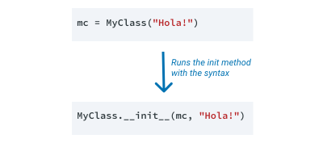


Our code didn't result in any output, but now we have stored `"Hola"` in the attribute `my_attribute` inside our object. Like methods, we access attributes using dot notation, but attributes don't have parentheses like methods do. Let's use dot notation to access the attribute:

```
print(mc.my_attribute)
```


```
Hola!
```


------

# RegEx

https://www.datacamp.com/tutorial/python-regular-expression-tutorial

https://docs.python.org/3/library/re.html

## Regular Expressions in Python

In Python, regular expressions are supported by the re module. That means that if you want to start using them in your Python scripts, you have to import this module with the help of `import`:

```python
import re

```

The `re` library in Python provides several functions that make it a skill worth mastering. You will see some of them closely in this tutorial.


## Special Characters

- `\number`

  Matches the contents of the group of the same number. Groups are numbered starting from 1. For example, `(.+) \1` matches `'the the'` or `'55 55'`, but not `'thethe'` (note the space after the group). This special sequence can only be used to match one of the first 99 groups. If the first digit of *number* is 0, or *number* is 3 octal digits long, it will not be interpreted as a group match, but as the character with octal value *number*. Inside the `'['` and `']'` of a character class, all numeric escapes are treated as characters.

- `\A`

  Matches only at the start of the string.

- `\b`

  Matches the empty string, but only at the beginning or end of a word. A word is defined as a sequence of word characters. Note that formally, `\b` is defined as the boundary between a `\w` and a `\W` character (or vice versa), or between `\w` and the beginning/end of the string. This means that `r'\bfoo\b'` matches `'foo'`, `'foo.'`, `'(foo)'`, `'bar foo baz'` but not `'foobar'` or `'foo3'`.By default Unicode alphanumerics are the ones used in Unicode patterns, but this can be changed by using the [`ASCII`](https://docs.python.org/3/library/re.html#re.ASCII) flag. Word boundaries are determined by the current locale if the [`LOCALE`](https://docs.python.org/3/library/re.html#re.LOCALE) flag is used. Inside a character range, `\b` represents the backspace character, for compatibility with Python’s string literals.

- `\B`

  Matches the empty string, but only when it is *not* at the beginning or end of a word. This means that `r'py\B'` matches `'python'`, `'py3'`, `'py2'`, but not `'py'`, `'py.'`, or `'py!'`. `\B` is just the opposite of `\b`, so word characters in Unicode patterns are Unicode alphanumerics or the underscore, although this can be changed by using the [`ASCII`](https://docs.python.org/3/library/re.html#re.ASCII) flag. Word boundaries are determined by the current locale if the [`LOCALE`](https://docs.python.org/3/library/re.html#re.LOCALE) flag is used.

- `\d`

  For Unicode (str) patterns:Matches any Unicode decimal digit (that is, any character in Unicode character category [Nd]). This includes `[0-9]`, and also many other digit characters. If the [`ASCII`](https://docs.python.org/3/library/re.html#re.ASCII) flag is used only `[0-9]` is matched.For 8-bit (bytes) patterns:Matches any decimal digit; this is equivalent to `[0-9]`.

- `\D`

  Matches any character which is not a decimal digit. This is the opposite of `\d`. If the [`ASCII`](https://docs.python.org/3/library/re.html#re.ASCII) flag is used this becomes the equivalent of `[^0-9]`.

- `\s`

  For Unicode (str) patterns:Matches Unicode whitespace characters (which includes `[ \t\n\r\f\v]`, and also many other characters, for example the non-breaking spaces mandated by typography rules in many languages). If the [`ASCII`](https://docs.python.org/3/library/re.html#re.ASCII) flag is used, only `[ \t\n\r\f\v]` is matched.For 8-bit (bytes) patterns:Matches characters considered whitespace in the ASCII character set; this is equivalent to `[ \t\n\r\f\v]`.

- `\S`

  Matches any character which is not a whitespace character. This is the opposite of `\s`. If the [`ASCII`](https://docs.python.org/3/library/re.html#re.ASCII) flag is used this becomes the equivalent of `[^ \t\n\r\f\v]`.

- `\w`

  For Unicode (str) patterns:Matches Unicode word characters; this includes most characters that can be part of a word in any language, as well as numbers and the underscore. If the [`ASCII`](https://docs.python.org/3/library/re.html#re.ASCII) flag is used, only `[a-zA-Z0-9_]` is matched.For 8-bit (bytes) patterns:Matches characters considered alphanumeric in the ASCII character set; this is equivalent to `[a-zA-Z0-9_]`. If the [`LOCALE`](https://docs.python.org/3/library/re.html#re.LOCALE) flag is used, matches characters considered alphanumeric in the current locale and the underscore.

- `\W`

  Matches any character which is not a word character. This is the opposite of `\w`. If the [`ASCII`](https://docs.python.org/3/library/re.html#re.ASCII) flag is used this becomes the equivalent of `[^a-zA-Z0-9_]`. If the [`LOCALE`](https://docs.python.org/3/library/re.html#re.LOCALE) flag is used, matches characters which are neither alphanumeric in the current locale nor the underscore.

- `\Z`

  Matches only at the end of the string.

## search(pattern, input_text)

Szuka peirwszego dopasowania wyrażenia regularnego (pattern) w łańcuchu tekstowym podanym jako drugi paramter (input_text)

- Jeśli true zwraca obiekt typu Match jeśli false zwraca None.
- Zwraca tylko pierwsze dopasowanie

compile()

When you need to use an expression several times in a single program, using `compile()` to save the resulting regular expression object for reuse is more efficient than saving it as a string. This is because the compiled versions of the most recent patterns passed to `compile()` and the module-level matching functions are cached.

```python
pattern = re = "Se"

pattern = re.compile("Se")
```

Używanie complie() pozwala na wydajniejsza prace w sytuacji gdy wyrażenie regularne jest skomplikowane i "pracuje" na dużych tekstach.


## **`findall(pattern, string, flags=0)`**

 Finds all the possible matches in the entire sequence and returns them as a list of strings. Each returned string represents one match.

```python
statement = "Please contact us at: support@datacamp.com, xyz@datacamp.com"

#'addresses' is a list that stores all the possible match
addresses = re.findall(r'[\w\.-]+@[\w\.-]+', statement)
for address in addresses:
    print(address)

```


## **`finditer(string, [position, end_position])`**

 Similar to `findall()` - it finds all the possible matches in the entire sequence but returns regex match objects as an iterator.

`sub()` is the **substitute** function. It returns the string obtained by replacing or substituting the leftmost non-overlapping occurrences of pattern in string by the replacement `repl`. If the pattern is not found, then the string is returned unchanged.

 

The `subn()` is similar to `sub()`. However, it returns a tuple containing the new string value and the number of replacements that were performed in the statement.

```python
statement = "Please contact us at: xyz@datacamp.com"
new_email_address = re.sub(r'([\w\.-]+)@([\w\.-]+)', r'support@datacamp.com', statement)
print(new_email_address)
```


## Quantifier

Okreslają , ile razy jakiś znak lub ciąg znakó mosi wystąpic w danych wyjściowych, aby uznać je za prawdziwe.

| Quantifier          | Name          | Meaning                                            |
| :------------------ | :------------ | :------------------------------------------------- |
| `*`                 | Asterisk      | Match its preceding element zero or more times.    |
| `+`                 | Plus          | Match its preceding element one or more times.     |
| `?`                 | Question Mark | Match its preceding element zero or one time.      |
| `{` *n* `}`         | Curly Braces  | Match its preceding element exactly `n` times.     |
| `{` *n* `,}`        | Curly Braces  | Match its preceding element at least `n` times.    |
| `{` *n* `,` *m* `}` | Curly Braces  | Match its preceding element from `n` to `m` times. |


kropka (.) - oznacz jeden dowolny znak

 

## RegEx Sets

A set is a set of characters inside a pair of square brackets `[]` with a special meaning:

| Set        | Description                                                  | Try it                                                       |
| :--------- | :----------------------------------------------------------- | :----------------------------------------------------------- |
| [arn]      | Returns a match where one of the specified characters (`a`, `r`, or `n`) are present | [Try it »](https://www.w3schools.com/python/trypython.asp?filename=demo_regex_set1) |
| [a-n]      | Returns a match for any lower case character, alphabetically between `a` and `n` | [Try it »](https://www.w3schools.com/python/trypython.asp?filename=demo_regex_set2) |
| [^arn]     | Returns a match for any character EXCEPT `a`, `r`, and `n`   | [Try it »](https://www.w3schools.com/python/trypython.asp?filename=demo_regex_set3) |
| [0123]     | Returns a match where any of the specified digits (`0`, `1`, `2`, or `3`) are present | [Try it »](https://www.w3schools.com/python/trypython.asp?filename=demo_regex_set4) |
| [0-9]      | Returns a match for any digit between `0` and `9`            | [Try it »](https://www.w3schools.com/python/trypython.asp?filename=demo_regex_set5) |
| [0-5][0-9] | Returns a match for any two-digit numbers from `00` and `59` | [Try it »](https://www.w3schools.com/python/trypython.asp?filename=demo_regex_set6) |
| [a-zA-Z]   | Returns a match for any character alphabetically between `a` and `z`, lower case OR upper case | [Try it »](https://www.w3schools.com/python/trypython.asp?filename=demo_regex_set7) |
| [+]        | In sets, `+`, `*`, `.`, `|`, `()`, `$`,`{}` has no special meaning, so `[+]` means: return a match for any `+` character in the string |                                                              |


## Flags

| Flag   | **long syntax** | **Meaning**                                                  |
| :----- | :-------------- | :----------------------------------------------------------- |
| `re.A` | `re.ASCII`      | Perform ASCII-only matching instead of full Unicode matching |
| `re.I` | `re.IGNORECASE` | Perform case-insensitive matching                            |
| `re.M` | `re.MULTILINE`  | This flag is used with metacharacter `^` (caret) and `$` (dollar). When this flag is specified, the metacharacter `^` matches the pattern at beginning of the string and each newline’s beginning (`\n`). And the metacharacter `$` matches pattern at the end of the string and the end of each new line (`\n`) |
| `re.S` | `re.DOTALL`     | Make the DOT (`.`) special character match any character at all, including a newline. Without this flag, DOT(`.`) will match anything except a newline |
| `re.X` | `re.VERBOSE`    | Allow comment in the regex. This flag is useful to make regex more readable by allowing comments in the regex. |
| `re.L` | `re.LOCALE`     | Perform case-insensitive matching dependent on the current locale. Use only with bytes patterns |


### usage of `re.I`

```python
pattern_with_flag = "(?i)se"
match1 = re.search(pattern, input_text)
match2 = re.search(pattern, input_text, re.I)

match3 = re.search(pattern, input_text, re.IGNORECASE)
match4 = re.search(pattern_with_flag, input_text)
```


# Data Formatting

https://realpython.com/python-string-formatting/

## % operator

line = "Witaj! %s %s" % (first_name, last_name)


## %c operator

ciąg znaków


## %d operator

Liczba całkowita dziesiętna ze znakiem


## %u operator

Liczba całkowita dziesiętna bez znaku


## Rich Library


### rich.progress

```python
import time
from rich.progress import track

max_step = 10
      
def hard_calculation(n):
    time.sleep(n)
    return True
      
for i in track(range(max_step), description="Processing..."):
    hard_calculation(i)
```


### rich.table

```python
from rich.console import Console
from rich.table import Table

customers = []
customers.append(["2021-02-01", "Jan Nowak", "2000,00 PLN"])
customers.append(["2021-02-01", "Anna Kowalska", "3999,90 PLN"])
customers.append(["2021-02-02", "Kondracki & Partner sp. z o.o.", "5000,00 PLN"])
customers.append(["2021-02-03", "Importex sp. z o.o.", "120,00 PLN"])

table = Table(title="Sprzedaż Q1-2021")
table.add_column("Data transakcji", justify="right", style="cyan", no_wrap=True)
table.add_column("Klient", style="magenta")
table.add_column("Przychód", justify="right", style="green")

for customer in customers:
    table.add_row(customer[0],customer[1],customer[2])

console = Console()
console.print(table)
```

