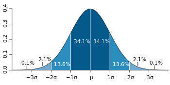
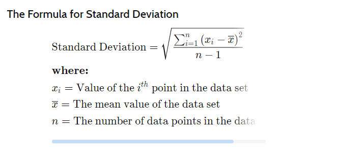
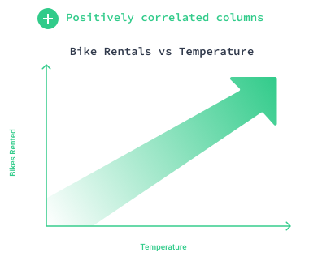
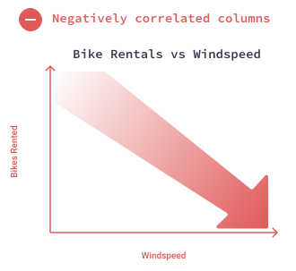
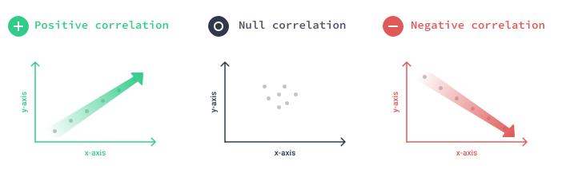
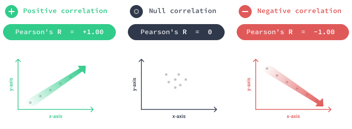

# Dispersion

https://www.statisticshowto.com/dispersion/

Dispersion in statistics is a way of describing how spread out a set of data is. When a data set has a large value, the values in the set are widely scattered; when it is small the items in the set are tightly clustered. Very basically, this set of data has a small value:
1, 2, 2, 3, 3, 4
…and this set has a wider one:
0, 1, 20, 30, 40, 100

The spread of a data set can be described by a range of descriptive statistics including [variance](https://www.statisticshowto.com/probability-and-statistics/variance/), [standard deviation](https://www.statisticshowto.com/probability-and-statistics/standard-deviationon/), and [interquartile range](https://www.statisticshowto.com/probability-and-statistics/interquartile-range/). Spread can also be shown in graphs: [dot plots](https://www.statisticshowto.com/what-is-a-dot-plot/), [boxplots](https://www.statisticshowto.com/probability-and-statistics/descriptive-statistics/box-plot/), and [stem and leaf plots](https://www.statisticshowto.com/stemplot/) have a greater distance with samples that have a larger dispersion and vice versa.


# **Interquartile range**

https://www.statisticshowto.com/probability-and-statistics/interquartile-range/

The **interquartile range** is a measure of where the “[middle fifty](https://www.statisticshowto.com/middle-fifty/)” is in a data set. Where a [range ](https://www.calculushowto.com/types-of-functions/domain-and-range-of-a-function/)is a measure of where the beginning and end are in a set, **an interquartile range is a measure of where the bulk(większość) of the values lie.** That’s why it’s preferred over many other [measures of spread](https://www.statisticshowto.com/measures-of-spread/) when reporting things like school performance or SAT scores.

The interquartile range formula is the first [quartile ](https://www.statisticshowto.com/probability-and-statistics/statistics-definitions/what-are-quartiles/)subtracted from the third [quartile](https://www.statisticshowto.com/probability-and-statistics/statistics-definitions/what-are-quartiles/):

**IQR = Q3 – Q1.**

# Standard Deviation

https://www.statisticshowto.com/probability-and-statistics/standard-deviation/

https://www.scribbr.com/statistics/outliers/

Standard deviation is a measure of dispersement in statistics. “Dispersement” tells you how much your data is spread out. Specifically, it shows you how much your data is spread out around the [mean](https://www.statisticshowto.com/probability-and-statistics/statistics-definitions/mean-median-mode/#mean) or [average](https://www.statisticshowto.com/arithmetic-mean/). For example, are all your scores close to the average? Or are lots of scores way above (or way below) the average score?

The following graph of a [normal distribution](https://www.statisticshowto.com/probability-and-statistics/normal-distributions/) represents a great deal of data in real life. The [mean](https://www.statisticshowto.com/probability-and-statistics/statistics-definitions/mean-median-mode/#mean), or average, is represented by the Greek letter μ, in the center. Each segment (colored in dark blue to light blue) represents one standard deviation away from the mean. For example, 2σ means two standard deviations from the mean.

[](https://www.statisticshowto.com/probability-and-statistics/standard-deviation/)




The Σ sign in the formula means “to add up” (see: [Sigma notation](https://calculushowto.com/what-is-sigma-summation-notation/)). 


# Correlation

There are two kinds of correlation: positive and negative.

Two positively correlated columns tend to change in the same direction — when one increases (or decreases), the other tends to increase (or decrease) as well. On a scatter plot, two positively correlated columns show an upward trend (like in the `temp` versus `cnt` plot).





Two negatively correlated columns tend to change in opposite directions — when one increases, the other tends to decrease, and vice versa. On a scatter plot, two negatively correlated columns show a downward trend (like in the `windspeed` versus `cnt` plot).





Not all pairs of columns are correlated. We often see two columns changing together in a way that shows no clear pattern. The values in the columns increase and decrease without any correlation

## **Pearson correlation coefficient**

The most popular way to measure correlation strength is by calculating the degree to which the points on a scatter plot fit on a straight line.





We can measure how well the points fit on a straight line by using the **Pearson correlation coefficient** — also known as **Pearson's r**.

Pearson's r values lie between -1.00 and +1.00. When the positive correlation is perfect, the Pearson's r is equal to +1.00. When the negative correlation is perfect, the Pearson's r is equal to -1.00. A value of 0.0 shows no correlation.





Below, we see various scatter plot shapes along with their corresponding Pearson's r.


[Source:Wikipedia](https://en.wikipedia.org/wiki/Pearson_correlation_coefficient#/media/File:Correlation_examples2.svg)


If columns X and Y have *r = +0.8*, and columns X and Z have *r = -0.8*, then the strength of these two correlations is equal. The minus sign only tells us that the correlation is negative, not that it is weaker.

For example, even though the number +0.2 is greater than -0.6, a -0.6 correlation is stronger compared to a +0.2 correlation.

When we compare correlation strengths, we need to ignore the signs and only look at the absolute *r* values. The sign only gives us the correlation's direction, not its strength.

## Calculating **Pearson correlation coefficient**

To calculate the Pearson's r between any two columns, we can use the [`Series.corr()` method](https://pandas.pydata.org/pandas-docs/stable/reference/api/pandas.Series.corr.html). For instance, this is how we can calculate the two correlations above:

```python
bike_sharing['temp'].corr(bike_sharing['cnt'])
```

```python
0.6274940090334918
```

```python
bike_sharing['windspeed'].corr(bike_sharing['cnt'])
```

```
-0.23454499742167
```

The order of columns doesn't matter when we use `Series.corr()`. Below, the r values are the same, although we use the columns in reverse order:

```python
# Previously: bike_sharing['temp'].corr(bike_sharing['cnt'])
bike_sharing['cnt'].corr(bike_sharing['temp'])
```

```
0.6274940090334918
```

```python
# Previously: bike_sharing['windspeed'].corr(bike_sharing['cnt'])
bike_sharing['cnt'].corr(bike_sharing['windspeed'])
```


```python
-0.23454499742167
```

`Series.corr()` uses a math formula that only works with numbers. This means that `Series.corr()` only works with numerical columns — if we use string or datetime columns, we'll get an error.

As a side note, teaching the math behind Pearson's r is beyond the scope of this visualization lesson. Here, we focus on how to interpret and visualize correlation.

The `Series.corr()` method only allows us to calculate the correlation between two numerical columns. We can get an overview of correlations using the [`DataFrame.corr()` method](https://pandas.pydata.org/pandas-docs/stable/reference/api/pandas.DataFrame.corr.html), which calculates the Pearson's r between all pairs of numerical columns.

```python
bike_sharing.corr()
```

|            | instant   | season    | yr        | mnth      | holiday   | weekday   | workingday | weathersit | temp      | atemp     | hum       | windspeed | casual    | registered | cnt       |
| ---------- | --------- | --------- | --------- | --------- | --------- | --------- | ---------- | ---------- | --------- | --------- | --------- | --------- | --------- | ---------- | --------- |
| instant    | 1.000000  | 0.412224  | 0.866025  | 0.496702  | 0.016145  | -0.000016 | -0.004337  | -0.021477  | 0.150580  | 0.152638  | 0.016375  | -0.112620 | 0.275255  | 0.659623   | 0.628830  |
| season     | 0.412224  | 1.000000  | -0.001844 | 0.831440  | -0.010537 | -0.003080 | 0.012485   | 0.019211   | 0.334315  | 0.342876  | 0.205445  | -0.229046 | 0.210399  | 0.411623   | 0.406100  |
| yr         | 0.866025  | -0.001844 | 1.000000  | -0.001792 | 0.007954  | -0.005461 | -0.002013  | -0.048727  | 0.047604  | 0.046106  | -0.110651 | -0.011817 | 0.248546  | 0.594248   | 0.566710  |
| mnth       | 0.496702  | 0.831440  | -0.001792 | 1.000000  | 0.019191  | 0.009509  | -0.005901  | 0.043528   | 0.220205  | 0.227459  | 0.222204  | -0.207502 | 0.123006  | 0.293488   | 0.279977  |
| holiday    | 0.016145  | -0.010537 | 0.007954  | 0.019191  | 1.000000  | -0.101960 | -0.253023  | -0.034627  | -0.028556 | -0.032507 | -0.015937 | 0.006292  | 0.054274  | -0.108745  | -0.068348 |
| weekday    | -0.000016 | -0.003080 | -0.005461 | 0.009509  | -0.101960 | 1.000000  | 0.035790   | 0.031087   | -0.000170 | -0.007537 | -0.052232 | 0.014282  | 0.059923  | 0.057367   | 0.067443  |
| workingday | -0.004337 | 0.012485  | -0.002013 | -0.005901 | -0.253023 | 0.035790  | 1.000000   | 0.061200   | 0.052660  | 0.052182  | 0.024327  | -0.018796 | -0.518044 | 0.303907   | 0.061156  |
| weathersit | -0.021477 | 0.019211  | -0.048727 | 0.043528  | -0.034627 | 0.031087  | 0.061200   | 1.000000   | -0.120602 | -0.121583 | 0.591045  | 0.039511  | -0.247353 | -0.260388  | -0.297391 |
| temp       | 0.150580  | 0.334315  | 0.047604  | 0.220205  | -0.028556 | -0.000170 | 0.052660   | -0.120602  | 1.000000  | 0.991702  | 0.126963  | -0.157944 | 0.543285  | 0.540012   | 0.627494  |
| atemp      | 0.152638  | 0.342876  | 0.046106  | 0.227459  | -0.032507 | -0.007537 | 0.052182   | -0.121583  | 0.991702  | 1.000000  | 0.139988  | -0.183643 | 0.543864  | 0.544192   | 0.631066  |
| hum        | 0.016375  | 0.205445  | -0.110651 | 0.222204  | -0.015937 | -0.052232 | 0.024327   | 0.591045   | 0.126963  | 0.139988  | 1.000000  | -0.248489 | -0.077008 | -0.091089  | -0.100659 |
| windspeed  | -0.112620 | -0.229046 | -0.011817 | -0.207502 | 0.006292  | 0.014282  | -0.018796  | 0.039511   | -0.157944 | -0.183643 | -0.248489 | 1.000000  | -0.167613 | -0.217449  | -0.234545 |
| casual     | 0.275255  | 0.210399  | 0.248546  | 0.123006  | 0.054274  | 0.059923  | -0.518044  | -0.247353  | 0.543285  | 0.543864  | -0.077008 | -0.167613 | 1.000000  | 0.395282   | 0.672804  |
| registered | 0.659623  | 0.411623  | 0.594248  | 0.293488  | -0.108745 | 0.057367  | 0.303907   | -0.260388  | 0.540012  | 0.544192  | -0.091089 | -0.217449 | 0.395282  | 1.000000   | 0.945517  |
| cnt        | 0.628830  | 0.406100  | 0.566710  | 0.279977  | -0.068348 | 0.067443  | 0.061156   | -0.297391  | 0.627494  | 0.631066  | -0.100659 | -0.234545 | 0.672804  | 0.945517   | 1.000000  |

Most often, we're only interested in finding the correlation for just a few columns. For example, what if we only want to see the correlation for the `cnt`, `casual`, and `registered` columns? The `DataFrame.corr()` method returns a `DataFrame`, which means we can select the `cnt`, `casual`, and `registered` columns directly.

```python
bike_sharing.corr()[['cnt', 'casual', 'registered']]
```

|            | cnt       | casual    | registered |
| ---------- | --------- | --------- | ---------- |
| instant    | 0.628830  | 0.275255  | 0.659623   |
| season     | 0.406100  | 0.210399  | 0.411623   |
| yr         | 0.566710  | 0.248546  | 0.594248   |
| mnth       | 0.279977  | 0.123006  | 0.293488   |
| holiday    | -0.068348 | 0.054274  | -0.108745  |
| weekday    | 0.067443  | 0.059923  | 0.057367   |
| workingday | 0.061156  | -0.518044 | 0.303907   |
| weathersit | -0.297391 | -0.247353 | -0.260388  |
| temp       | 0.627494  | 0.543285  | 0.540012   |
| atemp      | 0.631066  | 0.543864  | 0.544192   |
| hum        | -0.100659 | -0.077008 | -0.091089  |
| windspeed  | -0.234545 | -0.167613 | -0.217449  |
| casual     | 0.672804  | 1.000000  | 0.395282   |
| registered | 0.945517  | 0.395282  | 1.000000   |
| cnt        | 1.000000  | 0.672804  | 0.945517   |


## Correlation and Categorical Data

Generally, numerical columns describe a quantity — how much there is of something.

But we also have columns that describe qualities — what or how something is. These columns are **categorical** (or qualitative).

One example of a categorical column (also called categorical variable) is the `workingday` column. This column describes the type of day: a working day or a non-working day (weekend or holiday).

```python
bike_sharing['workingday'].value_counts()
```

```
1    500
0    231
Name: workingday, dtype: int64
```

Although it's categorical, the `workingday` column is encoded with numbers (`1` means a working day and `0` means a non-working day).

Because it's encoded with numbers, we can calculate correlations using `Series.corr()`. For instance, let's calculate its correlation with the `casual` and `registered` columns.

```python
bike_sharing.corr()['workingday'][['casual', 'registered']]
```

```
casual       -0.518044
registered    0.303907
Name: workingday, dtype: float64
```

We can see a negative correlation with the `casual` column (-0.52), and a positive correlation with the `registered` column (+0.30).

These values suggest that registered users tend to use the bikes more on working days (to commute to work probably), while casual (non-registered) users tend to rent the bikes more on the weekends and holidays (maybe to spend some leisure time).

However, the `1` and `0` encoding is arbitrary. The creators of this dataset could have assigned `0` to a working day and `1` to a non-working day. Below, we make this change ourselves:

```python
bike_sharing['workingday'].replace({1:0, 0:1}, inplace=True)
```

After we changed `1` to `0` and vice versa, the correlation strengths remained the same, but their sign changed (minus becomes plus and vice versa):

```python
bike_sharing.corr()['workingday'][['casual', 'registered']]
```

```python
pcasual        0.518044
registered   -0.303907
Name: workingday, dtype: float64
```

If we are careful about what `1` and `0` mean, we reach the same conclusion as above (registered users tend to use the bikes more on working days, while casual users tend to ride the bikes more on the weekends and holidays).

The takeaway is that when we're working with categorical columns that have been encoded with numbers, we need to interpret the sign of the correlation with caution.

Because the encoding is arbitrary, the correlation can be both positive and negative, depending on how the creators of the dataset chose to encode the values of that column.

Often, the best thing we can do is acknowledge that there's a correlation but avoid talking about the correlation as being positive or negative.


## Causality 

When we find a strong correlation between two columns, one common mistake is to assume that the columns must also have a relationship of causality — one is the cause, and the other is the effect.

For instance, let's say we found a strong positive correlation between the number of bike rentals and ice cream sales. When the number of bike rentals goes up, the number of ice cream sales tends to go up as well. When bike rentals decrease, ice cream sales tend to decrease too.

The positive correlation doesn't imply that ice cream sales are causing bike rentals to increase or decrease (or vice versa). Most likely, both ice cream sales and bike rentals are related to temperature variations in a similar way, and this is why they change together similarly.

However, correlation can suggest causality. If two columns are correlated, it might be because of a cause-and-effect relationship. It might. To establish a relationship of causality, we often need to perform a rigorous experiment.

The overarching point is that proving causality requires more than just correlation. We can't say that X is the cause of Y simply because columns X and Y are strongly correlated. In other words, correlation does not imply causation.

# Outliers

https://towardsdatascience.com/5-ways-to-detect-outliers-that-every-data-scientist-should-know-python-code-70a54335a623

**In statistics**, outliers are data points  that don’t belong to a certain population. It is an abnormal observation that lies far away from other values. An outlier is an observation that diverges from otherwise well-structured data.

Being an outlier in itself does not make a data value invalid or erroneous (as in the previous example with Bill Gates). Still, outliers are often the result of data errors such as mixing data of different units (kilometers versus meters) or bad readings from a sensor. When outliers are the result of bad data, the **mean** will result in a poor estimate of location, while the **median** will be still be valid. In any case, outliers should be identified and are usually worthy of further investigation.

## **Method 1 — Standard Deviation:**

In statistics, If a data distribution is approximately normal then about  68% of the data values lie within one standard deviation of the mean and about 95% are within two standard deviations, and **about 99.7%** lie within three standard deviations


Therefore, if you have any data point that is more than 3 times the  standard deviation, then those points are very likely to be anomalous or outliers.

```python
import numpy as np
import matplotlib.pyplot as plt
seed(1)


# multiply and add by random numbers to get some real values
data = np.random.randn(50000)  * 20 + 20

# Function to Detection Outlier on one-dimentional datasets.
def find_anomalies(data):
    #define a list to accumlate anomalies
    anomalies = []
    
    # Set upper and lower limit to 3 standard deviation
    random_data_std = std(random_data)
    random_data_mean = mean(random_data)
    anomaly_cut_off = random_data_std * 3
    
    lower_limit  = random_data_mean - anomaly_cut_off 
    upper_limit = random_data_mean + anomaly_cut_off
    print(lower_limit)
    # Generate outliers
    for outlier in random_data:
        if outlier > upper_limit or outlier < lower_limit:
            anomalies.append(outlier)
    return anomalies

find_anomalies(data)
```

## Method 2 — Boxplots


Box plots are a graphical depiction of numerical data through their  quantiles. It is a very simple but effective way to visualize outliers.  Think about the lower and upper whiskers as the boundaries of the data  distribution. Any data points that show above or below the whiskers, can be considered outliers or anomalous. Here is the code to plot a box  plot:

<iframe src="https://towardsdatascience.com/media/74248bc899cd30db3ebd9b4229d8952b" allowfullscreen="" title="boxplot.py" class="fq aq as ag cf" scrolling="auto" width="692" height="127" frameborder="0"></iframe>

The above code displays the plot below. As you can see, it considers  everything above 75 or below ~ -35 to be an outlier. The results are  very close to method 1 above.


### Boxplot Anatomy:

The concept of the I**nterquartile Range** (**IQR**) is used to build the boxplot graphs. IQR is a concept in statistics  that is used to measure the statistical dispersion and data variability  by dividing the dataset into quartiles.

In simple words, any dataset or any set of observations is divided into  four defined intervals based upon the values of the data and how they  compare to the entire dataset. A quartile is what divides the data into  three points and four intervals.


Interquartile Range (IQR) is important because it is used to define the outliers. It  is the difference between the third quartile and the first quartile (IQR = Q3 -Q1). Outliers in this case are defined as the observations that  are below (Q1 − 1.5x IQR) or *boxplot lower whisker* or above (Q3 + 1.5x IQR) or *boxplot upper whisker*.


## Method 3 - Using the Interquartile Rule to Find Outliers

Though it's not often affected much by them, the interquartile range can be used to detect outliers. This is done using these steps:

1. Sort your data from low to high
2. Identify the first quartile (Q1), the median, and the third quartile (Q3).
3. Calculate your IQR = Q3 – Q1
4. Calculate your upper fence = Q3 + (1.5 * IQR) // 1.5 (a constant used to discern outliers).
5. Calculate your lower fence = Q1 – (1.5 * IQR)
6. Use your fences to highlight any outliers, all values that fall outside your fences.

Remember that the interquartile rule is only a rule of thumb that generally holds but does not apply to every case. In general, you should always follow up your outlier analysis by studying the resulting outliers to see if they make sense. Any potential outlier obtained by the interquartile method should be examined in the context of the entire set of data.

## Dealing with outliers

Once you’ve identified outliers, you’ll decide what to do with them. Your main options are retaining or removing them from your dataset. This is similar to the choice you’re faced with when [dealing with missing data](https://www.scribbr.com/statistics/missing-data/).

For each outlier, think about whether it’s a true value or an error before deciding.

- Does the outlier line up with other measurements taken from the same participant?
- Is this data point completely impossible or can it reasonably come from your population?
- What’s the most likely source of the outlier? Is it a natural variation or an error?

In general, you should try to accept outliers as much as possible unless it’s clear that they represent errors or bad data.

### Retain outliers

Just like with missing values, the most conservative option is to keep outliers in your dataset. Keeping outliers is usually the better option when you’re not sure if they are errors.

With a large sample, outliers are expected and more likely to occur. But each outlier has less of an impact on your results when your sample is large enough. The [central tendency](https://www.scribbr.com/statistics/central-tendency/) and [variability](https://www.scribbr.com/statistics/variability/) of your data won’t be as affected by a couple of extreme values when you have a large number of values.

If you have a small dataset, you may also want to retain as much data as possible to make sure you have enough [statistical power](https://www.scribbr.com/statistics/statistical-power/). If your dataset ends up containing many outliers, you may need to use a statistical test that’s more robust to them. Non-parametric statistical tests perform better for these data.

### Remove outliers

Outlier removal means deleting extreme values from your dataset before you perform analyses. You aim to delete any dirty data while retaining true extreme values.

It’s a tricky procedure because it’s often impossible to tell the two types apart for sure. Deleting true outliers may lead to a biased dataset and an inaccurate conclusion.

For this reason, you should only remove outliers if you have legitimate reasons for doing so. It’s important to document each outlier you remove and your reasons so that other researchers can follow your procedures.


# Histogram

## **BINS**

In statistics, data is usually sorted in one way or another. You might sort the data into classes, categories, by [range ](https://www.statisticshowto.com/probability-and-statistics/statistics-definitions/range-statistics/)or placement on the number line. 

A **bin**—sometimes called a class interval—is a way of sorting data in a [histogram](https://www.statisticshowto.com/probability-and-statistics/descriptive-statistics/histogram-make-chart/). It’s very similar to the idea of putting data into categories.

### What is a bin in statistics: Choosing bins

**Choosing bins** can be done by hand for simple  histograms in most cases. For example, if you are making a histogram for exam scores, choosing bins that matches grades (70-79, 80-89, 90-100)  is a fairly obvious choice. You have two numbers associated with each  bin: 

- The low value (sometimes called *bin low*), which in this example would be 70, 80, 90,
- The high value (sometimes called *bin high*) which for this example is 79 89 100.

In most cases though, choosing bins isn’t going to be that simple  especially for large data sets. When dealing with large sets of numbers, you’re usually better off using technology like [Microsoft Excel](https://office.microsoft.com/en-us/excel/) to create a histogram ([how to create a histogram in Excel](https://www.statisticshowto.com/probability-and-statistics/excel-statistics/histogram-in-excel/)), because if your bin choice doesn’t make for a nice-looking diagram you  can dynamically change the bin values without having to draw a graph.


# Percentiles vs average vs median


Percentiles and averages are both measures of central tendency used to summarize data, but they provide different insights. The average, or mean, is calculated by summing all the values in a dataset and dividing by the number of values. It is a useful measure to determine the overall trend or central value of a set of numbers. However, the average can be easily skewed by extreme values or outliers, as it takes into account all values equally. On the other hand, percentiles divide a dataset into 100 equal parts, with each part representing a percentage. For example, the 75th percentile represents the value below which 75% of the data falls. 

The difference between the average and the 50th percentile lies in what they represent in a dataset.

The average, also known as the mean, provides a measure of central tendency by summing up all the values in the dataset and dividing by the total number of values. It gives us an idea of the typical or average value in the dataset. However, the average can be influenced by extreme values or outliers, which may skew the representation of the data.

On the other hand, the 50th percentile represents the median of a dataset. It is the value below which 50% of the data falls and above which the other 50% of the data falls. The median is useful in understanding the typical value in a dataset, especially when there are outliers present.

In summary, while the average provides an overall idea of the typical value, the 50th percentile or median specifically represents the middle value of a dataset, dividing it into two equal parts.