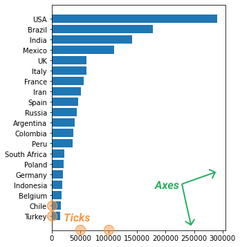
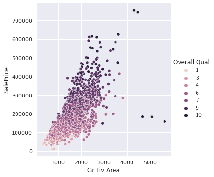
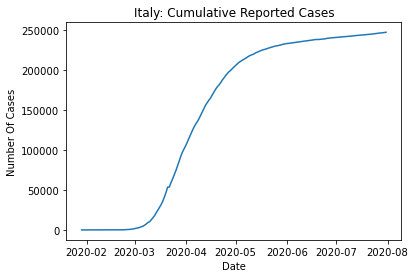
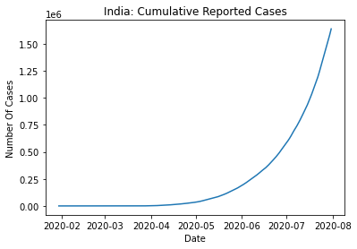
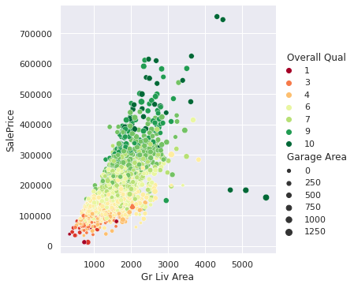
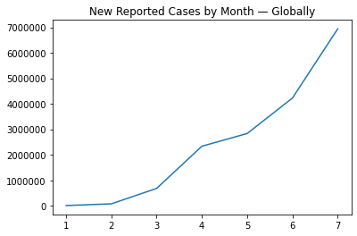
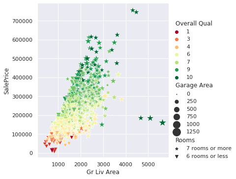

# Types of Visualization

At the heart of any data science workflow is data exploration. Most commonly, we explore data by using the following:

- Statistical methods (measuring averages, measuring variability, etc.)
- **Data visualization** (transforming data into a visual form)

This indicates that one of the central tasks of data visualization is to help us explore data.

The other central task is to help us communicate and explain the results we've found through exploring data. That being said, we have two kinds of data visualization:

- Exploratory data visualization: we build graphs for *ourselves* to explore data and find patterns.
- Explanatory data visualization: we build graphs for *others* to communicate and explain the patterns we've found through exploring data.


## Graphs

https://matplotlib.org/stable/tutorials/introductory/quick_start.html

We can create a graph by drawing two lines at right angles to each other. Each line is called an **axis** — the horizontal line at the bottom is the **x-axis**, and the vertical line on the left is the **y-axis**. The point where the two lines intersect is called the **origin**.





Each axis has length — below, we see both axes marked with numbers, which represent unit lengths.


The length of the axes helps us precisely locate any point drawn on the graph. Point *A* on the graph below, for instance, is seven length units away from the y-axis and two units away from the x-axis.


The two numbers that represent the distances of a point from the x- and y-axis are called **coordinates**. Point *A* above has two coordinates: seven and two. Seven is the x-coordinate, and two is the y-coordinate.

The coordinates often appear in the form (x, y), with the x-coordinate first. So the coordinates of *A* are (7, 2). So, here's what we need to know about coordinates:

- The x-coordinate shows the distance in unit lengths relative to the y-axis.
- The y-coordinate shows the distance in unit lengths relative to the x-axis.

The unit lengths of the x- and y-axes doesn't have to be the same. Below, we see the unit of length on the x-axis is 10, while on the y-axis it is 1,000 (note that we can also hide some of the numbers to make the graph look better).


### Interpreting the graph

Below, we see a table showing the number of new COVID-19 infections reported world-wide for the first seven months of 2020:


Each row shows a pair of two connected data points:

1. The month number (where one means January, two means February, and so on)
2. The number of cases reported for that month

When we have a pair of two numbers, we can map it on a graph by using the two numbers as coordinates. Below, we added a point corresponding to the coordinates (5, 2835147) — this corresponds to the month of May. Behind the curtains, we generated the graph using Matplotlib, which we'll introduce on the next screen.



Let's now put all the data in the table on the graph following the same method:


When we graph how something changes over time, we connect all the points with a line — above, we graphed how the number of new COVID-19 cases changed month by month.


Because we use lines to connect the points, the graph above is a **line graph** (also known as a line plot, or line chart; the distinction between graph, plot and chart is ambiguous in the data visualization world, with different authors assigning slightly different meanings to these terms — in this course, we use all three synonymously).

When we create line graphs, it's common to hide the points on the line:


By looking at the line graph we built for our table above, we can see a few patterns.

Overall, the line shows an upward direction, which indicates the number of new reported cases has gone up month by month and has never decreased or stabilized. This is mostly a result of the virus spreading. Countries also started to test more people, which increased the number of new reported cases.

The line connecting January to March has a moderate upward steepness (the January-February line is almost horizontal), which indicates a moderate increase in the number of new reported cases. In that period, the virus was just starting to spread around the world, and many countries were testing people only when they got to the hospital.

The March-April line is very steep, indicating a surge in new reported cases. The April-May line shows a mild steepness, so the number of new cases remained high (around three million). However, the number didn't increase too much compared to April — this is most likely due to the worldwide lockdowns.

The May-July line is very steep, indicating another surge in the number of cases (from about three million to approximately seven million). This is most likely because of ending the lockdowns, which created the conditions for more virus spreading.


## Time Series

The rows in our dataset are listed in time order, starting with January 4 and ending with July 31. We call a series of data points that is listed in time order a **time series**.

Typically we visualize time series with line graphs. The time values are always plotted, by convention, on the x-axis.


## Types of growth

###  **Logarithmic growth**

*Generally, a quantity that increases very quickly in the beginning — and then it slows down more and more over time — has a **logarithmic growth**.*

Italy was the second epicenter of the pandemic after China. Let's see how the total number of cumulative cases (recall this is different from the number of new cases) evolved over the first seven months of 2020. In the code below, we begin by isolating the data for Italy, and then we create the plot.

```python
italy = who_time_series[who_time_series['Country'] == 'Italy']

plt.plot(italy['Date_reported'], italy['Cumulative_cases'])
plt.title('Italy: Cumulative Reported Cases')
plt.xlabel('Date')
plt.ylabel('Number Of Cases')
plt.show()
```




Until March, the number of cumulative cases stays very low. But then the number starts to grow very fast (the line on the graph goes upwards very rapidly in March), and it maintains that fast pace until May. The growth then starts to settle down, and on the graph, we see an almost horizontal line.

Generally, a quantity that increases very quickly in the beginning — and then it slows down more and more over time — has a **logarithmic growth**.

In the March-July period (thus excluding January and February), Italy had a logarithmic growth in the number of cumulative cases because there were many new cases in the March-April period, but then the number of new cases started to decrease. The line on the graph will become perfectly horizontal when there will be no more new cases.

### Exponential growth

*Generally, a quantity that increases slowly in the beginning — but then starts growing faster and faster over time — has **exponential growth**.*

If we look at India, we can see another type of growth:

```python
india = who_time_series[who_time_series['Country'] == 'India']

plt.plot(india['Date_reported'], india['Cumulative_cases'])
plt.title('India: Cumulative Reported Cases')
plt.xlabel('Date')
plt.ylabel('Number Of Cases')
plt.show()
```



The number of cumulative cases increases very slowly in the February-May period (the line is almost horizontal). But then the growth becomes fast (the line rapidly switches direction upwards), and it gets faster and faster over time, without showing any sign of slowing down.

Generally, a quantity that increases slowly in the beginning — but then starts growing faster and faster over time — has **exponential growth**.

India shows exponential growth for the data we have, but when the number of new cases will decrease, the growth (of cumulative cases) will become logarithmic.

If we look at Italy again, we can actually see an exponential growth too if we isolate only the February-May period. Overall, Italy has a slow growth in the beginning, followed by a fast growth in the March-May period, and then the growth slows down again. This sequence of growth rates is often described as logistic growth.

### Linear growth

*Generally, a quantity that increases constantly over time has **linear growth**.*


Now, let's plot a line graph for Poland to see another type of growth:

```python
poland = who_time_series[who_time_series['Country'] == 'Poland']

plt.plot(poland['Date_reported'], poland['Cumulative_cases'])
plt.title('Poland: Cumulative Reported Cases')
plt.xlabel('Date')
plt.ylabel('Number Of Cases')
plt.show()
```


If we look at the April-July period, we can see an approximately straight line. There are a few variations here and there, but no obvious curves like we see for Italy or India. The number of cases increases nonetheless, but it increases at a constant rate.

Generally, a quantity that increases constantly over time has **linear growth**.

### Summary

To sum up, these are the three types of growth we've learned in this screen:


### Irregularities

Change is not only about growth. A quantity can also decrease following a linear, exponential, or logarithmic pattern.


The data, however, rarely fits any of these patterns perfectly. Most often, our line graphs are only *approximately* linear, approximately exponential, or approximately logarithmic. Moreover, one portion of a single line graph can show an exponential change, another portion of the same graph can show a linear change, while another can show an irregular change that doesn't resemble any common pattern.

In practice, most of the line graphs we plot don't show any clear pattern. We need to pay close attention to what we see and try to extract meaning without forcing the data into some patterns we already know.

If we look at the evolution of new cases in Belarus, for instance, we see many irregularities on the line graph:

```python
belarus = who_time_series[who_time_series['Country'] == 'Belarus']

plt.plot(belarus['Date_reported'], belarus['New_cases'])
plt.title('Belarus: New Reported Cases')
plt.xlabel('Date')
plt.ylabel('Number Of Cases')
plt.show()
```


In the April-July period, we see several spikes on the graph going either upward or downward. For some days, the number of new cases gets close to 2,000 (the upward spikes), while for others is zero (the downwards spikes). These large variations suggest that the reports didn't arrive daily — it may be that no one sent reports over the weekends or on national holidays. The number of new cases keeps increasing until the next report, and then we see one of those upward spikes.

When we see irregularities on a line graph, this doesn't mean we can't extract any meaning. By analyzing the irregularities, we can sometimes uncover interesting details.


# matplotlib

We can build this line graph ourselves using Matplotlib, a Python library specifically designed for creating visualizations. Let's start by importing Matplotlib.

```python
import matplotlib.pyplot as plt
```

A quirk of Matplotlib is that we generally import the `pyplot` submodule instead of the whole module:`import matplotlib.pyplot` instead of `import matplotlib`.

When we import `matplotlib.pyplot`, we need to use the `plt` alias, by convention (`import matplotlib.pyplot as plt`).

The `pyplot` submodule is a collection of high-level functions we can use to generate graphs very quickly. To create our line graph above, we need to:

- Add the data to the [`plt.plot()` function](https://matplotlib.org/api/_as_gen/matplotlib.pyplot.plot.html#matplotlib-pyplot-plot).
- Display the plot using the [`plt.show()` function](https://matplotlib.org/stable/api/_as_gen/matplotlib.pyplot.show.html).

```python
month_number = [1, 2, 3, 4, 5, 6, 7]
new_cases = [9926, 76246, 681488, 2336640,
             2835147, 4226655, 6942042]

plt.plot(month_number, new_cases)
plt.show()
```




We see a rather odd "1e6" sign on the top left section of the graph. This is scientific notation, and it tells us that the values on the y-axis are multiplied by 106. This means that a seven on the y-axis means 7 multiplied by 106, which is seven million — we'll get back to this on the next screen.

The `plt.plot()` function generates a line graph by default. All it needs is two arrays of data of the same length — these can be Python lists, pandas Series, NumPy arrays, etc. Above, we used two Python lists.

Notice the order of arguments in `plt.plot(month_number, new_cases)`: `month_number` comes first, followed by `new_cases`. The array that comes first gives the x-coordinates, and the second array gives the y-coordinates.


The two arrays must be equal in length, or some coordinates will remain unpaired, and Matplotlib will raise an error.

Let's create a new line graph in the exercise below. On the next screen, we'll learn more about customizing the graph: adding a title, axes labels, and removing the "1e6" notation.

## "1e6" sign

On the previous screen, we built a line graph showing the evolution of new cases by month:

```python
month_number = [1, 2, 3, 4, 5, 6, 7]
new_cases = [9926, 76246, 681488, 2336640,
             2835147, 4226655, 6942042]

import matplotlib.pyplot as plt
plt.plot(month_number, new_cases)
plt.show()
```


On the top left side of the graph, we see an "1e6" sign — this is scientific notation. Matplotlib changes to scientific notation if one value on the axis needs to be one million or greater. If we want to remove scientific notation, we can use the [plt.ticklabel_format(axis, style) function](https://matplotlib.org/api/_as_gen/matplotlib.pyplot.ticklabel_format.html#matplotlib-pyplot-ticklabel-format).

```
plt.plot(month_number, new_cases)
plt.ticklabel_format(axis='y', style='plain')
plt.show()
```

Copy


The `axis` parameter defines which axis to configure — its arguments are the strings `'x'`, `'y'`, and `'both'`.

The `style` parameter controls the notation style (plain or scientific). Its arguments are `'sci'`, `'scientific'`, and `'plain'`.

## Title and Labels

The next thing we're going to do is use the [`plt.title()` function](https://matplotlib.org/api/_as_gen/matplotlib.pyplot.title.html#matplotlib-pyplot-title) to add a title to our line graph.

```python
plt.plot(month_number, new_cases)
plt.ticklabel_format(axis='y', style='plain')
plt.title('New Reported Cases by Month — Globally')
plt.show()
```



The x-axis shows the month number, and the y-axis shows the number of new reported cases. We can show this on our graph by adding a **label** to each axis — a y-label and an x-label. To add axis labels, we use [`plt.xlabel()`](https://matplotlib.org/api/_as_gen/matplotlib.pyplot.xlabel.html#matplotlib-pyplot-xlabel) and [`plt.ylabel()`](https://matplotlib.org/api/_as_gen/matplotlib.pyplot.ylabel.html#matplotlib-pyplot-ylabel).

```python
plt.plot(month_number, new_cases)
plt.ticklabel_format(axis='y', style='plain')
plt.title('New Reported Cases By Month (Globally)')
plt.xlabel('Month Number')
plt.ylabel('Number Of Cases')
plt.show()
```



Adding a title and axis labels is always a good thing — even if we're just exploring data for ourselves and no one else will ever see our work.

We create many graphs when we explore data, and we often lose track of what each graph describes. If we plot a graph now and then examine it again forty minutes later, the title and the axis labels will help us immediately determine what that graph is about.


## Two line graphs visualization

For instance, let's visualize the evolution of cumulative cases for France and the United Kingdom. Matplotlib allows us to have two line graphs sharing the same x- and y-axis:

```python
france = who_time_series[who_time_series['Country'] == 'France']
uk = who_time_series[who_time_series['Country'] == 'The United Kingdom']

plt.plot(france['Date_reported'], france['Cumulative_cases'])
plt.plot(uk['Date_reported'], uk['Cumulative_cases'])
plt.show()
```


We see two lines of different colors above, but we can't tell which is for France and which is for the United Kingdom. To solve this problem, we're going to add a **legend** that shows which color corresponds to which country. In the code below, we first add a `label` argument to the `plt.plot()` function, and then we use the [`plt.legend()` function](https://matplotlib.org/api/_as_gen/matplotlib.pyplot.legend.html#matplotlib-pyplot-legend):

```python
plt.plot(france['Date_reported'], france['Cumulative_cases'],
         label='France')
plt.plot(uk['Date_reported'], uk['Cumulative_cases'],
         label='The UK')
plt.legend()
plt.show()
```


When we use `plt.plot()` the first time, Matplotlib creates a line graph. When we use `plt.plot()` again, Matplotlib creates another line graph that shares the same x- and y-axis as the first graph. If we want Matplotlib to draw the second line graph separately, we need to close the first graph with the [`plt.show()` function](https://matplotlib.org/api/_as_gen/matplotlib.pyplot.show.html).

```python
plt.plot(france['Date_reported'], france['Cumulative_cases'])
plt.title('France')
plt.show()

plt.plot(uk['Date_reported'], uk['Cumulative_cases'])
plt.title('The UK')
plt.show()
```


Looking at the two graphs above, the evolution of cumulative cases looks very similar if we only judge by the shape of the line. If we look on the y-axis, however, we see that the two graphs have different ranges, and the values for the UK are almost twice as large. It's much easier to compare these two visualizations if they share the same axes.

## Linge Graph Customization


the dates on the bottom of the graph are overlapping and we can  barely read them. To fix this, we can rotate the labels using the [`plt.xticks()` function](https://matplotlib.org/api/_as_gen/matplotlib.pyplot.xticks.html). The function has a `rotation` parameter which we can use to control the angle of rotation.

```python
plt.plot(bike_sharing['dteday'], bike_sharing['cnt'])
plt.xticks(rotation=45)
plt.show()
```


The `plt.xticks()` function takes its name from the little lines on each axis to show unit lengths. These lines are called **ticks**, and the corresponding labels are **tick labels**. The x-axis has x-ticks, and the y-axis has y-ticks — there's also a [`plt.yticks()` function](https://matplotlib.org/api/_as_gen/matplotlib.pyplot.yticks.html).


## Adding Graph Legend

```python
plt.plot(bike_sharing['dteday'], bike_sharing['casual'],
        label='Casual')
plt.plot(bike_sharing['dteday'], bike_sharing['registered'],
        label='Registered')
plt.xticks(rotation=30)
plt.ylabel('Bikes Rented')
plt.xlabel('Date')
plt.title('Bikes Rented: Casual vs. Registered')
plt.legend()
plt.show()
```


# Scatter Plot

https://medium.com/@row3no6/scatter-plot-visualization-and-relationship-in-python-39729bb0e4df

## What is scatter plot?

A scatter plot is a type of data visualization that shows the relationship between different variables. This data is shown by placing various data points between an x- and y-axis. Essentially, each of these data points looks “scattered” around the graph, giving this type of data visualization its name.

Scatter plots can provide answers to the following questions:

1. Are variables X and Y related?
2. Are variables X and Y linearly related?
3. Are variables X and Y non-linearly related?
4. Does the variation in Y change depending on X?
5. Are there outliers?


## When To Use a Scatter Plot

Let’s dive into the best times to use a scatter plot to visualize your data set.

Use a scatter plot to determine whether or not two variables have a relationship or correlation.

Use a scatter plot when your independent variable has multiple values for your dependent variable.

Use a scatter plot when you have two variables that pair well together.

## When Not to Use a Scatter Plot

Avoid a scatter plot when your data is not at all related.

Avoid a scatter plot when you have too large a set of data.

Let's start by creating a scatter plot using the [`plt.scatter()` function](https://matplotlib.org/api/_as_gen/matplotlib.pyplot.scatter.html):


## How to Create a Scatter Plot

```python
plt.scatter(bike_sharing['temp'], bike_sharing['cnt'])
plt.xlabel('Temperature')
plt.ylabel('Bikes Rented')
plt.show()
```


Each point (also called a marker) on the scatter plot has an x-coordinate and an y-coordinate. Above, the `temp` column provides the x-coordinates, and the `cnt` column provides the y-coordinates.

Generally, the first column we pass to `plt.scatter(x, y)` provides the x-coordinates, and the second one the y-coordinates.

One thing we notice in the scatter plot above is that the overall direction of the points is upward (seen from left to right). This is because as the temperature increases, the number of bike rentals tends to grow too.

Seen from right to left, the direction of the points is downward — as the temperature decreases, the number of rentals also tends to decrease.


## Calculating **Pearson correlation coefficient**

To calculate the Pearson's r between any two columns, we can use the [`Series.corr()` method](https://pandas.pydata.org/pandas-docs/stable/reference/api/pandas.Series.corr.html). For instance, this is how we can calculate the two correlations above:

```python
bike_sharing['temp'].corr(bike_sharing['cnt'])
```

```
0.6274940090334918
```

```
bike_sharing['windspeed'].corr(bike_sharing['cnt'])
```

```
-0.23454499742167
```

The order of columns doesn't matter when we use `Series.corr()`. Below, the r values are the same, although we use the columns in reverse order:

```
# Previously: bike_sharing['temp'].corr(bike_sharing['cnt'])
bike_sharing['cnt'].corr(bike_sharing['temp'])
```

```
0.6274940090334918
```

```
# Previously: bike_sharing['windspeed'].corr(bike_sharing['cnt'])
bike_sharing['cnt'].corr(bike_sharing['windspeed'])
```


```python
-0.23454499742167
```

`Series.corr()` uses a math formula that only works with numbers. This means that `Series.corr()` only works with numerical columns — if we use string or datetime columns, we'll get an error.

As a side note, teaching the math behind Pearson's r is beyond the scope of this visualization lesson. Here, we focus on how to interpret and visualize correlation.

The `Series.corr()` method only allows us to calculate the correlation between two numerical columns. We can get an overview of correlations using the [`DataFrame.corr()` method](https://pandas.pydata.org/pandas-docs/stable/reference/api/pandas.DataFrame.corr.html), which calculates the Pearson's r between all pairs of numerical columns.

```
bike_sharing.corr()
```

|            | instant   | season    | yr        | mnth      | holiday   | weekday   | workingday | weathersit | temp      | atemp     | hum       | windspeed | casual    | registered | cnt       |
| ---------- | --------- | --------- | --------- | --------- | --------- | --------- | ---------- | ---------- | --------- | --------- | --------- | --------- | --------- | ---------- | --------- |
| instant    | 1.000000  | 0.412224  | 0.866025  | 0.496702  | 0.016145  | -0.000016 | -0.004337  | -0.021477  | 0.150580  | 0.152638  | 0.016375  | -0.112620 | 0.275255  | 0.659623   | 0.628830  |
| season     | 0.412224  | 1.000000  | -0.001844 | 0.831440  | -0.010537 | -0.003080 | 0.012485   | 0.019211   | 0.334315  | 0.342876  | 0.205445  | -0.229046 | 0.210399  | 0.411623   | 0.406100  |
| yr         | 0.866025  | -0.001844 | 1.000000  | -0.001792 | 0.007954  | -0.005461 | -0.002013  | -0.048727  | 0.047604  | 0.046106  | -0.110651 | -0.011817 | 0.248546  | 0.594248   | 0.566710  |
| mnth       | 0.496702  | 0.831440  | -0.001792 | 1.000000  | 0.019191  | 0.009509  | -0.005901  | 0.043528   | 0.220205  | 0.227459  | 0.222204  | -0.207502 | 0.123006  | 0.293488   | 0.279977  |
| holiday    | 0.016145  | -0.010537 | 0.007954  | 0.019191  | 1.000000  | -0.101960 | -0.253023  | -0.034627  | -0.028556 | -0.032507 | -0.015937 | 0.006292  | 0.054274  | -0.108745  | -0.068348 |
| weekday    | -0.000016 | -0.003080 | -0.005461 | 0.009509  | -0.101960 | 1.000000  | 0.035790   | 0.031087   | -0.000170 | -0.007537 | -0.052232 | 0.014282  | 0.059923  | 0.057367   | 0.067443  |
| workingday | -0.004337 | 0.012485  | -0.002013 | -0.005901 | -0.253023 | 0.035790  | 1.000000   | 0.061200   | 0.052660  | 0.052182  | 0.024327  | -0.018796 | -0.518044 | 0.303907   | 0.061156  |
| weathersit | -0.021477 | 0.019211  | -0.048727 | 0.043528  | -0.034627 | 0.031087  | 0.061200   | 1.000000   | -0.120602 | -0.121583 | 0.591045  | 0.039511  | -0.247353 | -0.260388  | -0.297391 |
| temp       | 0.150580  | 0.334315  | 0.047604  | 0.220205  | -0.028556 | -0.000170 | 0.052660   | -0.120602  | 1.000000  | 0.991702  | 0.126963  | -0.157944 | 0.543285  | 0.540012   | 0.627494  |
| atemp      | 0.152638  | 0.342876  | 0.046106  | 0.227459  | -0.032507 | -0.007537 | 0.052182   | -0.121583  | 0.991702  | 1.000000  | 0.139988  | -0.183643 | 0.543864  | 0.544192   | 0.631066  |
| hum        | 0.016375  | 0.205445  | -0.110651 | 0.222204  | -0.015937 | -0.052232 | 0.024327   | 0.591045   | 0.126963  | 0.139988  | 1.000000  | -0.248489 | -0.077008 | -0.091089  | -0.100659 |
| windspeed  | -0.112620 | -0.229046 | -0.011817 | -0.207502 | 0.006292  | 0.014282  | -0.018796  | 0.039511   | -0.157944 | -0.183643 | -0.248489 | 1.000000  | -0.167613 | -0.217449  | -0.234545 |
| casual     | 0.275255  | 0.210399  | 0.248546  | 0.123006  | 0.054274  | 0.059923  | -0.518044  | -0.247353  | 0.543285  | 0.543864  | -0.077008 | -0.167613 | 1.000000  | 0.395282   | 0.672804  |
| registered | 0.659623  | 0.411623  | 0.594248  | 0.293488  | -0.108745 | 0.057367  | 0.303907   | -0.260388  | 0.540012  | 0.544192  | -0.091089 | -0.217449 | 0.395282  | 1.000000   | 0.945517  |
| cnt        | 0.628830  | 0.406100  | 0.566710  | 0.279977  | -0.068348 | 0.067443  | 0.061156   | -0.297391  | 0.627494  | 0.631066  | -0.100659 | -0.234545 | 0.672804  | 0.945517   | 1.000000  |

Most often, we're only interested in finding the correlation for just a few columns. For example, what if we only want to see the correlation for the `cnt`, `casual`, and `registered` columns? The `DataFrame.corr()` method returns a `DataFrame`, which means we can select the `cnt`, `casual`, and `registered` columns directly.

```python
bike_sharing.corr()[['cnt', 'casual', 'registered']]
```

|            | cnt       | casual    | registered |
| ---------- | --------- | --------- | ---------- |
| instant    | 0.628830  | 0.275255  | 0.659623   |
| season     | 0.406100  | 0.210399  | 0.411623   |
| yr         | 0.566710  | 0.248546  | 0.594248   |
| mnth       | 0.279977  | 0.123006  | 0.293488   |
| holiday    | -0.068348 | 0.054274  | -0.108745  |
| weekday    | 0.067443  | 0.059923  | 0.057367   |
| workingday | 0.061156  | -0.518044 | 0.303907   |
| weathersit | -0.297391 | -0.247353 | -0.260388  |
| temp       | 0.627494  | 0.543285  | 0.540012   |
| atemp      | 0.631066  | 0.543864  | 0.544192   |
| hum        | -0.100659 | -0.077008 | -0.091089  |
| windspeed  | -0.234545 | -0.167613 | -0.217449  |
| casual     | 0.672804  | 1.000000  | 0.395282   |
| registered | 0.945517  | 0.395282  | 1.000000   |
| cnt        | 1.000000  | 0.672804  | 0.945517   |


# Bar Plot

https://chartio.com/learn/charts/bar-chart-complete-guide/

https://medium.com/@komal.bhlla/bar-charts-what-they-are-when-to-use-them-guidelines-for-creating-64f0720a88d1

## What is a bar chart

A bar or column chart depicts the quantitative values across various subcategories (or groups) of data. The bars represent the groups whereas the height of the bars correspond to their numerical value. The groups and the numerical values are shown along different graph axes.

Bar plots work especially well for visualizing frequency tables when the number of unique values is low.

If there are many unique values, then the bar plot looks too crowded, and it becomes more difficult to see any pattern.

Bar plots work well when generating the frequency tables for categorical columns. For numerical columns, we need to use a histogram — a graph type that we'll learn about later in this lesson.

## Kinds of bar charts

### a. Vertical

A vertical bar graph illustrates data points in the form of bars in a vertical direction (column-wise).

In vertical bar graph, the category variable can be written in a diagonal way along the x axis making it hard for lengthy categories’ names to fit easily. Below is a vertical bar graph representing the weekly time spent on different entertainment activities by seniors in Halifax.


### b. Horizontal

A horizontal bar graph illustrates data points in a horizontal direction (row-wise). Horizontal bar graphs give ample space for category names on the left (see below) as compared to vertical bar graph. A horizontal bar graph would be apt if the category names are lengthy.


### c. Clustered

Clustered may be present in horizontal or vertical arrangement. These charts depict multiple sequences within each category at sub-category level.

However, it is important to note that the number of sequences (or sub-categories) should be carefully planned as too many may make it complicated to understand the trends. Below is a clustered column chart depicting the weekly time spent on different leisure activities across young, middle-aged and senior age group in Halifax.


### d. Stacked

Stacked and 100% Stacked charts may be displayed in horizontal or vertical arrangement. As compared to clustered column chart, this chart has an advantage that overall figure for each group can be easily assessed. The disadvantage is that stacked charts make it complex to judge how much each sub-group contribute to the total figure individually within a group.


For instance, this is how the bar plot for the casual users averages looks — we can generate a bar plot using the [`plt.bar()` function](https://matplotlib.org/api/_as_gen/matplotlib.pyplot.bar.html):

```python
import matplotlib.pyplot as plt

working_days = ['Non-Working Day', 'Working Day']
casual_avg = [1371, 607]

plt.bar(working_days, casual_avg)
plt.show()
```


In our bar plot above, we see two vertical blue bars. The bar on the left corresponds to the non-working day category, and the one on the right to the working day category.

The bar on the left is higher — it's more than twice as tall as the one on the right. That's because on non-working days casual users rent on average more than double the number of bikes they rent on working days.

The height of each bar corresponds to the values in the `casual_avg` list — the left bar corresponds to the value 1,371, and the right one corresponds to 607. Essentially, the height is a y-coordinate.

We pass the heights of the bars as the second argument in `plt.bar(x, height)`. The first parameter, `x`, specifies the x-coordinates, and it works equally well with both numbers and strings (Matplotlib handles the strings behind the curtains). Below, we see an example with numbers:

```python
plt.bar(x=[1,2,3,4], height=[10,20,40,80])
plt.show()
```


### Bar Plot - Manipulation

If we look at the x-tick labels, we only see numbers (from 0 to 6). If we wanted to add day names instead, we can use the [`plt.xticks()` function](https://matplotlib.org/api/_as_gen/matplotlib.pyplot.xticks.html). The `ticks` parameter takes in the x-coordinates, and the `labels` parameter takes in the corresponding new labels:

```python
plt.bar(weekday_averages['weekday'], weekday_averages['casual'])
plt.xticks(ticks=[0, 1, 2, 3, 4, 5, 6],
          labels=['Sunday', 'Monday', 'Tuesday', 'Wednesday',
                 'Thursday', 'Friday', 'Saturday'])
plt.show()
```


Some of the x-tick labels are now overlapping. One thing we can do is leverage the `rotation` parameter we learned about in the first lesson:

```python
plt.bar(weekday_averages['weekday'], weekday_averages['casual'])
plt.xticks(ticks=[0, 1, 2, 3, 4, 5, 6],
          labels=['Sunday', 'Monday', 'Tuesday', 'Wednesday',
                 'Thursday', 'Friday', 'Saturday'],
          rotation=30)
plt.show()
```


Another solution is to flip all the bars horizontally.


We call this a **horizontal bar plot**. The average numbers of bikes rented are now on the x-axis, and the day names are on the y-axis. And we're now talking about bar widths instead of bar heights.

To generate the bar plot above, we can use the [`plt.barh(y, width)` function](https://matplotlib.org/api/_as_gen/matplotlib.pyplot.barh.html) along with the `plt.yticks()` function to change the y-tick labels:

```python
plt.barh(weekday_averages['weekday'], weekday_averages['casual'])
plt.yticks(ticks=[0, 1, 2, 3, 4, 5, 6],
          labels=['Sunday', 'Monday', 'Tuesday', 'Wednesday',
                 'Thursday', 'Friday', 'Saturday'])
plt.show()
```


# Histogram

https://www.investopedia.com/terms/h/histogram.asp

https://datavizcatalogue.com/methods/histogram.html

https://towardsdatascience.com/take-your-histograms-to-the-next-level-using-matplotlib-5f093ad7b9d3

## What Is a Histogram?

A Histogram visualizes the distribution of data over a continuous interval. Each bar in a histogram represents the tabulated frequency at each interval/bin.

Histograms help give an estimate as to where values are concentrated, what the extremes are and whether there are any gaps or unusual values. They are also useful for giving a rough view of the probability distribution.

The best way to visualize a grouped frequency table is by using a **histogram**. To generate a histogram for our table above, we can use the [`plt.hist()` function](https://matplotlib.org/api/_as_gen/matplotlib.pyplot.hist.html):

```python
plt.hist(bike_sharing['cnt'])
plt.show()
```


Notice that all we needed to pass to `plt.hist()` was the `cnt` column (not the grouped frequency table).

Behind the curtains, the `plt.hist()` function did the following:

- Generated a grouped frequency table with ten equal intervals for the `cnt` column.
- Plotted a bar for each interval (ten intervals means ten bars). The height of each bar corresponds to the frequency of its corresponding interval.

A histogram is a modified bar plot — the main visual difference is that there are no gaps between bars.

Another equally-important difference is that each bar represents an interval, not a single value.

Looking at the histogram we generated for the `cnt` column, we can make a few quick observations about the following:

- Range: Over the two years (2011 and 2012), the values ranged between 0 and 9,000 bike rentals.
- The distribution of the bike rentals:
  - Most typically, the number of bike rentals per day varies between 4,500 and 5,000 — the tallest bar is around that interval. The height of that bar indicates that we had about 140 days when rentals were between 4,500 and 5,000.
  - For most days, the number of rentals ranges between 1,000 and 7,500 — we see the tallest bars around this larger interval.
  - Most uncommonly, the number of rentals per day goes under 1,000 or over 8,000 — the bars are short around these values, with a frequency of 20 or less.

Histograms are one of the most common graphs we use in exploratory data visualization. They quickly show us the distribution of the values, which in turn can suggest important patterns — we'll continue this discussion on the next screen.


### Histogram and Normal Distributions

We often see histograms with a shape that is more or less symmetrical. If we draw a vertical line exactly in the middle of a symmetrical histogram, then we divide the histogram in two halves that are mirror images of one another.


A histogram shows the distribution of the values, and if its shape is symmetrical, then we say we have a **symmetrical distribution**.

One common symmetrical distribution is the **normal distribution** (also called Gaussian distribution).


Let's think of a numerical column for a moment (like the `cnt` column): it has a minimum value, a maximum value, and a range (the range is the difference between the maximum and the minimum column). If we plot a histogram for this column and the visual result is a normal distribution, then this means the following:

- Most of the values in that column lie in the middle of the range.
- As we approach the minimum and the maximum points of the range, we have less and less of those values.

To better understand what a normal distribution means, let's say we plotted a histogram with the grades students earned on a math test. If the histogram shows a normal distribution, then this means the following:

- Most of the student performances were average (lying somewhere in the middle between the minimum and the maximum marks).
- As we approach the minimum and maximum marks, we have less and less students with those performances.


### **uniform distribution**

Another symmetrical distribution we can see in practice is the **uniform distribution** — the values are *uniformly distributed*. The bars have equal height because the intervals have equal frequencies.


If we plotted a histogram for the grades students earned on a math test, and the distribution is uniform, this means that all the marks (or the mark intervals) have the same frequency.

When we plot histograms in practice, we rarely see perfectly symmetrical distributions. However, these ideal cases we learned about serve as a baseline to help us describe and interpret the distributions we see in practice.

### Skewed Distribution

Not all histogram shapes are symmetrical though. The histogram of the `casual` column, for instance, shows a cluster of tall bars located on the left side of the x-axis.


The `casual` histogram shows a **skewed distribution**. In a skewed distribution, we see the following:

- The values pile up toward the end or the starting point of the range, making up the

   

  body

   

  of the distribution.

  - In the case of the `casual` histogram, the values pile up toward the starting point of the range.

- Then the values decrease in frequency towards the opposite end, forming the *tail* of the distribution.


If the tail points to the right, then the distribution is right skewed (the distribution of the `casual` column is right skewed). If the tail points to the left, then the distribution is said to be left skewed.


When the tail points to the left, it also points in the direction of negative numbers (on the x-axis, the numbers decrease from right to left). For this reason, a left-skewed distribution is sometimes also said to have a negative skew.

When the tail points to the right, it also points in the direction of positive numbers. As a consequence, right-skewed distributions are also said to have a positive skew.


## matplotlip styles

https://matplotlib.org/stable/api/style_api.html

Styles are predefined sets of [`rcParams`](https://matplotlib.org/stable/api/matplotlib_configuration_api.html#matplotlib.rcParams) that define the visual appearance of a plot.

[Customizing Matplotlib with style sheets and rcParams](https://matplotlib.org/stable/tutorials/introductory/customizing.html) describes the mechanism and usage of styles.

The [Style sheets reference](https://matplotlib.org/stable/gallery/style_sheets/style_sheets_reference.html) gives an overview of the builtin styles.


Matplotlib's pre-defined styles change the default visual properties of graphs. Below, we create a line plot using the `Solarize_Light2` style. To do that, we import the [`matplotlib.style` submodule](https://matplotlib.org/api/style_api.html) and then use the [`style.use()` function](https://matplotlib.org/api/style_api.html#matplotlib.style.use).

```python
import matplotlib.pyplot as plt
import matplotlib.style as style

style.use('Solarize_Light2')
plt.plot([1, 2, 3], [5, 2, 7])
plt.show()
```


Note that we must use the `style.use()` function before we create the graph — before calling the `plt.plot()` function.

After we call `style.use('Solarize_Light2')`, all subsequent graphs will inherit this style. To get back to the default settings, we need to use `style.use('default')`.

```python
style.use('Solarize_Light2')
plt.plot([1, 2, 3], [5, 2, 7])
plt.show()

style.use('default')
plt.plot([1, 2, 3], [5, 2, 7])
plt.show()
```

We can see all the available styles by accessing the [`style.available` attribute](https://matplotlib.org/api/style_api.html#matplotlib.style.matplotlib.style.available).

```python
print(style.available)
```

```python
['Solarize_Light2',
 '_classic_test_patch',
 'bmh',
 'classic',
 'dark_background',
 'fast',
 'fivethirtyeight',
 'ggplot',
 'grayscale',
 'seaborn',
 'seaborn-bright',
 'seaborn-colorblind',
 'seaborn-dark',
 'seaborn-dark-palette',
 'seaborn-darkgrid',
 'seaborn-deep',
 'seaborn-muted',
 'seaborn-notebook',
 'seaborn-paper',
 'seaborn-pastel',
 'seaborn-poster',
 'seaborn-talk',
 'seaborn-ticks',
 'seaborn-white',
 'seaborn-whitegrid',
 'tableau-colorblind10']
```


If you want to switch between different styles, use `style.use('default')` between each change — some of the styles can interfere with one another.

### fivethirtyeight style barh

Let's start by creating the two bar plots using the `fivethirtyeight` style.

```python
style.use('fivethirtyeight')
fig, ax = plt.subplots(figsize=(9, 5))
ax.barh(white_corr.index, white_corr)
ax.barh(red_corr.index, red_corr)
plt.show()
```

We can tell from the two colors that Matplotlib built two different bar plots. It's not clear which is which, though.

To separate them, we're going to move the white wine plot to the right side of the graph. To do that, we can use the `left` parameter of the `Axes.barh()` method.

This parameter moves the left sides of the bars from their default x-coordinate of `0`. In our case, `left=2` moves them from `0` to `2` (for bars representing negative quantities, the right sides move from `0` to `2`).

```python
# Assume the other code is written
ax.barh(white_corr.index, white_corr, left=2)
ax.barh(red_corr.index, red_corr)
```

### Adding X-tick Labels

On the previous screen, we focused on adding y-tick labels. Now, we need to add x-tick labels so the audience can read the correlation values.

To do that, we're going to add a horizontal line under each bar plot. Note that we control the position of the lines along the x-axis through the `xmin` and the `xmax` parameters.

```python
# Assume the rest of the code is written
ax.axhline(-1, color='grey', linewidth=1, alpha=0.5,
          xmin=0.01, xmax=0.32)
ax.axhline(-1, color='grey', linewidth=1, alpha=0.5,
           xmin=0.67, xmax=0.98)
```


.png)


All correlations range between -0.5 and +0.5, and we're going to use these two values as extremes. We're going to add these values as x-tick labels under each horizontal line. Below, note that we also use string concatenation (and `' '*31` means `31` space characters).

```python
# Assume the rest of the code is written
ax.text(-0.7, -1.7, '-0.5'+ ' '*31 + '+0.5',
        color='grey', alpha=0.5)
ax.text(1.43, -1.7, '-0.5'+ ' '*31 + '+0.5',
        color='grey', alpha=0.5)
```

.png)


Now, we're going to add a title to each bar plot to show which is the plot for red wine and which is the other. To do that, we're going to draw a horizontal line above each plot. Then, we'll write `"RED WINE"` and `"WHITE WINE"` respectively above the horizontal lines.


Bar Plot, Histogram and Distribution Takeaways

------

# Box Plot

https://blog.hubspot.com/website/pandas-boxplot

https://www.machinelearningplus.com/plots/python-boxplot/


## Boxplot in Pandas

A boxplot is created by calculating the quartiles of a data set, which divide the number range into four pieces based on their distribution.

To understand quartiles better, let's break each one down:

- **Median**: the value in the middle of the distribution
- **Lower quartile**: the midpoint between the median and lowest value in the range
- **Upper quartile**: the midpoint between the median and highest value in the range
- **Lower boundary**: the lowest value in the distribution
- **Higher boundary**: the highest value in the distribution

You can see each of these values marked on the boxplot diagram below.

-4.png)


Box plot is method to graphically show the spread of a numerical variable through quartiles.

From the below image you can see what information we generally get from a box plot.

[](https://www.machinelearningplus.com/wp-content/uploads/2020/04/representation.png)

 


## How to interpret the box plot?

The bottom of the (green) box is the 25% percentile and the top is the 75% percentile value of the data.

So, essentially the box represents the **middle 50% of all the datapoints** which represents the core region when the data is situated. The height of the boxplot is also called the **Inter Quartile Range (IQR)**, which mathematically is the difference between the 75th and 25th percentile values of the data.

The thick line in the middle of the box represents the median. Whereas, the upper and lower whisker marks 1.5 times the IQR from the top (and bottom) of the box.

But, why whiskers matter?

Because, **the points that lie outside the whiskers, that is, (1.5 x IQR) in both directions are generally considered as outliers**.


`df` is the DataFrame we created before, for plotting boxplot we use the command `DataFrame.plot.box()`.

```python
# Boxplot with Pandas
df.plot.box(title='Boxplot with pandas');
```

[](https://www.machinelearningplus.com/wp-content/uploads/2020/04/simple-boxplot.png)


------


# Visualization with Pandas

https://pandas.pydata.org/pandas-docs/stable/user_guide/visualization.html

https://en.wikipedia.org/wiki/Small_multiple

A quicker way to generate the same histogram is to use the [`Series.plot.hist()` method](https://pandas.pydata.org/pandas-docs/stable/reference/api/pandas.Series.plot.hist.html):

```python
traffic['Slowness in traffic (%)'].plot.hist()
plt.show()
```


Behind the curtains, Pandas uses Matplotlib to generate the graphs. For our graph above, Pandas used `plt.hist()` to generate the histogram.

Since Pandas uses Matplotlib code, we can call `plt.show()` once we're ready to display the graph. This also means we can use Matplotlib code to customize the graphs. Below, we first generate the histogram using `Series.plot.hist()`, and then we add an x-label using `plt.xlabel()`.

```python
traffic['Slowness in traffic (%)'].plot.hist()
plt.xlabel('Slowness in traffic (%)')
plt.show()
# The y-label "Frequency" was generated by default
```


The Pandas library has other useful visualization methods as well:

- [`Series.plot.bar()`](https://pandas.pydata.org/pandas-docs/stable/reference/api/pandas.Series.plot.bar.html): generates a vertical bar plot.
- [`Series.plot.barh()`](https://pandas.pydata.org/pandas-docs/stable/reference/api/pandas.Series.plot.barh.html): generates a horizontal bar plot.
- [`Series.plot.line()`](https://pandas.pydata.org/pandas-docs/stable/reference/api/pandas.Series.plot.line.html): generates a line plot.

------

# Subplots

The best approach in this case is to plot the five line plots both collectively and separately.


What we see above is a **grid chart** — also known as a **small multiple**. A grid chart is a collection of similar graphs that usually share the same x- and y-axis range. The main purpose of a grid chart is to ease comparison.

Matplotlib is flexible enough to make grid charts possible. In fact, we created the grid chart above in Matplotlib.

To create a grid chart, we start by creating the larger figure where we will plot all the graphs — we use the [`plt.figure()` function](https://matplotlib.org/api/_as_gen/matplotlib.pyplot.figure.html).

```
plt.figure()
```

```

```

```python
plt.figure()
plt.subplot()
plt.show()
```


Before moving on, we need to mention the table-like structure of a grid chart — it has rows and columns.The grid chart below, for instance, has three rows and two columns. Also, each plot is indexed by a number — the upper left plot has the index `1`, its neighboring plot on the right is indexed with `2`, and so on.


We can specify the number of rows and columns for our grid chart by using the `plt.subplot(nrows, ncols, index)` function. For instance, `plt.subplot(3, 2, 1)` means that we want to build the plot with index `1` on a grid chart that has `3` rows and `2` columns.

```
plt.figure()
plt.subplot(3, 2, 1)
plt.show()
```


When we want to add another plot, we add another `plt.subplot()` function. Below, we add the sixth plot on the grid chart.

```
plt.figure()
plt.subplot(3, 2, 1)
plt.subplot(3, 2, 6) # index number 6
plt.show()
```


When we add a second plot, we need to keep the same rows and columns configuration. The only parameter we want to change is the index number. Below, we add the subplot with index `2`.

```
plt.figure()
plt.subplot(3, 2, 1)
plt.subplot(3, 2, 2)
plt.subplot(3, 2, 6)
plt.show()
```


As a sidenote, a quirk of `plt.subplot()` is that it only takes positional arguments. If we use keyword arguments, we'll get an error — `plt.subplot(nrows=3, ncols=2, index=1)` raises an error.

The plots are overlapping, and the grid chart as a whole looks a bit too packed. To fix this, we're going to increase the size of the entire figure by using `plt.figure(figsize=(width, height))`.

```python
plt.figure(figsize=(10, 12))
plt.subplot(3, 2, 1)
plt.subplot(3, 2, 2)
plt.subplot(3, 2, 3)
plt.subplot(3, 2, 4)
plt.subplot(3, 2, 5)
plt.subplot(3, 2, 6)
plt.show()
```


Now let's start to plot the line graphs that show how traffic slowness changes. Under each `plt.subplot()` function, we need to write the code that's going to generate the plot we want. Below, we generate our first plot.

```python
plt.figure(figsize=(10, 12))

# The first subplot
plt.subplot(3, 2, 1)
plt.plot(traffic_per_day['Monday']['Hour (Coded)'],
        traffic_per_day['Monday']['Slowness in traffic (%)'])

# The rest of the subplots
plt.subplot(3, 2, 2)
plt.subplot(3, 2, 3)
plt.subplot(3, 2, 4)
plt.subplot(3, 2, 5)
plt.subplot(3, 2, 6)

# plt.show() at the end to display the entire grid chart
plt.show()
```


Matplotlib allows us to customize the subplots individually. All the Matplotlib code under a certain `plt.subplot()` function is targeted towards the particular subplot that function generates. A second `plt.subplot()` function generates a second subplot, and the matplolib code that follows targets the second subplot.

Below, we add a second line plot and different titles to the first three subplots.

```python
plt.figure(figsize=(10, 12))

# The first subplot
plt.subplot(3, 2, 1)
plt.plot(traffic_per_day['Monday']['Hour (Coded)'],
        traffic_per_day['Monday']['Slowness in traffic (%)'])
plt.title('Monday')

# The second subplot
plt.subplot(3, 2, 2)
plt.plot(traffic_per_day['Tuesday']['Hour (Coded)'],
        traffic_per_day['Tuesday']['Slowness in traffic (%)'])
plt.title('Tuesday')

# The third subplot
plt.subplot(3, 2, 3)
plt.title('Wednesday')

# The rest of the subplots
plt.subplot(3, 2, 4)
plt.subplot(3, 2, 5)
plt.subplot(3, 2, 6)

plt.show()
```


When we need to use the `plt.subplot()` function multiple times, it's better to use a `for` loop. Below, for instance, we create all the six plots with significantly less code.

```python
plt.figure(figsize=(10,12))

for i in range(1, 7):
    plt.subplot(3, 2, i)

plt.show()
```


------

# Seaborn

https://seaborn.pydata.org/tutorial/relational.html

https://seaborn.pydata.org/tutorial/distributions.html

https://seaborn.pydata.org/tutorial/categorical.html

https://seaborn.pydata.org/tutorial/axis_grids.html

Seaborn enables us to easily show more than two variables on a graph. Below, we see a graph with five variables (we'll introduce the data and explain the graph later in this lesson).


Although the graph shows five variables, we generated it with a single line of code. Behind the curtains, however, Seaborn used many lines of Matplotlib code to build the graph.

```python
import seaborn as sns
import matplotlib.pyplot as plt

sns.relplot(data=housing, x='Gr Liv Area', y='SalePrice')
plt.show()
```


Visually, the graph uses Matplotlib defaults. To switch to Seaborn defaults, we need to call the [`sns.set_theme()` function](https://seaborn.pydata.org/generated/seaborn.set_theme.html):

```python
import seaborn as sns
import matplotlib.pyplot as plt

sns.set_theme()
sns.relplot(data=housing, x='Gr Liv Area', y='SalePrice')
plt.show()
```


We need to call the `sns.set_theme()` function before generating the plot — before calling `sns.relplot()`. Once we call `sns.set_theme()`, all subsequent graphs will inherit the Seaborn style — we only need to call this function once

## hue parameter

Below, we use the `hue` parameter to add the `Overall Qual` variable on the scatter plot. Recall that `Overall Qual` describes the quality ratings of the overall material and finish of the house.

```python
sns.relplot(data=housing, x='Gr Liv Area', y='SalePrice',
            hue='Overall Qual')
plt.show()
```


The values in the `Overall Qual` variable range from one to ten — one is equivalent to "very poor," and ten is equivalent to "very excellent" (per the documentation).

Seaborn matched lower ratings with lighter colors and higher ratings with darker colors. A pale pink represents a rating of one, while black represents a ten. Seaborn also generated a legend to describe which color describes which rating.


## palette parameter

Let's say we want the colors to vary between red and green — where dark red means a rating of one and dark green means a rating of ten. We can make this change using the `palette` parameter with the `'RdYlGn'` argument:

```python
sns.relplot(data=housing, x='Gr Liv Area', y='SalePrice',
            hue='Overall Qual', palette='RdYlGn')
plt.show()
```


The argument `'RdYlGn'` contains three abbreviations:

- `Rd`: red
- `Yl`: yellow
- `Gn`: green

The argument `'RdYlGn'` as a whole describes a color palette that starts with red, goes through yellow, and ends with green. Below, we see a few color palettes:


We can see the color code to the left of each palette — this is the code that we can input into the `palette` parameter. The color palette we used for our scatter plot (`'RdYlGn'`) is the fifth one from the bottom.

We can find all the available color palettes in Matplotlib's [documentation](https://matplotlib.org/tutorials/colors/colormaps.html#miscellaneous) (remember that Seaborn uses Matplotlib; when you click the documentation link, you'll need to scroll down to find the color palettes).


## size parameter

Another element we can use to represent values is size. A dot can have a color and x- and y-coordinates, but it can also be larger or smaller. Below, we use a size representation to add the `Garage Area` variable on the graph — we use the `size` parameter. Recall that `Garage Area` describes the garage area in square feet.

```python
sns.relplot(data=housing, x='Gr Liv Area', y='SalePrice',
            hue='Overall Qual', palette='RdYlGn',
            size='Garage Area')
plt.show()
```


To make the size differences more visible, we'll increase the size range — the `sizes` parameter takes in a `tuple` specifying the minimum and maximum size.

```python
sns.relplot(data=housing, x='Gr Liv Area', y='SalePrice',
            hue='Overall Qual', palette='RdYlGn',
            size='Garage Area', sizes=(1,300))
plt.show()
```


The `sizes` parameter can take in a `tuple` only if the variable we represent is numerical — `Garage Area` is a numerical variable. The `tuple` in `sizes` represents a range. The minimum value in the range maps to the minimum value in the variable. Similarly, the maximum value in the range maps to the maximum value in the variable.

To control the sizes for a non-numerical (categorical) variable, we need to use a `list` or a `dict`. Instead of specifying the range, we need to specify the sizes for each unique value in the variable.

The `Rooms` variable is categorical, and it has two unique values: `'7 rooms or more'`, and `'6 rooms or less'`. Below, we pass in the list `[200,50]` to map `'7 rooms or more'` to a size of `200` and `'6 rooms or less'` to a size of `50`.

```python
sns.relplot(data=housing, x='Gr Liv Area', y='SalePrice',
            hue='Overall Qual', palette='RdYlGn',
            size='Rooms', sizes=[200,50])
plt.show()
```


## markers parameter

By default, Seaborn chose a circle and an "x" sign to represent the values in the `Rooms` variable. Recall that `Rooms` has two unique values: `'7 rooms or more'`, and `'6 rooms or less'`.

If we're not happy with Seaborn's marker choice, we can change the markers' shape. To see the available shapes, we can check Matplotlib's [documentation](https://matplotlib.org/3.3.3/api/markers_api.html).

Below, we add different markers using the `markers` parameter. Each marker shape has a `string` representation that we can find in the documentation referenced earlier.

```python
sns.relplot(data=housing, x='Gr Liv Area', y='SalePrice',
            hue='Overall Qual', palette='RdYlGn',
            size='Garage Area', sizes=(1,300),
            style='Rooms', markers=['*','v'])
plt.show()
```


Choosing the best markers depends on each graph. For our situation, we need markers that clearly show the small differences in size and color. The star shapes above look nice, but the circles seem to offer a clearer representation in terms of size.


## col property

So far, we've added the following variables on our graph:

- `Gr Liv Area`: represented with x-coordinates.
- `SalePrice`: represented with y-coordinates.
- `Overal Qual`: represented with color.
- `Garage Area`: represented with size.
- `Rooms`: represented with shape.

We'll add one more variable by spatially separating the graph based on the values in the `Year` variable. This variable describes the year when a house was built, and it has only two values: `1999 or older` and `2000 or newer`. For each value, we'll build a separate graph that will display the five variables we've already plotted.

Below, we add the `Year` column using the `col` parameter:

```python
sns.relplot(data=housing, x='Gr Liv Area', y='SalePrice',
            hue='Overall Qual', palette='RdYlGn',
            size='Garage Area', sizes=(1,300),
            style='Rooms', col='Year')
plt.show()
```


Individually, each graph displays only five variables, but together they show six variables — the `Year` variable and the other five.

The quantity of information we see in the data visualization above is very large. Each column has 2,930 data points (exception: `Garage Area` has 2,929), which means we condensed 17,579 data points into one picture.

More importantly, however, we managed to visually represent the relationships between all six variables. Although there's so much information, the graph is readable and shows clear patterns.

The graph we built is essentially a scatter plot. However, because it shows the relationships between so many variables, we call it a **relational plot**.

We can do much more with Seaborn than just creating relational plots. We've shared a few Seaborn tutorials in the resources section of the takeaways to show you what this library can do.


------


# Presenting to Audience

First, we need to decide which type of graph to use. To make a good  decision, we need to choose a graph that our audience can easily  understand. 

Ease of understanding often comes from familiarity. If people already know how to read a bar plot, they can immediately start reading the  data on the graph. If they aren't familiar with a bar plot, they first  need to figure out how to read one.

The **familiarity principle** typically favors simple  graphs over complicated, eye-catching graphs. As data scientists, we use visuals to communicate data correctly and efficiently. Our primary aim  is not to impress the audience on artistic grounds.


## Functional Interface vs Object-Oriented Interface

This graph is our starting point. We're going to learn how to design  it for our audience — by the end of this lesson, we'll get to this  version:


To make the changes we want, we'll use matplotlib's object-oriented interface. Matplotlib has two interfaces:

- A functional interface: we use functions to create and modify plots.
- An object-oriented (OO) interface: we use methods to create and modify plots.

We used the functional approach when we called the function `plt.barh()`. We also used this approach extensively in the [Data Visualization Fundamentals](https://app.dataquest.io/course/data-visualization-fundamentals) course when we created and modified graphs using functions from the `matplotlib.pyplot` submodule: `plt.plot()`, `plt.scatter()`, `plt.title()`, `plt.xlim()`, etc.

The functional interface is simpler and easier to use. It comes in  handy in the exploratory data visualization workflow, where we need to  create graphs fast. But the OO interface offers more power and  flexibility in graph editing.


## OO Interface

To create a graph using the OO interface, we use the [`plt.subplots()` function](https://matplotlib.org/api/_as_gen/matplotlib.pyplot.subplots.html), which generates an empty plot and returns a `tuple` of two objects:

```
plt.subplots()
plt.show()
```


We assign the two objects inside the `tuple` to variables `fig` and `ax`:

```python
fig, ax = plt.subplots()
plt.show()
print(type(fig))
print(type(ax))
```


```python
<class 'matplotlib.figure.figure'="">
<class 'matplotlib.axes._subplots.axessubplot'="">
</class></class>
```


The `matplotlib.figure.Figure` object acts as a canvas on which we can add one or more plots. The `matplotlib.axes._subplots.AxesSubplot` object is the actual plot. In short, we have two objects:

- The `Figure` (the canvas)
- The `Axes` (the plot; don't confuse with "axis," which is the x- and y-axis of a plot).

To create a bar plot, we use the [`Axes.bar()` method](https://matplotlib.org/api/_as_gen/matplotlib.axes.Axes.bar.html) and call `plt.show()`:

```python
fig, ax = plt.subplots()
ax.bar(['A', 'B', 'C'],
       [2, 4, 16])
plt.show()
```


Let's recreate our horizontal bar plot about coronavirus using the OO interface.

### Canvas

The Canvas is a rectangular area intended for drawing pictures or other complex layouts. You can place graphics, text, widgets or frames on a Canvas.

### figsize()

We know that a large part of our audience will read the article  on a mobile device. This means our graph needs to have mobile-friendly  proportions: small width, larger height. Our graph currently has a small height and a larger width.


To change the proportions, we can use the `figsize` parameter inside the `plt.subplots(figsize=(width, height))` function:

```python
fig, ax = plt.subplots(figsize=(3, 5))
ax.barh(['A', 'B', 'C'],
        [2, 4, 16])
plt.show()
```


## Graphs Design Principle

https://matplotlib.org/stable/tutorials/introductory/lifecycle.html

https://matplotlib.org/stable/gallery/index.html

When we design graphs (and anything in general), we need design principles to guide us. Design principles help us in two ways:

- They generate design options.
- They help us choose among those options.

One design principle we've already covered is familiarity. For  example, if we need to visually present a frequency distribution,  familiarity gives us a few options: a histogram and a box plot (let's  assume our audience is only familiar with these two). Our audience,  however, is more familiar with histograms, so we choose a histogram for  our presentation.

The next design principle we're going to learn has to do with  maximizing data elements on a graph. Generally, a graph has three  elements:

- Data elements: the numbers and the categories visually represented and the relationships between them.
- Structural elements: the axes, the ticks, the legend, the grid, etc.
- Decorations: extra colors, shapes, artistic drawings etc.

Maximizing the data elements ensures the audience's attention is on  the data — not on structure or decorations. Below, we see how removing  structural elements and decorations can maximize data elements (GIF  source: Darkhorse Analytics):


Edward Tufte theorized the principle of maximizing data elements in his book *The Visual Display of Quantitative Information* (1983). From the total amount of ink used for printing a graph, some of the ink goes to show the data — that is the **data-ink**. As a sidenote, Tufte worked on his book in the 1980s, when most graphs were printed on paper using ink.

Tufte named the principle of maximizing data elements as **maximizing the data-ink ratio**. The data-ink ratio is the proportion of data-ink from the total ink:

Data-ink ratio = data-ink / total ink used to print the graph


A graph with many decorations and structural parts has a low data-ink ratio. A graph where data-ink prevails has a greater data-ink ratio.  Below, we see two theoretical examples:

Data-ink ratio= 15/100 = 0.15 

Data-ink ratio = 75/100 = 0.75


We should try to maximize the data-ink ratio within reason. Some  structural elements are necessary; otherwise, the graph can become  unreadable. Decorations are optional by definition, but they can help  prove a point in some cases. We'll continue this discussion on the next  screen, where we'll modify our graph using Tufte's principle: maximizing the data-ink ratio.


### maximize data ink

To maximize data ink, we can do the following:

- Erase non-data ink
- Erase redundant data-ink

Let's return to our horizontal bar plot and see how we can maximize the data-ink ratio.


We begin by identifying the data-ink that we can't remove without losing information (this is the core of the graph):

- The bars
- The y-tick labels (the country names)
- The x-tick labels (the number of deaths)

There are two structural elements that constitute non-data ink — we can remove them without losing any important information:

- The axes
- The ticks


To remove the axes (also called **spines**), we can use the [`Axes.spines[position\].set_visible(bool)` method](https://matplotlib.org/api/_as_gen/matplotlib.artist.Artist.set_visible.html), where `position` is a string indicating the location of the axis: `'left'`, `'right'`, `'top'`, and `'bottom'`. For instance, this is how we remove the left and the bottom spines.

```python
fig, ax = plt.subplots()
ax.bar(['A', 'B', 'C'],
       [2, 4, 16])
ax.spines['left'].set_visible(False)
ax.spines['bottom'].set_visible(False)
plt.show()
```


If we want to remove all the spines, the fastest way is to use a `for` loop:

```python
fig, ax = plt.subplots()
ax.bar(['A', 'B', 'C'],
       [2, 4, 16])

for location in ['left', 'right', 'bottom', 'top']:
    ax.spines[location].set_visible(False)

plt.show()
```


To make the bars less thick, we can use the `height` parameter inside the `Axes.barh()` method. The `height` parameter has a default value of `0.8`. Below, we exaggerate a little for the sake of the example and make the bars very thin, with `height=0.1`. 

```python
fig, ax = plt.subplots(figsize=(4.5, 6))
ax.barh(top20_deathtoll['Country_Other'],
        top20_deathtoll['Total_Deaths'],
        height=0.1)
plt.show()
```


To remove some of the x-tick labels, we use the [`Axes.set_xticks` method](https://matplotlib.org/api/_as_gen/matplotlib.axes.Axes.set_xticks.html). Below, we only keep the labels 0, 100000, 200000, and 300000.

```python
fig, ax = plt.subplots(figsize=(4.5, 6))
ax.barh(top20_deathtoll['Country_Other'],
        top20_deathtoll['Total_Deaths'])
ax.set_xticks([0, 100000, 200000, 300000])
plt.show()
```


### audience's direction of reading

Another aspect that we need to consider is the audience's  direction of reading. As they scroll down through our article, they will read (and look at) our graph from top to bottom.   More specifically,  people usually start from top left and follow a zigzag pattern until  they reach bottom right.

One problem with our graph is that the tick labels are located at the bottom. People will immediately see the country names, the bars, but  they may get confused about the quantities.

To address that, we're going to move the tick labels at the top of the graph using the [`Axes.xaxis.tick_top()` method](https://matplotlib.org/api/_as_gen/matplotlib.axis.XAxis.tick_top.html):

```python
# Assume the rest of the code is written
ax.xaxis.tick_top()
```


We now see ticks again because we only removed the bottom and  left ticks. We now need to remove the top ticks instead of the bottom  ones:

```python
# Assume the rest of the code is written
ax.xaxis.tick_top()
ax.tick_params(top=False, left=False)
```


Right now, the first thing people will probably see are the  x-tick labels. We want readers to focus on the data, so we'll do two  things:

- We'll color the x-tick labels in grey so they don't stand out visually so much.
- We'll color the bars in a shade of red.

To color the x-tick labels, we use the same [`Axes.tick_params()` method](https://matplotlib.org/api/_as_gen/matplotlib.axes.Axes.tick_params.html). However, we need to call it one more time because we only want to modify the ticks of the x-axis.

```python
# Assume the rest of the code is written
ax.xaxis.tick_top()
ax.tick_params(top=False, left=False)
ax.tick_params(axis='x', colors='grey')
```


To change the colors of the bar, we use the `color` parameter in the `Axes.barh(color)` method. This parameter accepts HEX color codes, and we use `#af0b1e` to get a shade of red. (One place where you can get HEX color codes is [here](https://www.color-hex.com/).)

```python
# Assume the rest of the code is written
ax.barh(total_deaths_20['Country_Other'],
        total_deaths_20['Total_Deaths'],
        height=0.45, color='#af0b1e')
```


### title and a subtitle

To add a title and a subtitle, we're going to use the [`Axes.text()` method](https://matplotlib.org/api/_as_gen/matplotlib.axes.Axes.text.html). This method expects at least three arguments:

- `x` and `y`: the coordinates that give the position of the text.
- `s`: the text.

Below, we add a title and subtitle to a bar plot:

```python
fig, ax = plt.subplots()
ax.bar(['A', 'B', 'C'],
       [2, 4, 16])
ax.text(x=0.5, y=18, s='Title example')
ax.text(x=0.5, y=17, s='Subtitle example')
plt.show()
```


The `Axes.text()` method has a `size` parameter we can use to control the text size. Also, it has a `weight` parameter that enables us to bold the text.

```python
fig, ax = plt.subplots()
ax.bar(['A', 'B', 'C'],
       [2, 4, 16])
ax.text(x=0.5, y=18, s='Title example',
        size=15, weight='bold')
ax.text(x=0.5, y=17, s='Subtitle example',
        size=12)
plt.show()
```


### final touches

Next, we're only going to give it some final touches. First,  we'll make the y-tick labels easier to read. We'll add a comma to both  150000 and 300000 to make them more readable — so people don't have to  struggle to tell whether it's a 30,000 or a 300,000, for instance.

To make this change, we use the [`Axes.set_xticklabels()` method](https://matplotlib.org/api/_as_gen/matplotlib.axes.Axes.set_xticklabels.html).

```python
# Assume the rest of the code is written
ax.set_xticklabels(['0', '150,000', '300,000'])
```


Next, we're going to left-align the y-tick labels (the country  names). To do that, we're going to leverage the flexibility of the `Axes.text()` method. First, however, we're going to remove the current labels using the [`Axes.set_yticklabels()` method](https://matplotlib.org/api/_as_gen/matplotlib.axes.Axes.set_yticklabels.html).

```python
# Assume the rest of the code is written
ax.set_yticklabels([]) # an empty list removes the labels
country_names = top20_deathtoll['Country_Other']
for i, country in zip(range(20), country_names):
    ax.text(x=-80000, y=i-0.15, s=country)
```


Readers who explore the graph will try to determine the approximate  death toll for each country. To help them, we're going to draw a  vertical line below the 150,000 value. To do that, we use the [`Axes.axvline(x)` method](https://matplotlib.org/api/_as_gen/matplotlib.axes.Axes.axvline.html), where `x` is the x-coordinate where the line begins:

```
# Assume the rest of the code is written
ax.axvline(x=150000)
```


The color of the vertical line is too bright and stands out more than we want. Moreover, the line spans too far vertically and isn't on the  same line with the `Turkey` label. To fix these problems, we're going to use the following:

- The `ymin` parameter to make it shorter — where `0` is the bottom of the plot, and `1` is the top of the plot.
- The `c` parameter to change the color to `'grey'`.
- The `alpha` parameter to add transparency to the line.

```
# Assume the rest of the code is written
ax.axvline(x=150000, ymin=0.045, c='grey', alpha=0.5)
```


## Data Story Telling

https://medium.com/nightingale/is-your-data-story-actually-a-story-3d1fa52394d9

https://policyviz.com/2017/03/20/what-is-story/

The data story visualization we showed on the previous screen is the  result of using Matplotlib's object-oriented interface. The  visualization is a grid chart composed of four different line plots —  with a configuration of four rows by one column.


### Grid Chart Creation

We'll learn how to recreate this graph throughout this lesson.  We begin with creating a grid chart of four rows by one column using the [`plt.subplots()` function](https://matplotlib.org/api/_as_gen/matplotlib.pyplot.subplots.html). We also adjust the figure size to `(6, 8)` since we want to keep a mobile-friendly ratio.

```python
fig, (ax1, ax2, ax3, ax4) = plt.subplots(nrows=4, ncols=1,
                                         figsize=(6,8))
plt.show()
```


The function returns two objects: a `Figure` and an array of four `Axes` objects. We use `(ax1, ax2, ax3, ax4)` to assign each object within that array to a different variable.

To draw on the individual plots, we can use Matplotlib methods on each of the four `Axes` objects. Below, we draw a line plot on the first and the third plot.

```python
fig, (ax1, ax2, ax3, ax4) = plt.subplots(nrows=4, ncols=1,
                                         figsize=(6,8))
ax1.plot([2, 4, 8], [2, 8, 16])
ax3.plot([3, 9, 18], [16, 4, 16])
plt.show()
```


Since we draw the same plot on each of the four `Axes` objects, we can simplify our work using a `for` loop. First, we group the four `Axes` objects into a Python `list`, and then we iterate over that list:

```python
fig, (ax1, ax2, ax3, ax4) = plt.subplots(nrows=4, ncols=1,
                                         figsize=(6,8))
axes = [ax1, ax2, ax3, ax4]
for ax in axes:
    ax.plot(death_toll['Month'], death_toll['New_deaths'])
plt.show()
```

We can also use the loop to apply a change to all `Axes` objects. Below, for instance, we remove the y- and x-tick labels for all plots:

```python
fig, (ax1, ax2, ax3, ax4) = plt.subplots(nrows=4, ncols=1,
                                         figsize=(6,8))
axes = [ax1, ax2, ax3, ax4]
for ax in axes:
    ax.plot(death_toll['Month'], death_toll['New_deaths'])
    ax.set_yticklabels([])
    ax.set_xticklabels([])
plt.show()
```


### Remove all Graph Properties

```python
import pandas as pd
import matplotlib.pyplot as plt

death_toll = pd.read_csv('covid_avg_deaths.csv')
fig, (ax1, ax2, ax3, ax4) = plt.subplots(nrows=4, ncols=1,
                                         figsize=(6,8))

axes = [ax1, ax2, ax3, ax4]

for ax in axes:
    ax.plot(death_toll['Month'], death_toll['New_deaths'])
    ax.set_yticklabels([])
    ax.set_xticklabels([])
    ax.tick_params(top=False, left=False, bottom=False)
    ax.spines['left'].set_visible(False)
    ax.spines['right'].set_visible(False)
    ax.spines['top'].set_visible(False)
    ax.spines['bottom'].set_visible(False)
    
    
plt.show()
```


### Modifying the Line Plots

The storytelling data visualization we first showed emphasizes four periods:

- January–March
- March–June
- June–October
- October–December


To highlight these four periods, we begin by coloring all plots in a shade of red. Then, we increase their transparency by using the `alpha` parameter.

```python
axes = [ax1, ax2, ax3, ax4]
for ax in axes:
    ax.plot(death_toll['Month'], death_toll['New_deaths'],
            color='#af0b1e', alpha=0.1)

    # Assume the rest of the code is written
```


Now, we draw separate line plots on top of the current ones. We begin by drawing the first one — we use the same color and increase the line width using the `linewidth` parameter.

```python
# Assume the rest of the code is written 
ax1.plot(death_toll['Month'][:3], death_toll['New_deaths'][:3],
         color='#af0b1e', linewidth=2.5)
```

Notice that above we used `ax1` in `ax1.plot()`, not just `ax`. We take the same approach for `ax2`.

```python
# Assume the rest of the code is written 
ax1.plot(death_toll['Month'][:3], death_toll['New_deaths'][:3],
         color='#af0b1e', linewidth=2.5)
ax2.plot(death_toll['Month'][2:6], death_toll['New_deaths'][2:6],
         color='#af0b1e', linewidth=2.5)
```


Matplotlib can be very powerful if you're a little imaginative. You'll often want to make a specific change and search for a function that will specifically handle that change. This approach won't always work because the function you want may not exist.

However, it'll often be possible to get what you want by combining what Matplotlib already has. To do that, identify the basic parts of what you want to create. Then, try to create those basic parts using Matplotlib.


### Adding Structural Elements

Right now, our graph has a very high data-ink ratio, which is good. Except for the four highlighted periods, we can't remove anything without losing important data.

However, we still need to add a few structural elements so the audience can understand the visualization.

First, we're going to show the quantities by adding three labels on the first plot — we do this using the [`Axis.text()` method](https://matplotlib.org/api/_as_gen/matplotlib.axes.Axes.text.html). We arrived at the exact x- and y-coordinates you see below through a process of trial and error.

```python
# Assume the rest of the code is written
ax1.text(0.5, -80, '0', alpha=0.5)
ax1.text(3.5, 2000, '1,844', alpha=0.5)
ax1.text(11.5, 2400, '2,247', alpha=0.5)
```

.png)

The three labels give the audience a sense of the magnitude and the range of the quantities. We only want to show people a trend, so these three labels are enough. The other three plots are identical, so we don't need to add more ink.

However, if our purpose were to show all quantities, adding only three labels wouldn't be enough. One solution is to show readers a separate table rather than decreasing the data-ink ratio with extra labels.

The three labels we added correspond to the quantities on the y-axis (the average number of daily deaths per month). On the x-axis, we have month names, and we need to make that clear.

Below, we add the 'Jan-Mar' label using `Axes.text()`. Specifically, notice the `rotation` parameter we use to slightly rotate the text.

```python
# Assume the rest of the code is written
ax1.text(1.1, -300, 'Jan - Mar', color='#af0b1e',
         weight='bold', rotation=3)
```


### Adding a Progress Bar

The last thing we're going to add to our visualization is a progress  bar. At the beginning of the lesson, we saw the complete graph with four progress bars showing the cumulative death toll.


We don't have a Matplotlib function specifically built for  creating progress bars. Our approach, however, is to do the following:

1. Determine the basic parts of a progress bar.
2. Use Matplotlib to create those parts.

A progress bar is made of two rectangles. The rectangles are  different colors, and the one with a darker shade is put on top of the  other — this creates a visual sense of progress.

To create a rectangle in Matplotlib, we can draw a thick horizontal line. To draw a horizontal line, we can use the [`Axes.axhline()` method](https://matplotlib.org/api/_as_gen/matplotlib.axes.Axes.axhline.html). The `y` parameter specifies the y-coordinate of the horizontal line.

```python
# Assume the rest of the code is written
ax1.axhline(y=1600)
```


Now that we have drawn a horizontal line, we need to do the following:

- Make the line shorter — we control the line's length using `xmin` and `xmax` parameters.
- Increase the line's width to make it look like a rectangle — we use the `linewidth` parameter.
- Change the color to `'#af0b1e'` and increase its transparency — we use the `color` and `alpha` parameters.

```python
# Assume the rest of the code is written
ax1.axhline(y=1600, xmin=0.5, xmax=0.8,
           linewidth=6, color='#af0b1e', alpha=0.1)
```


The progress bars all indicate the same quantity, so we need to modify them as a function of the cumulative number of deaths. Inside the code block below, we see three lists:

- `deaths`: the number of cumulative deaths at the end of March, June, October, and December (note: we collected the December data on December 15th).
- `proportions`: the proportion of deaths for each of those months relative to the current death toll (December 15th).
- `xmax_vals`: the values we'll need to use for the `xmax` parameter of `Axes.axhline()` to control its length. We multiplied each proportion by `0.3` because `xmax - xmin = 0.8 - 0.5 = 0.3`.

```python
deaths = [2398, 126203, 227178, 295406]
proportions = [round(death/295406, 2) for death in deaths]
xmax_vals = [round(0.5 + proportion * 0.3, 3) for proportion in proportions]
print(proportions)
print(xmax_vals)
```

```
[0.01, 0.43, 0.77, 1.0]
[0.503, 0.629, 0.731, 0.8]
```

The objective of this mission is to fill the progress on the progress line by trimestre. On the plot, the progress line starts at `x=0.5` and finishes at `x=0.8`, so its length is **0.8 - 0.5 = 0.3**. We are to fill it with the `proportions` value which is accumulated number of death by trimester to the total number of death in the year. The last trimestre is the most illustrative one. The `proportion` value is `1`. We have to fit this value on a line with the length of **0.3**. How do we do this? Right, by multiplying by **0.3**. And if we assumed that in the first trimester half of the total deaths occured, we would have to do some proportion calculations to define the lengths of the color line: *The `1` value fills the length of 0.3. What would be the length of `0.5` value?* → **0.5 \* 0.3 / 1** which is equivalent to **0.5 \* 0.3**

As for the for-loops used in the code, it’s a one-line shortcut syntax for creating a list using for-loop, which is called [list comprehension 6](https://app.dataquest.io/m/355/list-comprehensions-and-lambda-functions/4/writing-list-comprehensions)


Using this data, we can now adjust the progress bars:

```python
# Assume the rest of the code is written
for ax, xmax in zip(axes, xmax_vals):
    # First line
    ax.axhline(y=1600, xmin=0.5, xmax=0.8,
               linewidth=6, color='#af0b1e', alpha=0.1)

    # Second line
    ax.axhline(y=1600, xmin=0.5, xmax=xmax,
               linewidth=6, color='#af0b1e')
```


Now let's add the text above the progress bars. For the exercise, we've already added the lists `deaths`, `proportions`, and `xmax_vals`. We've also created this `for` loop, which you'll need to complete in the following exercise.

```python
for ax, xmax, death in zip(axes, xmax_vals, deaths):
    ax.axhline(y=1600, xmin=0.5, xmax=0.8,
               linewidth=6, color='#af0b1e',
               alpha=0.1)
    ax.axhline(y=1600, xmin=0.5, xmax=xmax,
               linewidth=6, color='#af0b1e')
    # You'll complete from here
```


## Gestalt Principles

https://en.wikipedia.org/wiki/Pre-attentive_processing

https://en.wikipedia.org/wiki/Gestalt_psychology

In the first lesson, we learned two design principles:

- Familiarity (choose what is most familiar to your audience)
- Maximizing the data-ink ratio

Design principles help us in two ways:

- They generate design options.
- They help us choose among those options.

We can derive a few other useful design principles if we understand how our visual perception works. Let's take a look at the image below.


If you see a square and a triangle, then you perceive a pattern. If we break down the image into individual components, however, we only have a bunch of small gray circles arbitrarily spaced and arranged. Then why do we see a pattern?

The pattern we see is a result of how our visual system processes the individual components. Our interest as data scientists is to predict what sort of patterns people see in our data visualizations. To predict that, we can use the **Gestalt principles**.

The idea behind Gestalt principles is that humans generally perceive patterns rather than individual objects. From a practical point of view, **Gestalt principles** tell us what sort of pattern we can expect people to see when we show them our data visualizations

### Proximity

Let's take a look at the image below.


You probably see a rectangle. However, what if we rearrange the gray circles?


We now see two squares. What if we rearrange the gray circles again?


We now have four rectangles. The changes in pattern we see depend on how close the gray circles are to each other. When we see distinct objects close to each other, we perceive them as a group. We call this the principle of **proximity** — this is a Gestalt principle.

We can see the principle of proximity applied to the data story we created in the previous lesson.


We perceive four distinct line plots — along with their progress bars and highlighted periods. That's because the individual elements of each group (the lines, the progress bars, the highlighted periods) are closer to each other compared to those of the other groups.

Below, we see a data story from [FiveThirtyEight](https://fivethirtyeight.com/features/how-the-post-office-became-a-political-football/) showing how the coronavirus pandemic affected mail services compared to shipping and packaging.


### Similarity

Let's take a look at the image below.


We see two distinct groups: a group of green squares, and a group of blue squares. This time, we separate the groups based on color similarity, not proximity. Let's now look at another image.


We see two distinct groups: a group of triangles and a group of circles. The separation, however, arises from shape similarity, not color similarity.

Generally, our perception groups together individual elements that are similar to one another. We call this the principle of **similarity**. Similarity can apply to color, shape, size, or other visual properties.


Below, we expect people to see four different line plots based on the principle of proximity. Based on similarity of shape, however, we expect them to realize that they are seeing four variations of the same plot. This enables us to only add x-tick labels to the first plot and maximize the data-ink ratio.


Let's analyze another graph from [FiveThirtyEight](https://projects.fivethirtyeight.com/non-voters-poll-2020-election/).


### Enclosure

Let's take a look at the image below:


The circle and the square on the first row are both enclosed inside a rectangle. The enclosing leads us to perceive the circle and the square as belonging together.

When we see a set of distinct elements enclosed inside a visual form, we perceive them as part of the same group. We call this the principle of **enclosure**.

We can enclose objects using different visual forms, not just rectangles. Below, we create an enclosure using a shaded ellipse.


In data visualization, enclosure comes in handy when we want to separate or draw attention to certain portions of a graph. Below, we highlight the third line plot using enclosure (let's say we want to draw attention to the third plot).


Let's now take another look at one of the FiveThirtyEight graphs we saw earlier.


### Connection

Let's take a look at the image below.


The circle on the first row belongs with the triangle on the last row because of the line that connects them.

When we see distinct objects connected by some kind of a visual form (usually a line), we perceive them as part of the same group. We call this the principle of **connection**.

Below, we use this principle to show a connection between Mexico and Argentina (let's say we need to make a point about this connection).


### Visual Hierarchy

So far, we've learned four Gestalt principles:

- Proximity
- Similarity
- Enclosure
- Connection

Connection is typically stronger than proximity and similarity. Let's take a look at the image below:


We perceive the first two squares as belonging together because of the line that connects them. Connection cancels out the space between them — in other words, connection is stronger than proximity.

Below, we see an interaction between connection and similarity:


On each row, we perceive the square and the circle as belonging together because of the line that connects them. We don't see two groups (three squares and three circles) because connection is stronger than similarity.

Connection and enclosure typically have similar strengths. What makes the difference is the properties of the visual objects we use to create the enclosure and the connection. Thicker lines and stronger color can mean a stronger connection. Dotted lines along with a strong-colored enclosing form can mean stronger enclosure and weaker connection.


Because some of the principles are stronger than others, a **visual hierarchy** develops. When we create data visualizations, we need to create with visual hierarchy in mind. If connection cancels out similarity without us realizing, we can communicate incorrect information.


### Pre-Attentive Attributes

Gestalt principles describe how we can visually perceive distinct elements as a group. These principles indirectly show us that visual perception isn't random. We perceive visual stimuli according to certain rules, and the output is typically predictable.

The way we direct our attention on an image is also non-random. Let's start by examining the image below:


We see a few parallel horizontal lines, and except for their position in space, they are identical. Nothing really stands out. Let's now look at this image:


The thicker green line instantly draws our attention because it's different from the rest. It signals where to look. We see a similar visual effect in the horizontal bar plot below:


We focus our attention on Brazil because the color of its corresponding bar is different.

A visual object that is different from the rest stands out and signals where to look. We can use this visual effect to guide our audience's attention. If people look where we want them to, we can present information more efficiently.

Our brains typically become aware of these different objects before we consciously direct our attention toward them. Because they come before conscious attention, we call them **pre-attentive** ("pre" means "before"). Below, we see some of the pre-attentive attributes we can use in our data visualizations.


Pre-attentive attributes can become inefficient if we overuse them, so we must be very selective about what we make different. Below, for instance, nothing stands out.


Although pre-attentive attributes can be useful, they aren't essential. If you don't need one for your graph, then don't add it.