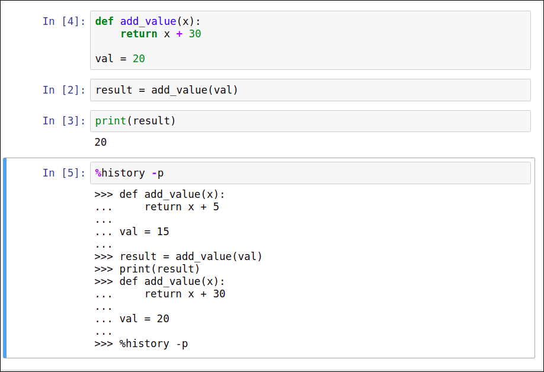

# Some of the most useful keyboard shortcuts in command mode include the following:

- Ctrl + Enter: run selected cell
- Shift + Enter: run cell, select below
- Alt + Enter: run cell, insert below
- ↑: select cell above
- ↓: select cell below
- Enter: enter edit mode
- A: insert cell above
- B: insert cell below
- D,D (press D twice): delete selected cell
- Z: undo cell deletion
- S: save and checkpoint
- Y: convert to code cell
- M: convert to Markdown cell

# Some of the most useful keyboard shortcuts in edit mode include the following:

- Ctrl + Enter: run selected cell
- Shift + Enter: run cell, select below
- Alt + Enter: run cell, insert below
- Up: move cursor up
- Down: move cursor down
- Esc: enter command mode
- Ctrl + A: select all
- Ctrl + Z: undo
- Ctrl + Y: redo
- Ctrl + S: save and checkpoint
- Tab : indent or code completion
- Shift + Tab: tooltip

# Special commands

## `%history -p`

To determine exactly what happened, we can run the special command `%history -p`, which reveals what code ran in what order:

# Markdown syntax

https://commonmark.org/help/

## Creating table

https://www.markdownguide.org/extended-syntax/#tables

https://www.tablesgenerator.com/markdown_tables