# Vector

## In graphic

Design programs Adobe Illustrator and Adobe Animate are vector-based—the artwork you create in these programs are built of a series of points,  lines, curves and shapes that allows the artwork to scale without  quality deterioration, with the added benefit of keeping the size of the file small.

## In NumPy and Pandas

Vectors do operate on elements of an array or series datatype all at once, and also suggests that NumPy relies on the programming language C to do its  vectorization operations

## In mathematics

In mathematics, a vector is something that has magnitude and direction. 

## In programing

In programming and computer science, vectorization is the process of applying operations to an entire set of values at once.

# Vectorization

Vectorized processing, in contrast, may be applied when the order of processing does *not* matter. As suggested above, the built-in methods in NumPy and Pandas are built  with C, which allows for vectorization. Vectorization almost always  works faster as execution time is either constant, or grows at a much  slower rate with a larger number of elements.

## Parallel Processing

- In NumPy and Pandas, separate segments of arrays are processed amongst *all* of the processing cores of your computer. NumPy and Pandas operate on  their arrays and series in parallel, with a segment of each array being  worked on by a different core of your computer’s processor.

## Like-Datatypes

- NumPy arrays are set to a single datatype. Likewise with series in Pandas —  each column will be of type int, float, str, or datetime. This allows  for optimization of data processing, as the contents of these containers are certain to be able to be manipulated in like-manner.
  This is not the case with Python’s built-in container data-types, such as lists,  sets, and dictionaries. These types allow you to store a variety of  types within them at the same time. A list may contain strings, ints,  floats, other lists, etc.

## Locality

- NumPy takes your array matrix and stores it in *one area* of your memory. Contents being local to each other allow them to be operated on faster. 
  In contrast, Python lists may have its contents stored distant from each other within your memory.

## The Mechanism Behind Vectorization — SISD vs SIMD

Modern computer processors contain components that have particular computer  architecture classifications that are relevant to understanding  vectorization:

> SISD — Single Instruction, Single Data
>
> SIMD—Single Instruction, Multiple Data


Visualizing SISD vs SIMD component processes

- SISD: This is the structure for how Python for-loops are processed—One  instruction, per one data element, per one moment in time, in order to  produce one result. The neat thing about this is that it is flexible —  you may implement any operation on your data. The drawback is that it is not optimum for processing large amounts of data.
- SIMD: This is the structure for how NumPy and Pandas vectorizations are processed—One instruction per *any number of* data elements per one moment in time, in order to produce *multiple* results. Contemporary CPUs have a component to process SIMD operations in *each of its cores,* allowing for parallel processing.

# NumPy

NumPy is very popular because it makes writing programs easy. Python is a high-level language, which means you don't have to allocate memory manually. With low-level languages, you have to define memory allocation and processing, which gives you more control over performance, but it also slows down your programming. NumPy gives you the best of both worlds: processing performance without all the allocation.


## **ndarray** and **n-dimensional array**

The core data structure in NumPy is the **ndarray** or **n-dimensional array**. In programming, **array** describes a collection of elements, similar to a list. The word **n-dimensional** refers to the fact that ndarrays can have one or more dimensions. We'll start by working with one-dimensional (1D) ndarrays.


## NumPy behind the scene

Ndarrays and the NumPy library make it easier to manipulate and analyze data. Let's explore why.

Using standard Python, we might consider using **lists of lists** to represent datasets. While lists of lists work with small datasets, they aren't very good for larger data sets.

Let's look at an example involving two columns of data. Each row contains two numbers we want to add together. Using standard Python, we could use a list-of-lists structure to store our data, and we could use **for loops** to iterate over that data:


In each iteration of our loop, Python turns our code into [bytecode](https://en.wikipedia.org/wiki/Bytecode), and the bytecode asks our computer's processor to add the two numbers together:


Our computer would take eight processor cycles to process the eight rows of our data.

The NumPy library takes advantage of a processor feature called **Single Instruction Multiple Data (SIMD)** to process data faster. SIMD allows a processor to perform the same operation on multiple data points in a single processor cycle:


As a result, using NumPy would only take two processor cycles — making it four times faster than standard Python alone. We call this concept of replacing for loops with operations applied to multiple data points at once **vectorization**, and ndarrays make vectorization possible.

We'll explore how vectorization makes our code faster and easier to execute throughout this lesson. On the next screen, we'll practice converting a real-world dataset from a list of lists to an ndarray.

## ndarray.shape

https://docs.scipy.org/doc/numpy-1.12.0/reference/generated/numpy.ndarray.shape.html#numpy.ndarray.shape

it's often useful to know the number of rows and columns in a ndarray. When we can't easily print the entire ndarray, we can use the [`ndarray.shape`](https://docs.scipy.org/doc/numpy-1.12.0/reference/generated/numpy.ndarray.shape.html#numpy.ndarray.shape) attribute instead:

```python
data_ndarray = np.array([[5, 10, 15], 
                         [20, 25, 30]])
print(data_ndarray.shape)
```

```
(2, 3)
```

The data type returned is called a **tuple**. Tuples are very similar to Python lists, but you can't modify them.


## NdArray select 

Next, let's compare working with ndarrays and list of lists to select one or more rows of data:


As we see above, we can select rows in ndarrays very similarly to lists of lists. In reality, what we're seeing is a kind of shortcut. For any 2D array, the full syntax for selecting data is the following:

```
ndarray[row_index,column_index]

# or if you want to select all
# columns for a given set of rows
ndarray[row_index]
```

Copy

. . . where `row_index` defines the location along the row axis and `column_index` defines the location along the column axis.

Like lists, array slicing is from the first specified index up to — but not including — the second specified index. For example, to select the items at index `1`, `2`, and `3`, we'd need to use the slice `[1:4]`.

This is how we select a single item from a 2D ndarray:


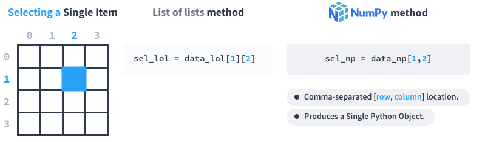


With a list of lists, we use two separate pairs of square brackets back-to-back. With a NumPy ndarray, we use a single pair of brackets with comma-separated row and column locations.

## NdArray select more element

Let's continue by learning how to select one or more columns of data:


With a list of lists, we need to use a for loop to extract specific column(s) and append them back to a new list. With ndarrays, the process is much simpler. We again use single brackets with comma-separated row and column locations, but we use a colon (`:`) for the row locations, which gives us all of the rows.

If we want to select a partial 1D slice of a row or column, we can combine a single value for one dimension with a slice for the other dimension:


Lastly, if we want to select a 2D slice, we can use slices for both dimensions:


 


## NumPy vectorized operations (adding culumns)

As we saw on the previous two screens, NumPy ndarrays allow us to select data much more easily. Beyond this, the selection is much faster when working with **vectorized operations** because the operations apply to multiple data points at once.

When we first talked about vectorized operations, we used the example of adding two columns of data. With data in a list of lists, we'd have to construct a for-loop and add each pair of values from each row individually:


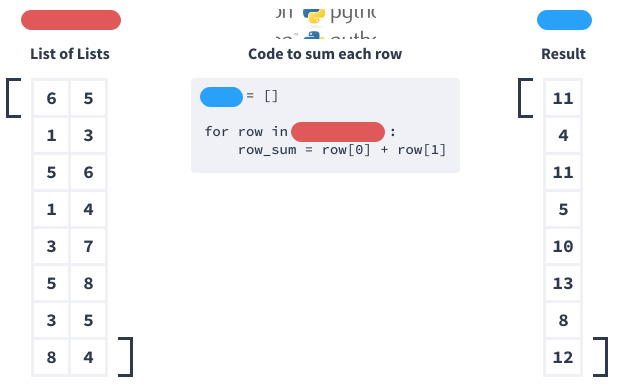


At the time, we only talked about how vectorized operations make this faster; however, vectorized operations also make our code easier to execute. Here's how we would perform the same task above with vectorized operations:

```python
# convert the list of lists to an ndarray
my_numbers = np.array(my_numbers)

# select each of the columns - the result
# of each will be a 1D ndarray
col1 = my_numbers[:,0]
col2 = my_numbers[:,1]

# add the two columns
sums = col1 + col2
```

We could simplify this further if we wanted to:

```
sums = my_numbers[:,0] + my_numbers[:,1]
```

Here are some key observations about this code:

- When we selected each column, we used the syntax `ndarray[:,c]` where `c` is the column index we wanted to select. Like we saw in the previous screen, the colon selects all rows.
- To add the two 1D ndarrays, `col1` and `col2`, we simply use the addition operator (`+`) between them.

Here's what happened behind the scenes:


The result of adding two 1D ndarrays is a 1D ndarray of the same shape (or dimensions) as the original. In this context, we can also call ndarrays **vectors**, a term from linear algebra. We call adding two vectors together **vector addition**.


## NdArray methods

https://docs.scipy.org/doc/numpy-1.14.0/reference/arrays.ndarray.html#calculation


## methods vs functions

| Calculation                                                  | Function Representation | Method Representation             |
| ------------------------------------------------------------ | ----------------------- | --------------------------------- |
| Calculate the minimum value of `trip_mph`                    | `np.min(trip_mph)`      | `trip_mph.min()`                  |
| Calculate the maximum value of `trip_mph`                    | `np.max(trip_mph)`      | `trip_mph.max()`                  |
| Calculate the [mean average](https://en.wikipedia.org/wiki/Mean) value of `trip_mph` | `np.mean(trip_mph)`     | `trip_mph.mean()`                 |
| Calculate the [median average](https://en.wikipedia.org/wiki/Median) value of `trip_mph` | `np.median(trip_mph)`   | There is no ndarray median method |


To remember the right terminology, anything that starts with `np` (e.g., `np.mean()`) is a function, and anything expressed with an object (or variable) name first (e.g., `trip_mph.mean()`) is a method. When both exist, it's up to you to decide which to use, but it's much more common to use the method approach.

## max and min of a particular column or row

Next, we'll calculate statistics for 2D ndarrays. If we use the `ndarray.max()` method on a *2D ndarray* without any additional parameters, it will return a single value, just like a 1D array:


But what if we want to find the maximum value of each row? We need to use the `axis` parameter and specify a value of `1` to indicate that we want to calculate the maximum value for each row.


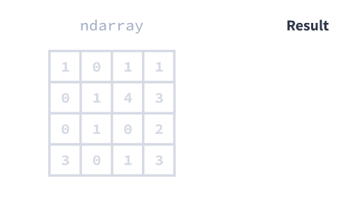


If we want to find the maximum value of each column, we'd use an `axis` value of `0`:


## NumPy datatype

NumPy chose the `float64` type, since it will allow most of the values from our CSV to be read. You can think of NumPy's `float64` type as identical to Python's `float` type (the "64" refers to the number of [bits](https://en.wikipedia.org/wiki/Bit) used to store the underlying value).


## Boolean arrays

Now, let's focus on arguably the most powerful method to index data: the Boolean array. A **Boolean array**, as the name suggests, is an array of Boolean values. We sometimes call Boolean arrays **Boolean vectors** or **Boolean masks**.

You may recall that the Boolean (or `bool`) type is a built-in Python type that can be one of two unique values:

- `True`
- `False`

We also use Boolean values when working with Python [comparison operators](https://docs.python.org/3.4/library/stdtypes.html#comparisons) like `==` (equal) `>` (greater than), `<` (less than), `!=` (not equal). Below are some examples of simple Boolean operations:

```
print(type(3.5) == float)
```

Copy

```
True
```

Copy

```
print(5 > 6)
```

Copy

```
False
```

Copy

When we're talking about vector math, an operation between a ndarray and a single value results in a new ndarray:

```
print(np.array([2,4,6,8]) + 10)
```

Copy

```
[12 14 16 18]
```

Copy

The `+ 10` operation applies to each value in the array.

Now, let's look at what happens when we perform a *Boolean operation* between an ndarray and a single value:

```
print(np.array([2,4,6,8]) < 5)
```

Copy

```
[ True  True False False]
```

Copy

A similar pattern occurs – each value in the array is compared to five. If the value is less than five, `True` is returned. Otherwise, `False` is returned.

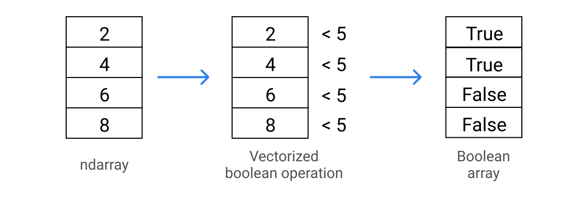


## Boolen indexing

On the previous screen, we learned how to create Boolean arrays using vectorized Boolean operations. Next, we'll learn how to *index* (or select) using Boolean arrays, known as **Boolean indexing**. Let's use one of the examples from the previous screen.

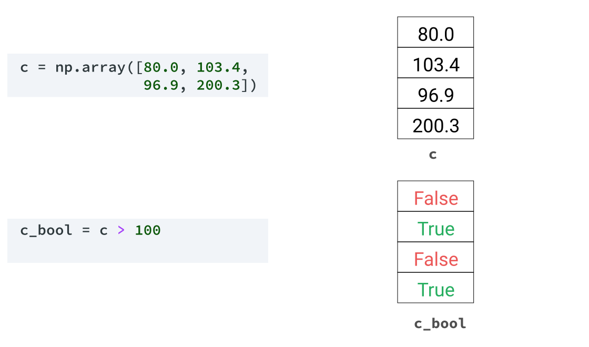

To index using our new Boolean array, we simply insert it in the square brackets, just like we would do with our other selection techniques:

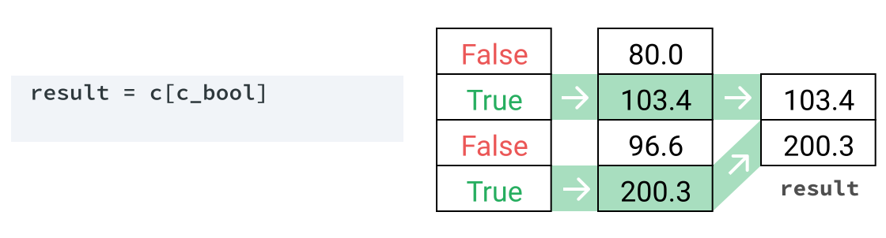

The Boolean array acts as a filter, so that the values corresponding to `True` become part of the result and the values corresponding to `False` are removed.

Let's use Boolean indexing to confirm the number of taxi rides in our data set from the month of January. First, let's select just the `pickup_month` column, which is the second column in the ndarray:

```
pickup_month = taxi[:,1]
```

Copy

Next, we use a Boolean operation to make a Boolean array, where the value `1` corresponds to January:

```
january_bool = pickup_month == 1
```

Copy

Then we use the new Boolean array to select only the items from `pickup_month` that have a value of `1`:

```
january = pickup_month[january_bool]
```

Copy

Finally, we use the `.shape` attribute to determine how many items are in our `january` ndarray, which is equal to the number of taxi rides from the month of January. We'll use `[0]` to extract the value from the tuple returned by `.shape`:

```
january_rides = january.shape[0]
print(january_rides)
```

Copy

```
800
```


## Boolean indexing cd

When working with 2D ndarrays, you can use Boolean indexing in combination with other indexing methods. The only limitation is that the Boolean array must have the same length as the dimension you're indexing. Let's look at some examples:


Because a Boolean array contains no information about its creation, we can use a Boolean array made from just one column of our array to index the entire array.

Let's use what we've learned to analyze the average speed of trips. Let's see if there are any issues with the data. We calculated the average travel speed as follows:

```
# calculate the average speed
trip_mph = taxi[:,7] / (taxi[:,8] / 3600)
```

Copy

Next, we'll check for trips with an average speed greater than 20,000 mph:

```
# create a boolean array for trips with average
# speeds greater than 20,000 mph
trip_mph_bool = trip_mph > 20000

# use the boolean array to select the rows for
# those trips, and the pickup_location_code,
# dropoff_location_code, trip_distance, and
# trip_length columns
trips_over_20000_mph = taxi[trip_mph_bool,5:9]

print(trips_over_20000_mph)
```

Copy

```
[[     2      2     23      1]
 [     2      2   19.6      1]
 [     2      2   16.7      2]
 [     3      3   17.8      2]
 [     2      2   17.2      2]
 [     3      3   16.9      3]
 [     2      2   27.1      4]]
```

Copy

We can see from the last column that most of these are very short rides — all have `trip_length` values of 4 seconds or fewer, which does not reconcile with the trip distances, all of which are more than 16 miles.


## Boolean arrays data manipulation

So far, we've learned how to retrieve data from ndarrays. Next, we'll use the same indexing techniques we've already learned to modify values within an ndarray. Here is the syntax we'll use (in pseudocode):

```
ndarray[location_of_values] = new_value
```

Copy

Let's see how that looks like in actual code. With our 1D array, we can specify one specific index location:

```
a = np.array(['red','blue','black','blue','purple'])
a[0] = 'orange'
print(a)
```

Copy

```
['orange', 'blue', 'black', 'blue', 'purple']
```

Copy

Or we can assign multiple values at once:

```
a[3:] = 'pink'
print(a)
```

Copy

```
['orange', 'blue', 'black', 'pink', 'pink']
```

Copy

With a 2D ndarray, as with a 1D ndarray, we can assign one specific index location:

```
ones = np.array([[1, 1, 1, 1, 1],
                 [1, 1, 1, 1, 1],
                 [1, 1, 1, 1, 1]])
ones[1,2] = 99
print(ones)
```

Copy

```
[[ 1,  1,  1,  1,  1],
 [ 1,  1, 99,  1,  1],
 [ 1,  1,  1,  1,  1]]
```

Copy

We can also assign a whole row...

```
ones[0] = 42
print(ones)
```

Copy

```
[[42, 42, 42, 42, 42],
 [ 1,  1, 99,  1,  1],
 [ 1,  1,  1,  1,  1]]
```


## 2D array values manipulation

Next, we'll look at an example of assignment using a Boolean array with *two* dimensions:


The `b > 4` Boolean operation produces a 2D Boolean array which then controls the values that the assignment applies to.

We can also use a 1D boolean array to perform assignment on a 2D array:

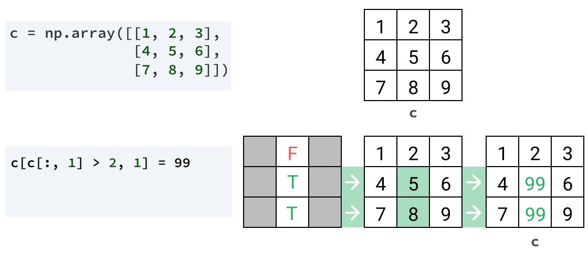

The `c[:,1] > 2` Boolean operation compares just one column's values and produces a 1D Boolean array. We then use that Boolean array as the row index for assignment, and `1` as the column index to specify the second column. Our Boolean array only applies to the second column, while all other values remain unchanged.

The pseudocode syntax for this code is as follows, first using an intermediate variable:

```
bool = array[:, column_for_comparison] == value_for_comparison
array[bool, column_for_assignment] = new_value
```

. . . and then all in one line:

```
array[array[:, column_for_comparison] == value_for_comparison, column_for_assignment] = new_value
```

------


# Pandas

The **pandas** library provides solutions to all of these pain points and more. Pandas is not a replacement for NumPy, but *extension* of NumPy. The underlying code for pandas uses the NumPy library extensively, which means the concepts you've been learning will come in handy as you begin to learn more about pandas.

The primary data structure in pandas is called a [**dataframe**](http://pandas.pydata.org/pandas-docs/stable/generated/pandas.DataFrame.html#pandas.DataFrame). Dataframes are the pandas equivalent of a Numpy 2D ndarray, with a few key differences:

- Axis values can have string **labels**, not just numeric ones.
- Dataframes can contain columns with **multiple data types**: including integer, float, and string.


## head and tail methods

Let's verify this next. To view the first few rows of our dataframe, we can use the [`DataFrame.head()` method](http://pandas.pydata.org/pandas-docs/stable/generated/pandas.DataFrame.head.html). By default, it returns the first five rows of our dataframe. However, it also accepts an optional integer parameter, which specifies the number of rows:

```
f500.head(3)
```

|               | rank | revenues | revenue_change | profits | assets | profit_change |                 ceo |              industry |    sector | previous_rank | country |     hq_location |                website | years_on_global_500_list | employees | total_stockholder_equity |
| ------------: | ---: | -------: | -------------: | ------: | -----: | ------------: | ------------------: | --------------------: | --------: | ------------: | ------: | --------------: | ---------------------: | -----------------------: | --------: | -----------------------: |
|       Walmart |    1 |   485873 |            0.8 | 13643.0 | 198825 |          -7.2 | C. Douglas McMillon | General Merchandisers | Retailing |             1 |     USA | Bentonville, AR | http://www.walmart.com |                       23 |   2300000 |                    77798 |
|    State Grid |    2 |   315199 |           -4.4 |  9571.3 | 489838 |          -6.2 |             Kou Wei |             Utilities |    Energy |             2 |   China |  Beijing, China | http://www.sgcc.com.cn |                       17 |    926067 |                   209456 |
| Sinopec Group |    3 |   267518 |           -9.1 |  1257.9 | 310726 |         -65.0 |           Wang Yupu |    Petroleum Refining |    Energy |             4 |   China |  Beijing, China | http://www.sinopec.com |                       19 |    713288 |                   106523 |

Likewise, we can use the [`DataFrame.tail()` method](http://pandas.pydata.org/pandas-docs/stable/generated/pandas.DataFrame.tail.html) to show us the last rows of our dataframe:

```
f500.tail(3)
```

|                           | rank | revenues | revenue_change | profits | assets | profit_change |                ceo |             industry |             sector | previous_rank | country |         hq_location |                   website | years_on_global_500_list | employees | total_stockholder_equity |
| ------------------------: | ---: | -------: | -------------: | ------: | -----: | ------------: | -----------------: | -------------------: | -----------------: | ------------: | ------: | ------------------: | ------------------------: | -----------------------: | --------: | -----------------------: |
| Wm. Morrison Supermarkets |  498 |    21741 |          -11.3 |   406.4 |  11630 |          20.4 |     David T. Potts | Food and Drug Stores | Food & Drug Stores |           437 | Britain |   Bradford, Britain |  http://www.morrisons.com |                       13 |     77210 |                     5111 |
|                       TUI |  499 |    21655 |           -5.5 |  1151.7 |  16247 |         195.5 |  Friedrich Joussen |      Travel Services |  Business Services |           467 | Germany |    Hanover, Germany |   http://www.tuigroup.com |                       23 |     66779 |                     3006 |
|                AutoNation |  500 |    21609 |            3.6 |   430.5 |  10060 |          -2.7 | Michael J. Jackson |  Specialty Retailers |          Retailing |             0 |     USA | Fort Lauderdale, FL | http://www.autonation.com |                       12 |     26000 |                     2310 |


## dtypes

We can use the [`DataFrame.dtypes` attribute](http://pandas.pydata.org/pandas-docs/stable/generated/pandas.DataFrame.dtypes.html#pandas.DataFrame.dtypes) (similar to NumPy's [`ndarray.dtype` attribute](http://docs.scipy.org/doc/numpy-1.14.2/reference/generated/numpy.ndarray.dtype.html#numpy.ndarray.dtype)) to return information about the types of each column. Let's look at an example using a selection of data stored using the variable name `f500_selection`.


```python
print(f500_selection.dtypes)
```

```python
rank          int64
revenues      int64
profits     float64
country      object
dtype: object
```

We can see three different data types, or **dtypes**.

You may recognize the `float64` dtype from our work in NumPy. Pandas uses NumPy dtypes for numeric columns, including `integer64`. There is also a type we haven't seen before, `object`, which is used for columns that have data that doesn't fit into any other dtypes. This is normally used for columns containing string values.

When we import data, pandas attempts to guess the correct dtype for each column. Generally, pandas does well with this, which means we don't need to worry about specifying dtypes every time we start to work with data.

If we wanted an overview of all the dtypes used in our dataframe, along with its shape and other information, we could use the [`DataFrame.info()` method](http://pandas.pydata.org/pandas-docs/stable/generated/pandas.DataFrame.info.html#pandas.DataFrame.info). Note that `DataFrame.info()` prints the information, rather than returning it, so we can't assign it to a variable.

## select loc

Since our axis in pandas have labels, we can select data using those labels — unlike in NumPy, where we needed to know the exact index location. To do this, we can use the [`DataFrame.loc[\]` attribute](http://pandas.pydata.org/pandas-docs/stable/generated/pandas.DataFrame.loc.html#pandas.DataFrame.loc). The syntax for `DataFrame.loc[]` is:

```
df.loc[row_label, column_label]
```

Copy

Notice that we use brackets (`[]`) instead of parentheses (`()`) when selecting by location.

Throughout our pandas lessons, you'll see `df` used in code examples as shorthand for a dataframe object. We use this convention because it's also used extensively in the official pandas documentation — getting used to reading it is important.

Let's look at an example next. We'll again work with just a selection of data stored as `f500_selection`:


Let's select a single column by specifying a **single label**:


Notice we used `:` to specify that we wish to select all rows. Also note that the new dataframe has the same row labels as the original.

We can use the following shortcut to select a single column:

```python
rank_col = f500_selection["rank"]
print(rank_col)
```

```python
Walmart                     1
State Grid                  2
Sinopec Group               3
China National Petroleum    4
Toyota Motor                5
Name: rank, dtype: int64
```

This style of selecting columns is very common. We will use it throughout our Dataquest lessons.

## **series object**

On the last screen, we observed that when you select just one column of a dataframe, you get a new pandas type: a **series object**. Series is the pandas type for one-dimensional objects. Anytime you see a 1D pandas object, it will be a series. Anytime you see a 2D pandas object, it will be a dataframe.

In fact, you can think of a dataframe as a collection of series objects, which is similar to how pandas stores the data behind the scenes.


## select by label

Next, let's learn how to select multiple columns. As a reminder, here's the selection of data we're working with:


Below, we use a **list of labels** to select specific columns:


Since the object returned is two-dimensional, it's a *dataframe*, not a series. Instead of `df.loc[:,["col1","col2"]]`, you can also use `df[["col1", "col2"]]` to select specific columns.

Let's finish by using **a slice object with labels** to select specific columns:


We again get a dataframe object, with all of the columns from the first up until — **and including** — the last column in our slice. There is no shortcut for selecting column slices.

A summary of the techniques we've learned so far is below:


Select by LabelExplicit SyntaxCommon ShorthandSingle column

`df.loc[:,"col1"]``df["col1"]`List of columns`df.loc[:,["col1", "col7"]]``df[["col1", "col7"]]`Slice of columns`df.loc[:,"col1":"col4"]`

## select rows

Now that we've learned how to select columns by label, let's learn how to select *rows* using the labels of the **index** axis:


We use the same syntax to select rows from a dataframe as we do for columns:

```
df.loc[row_label, column_label]
```

Copy

We'll again use a selection of our data, stored as the variable `f500_selection`:


**Select a single row**

```
single_row = f500_selection.loc["Sinopec Group"]
print(type(single_row))
print(single_row)
```

Copy

```
class 'pandas.core.series.Series'

rank             3
revenues    267518
profits     1257.9
country      China
Name: Sinopec Group, dtype: object
```

Copy

Note the object returned is a *series* because it is one-dimensional. Since this series has to store integer, float, and string values, pandas uses the `object` dtype, since none of the numeric types could cater for all values.

**Select a list of rows**

```
list_rows = f500_selection.loc[["Toyota Motor", "Walmart"]]
print(type(list_rows))
print(list_rows)
```

Copy

```
class 'pandas.core.frame.DataFrame'

              rank  revenues  profits country
Toyota Motor     5    254694  16899.3   Japan
Walmart          1    485873  13643.0     USA
```

Copy

**Select a slice object with labels**

For selection using slices, we can use the shortcut below. This is the reason we can't use this shortcut for columns - because it's reserved for use with rows:

```
slice_rows = f500_selection["State Grid":"Toyota Motor"]
print(type(slice_rows))
print(slice_rows)
```

Copy

```
class 'pandas.core.frame.DataFrame'

                          rank  revenues  profits country
State Grid                   2    315199   9571.3   China
Sinopec Group                3    267518   1257.9   China
China National Petroleum     4    262573   1867.5   China
Toyota Motor                 5    254694  16899.3   Japan
```


## Series.value_counts()

Since series and dataframes are two distinct objects, they have their own unique methods. Let's look at an example of a series method next - the [`Series.value_counts()` method](http://pandas.pydata.org/pandas-docs/stable/generated/pandas.Series.value_counts.html). This method displays each unique non-null value in a column and their counts in order.

First, we'll select just one column from the `f500` dataframe:

```python
sectors = f500["sector"]
print(type(sectors))
```

```
class 'pandas.core.series.Series'
```

Next, we'll substitute "Series" in `Series.value_counts()` with the name of our `sectors` series, like below:

```python
sectors_value_counts = sectors.value_counts()
print(sectors_value_counts)
```

```python
Financials                       118
Energy                            80
Technology                        44
Motor Vehicles & Parts            34
Wholesalers                       28
Health Care                       27
Food & Drug Stores                20
Transportation                    19
Telecommunications                18
Retailing                         17
Food, Beverages & Tobacco         16
Materials                         16
Industrials                       15
Aerospace & Defense               14
Engineering & Construction        13
Chemicals                          7
Media                              3
Household Products                 3
Hotels, Restaurants & Leisure      3
Business Services                  3
Apparel                            2
Name: sector, dtype: int64
```

In the resulting series, we can see each unique non-null value in the column and their counts.

Let's see what happens when we use the `Series.value_counts()` method with a dataframe. First, we'll select the `sector` and `industry` columns to create a dataframe named `sectors_industries`:

```
sectors_industries = f500[["sector", "industry"]]
print(type(sectors_industries))
```

```
< class 'pandas.core.frame.DataFrame' >
```

Then, we'll use the `value_counts()` method:

```
si_value_counts = sectors_industries.value_counts()
print(si_value_counts)
```

Since `value_counts()` is a *series only* method, we get the following error:

```
AttributeError: 'DataFrame' object has no attribute 'value_counts'
```


## select summary

| Select by Label                 | Explicit Syntax             | Shorthand Convention   |
| ------------------------------- | --------------------------- | ---------------------- |
| Single column from dataframe    | `df.loc[:,"col1"]`          | `df["col1"]`           |
| List of columns from dataframe  | `df.loc[:,["col1","col7"]]` | `df[["col1","col7"]]`  |
| Slice of columns from dataframe | `df.loc[:,"col1":"col4"]`   |                        |
| Single row from dataframe       | `df.loc["row4"]`            |                        |
| List of rows from dataframe     | `df.loc[["row1", "row8"]]`  |                        |
| Slice of rows from dataframe    | `df.loc["row3":"row5"]`     | `df["row3":"row5"]`    |
| Single item from series         | `s.loc["item8"]`            | `s["item8"]`           |
| List of items from series       | `s.loc[["item1","item7"]]`  | `s[["item1","item7"]]` |
| Slice of items from series      | `s.loc["item2":"item4"]`    | `s["item2":"item4"]`   |


## describe() method

Next, we'll learn another method that can help us more quickly investigate this issue - the [`Series.describe()` method](http://pandas.pydata.org/pandas-docs/stable/generated/pandas.Series.describe.html#pandas.Series.describe). This method tells us how many non-null values are contained in the series, along with the mean, minimum, maximum, and other statistics we'll learn about later in this path.

Let's look at an example:

```python
assets = f500["assets"]
print(assets.describe())
```

```python
count    5.000000e+02
mean     2.436323e+05
std      4.851937e+05
min      3.717000e+03
25%      3.658850e+04
50%      7.326150e+04
75%      1.805640e+05
max      3.473238e+06
Name: assets, dtype: float64
```

Copy

You may notice that the values in the code segment above look a little bit different. Because the values for this column are too long to neatly display, pandas has displayed them in **E-notation**, a type of [scientific notation](https://en.wikipedia.org/wiki/Scientific_notation):

| Original Notation | Expanded Formula     | Result     |
| ----------------- | -------------------- | ---------- |
| `5.000000E+02`    | `5.000000 * 10 ** 2` | `500`      |
| `2.436323E+05`    | `2.436323 * 10 ** 5` | `243632.3` |

If we use `describe()` on a column that contains non-numeric values, we get some different statistics. Let's look at an example:

```python
country = f500["country"]
print(country.describe())
```

```python
count     500
unique     34
top       USA
freq      132
Name: country, dtype: object
```

The first statistic, `count`, is the same as for numeric columns, showing us the number of non-null values. The other three statistics are new:

- `unique`: Number of unique values in the series. In this case, it tells us that there are 34 different countries represented in the Fortune 500.
- `top`: Most common value in the series. The USA is the country that headquarters the most Fortune 500 companies.
- `freq`: Frequency of the most common value. Exactly 132 companies from the Fortune 500 are headquartered in the USA.


## dataframe statistics methods usage

Unlike their series counterparts, dataframe methods require an *axis parameter* so we know which axis to calculate across. While you can use integers to refer to the first and second axis, pandas dataframe methods also accept the strings `"index"` and `"columns"` for the axis parameter:

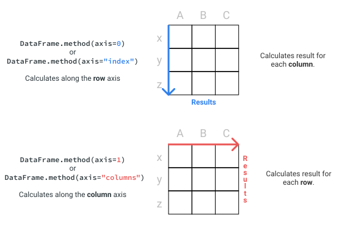``

For instance, if we wanted to find the median (middle) value for the `revenues` and `profits` columns, we could use the following code:

```python
medians = f500[["revenues", "profits"]].median(axis=0)
# we could also use .median(axis="index")
print(medians)
```

```python
revenues    40236.0
profits      1761.6
dtype: float64
```

In fact, the default value for the axis parameter with these methods is `axis=0`. We could have just used the `median()` method without a parameter to get the same result!

get the max value for each numeric column

```python
max_f500 = f500.max(numeric_only=True)
```


## value assignment

Let's start by learning **assignment,** starting with the following example:

```
top5_rank_revenue = f500[["rank", "revenues"]].head()
print(top5_rank_revenue)
```

Copy

```python
_                         rank  revenues
Walmart                      1    485873
State Grid                   2    315199
Sinopec Group                3    267518
China National Petroleum     4    262573
Toyota Motor                 5    254694
```

```python
top5_rank_revenue["revenues"] = 0
print(top5_rank_revenue)
```

```python
_                        rank  revenues
Walmart                      1         0
State Grid                   2         0
Sinopec Group                3         0
China National Petroleum     4         0
Toyota Motor                 5         0
```

Just like in NumPy, the same techniques that we use to select data could be used for assignment. When we selected a whole column by label and used assignment, we assigned the value to every item in that column.

By providing labels for both axes, we can assign them to a single value within our dataframe.

```python
top5_rank_revenue.loc["Sinopec Group", "revenues"] = 999
print(top5_rank_revenue)
```

```python
_                         rank  revenues
Walmart                      1         0
State Grid                   2         0
Sinopec Group                3       999
China National Petroleum     4         0
Toyota Motor                 5         0
```


## Boolean indexing

Let's look at two examples of how boolean indexing works in pandas. For our example, we'll work with this dataframe of people and their favorite numbers:


Let's check which people have a favorite number of **8**. First, we perform a vectorized boolean operation that produces a boolean series:

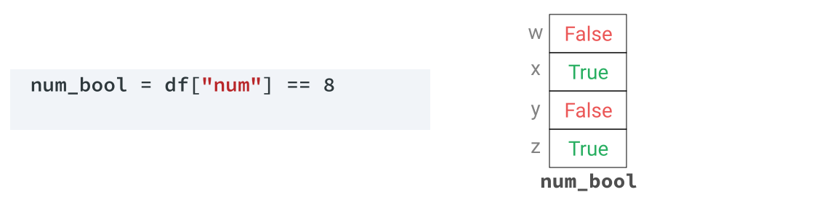

We can use that series to index the whole dataframe, leaving us with the rows that correspond only to people whose favorite number is **8**:


Note that we didn't use `loc[]`. This is because boolean arrays use the same shortcut as slices to select along the index axis. We can also use the boolean series to index just one column of the dataframe:


In this case, we used `df.loc[]` to specify both axes.


## Boolean indexing and value assignment

Let's look at an example of how we combine these two operations together. For our example, we'll change the `'Motor Vehicles & Parts'` values in the `sector` column to `'Motor Vehicles and Parts'`– i.e. we will change the ampersand (`&`) to `and`.

First, we create a boolean series by comparing the values in the sector column to `'Motor Vehicles & Parts'`

```
ampersand_bool = f500["sector"] == "Motor Vehicles & Parts"
```

Copy

Next, we use that boolean series and the string `"sector"` to perform the assignment.

```
f500.loc[ampersand_bool,"sector"] = "Motor Vehicles and Parts"
```

Copy

Just like we saw in the NumPy lesson earlier in this course, we can remove the intermediate step of creating a boolean series, and combine everything into one line. This is the most common way to write pandas code to perform assignment using boolean arrays:

```
f500.loc[f500["sector"] == "Motor Vehicles & Parts","sector"] = "Motor Vehicles and Parts"
```

Copy

Now we can follow this pattern to replace the values in the `previous_rank` column. We'll replace these values with `np.nan`. Just like in NumPy, `np.nan` is used in pandas to represent values that can't be represented numerically, most commonly missing values.

To make comparing the values in this column before and after our operation easier, we've added the following line of code to the `script.py` codebox:

```
prev_rank_before = f500["previous_rank"].value_counts(dropna=False).head()
```

Copy

This uses `Series.value_counts()` and [`Series.head()`](http://pandas.pydata.org/pandas-docs/stable/reference/api/pandas.Series.head.html) to display the 5 most common values in the `previous_rank` column, but adds an additional `dropna=False` parameter, which stops the `Series.value_counts()` method from excluding null values when it makes its calculation, as shown in the [`Series.value_counts()` documentation](http://pandas.pydata.org/pandas-docs/stable/generated/pandas.Series.value_counts.html#pandas.Series.value_counts).


## select by index

Just like in NumPy, we can also use *integer* positions to select data using [`Dataframe.iloc[\]`](http://pandas.pydata.org/pandas-docs/stable/generated/pandas.DataFrame.iloc.html) and [`Series.iloc[\]`](http://pandas.pydata.org/pandas-docs/stable/generated/pandas.Series.iloc.html). It's easy to get `loc[]` and `iloc[]` confused at first, but the easiest way is to remember the first letter of each method:

- **l**oc: **l**abel based selection
- **i**loc: **integer** position based selection

Using `iloc[]` is almost identical to indexing with NumPy, with integer positions starting at `0` like ndarrays and Python lists. Let's look at how we would perform the selection above using `iloc[]`:

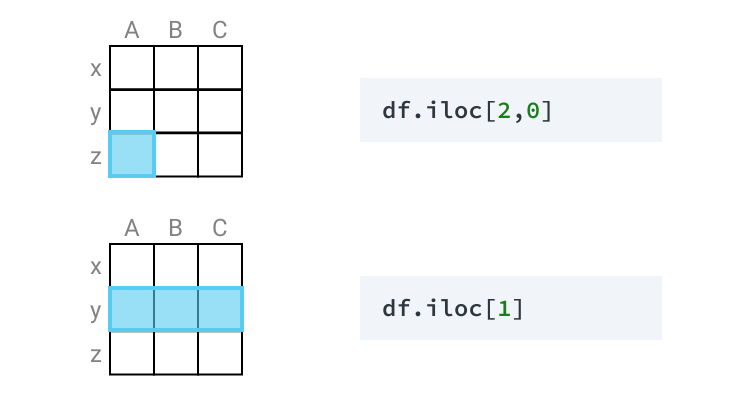

As you can see, `DataFrame.iloc[]` behaves similarly to `DataFrame.loc[]`. The full syntax for `DataFrame.iloc[]`, in pseudocode, is:

```
df.iloc[row_index, column_index]
```


## select slicing

Let's say we wanted to select just the first column from our `f500` dataframe. To do this, we use `:` (a colon) to specify all rows, and then use the integer `0` to specify the first column:

```
first_column = f500.iloc[:,0]
print(first_column)
```

Copy

```
0                        Walmart
1                     State Grid
2                  Sinopec Group
...
497    Wm. Morrison Supermarkets
498                          TUI
499                   AutoNation
Name: company, dtype: object
```

Copy

To specify a positional slice, we can take advantage of the same shortcut that we use with labels. Here's how we would select the rows between index positions one to four (inclusive):

```
second_to_sixth_rows = f500[1:5]
```

Copy

```
company  rank  revenues ... employees  total_stockholder_equity
1         State Grid     2    315199 ...    926067                    209456
2      Sinopec Group     3    267518 ...    713288                    106523
3  China National...     4    262573 ...   1512048                    301893
4       Toyota Motor     5    254694 ...    364445                    157210
```

Copy

In the example above, the row at index position `5` is not included, just as if we were slicing with a Python list or NumPy ndarray. Recall that `loc[]` handles slicing differently:

- With `loc[]`, the ending slice **is** included.
- With `iloc[]`, the ending slice **is not** included.

## iloc select summary

The table below summarizes how we can use `DataFrame.iloc[]` and `Series.iloc[]` to select by integer position:

| Select by integer position      | Explicit Syntax      | Shorthand Convention |
| ------------------------------- | -------------------- | -------------------- |
| Single column from dataframe    | `df.iloc[:,3]`       |                      |
| List of columns from dataframe  | `df.iloc[:,[3,5,6]]` |                      |
| Slice of columns from dataframe | `df.iloc[:,3:7]`     |                      |
| Single row from dataframe       | `df.iloc[20]`        |                      |
| List of rows from dataframe     | `df.iloc[[0,3,8]]`   |                      |
| Slice of rows from dataframe    | `df.iloc[3:5]`       | `df[3:5]`            |
| Single items from series        | `s.iloc[8]`          | `s[8]`               |
| List of item from series        | `s.iloc[[2,8,1]]`    | `s[[2,8,1]]`         |
| Slice of items from series      | `s.iloc[5:10]`       | `s[5:10]`            |

## iloc vs loc

|      | company               | rank | previous_rank |
| ---- | --------------------- | ---- | ------------- |
| 48   | Legal & General Group | 49   | NaN           |
| 90   | Uniper                | 91   | NaN           |
| 123  | Dell Technologies     | 124  | NaN           |

Above, we can see that index axis *labels* for this selection are `48`, `90`, and `123`.

If we wanted to select the first company from our new `null_previous_rank` dataframe by *integer position*, we can use `DataFrame.iloc[]`:

```
first_null_prev_rank = null_previous_rank.iloc[0]
print(first_null_prev_rank)
```

Copy

```
company          Legal & General Group
rank                                49
previous_rank                      NaN
Name: 48, dtype: object
```

Copy

Let's see what happens when we use `DataFrame.loc[]` instead of `DataFrame.iloc[]`:

```
first_null_prev_rank = null_previous_rank.loc[0]
```

Copy

```
---------------------------------------------------------------------------
KeyError                                  Traceback (most recent call last)
/python3.4/site-packages/pandas/core/indexing.py in _has_valid_type(self, key, axis)
   1410                 if key not in ax:
-> 1411                     error()
   1412             except TypeError as e:

/python3.4/site-packages/pandas/core/indexing.py in error()
   1405                 raise KeyError("the label [%s] is not in the [%s]" %
-> 1406                                (key, self.obj._get_axis_name(axis)))
   1407 

KeyError: 'the label [0] is not in the [index]'
```

Copy

We get an error, telling us that the `the label [0] is not in the [index]` (the actual traceback for this error is much longer than this). Recall that `DataFrame.loc[]` is used for *label* based selection:

- **l**oc: **l**abel based selection
- **i**loc: **integer** position based selection

Because there is no row with a `0` label in the index, we got the error above. If we wanted to select a row using `loc[]`, we'd have to use the integer label for the first row — `48`.

Always think carefully about whether you want to select by *label* or *integer position*. Use `DataFrame.loc[]` or `DataFrame.iloc[]` accordingly.


## adding tow dataframes with different shape

We can then create a `rank_change` column by subtracting the `rank` column from the `previous_rank` column:

```
rank_change = previously_ranked["previous_rank"] - previously_ranked["rank"]
print(rank_change.shape)
print(rank_change.tail(3))
```

Copy

```
(467,)
496   -70.0
497   -61.0
498   -32.0
dtype: float64
```

Copy

Above, we can see that our `rank_change` series has 467 rows. Since the last integer index label is 498, we know that our index labels no longer align with the integer positions.

Suppose now we decided to add the `rank_change` series to the `f500` dataframe as a new column. Its index labels no longer match the index labels in `f500`, so how could this be done?

Another powerful aspect of pandas is that almost every operation will **align on the index labels**. Let's look at an example – below we have a dataframe named `food` and a series named `alt_name`:


The `food` dataframe and the `alt_name` series not only have a different number of items, but they also only have two of the same index labels - `corn` and `eggplant` - and they're in different orders. If we wanted to add `alt_name` as a new column in our `food` dataframe, we can use the following code:

```
food["alt_name"] = alt_name
```

Copy

When we do this, pandas will ignore the order of the `alt_name` series, and align on the index labels:


Pandas will also:

- Discard any items that have an index that doesn't match the dataframe (like `arugula`).
- Fill any remaining rows with `NaN`.

Below is the result:


The pandas library will align on index at every opportunity, no matter if our index labels are strings or integers - this makes working with data from different sources or working with data when we have removed, added, or reordered rows much easier than it would be otherwise.


## combine arrays with boolean indexing

Boolean indexing is a powerful tool which allows us to select or exclude parts of our data based on their values. However, to answer more complex questions, we need to learn how to combine boolean arrays.

To recap, boolean arrays are created using any of the Python standard **comparison operators**: `==` (equal), `>` (greater than), `<` (less than), `!=` (not equal).

We combine boolean arrays using **boolean operators**. In Python, these boolean operators are `and`, `or`, and `not`. In pandas, the operators are slightly different:

| pandas  | Python equivalent | Meaning                                             |
| ------- | ----------------- | --------------------------------------------------- |
| `a & b` | `a and b`         | `True` if both `a` and `b` are `True`, else `False` |
| `a | b` | `a or b`          | `True` if either `a` or `b` is `True`               |
| `~a`    | `not a`           | `True` if `a` is `False`, else `False`              |


Let's look at an example using `f500_sel`, a small selection of our `f500` dataframe:


Suppose we wanted to find the companies in `f500_sel` with more than 265 billion in revenue that are headquartered in China. We'll start by performing two boolean comparisons to produce two separate boolean arrays (the revenue column is already in millions).


We then use the `&` operator to combine the two boolean arrays using boolean "and" logic:

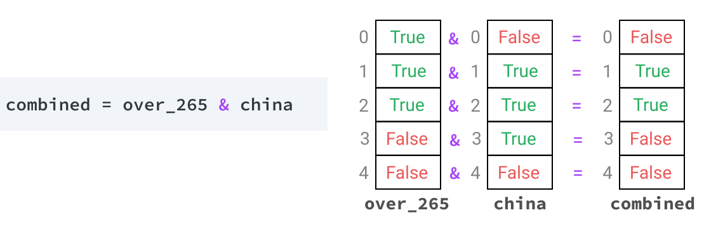

Lastly, we use the combined boolean array to perform selection on our dataframe:


The result gives us two companies from `f500_sel` that are both Chinese and have over 265 billion in revenue.


## boolean operators table

| pandas  | Python equivalent | Meaning                                             |
| ------- | ----------------- | --------------------------------------------------- |
| `a & b` | `a and b`         | `True` if both `a` and `b` are `True`, else `False` |
| `a | b` | `a or b`          | `True` if either `a` or `b` is `True`               |
| `~a`    | `not a`           | `True` if `a` is `False`, else `False`              |


## sort values

Then, we can use the [`DataFrame.sort_values()` method](http://pandas.pydata.org/pandas-docs/stable/generated/pandas.DataFrame.sort_values.html) to sort the rows on the `employees` column. To do so, we pass the column name to the method:

```
sorted_rows = selected_rows.sort_values("employees")
print(sorted_rows[["company", "country", "employees"]].head())
```

Copy

```
_                               company country  employees
204                         Noble Group   China       1000
458             Yango Financial Holding   China      10234
438  China National Aviation Fuel Group   China      11739
128                         Tewoo Group   China      17353
182            Amer International Group   China      17852
```

Copy

By default, the `sort_values()` method will sort the rows in *ascending* order — from smallest to largest.

To sort the rows in *descending* order instead, so the company with the largest number of employees appears first, we can set the `ascending` parameter to `False`:

```
sorted_rows = selected_rows.sort_values("employees", ascending=False)
print(sorted_rows[["company", "country", "employees"]].head())
```

Copy

```
_                       company country  employees
3      China National Petroleum   China    1512048
118            China Post Group   China     941211
1                    State Grid   China     926067
2                 Sinopec Group   China     713288
37   Agricultural Bank of China   China     501368
```

Copy

Now, we can see that the Chinese company that employs the most people is China National Petroleum


## aggregation

Aggregation is where we apply a statistical operation to groups of our data. Let's say that we wanted to calculate the average revenue for each country in the data set. Our process might look like this:

- Identify each unique country in the data set.
- For each country:
  - Select only the rows corresponding to that country.
  - Calculate the average revenue for those rows.

To identify the unique countries, we can use the [`Series.unique()` method](http://pandas.pydata.org/pandas-docs/stable/generated/pandas.Series.unique.html). This method returns an array of unique values from any series. Then, we can loop over that array and perform our operation. Here's what that looks like:

```python
# Create an empty dictionary to store the results
avg_rev_by_country = {}

# Create an array of unique countries
countries = f500["country"].unique()

# Use a for loop to iterate over the countries
for c in countries:
    # Use boolean comparison to select only rows that
    # correspond to a specific country
    selected_rows = f500[f500["country"] == c]
    # Calculate the mean average revenue for just those rows
    mean = selected_rows["revenues"].mean()
    # Assign the mean value to the dictionary, using the
    # country name as the key
    avg_rev_by_country[c] = mean
```

Copy

The resulting dictionary is below (we've shown just the first few keys):

```python
{'USA': 64218.371212121216,
 'China': 55397.880733944956,
 'Japan': 53164.03921568627,
 'Germany': 63915.0,
 'Netherlands': 61708.92857142857,
 'Britain': 51588.708333333336,
 'South Korea': 49725.6,
 ...
 }
```


## top employer by country


```python
top_employer_by_country = {}

unique_countries = f500["country"].unique()

for country in unique_countries:
    selected_rows = f500[f500["country"] == country]
    first_selected_row = selected_rows.sort_values("employees", ascending=False).iloc[0]
    top_employer_by_country[country] = first_selected_row["company"]
    
```


------


# Data  Cleaning

## remove whitespace from column names

```python
new_columns = []

for column in laptops.columns:
    new_columns.append(column.strip())
    
laptops.columns = new_columns 
```


## example function to clear columns labels

```python
def clean_column(col):
    if col.find('Operating System') != -1:
        col = col.replace('Operating System', 'os')
    col = col.strip()
    col = col.replace(" ", "_")
    col = col.replace("(","")
    col = col.replace(")","")
    col = col.lower()
return col  
```


## convert string data to numeric data

Let's convert the `screen_size` column to numeric next. Whenever we convert text to numeric data, we can follow this data cleaning workflow:

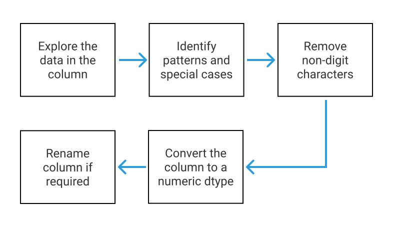

The first step is to **explore the data**. One of the best ways to do this is to use the [`Series.unique()` method](http://pandas.pydata.org/pandas-docs/stable/generated/pandas.Series.unique.html) to view all of the unique values in the column:

```python
print(laptops["screen_size"].dtype)
print(laptops["screen_size"].unique())
```

```python
object

['13.3"', '15.6"', '15.4"', '14.0"', '12.0"', '11.6"',
 '17.3"', '10.1"', '13.5"', '12.5"', '13.0"', '18.4"',
 '13.9"', '12.3"', '17.0"', '15.0"', '14.1"',
 '11.3"']
```

Our next step is to **identify patterns and special cases**. We can observe the following:

- All values in this column follow the same pattern - a series of digit and period characters, followed by a quote character (`"`).
- There are no special cases. Every value matches the same pattern.
- We'll need to convert the column to a `float` dtype, as the `int` dtype won't be able to store the decimal values.


## remove str characters from vectorized data

The pandas library contains dozens of [vectorized string methods](https://pandas.pydata.org/pandas-docs/stable/user_guide/text.html#method-summary) we can use to manipulate text data, many of which perform the same operations as Python string methods. Most vectorized string methods are available using the [`Series.str` accessor](http://pandas.pydata.org/pandas-docs/stable/api.html#string-handling), which means we can access them by adding `str` between the series name and the method name:


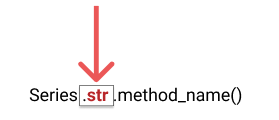


In this case, we can use the [`Series.str.replace()` method](http://pandas.pydata.org/pandas-docs/stable/generated/pandas.Series.str.replace.html), which is a vectorized version of the Python `str.replace()` method we used in the previous screen, to remove all the quote characters from every string in the `screen_size` column:

```python
laptops["screen_size"] = laptops["screen_size"].str.replace('"','')
print(laptops["screen_size"].unique())
```

```python
['13.3', '15.6', '15.4', '14.0', '12.0', '11.6', '17.3',
 '10.1', '13.5', '12.5', '13.0', '18.4', '13.9', '12.3',
 '17.0', '15.0', '14.1', '11.3']
```


## convert to int or float

```python
laptops["ram"] = laptops["ram"].str.replace('GB','').astype(int)
```


## rename column

To stop us from losing information that helps us understand the data, we can use the [`DataFrame.rename()` method](http://pandas.pydata.org/pandas-docs/stable/generated/pandas.DataFrame.rename.html) to rename the column from `screen_size` to `screen_size_inches`.

Below, we specify the `axis=1` parameter so pandas knows that we want to rename labels in the column axis:

```python
laptops.rename({"screen_size": "screen_size_inches"}, axis=1, inplace=True)
print(laptops.dtypes)
```

```python
manufacturer           object
model_name             object
category               object
screen_size_inches    float64
screen                 object
cpu                    object
ram                    object
storage                object
gpu                    object
os                     object
os_version             object
weight                 object
price_euros            object
dtype: object
```

Note that we can either use `inplace=True` or assign the result back to the dataframe - both will give us the same results.


## extract part of the string and assign to a new column

Sometimes, it can be useful to extract non-numeric values from within strings. Let's look at the first five values from the `gpu` (graphics processing unit) column:

```python
print(laptops["gpu"].head())
```

```python
0    Intel Iris Plus Graphics 640
1          Intel HD Graphics 6000
2           Intel HD Graphics 620
3              AMD Radeon Pro 455
4    Intel Iris Plus Graphics 650
Name: gpu, dtype: object
```

The information in this column seems to be a manufacturer (Intel, AMD) followed by a model name/number. Let's extract the manufacturer by itself so we can find the most common ones.

Because each manufacturer is followed by a whitespace character, we can use the [`Series.str.split()` method](http://pandas.pydata.org/pandas-docs/stable/generated/pandas.Series.str.split.html) to extract this data:

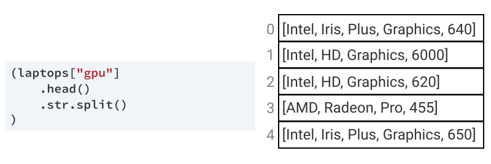

This method splits each string on the whitespace; the result is a series containing individual Python lists. Also note that we used parentheses to method chain over multiple lines, which makes our code easier to read.

Just like with lists and ndarrays, we can use bracket notation to access the elements in each list in the series. With series, however, we use the `str` accessor followed by `[]` (brackets):

```python
print(laptops["gpu"].head().str.split().str[0])
```

Above, we used `0` to select the *first* element in each list. Below is the result:

```python
0    Intel
1    Intel
2    Intel
3      AMD
4    Intel
Name: gpu, dtype: object
```

Let's use this technique to extract the manufacturer from the `cpu` column as well. Here are the first 5 rows of the `cpu` column:

```python
print(laptops["cpu"].head())
```

```python
0          Intel Core i5 2.3GHz
1          Intel Core i5 1.8GHz
2    Intel Core i5 7200U 2.5GHz
3          Intel Core i7 2.7GHz
4          Intel Core i5 3.1GHz
Name: cpu, dtype: object
```


## using map() to correct column values

If your data has been scraped from a webpage or if there was manual data entry involved at some point, you may end up with inconsistent values. Let's look at an example from our `os` column:

```python
print(laptops["os"].value_counts())
```

```python
Windows      1125
No OS          66
Linux          62
Chrome OS      27
macOS          13
Mac OS          8
Android         2
Name: os, dtype: int64
```

We can see that there are two variations of the Apple operating system — macOS — in our dataset: `Mac OS` and `macOS`. One way we can fix this is with the [`Series.map()` method](http://pandas.pydata.org/pandas-docs/stable/generated/pandas.Series.map.html). The `Series.map()` method is ideal when we want to change multiple values in a column, but we'll use it now as an opportunity to learn how the method works.

The most common way to use `Series.map()` is with a dictionary. Let's look at an example using a series of misspelled fruit:

```python
print(s)
```

```python
0       pair
1     oranje
2    bananna
3     oranje
4     oranje
5     oranje
dtype: object
```

We'll create a dictionary called `corrections` and pass that dictionary as an argument to `Series.map()`:

```python
corrections = {
    "pair": "pear",
    "oranje": "orange",
    "bananna": "banana"
}
s = s.map(corrections)
print(s)
```

```python
0       pear
1     orange
2     banana
3     orange
4     orange
5     orange
dtype: object
```

We can see that each of our corrections were made across our series. One important thing to remember with `Series.map()` is that if a value from your series doesn't exist as a key in your dictionary, it will convert that value to `NaN`. Let's see what happens when we run map one more time:

```python
s = s.map(corrections)
print(s)
```

```python
0    NaN
1    NaN
2    NaN
3    NaN
4    NaN
5    NaN
dtype: object
```

Because none of the corrected values in our series existed as keys in our dictionary, all values became `NaN`! It's a very common occurence, especially when working in Jupyter notebook, where you can easily re-run cells.


## dropping null values

In pandas, null values will be indicated by either `NaN` or `None`.

Recall that we can use the [`DataFrame.isnull()` method](http://pandas.pydata.org/pandas-docs/stable/generated/pandas.DataFrame.isnull.html) to identify missing values, which returns a boolean dataframe. We can then use the `DataFrame.sum()` method to give us a count of the `True` values for each column:

```python
print(laptops.isnull().sum())
```

```python
manufacturer            0
model_name              0
category                0
screen_size_inches      0
screen                  0
cpu                     0
ram_gb                  0
storage                 0
gpu                     0
os                      0
os_version            170
weight_kg               0
price_euros             0
cpu_manufacturer        0
screen_resolution       0
cpu_speed               0
dtype: int64
```

It's now clear that we have only one column with null values, `os_version`, which has 170 missing values.

There are a few options for handling missing values:

- Remove any rows that have missing values.
- Remove any columns that have missing values.
- Fill the missing values with some other value.
- Leave the missing values as is.

The first two options are often used to prepare data for machine learning algorithms, which are unable to be used with data that includes null values. We can use the [`DataFrame.dropna()` method](http://pandas.pydata.org/pandas-docs/stable/generated/pandas.DataFrame.dropna.html) to remove or **drop** rows and columns with null values.

The `DataFrame.dropna()` method accepts an `axis` parameter, which indicates whether we want to drop along the column or index axis. Let's look at an example:

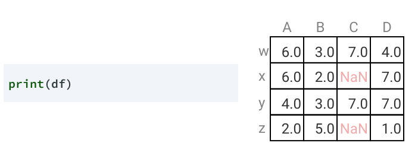

The default value for the `axis` parameter is `0`, so `df.dropna()` returns an identical result to `df.dropna(axis=0`):

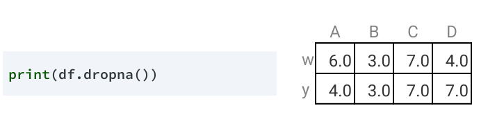

The rows with labels `x` and `z` contain null values, so those rows are dropped. Let's look at what happens when we use `axis=1` to specify the column axis:

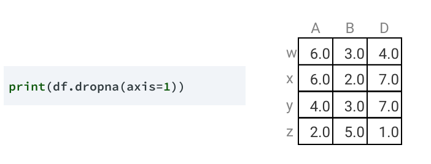

Only the column with label `C` contains null values, so, in this case, just one column is removed.

## replace null values

While dropping rows or columns is the easiest approach to deal with missing values, it may not always be the *best* approach. For example, removing a disproportionate amount of one manufacturer's laptops could change our analysis.

Because of this, it's a good idea to explore the missing values in the `os_version` column before making a decision. We can use `Series.value_counts()` to explore all of the values in the column, but we'll use a parameter we haven't seen before:

```python
print(laptops["os_version"].value_counts(dropna=False))
```

```python
10      1072
NaN      170
7         45
X          8
10 S       8
Name: os_version, dtype: int64
```

Because we set the `dropna` parameter to `False`, the result includes null values. We can see that the majority of values in the column are `10` and missing values are the next most common.

Let's also explore the `os` column, since it's is closely related to the `os_version` column. We'll only look at rows in which the `os_version` is missing:

```python
os_with_null_v = laptops.loc[laptops["os_version"].isnull(),"os"]
print(os_with_null_v.value_counts())
```

```python
No OS        66
Linux        62
Chrome OS    27
macOS        13
Android       2
Name: os, dtype: int64
```

Immediately, we can observe a few things:

- The most frequent value is "No OS". This is important to note because if there is no os, there *shouldn't* be a version defined in the `os_version` column.
- Thirteen of the laptops that come with macOS do not specify the version. We can use our knowledge of [MacOS](https://en.wikipedia.org/wiki/MacOS) to confirm that `os_version` should be equal to `X`.

In both of these cases, we can fill the missing values to make our data more correct. For the rest of the values, it's probably best to leave them as missing so we don't remove important values.

We can use assignment with a boolean comparison to perform this replacement, like below:

```python
laptops.loc[laptops["os"] == "macOS", "os_version"] = "X
```

For rows with `No OS` values, let's replace the missing value in the `os_version` column with the value `Version Unknown`.