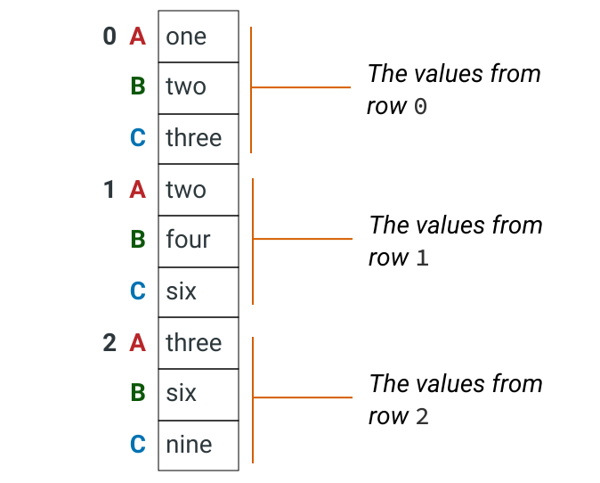

# Notebook

- create headings in order to

# Data Prep

- check the dateset you are working on, if it contains correct data
- compare the size of data sets after merging, check if there are any discrepancy eg null values after merging investigate why

# Dealing with null values

## Best Practices

When dropping null values, create a new data frame

# Grouping

## Group by value and get rows which group is longer then 1

```python
all_individual_tasks_review
all_individual_tasks_returned = all_individual_tasks_review.groupby("Parent id").filter(lambda x: len(x) > 1)
all_individual_tasks_returned
```

# Comparing data

```
all_tikets_returned["Is returned"] = all_tickets['Issue id'].isin(all_individual_tasks_returned['Parent id']).map({True: 'Yes', False: 'No'})

```

# Reshaping DF

## stack()

To convert a dataframe to a single column of values, we use the [`DataFrame.stack()` method,](http://pandas.pydata.org/pandas-docs/stable/reference/api/pandas.DataFrame.stack.html#pandas.DataFrame.stack) which stacks a dataframe object into a Series object. Let's look at a diagram of how this works. We'll start with a simple dataframe with three columns containing words:


When we use `DataFrame.stack()`, the values become a series object, with the values from each row "stacked" on top of each other:



```python
labels_series = label_columns_df.stack()
labels_series = labels_series.reset_index(drop=True)
labels_series
```


# Row value update

## Add text to string column value

```
all_tickets_returned_link = all_tikets_returned
all_tickets_returned_link['link'] = "https://rndwww.nce.amadeus.net/agile/browse/" + all_tickets_returned_link['Issue key']
all_tickets_returned_link
```

or

```
df = pd.DataFrame({'col':['a', 0]})

df['col'] = df['col'].apply(lambda x: "{}{}".format('str', x))
```
