# Links

https://sqlzoo.net/wiki/SQL_Tutorial

https://www.w3schools.com/SQL/default.asp

https://www.sqlstyle.guide/#aliasing-or-correlations

https://en.wikipedia.org/wiki/ISO/IEC_9075

https://sqlzoo.net/wiki/SQL_Tutorial

https://www.dataquest.io/blog/learn-sql-online/

https://www.sqlstyle.guide/


# Introduction

Here are a few things to note:

- We rarely linked to SQLite documentation, because it's a bit challenging to understand when you're just beginning. Sites like [W3 Schools](https://www.w3schools.com/SQL/default.asp) and [SQL ZOO](https://sqlzoo.net/) are more friendly for looking up SQL commands.
- We learned about clauses, statements, keywords, and operators in SQL. Here's a diagram describing the difference between each term:


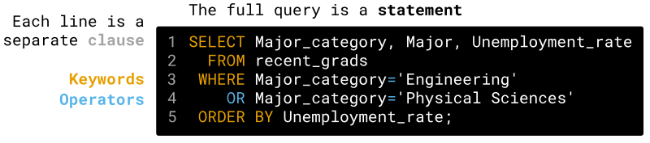

## Execution order

Here is the order in which the clauses run:

1. `FROM` and Join
2. `WHERE`
3. `SELECT`
4. `ORDER BY`
5. `LIMIT`

Since aggregate functions are part of `SELECT`, the calculation happens after `WHERE` acts.

Now we know two more clauses: `GROUP BY` and `HAVING`. We can expand our mental model of the general structure of a query:

```sql
SELECT column(s)
  FROM some_table
 WHERE some_condition
 GROUP BY column(s)
HAVING some_condition
 ORDER BY column(s)
 LIMIT some_limit;
```

And the order in which SQL runs this is as follows:

1. `FROM`
2. `WHERE`
3. `GROUP BY`
4. `HAVING`
5. `SELECT`
6. `ORDER BY`
7. `LIMIT`

We still haven't looked at using `GROUP BY` and `ORDER BY` simultaneously — we'll see an example later.

Note, however, that `ORDER BY` executes after `GROUP BY`. One of the main goals of ordering results is functional output, so it makes sense that it should be one of the last clauses to run.


## Missing Values

Sometimes, for various reasons, tables don't contain values in certain cells (a **cell** is an intersection of a row and a column in a table).

When this happens, we make any of the following statements (or variations of them):

- The value is missing.

- It's a missing value.

- The value is

   

  ```
  NULL
  ```

  .

  - `NULL` is a special entity in SQL that exists to capture the concept of missing value.

This is important when using aggregate functions because most of them ignore missing values.

For example, if we were to select `COUNT(Primes)` in the table below, the result would be `3` due to the missing value in the third row.


Primes237


Here's an animation depicting this operation:


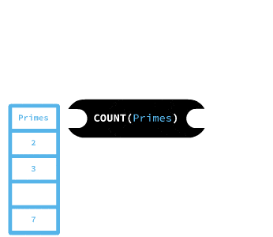


So we must know we don't have null values in a column before we can use it to count the numbers of rows.

To avoid this, we can resort to the `*` and pass it into `COUNT` as if it were a column name. So, in the table above, we'd use `COUNT(*)` instead of `COUNT(Primes)`.

In this screen's exercise we will ask you to use `COUNT` to find a column with at least a missing value. You can do this by running the query below, replacing `<column_name>` with the name of the columns in `recent_grads` until you find a suspicious result. Here's the query:

```
SELECT COUNT(<column_name>)
  FROM recent_grads;
```


## Counting Unique Values

`Major_category` is a column with only a few unique values. What if we want to get a list with repetitions of the values in this column? Or what if we want to determine how many distinct values there are in this column?

We can return all of the unique values in a column using the `DISTINCT` statement.

```sql
SELECT DISTINCT Major_category
  FROM recent_grads;
```


Major_categoryEngineeringBusinessPhysical SciencesLaw & Public PolicyComputers & MathematicsAgriculture & Natural ResourcesIndustrial Arts & Consumer ServicesArtsHealthSocial ScienceBiology & Life ScienceEducationHumanities & Liberal ArtsPsychology & Social WorkCommunications & JournalismInterdisciplinary


As with the other SQL clauses we've learned, we can use the `DISTINCT` statement with multiple columns to return unique pairings of those columns:

```
SELECT DISTINCT Major, Major_category
  FROM recent_grads
 LIMIT 5;
```


MajorMajor_categoryPETROLEUM ENGINEERINGEngineeringMINING AND MINERAL ENGINEERINGEngineeringMETALLURGICAL ENGINEERINGEngineeringNAVAL ARCHITECTURE AND MARINE ENGINEERINGEngineeringCHEMICAL ENGINEERINGEngineering


Lastly, we can count the number of unique values in a column by nesting the `COUNT()` function with the `DISTINCT` clause:

```sql
SELECT COUNT(DISTINCT Major_category) AS unique_major_categories
  FROM recent_grads;
```

unique_major_categories16


## DATA TYPES

https://en.wikipedia.org/wiki/Data_type

https://www.sqlite.org/datatype3.html


## String Functions and Operations

### 

Previously, we learned about aggregate functions. Aggregate functions take a column as input and return one value for the column. Now, we'll learn about functions that, when we pass them a column as input, return (a transformation of the input) another column. The values of text columns are typically called strings.

We'll start with the `LENGTH` function. Given a text column, the `LENGTH` function returns the number of characters in the input strings


Let's build on the query we saw on the previous screen to see it action.

```
SELECT Major,
       Total, Men, Women, Unemployment_rate,
       LENGTH(Major) AS Length_of_name
  FROM recent_grads
 ORDER BY Unemployment_rate DESC
 LIMIT 3;
```


MajorTotalMenWomenUnemployment_rateLength_of_nameNUCLEAR ENGINEERING257322003730.17722619PUBLIC ADMINISTRATION5629294726820.15949121COMPUTER NETWORKING AND TELECOMMUNICATIONS7613529123220.15185042


We can also concatenate strings by using the `||` operator. Here's an example:

```
SELECT 'Data' || 'quest' as 'e-learning';
```


e-learningDataquest


We indicated the presence of strings by enclosing them in single quotes (`'`), however, double quotes (`"`) can be used. But it's good practice to use single quotes as they are more widely accepted in other databases.

In the same way that we can compare columns with both constant numbers and other columns in `WHERE` clauses, we can also mix columns and constant strings when concatenating. For example:

```
SELECT 'Cat: ' || Major_category
  FROM recent_grads
 LIMIT 2;
```


'Cat: ' || Major_categoryCat: EngineeringCat: Engineering


In the following exercise, you'll use the `LOWER` function to replace the `Major` column with one where all values appear in lowercase letters. We use this just like the `LENGTH` function. Here's how the output of the exercise should look:


MajorTotalMenWomenUnemployment_rateLength_of_nameMajor: nuclear engineering257322003730.17722619Major: public administration5629294726820.15949121Major: computer networking and telecommunications7613529123220.15185042


## Performing Arithmetic in SQL

Let's revisit one of the questions from the beginning of the lesson:

- Which majors had the largest spread (difference) between the 25th and 75th percentile starting salaries?

In the same way that we can use string functions and operators, we can also perform arithmetic on the columns in a table. SQL supports the standard arithmetic operators: `*`, `+`, `-`, and `/`, and we can use them like any other operator:

```
SELECT P75th - P25th AS quartile_spread
  FROM recent_grads
 LIMIT 10;
```


quartile_spread30000350005500037000250005200019000775002200027000


You can also add, subtract, multiply, or divide columns by individual values:

```
SELECT ShareWomen * 100 percent_female 
  FROM recent_grads 
 LIMIT 10;
```


| percent_female     |
| ------------------ |
| 12.0564344         |
| 10.1851852         |
| 15.3037383         |
| 10.731319599999999 |
| 34.1630502         |
| 14.4966965         |
| 53.571428600000004 |
| 44.135557299999995 |
| 13.979280099999999 |
| 43.7846874         |

One thing to note is that multiplying or dividing columns with a floating point value (or a column with floating point values) will result in floating point values:

- Two floats — returns a float.
  - `SELECT 100.0 / 100.0` returns `1.0`.
- A float and an integer — returns a float
  - `SELECT 100 / 1.0` returns `100.0`.
- Two integers — returns an integer
  - `SELECT 100 / 10` returns `10`


# Subqueries

http://sql.standout-dev.com/2015/10/subqueries-oracle-sql/

https://mode.com/sql-tutorial/sql-sub-queries/

https://www.sqlitetutorial.net/sqlite-subquery/

## Introduction

## Classifications

One of the ways subqueries can be categorized is based on whether they reference columns from the main statement or not. When they do reference columns from the outer statement they are called *correlated subqueries*, and when they don’t reference anything outside themselves they are called *non-correlated subqueries*. Let’s review these types with a little more detail.

### Correlated Subqueries

As mentioned earlier, they reference one or more columns from the outer or main statement (which can be a SELECT, UPDATE or DELETE). So, since they are related to the main query, they cannot be executed alone prior to executing the main statement. Instead, they are executed once for each candidate row that can possibly be returned or affected by the main statement.

```sql
SELECT *
FROM customers c
WHERE 100 &lt;
(
SELECT COUNT ( * )
FROM orders
WHERE customer_id = c.customer_id
);
```


### Non-correlated Subqueries

As you might have guessed, these are the ones that are independent of the main statement, such as the first example included in the article.

Non-correlated subqueries are executed once before the execution of the main statement, and can be included in all places where a correlated subquery can be included, plus some other places. For example, here is an INSERT statement, which uses a non-correlated subquery:

```sql
INSERT
INTO departments
  (
    department_id, department_name, division_id
  )
  VALUES
  (
    100, 'DEVELOPMENT', (
      SELECT division_id
      FROM divisions
      WHERE division_name = 'INFORMATION TECHNOLOGY'
    )
  );
```


## The flow

Our method in the previous screen lacks flexibility and requires extra work. Fortunately, SQL allows us to answer questions with a single query.

How do we make the computed average value, `0.5225502029537575`, dynamic? We can do this by using **subqueries**. A subquery is a query nested within another query. Here's a template for a SQL statement where the subquery resides in the `WHERE` clause:

```sql
SELECT Major, ShareWomen FROM recent_grads
WHERE ShareWomen > (subquery that returns the average value for ShareWomen)
```

The subquery runs first and returns the average value for the `ShareWomen` column (which happens to be `0.5225502029537575`). Based on the result of the subquery, SQL will replace the subquery with this value dynamically.

SQL will ignore the column name (`AVG(ShareWomen)`) and use the actual row value. Here's a diagram that clarifies the flow:


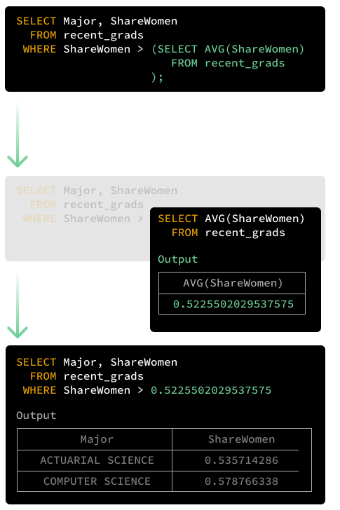


The query that replaces the placeholder `subquery` needs to be a full query (like the ones we've seen so far).

For this particular example, the inner query should only return a table with a single row and a column because of how it fits within the outer query (`... WHERE > ?`). If you try to return a table with multiple columns, you will get an error.

Lastly, a subquery must **always** be inside parentheses `()`. We get an error if we don't include them in the query above:

```sql
(sqlite3.OperationalError) near "SELECT": syntax error
[SQL: SELECT *   FROM recent_grads  WHERE ShareWomen > SELECT AVG(Sharewomen) FROM recent_grads;]
(Background on this error at: http://sqlalche.me/e/e3q8)
```


## Subquery in SELECT

On the previous screen, we wrote SQL statements that used a subquery to express dynamic filter criteria in the `WHERE` clause. Specifically, we looked for rows that were above or below the average value in a specific column.

What if we wanted to understand the *proportion* of majors that are above the average for a given column? We'd need to divide the number of rows that met the filter criteria by the *total* number of rows in the table.

Let's focus on the query from the previous screen:

```sql
SELECT Major, ShareWomen
  FROM recent_grads
 WHERE ShareWomen > (SELECT AVG(ShareWomen)
                       FROM recent_grads
                    );
```

Using the `COUNT` aggregate function, we can return the number of rows in the results set:

```sql
SELECT COUNT(*)
  FROM recent_grads
 WHERE ShareWomen > (SELECT AVG(ShareWomen)
                     FROM recent_grads
                    );
```


COUNT(*)91

To return the proportion, we need to divide this value by the *total* number of rows in `recent_grads`. We can count the number of rows in the table, save the result, and then divide by it. The challenge, however, is to do this dynamically!

To calculate the number of total rows in `recent_grads` and use it in another SQL statement, we can use a subquery in the `SELECT` clause:

```sql
SELECT COUNT(*),
       (SELECT COUNT(*)
          FROM recent_grads
       )
  FROM recent_grads
 WHERE ShareWomen > (SELECT AVG(ShareWomen)
                       FROM recent_grads
                    );
```


COUNT(*)(SELECT COUNT(*) FROM recent_grads)91173


## Returning Multiple Results in Subqueries

In the previous exercise, we displayed the majors in the categories `Business`, `Humanities & Liberal Arts`, and `Education`.

These are the top three categories with respect to the total number of graduates, as we can see in the query below.

```sql
SELECT Major_category, SUM(TOTAL)
  FROM recent_grads
 GROUP BY Major_category
 ORDER BY SUM(TOTAL) DESC;
```


Major_categorySUM(TOTAL)Business1302376Humanities & Liberal Arts713468Education559129Engineering537583Social Science529966Psychology & Social Work481007Health463230Biology & Life Science453862Communications & Journalism392601Arts357130Computers & Mathematics299008Industrial Arts & Consumer Services229792Physical Sciences185479Law & Public Policy179107Agriculture & Natural Resources79981Interdisciplinary12296


If we wanted to find the same list of majors as we saw in the previous screen, dynamically (i.e. without first determining the most popular categories and then hard-coding the values into the query), subqueries can help.

Instead of returning just one value, we can make the query return a list of values (disguised as a **single** column).

In the following exercise, you will display the same results as we saw in the previous screen, only this time you won't manually indicate the categories.

You can use the following code in this screen's exercise.

```sql
SELECT Major_category, Major
  FROM recent_grads
 WHERE Major_category IN (SUBQUERY_GOES_HERE);
```


Instructions

1. In the code displayed above, replace `SUBQUERY_GOES_HERE` to create a query that displays the `Major_category` and `Major` columns, for the rows where `Major_category` is one of the three highest group level sums for the `Total` column.

```sql
SELECT Major_category, Major
  FROM recent_grads
 WHERE Major_category IN (SELECT Major_category
                            FROM recent_grads
                           GROUP BY Major_category
                           ORDER BY SUM(TOTAL) DESC
                           LIMIT 3
                         );
```


## Integrating A Subquery With The Outer Query

```sql
SELECT Major, Major_category, 
       CAST(Sample_size AS FLOAT)/Total AS ratio 
  FROM recent_grads 
 WHERE ratio > (SELECT AVG(CAST(Sample_size AS FLOAT)/Total) AS avg_ratio 
                  FROM recent_grads
               );
```


# Joins

## Understanding Inner Joins

We've now joined the two tables to give us extra information about each row in `cities`.  Let's take a closer look at how this inner join works.

An inner join works by including only rows from each table that have a match as specified using the `ON` clause.  Let's look at a diagram of how our join from the previous  screen works.  We have included a selection of rows which best  illustrate the join:

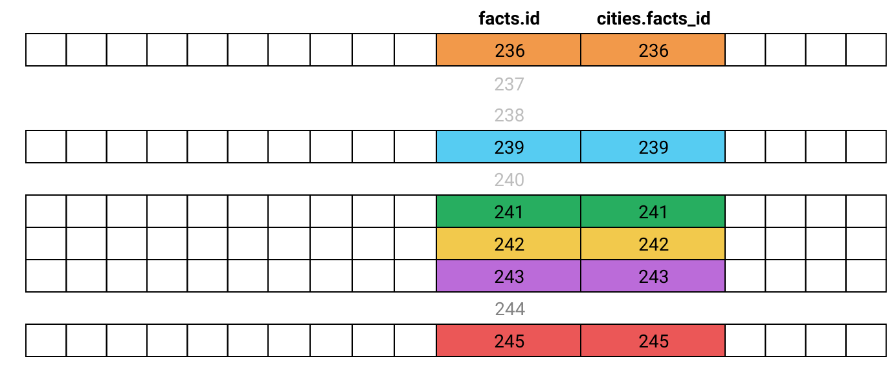

Our inner join **will** include:

- Rows from the `cities` table that have a `cities.facts_id` that matches a `facts.id` from `facts`.

Our inner join **will not** include:

- Rows from the `cities` table that have a `cities.facts_id` that doesn't match any `facts.id` from `facts`.
- Rows from the `facts` table that have a `facts.id` that doesn't match any `cities.facts_id` from `cities`.

You can see this represented as a Venn diagram:

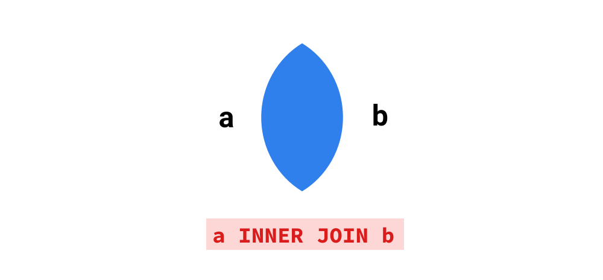

In the SQL fundamentals course, we learned how to use [aliases](https://www.tutorialspoint.com/sqlite/sqlite_alias_syntax.htm) to specify custom names for columns, eg:

```
SELECT AVG(population) AS AVERAGE_POPULATION
```

We can also create aliases for table names, which makes queries with joins easier to both read and write.  Instead of:

```
SELECT * FROM facts
INNER JOIN cities ON cities.facts_id = facts.id
```

We can write:

```
SELECT * FROM facts AS f
INNER JOIN cities AS c ON c.facts_id = f.id
```

Just like with column names, using `AS` is optional.  We can get the same result by writing:

```
SELECT * FROM facts f
INNER JOIN cities c ON c.facts_id = f.id
```

We can also combine aliases with wildcards - for instance, using the aliases created above, `c.*` would give us all columns from the table `cities`.

While our query from the previous screen included both columns from the `ON` clause, we don't need to use either column from our `ON` clause in our final list of columns.  This is useful as it means we can show only the information we're interested in, rather than having to  include the two join columns every time.


## Left Joins


As we mentioned earlier, an inner join will not include any rows where  there is not a mutual match from both tables.  This means there could be information we are not seeing in our query where rows don't match.

We can use some SQL queries to explore this:

```
SELECT COUNT(DISTINCT(name)) FROM facts;
```

| count |
| ----- |
| 261   |

```
SELECT COUNT(DISTINCT(facts_id)) FROM cities;
```

| count |
| ----- |
| 210   |

By running these two queries, we can see that there are some countries in the `facts` table that don't have corresponding cities in the `cities` table, which indicates we may have some incomplete data.

Let's look at how we can create a query to explore the missing data using a new type of join— the **left join**.

A left join includes all the rows that an inner join will select,  plus any rows from the first (or left) table that don't have a match in  the second table.  We can see this represented as a Venn diagram.

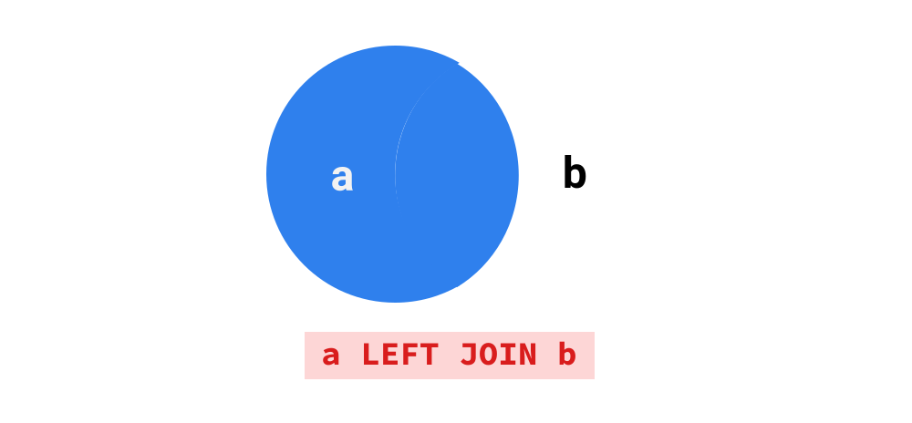

Let's look at an example by replacing `INNER JOIN` with `LEFT JOIN` from the first query we wrote, and looking at the same selection of rows from our earlier diagram

```
SELECT * FROM facts
LEFT JOIN cities ON cities.facts_id = facts.id
```


Here we can see that for the rows where `facts.id` doesn't match any values in `cities.facts_id` (237, 238, 240, and 244), the rows are still included in the results.  When this happens, all of the columns from the `cities` table are populated with null values.

We can use these null values to filter our results to just the countries that don't exist in `cities` with a `WHERE` clause.  When making a comparison to null in SQL, we use the `IS` keyword, rather than the `=` sign. If we want to select rows where a column is null we can write:

```
WHERE column_name IS NULL
```

If we want to select rows where a column name isn't null, we use:

```
WHERE column_name IS NOT NULL
```


## Right Joins and Outer Joins

Looking through the results of the query we wrote in the previous screen, we  can see a number of different reasons that countries don't have  corresponding values in `cities`:

- Countries with small populations and/or no major urban areas (which  are defined as having populations of over 750,000), eg San Marino,  Kosovo, and  Nauru.
- City-states, such as Monaco and Singapore.
- Territories that are not themselves countries, such as Hong Kong, Gibraltar, and the Cook Islands.
- Regions & Oceans that aren't countries, such as the European Union and the Pacific Ocean.
- Genuine cases of missing data, such as Taiwan.

It's important whenever you use inner joins to be mindful that you  might be excluding important data, especially if you are joining based  on columns that aren't linked in the database schema.

There are two less-common join types SQLite  does not support that you should be aware of.  The first is a **right join**. A right join, as the name indicates, is exactly the opposite of a left  join.  While the left join includes all rows in the table *before* the `JOIN` clause, the right join includes all rows in the new table *in* the `JOIN` clause.  We can see a right join in the Venn diagram below:


The following two queries, one using a left join and one using a right join, produce identical results.

```
SELECT f.name country, c.name city
FROM facts f
LEFT JOIN cities c ON c.facts_id = f.id
LIMIT 5;
```


```
SELECT f.name country, c.name city
FROM cities c
RIGHT JOIN facts f ON f.id = c.facts_id
LIMIT 5;
```

The main reason a right join would be used is when you are joining  more than two tables.  In these cases, using a right join is preferable  because it can avoid restructuring your whole query to join one table.  Outside of this, right joins are used reasonably rarely, so for simple  joins it's better to use a left join than a right as it will be easier  for your query to be read and understood by others.

The other join type not supported by SQLite is a **full outer join**.  A full outer join will include all rows from the tables on both sides  of the join.  We can see a full outer join in the Venn diagram below:


Like right joins, full outer joins are reasonably uncommon, and  similar results can be achieved using a union clause (which we will  teach in the next lesson).  The standard SQL syntax for a full outer  join is:

```
SELECT f.name country, c.name city
FROM cities c
FULL OUTER JOIN facts f ON f.id = c.facts_id
LIMIT 5;
```

When joining `cities` and `facts` with a full outer join, the result will be the same as our left and right joins above, because there are no values in `cities.facts_id` that don't exist in `facts.id`.

Let's look at the Venn diagrams of each join type side by side, which should help you compare the differences of each of the four joins we've discussed so far.

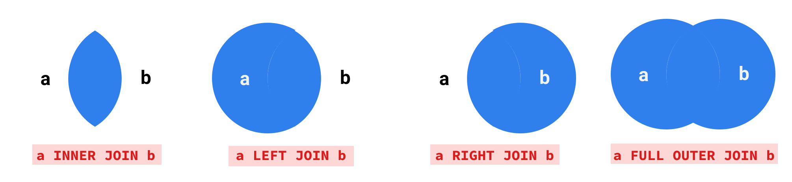

Next, let's practice using joins to answer some questions about our data.

## Combining Joins with Subqueries


As we learned in the SQL fundamentals course, subqueries can be used to  substitute parts of queries, allowing us to find the answers to more  complex questions.  We can also join to the result of a subquery, just  like we could a table.

Here's an example of a using a join and a subquery to produce a table of countries and their capital cities, like we did earlier in the  lesson.

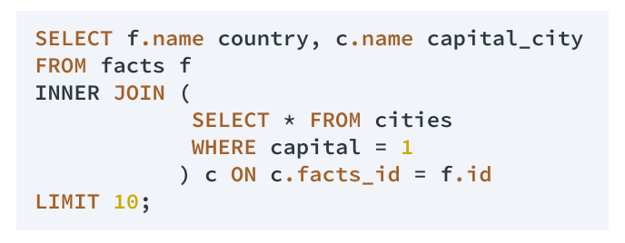

Reading subqueries can be overwhelming at first, so we'll break down  what happens in this example in several steps.  The important thing to  remember is that the result of any subquery is always calculated first,  so we read from the inside out.

- The subquery, in the red box, is calculated first.  This simple query selects all columns from `cities`, filtering rows that are marked as capital cities by having a value for `capital` of 1.
- The `INNER JOIN` joins the subquery result, aliased as `c`, to the `facts` table based on the `ON` clause.
- Two columns are selected from the results of the join:
  - `f.name`, aliased as `country`.
  - `c.name`, aliased as `capital_city`.
- The results are limited to the first 10 rows.

Below is the output of this query:

| country              | capital_city     |
| -------------------- | ---------------- |
| Aruba                | Oranjestad       |
| Antigua and Barbuda  | Saint John'S     |
| United Arab Emirates | Abu Dhabi        |
| Afghanistan          | Kabul            |
| Algeria              | Algiers          |
| Azerbaijan           | Baku             |
| Albania              | Tirana           |
| Armenia              | Yerevan          |
| Andorra              | Andorra La Vella |
| Angola               | Luanda           |

Using this example as a model, we'll write a similar query to find the capital cities with populations of over 10 million.


```sql
SELECT * FROM cities;

SELECT c.name capital_city, f.name country, c.population population
FROM facts f 
INNER JOIN
            (
            SELECT * FROM cities 
            WHERE capital = 1 
            AND population > 10000000
            ) c ON c.facts_id = f.id
            
ORDER BY 3 DES
```


## Complex Query with Joins and Subqueries (Workflow)

When you're writing complex queries with joins and subqueries, it helps to follow this process:

- Think about what data you need in your final output
- Work out which tables you'll need to join, and whether you will need to join to a subquery.
  - If you need to join to a subquery, write the subquery first.
- Then start writing your `SELECT` clause, followed by the join and any other clauses you will need.
- Don't be afraid to write your query in steps, running it as you go—  for instance you can run your subquery as a 'stand alone' query first to make sure it looks like you want before writing the outer query.

```sql
SELECT f.name country,  
f.population as total_pop,
(urban_pop / CAST(f.population AS FLOAT)) urban_pct
FROM facts f

INNER JOIN (
    SELECT facts_id, SUM(population) urban_pop FROM cities GROUP BY 1
            ) c ON c.facts_id = f.id

WHERE urban_pct > 0.5
ORDER BY urban_pct ASC
 
```


## Multiple Joins

Joining multiple tables is as simple as adding an extra `JOIN` clause. The SQL engine interprets joins in order, so the first join will be executed, and then the second join will be executed against the result of the first join. Because of this, we can first build our query in steps:

- with 0 joins.
- with 1 join.
- with 2 joins.

We will use the `invoice_line` table in our `FROM` clause, since it contains 3 of the 5 columns we want in our final query. You don't have to follow this pattern but if you're not sure, it's a good place to start. Since our task involves looking for information about a specific `invoice_id`, let's choose an `invoice_id` value of `3`. Selecting all lines from `invoice_line` with an `invoice_id` is straightforward:

```
SELECT * FROM invoice_line
WHERE invoice_id = 3;
```

| invoice_line_id | invoice_id | track_id | unit_price | quantity |
| --------------- | ---------- | -------- | ---------- | -------- |
| 27              | 3          | 2516     | 0.99       | 1        |
| 28              | 3          | 2646     | 0.99       | 1        |

Now we can use an inner join to add the data from the `track` table.

```
SELECT * FROM invoice_line il
INNER JOIN track t ON t.track_id = il.track_id
WHERE invoice_id = 3;
```


| invoice_line_id | invoice_id | track_id | unit_price | quantity | track_id | name            | album_id | media_type_id | genre_id | composer                                          | milliseconds | bytes    | unit_price |
| --------------- | ---------- | -------- | ---------- | -------- | -------- | --------------- | -------- | ------------- | -------- | ------------------------------------------------- | ------------ | -------- | ---------- |
| 27              | 3          | 2516     | 0.99       | 1        | 2516     | Black Hole Sun  | 203      | 1             | 1        | Soundgarden                                       | 320365       | 10425229 | 0.99       |
| 28              | 3          | 2646     | 0.99       | 1        | 2646     | I Looked At You | 214      | 1             | 1        | Robby Krieger, Ray Manzarek, John Densmore, Ji... | 142080       | 4663988  | 0.99       |

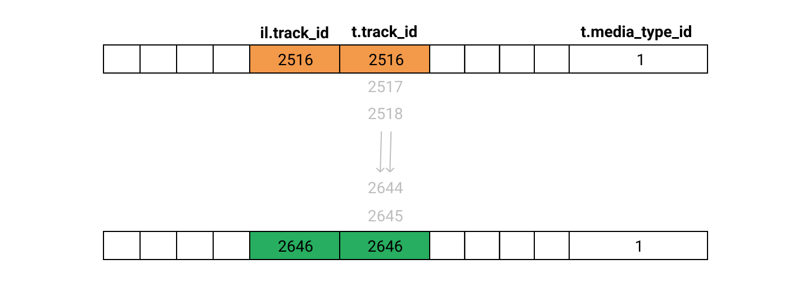

Next, we add our second join to add the data from the `media_type` table.

```
SELECT * FROM invoice_line il
INNER JOIN track t ON t.track_id = il.track_id
INNER JOIN media_type mt ON mt.media_type_id = t.media_type_id
WHERE invoice_id = 3;
```


| invoice_line_id | invoice_id | track_id | unit_price | quantity | track_id | name            | album_id | media_type_id | genre_id | composer                                          | milliseconds | bytes    | unit_price | media_type_id | name            |
| --------------- | ---------- | -------- | ---------- | -------- | -------- | --------------- | -------- | ------------- | -------- | ------------------------------------------------- | ------------ | -------- | ---------- | ------------- | --------------- |
| 27              | 3          | 2516     | 0.99       | 1        | 2516     | Black Hole Sun  | 203      | 1             | 1        | Soundgarden                                       | 320365       | 10425229 | 0.99       | 1             | MPEG audio file |
| 28              | 3          | 2646     | 0.99       | 1        | 2646     | I Looked At You | 214      | 1             | 1        | Robby Krieger, Ray Manzarek, John Densmore, Ji... | 142080       | 4663988  | 0.99       | 1             | MPEG audio file |

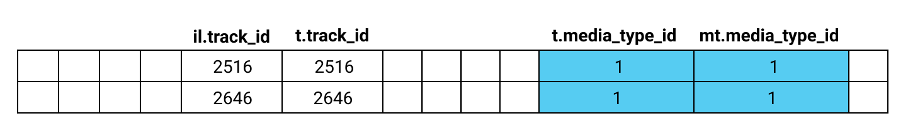

The last step is to alter the `SELECT` clause to include only the columns we require - let's do that now with a different order.


## Combining Multiple Joins with Subqueries

### 

Because the `invoice_line` table contains each individual song from each customer purchase, it contains information about which songs are purchased the most. We can use the table to find out which artists are purchased the most. Specifically, what we want to produce is *a query that lists the top 10 artists, calculated by the number of times a track by that artist has been purchased.*

We'll need to use a `GROUP BY` clause to get the number of tracks purchased from each artist, but before we do we'll have to join a few tables. As we start thinking about how we will write this query, we can look at the database schema from the first screen of this lesson and think about what tables we will need to include.

Writing our query would be a lot easier if we had one table that contained both the `track.track_id` and the `artist.name` columns. We can write a subquery that creates this table for us, and then use that subquery to calculate our answer. This means our process will be:

- Write a subquery that produces a table with `track.track_id` and `artist.name`,
- Join that subquery to the `invoice_line` table,
- Use a `GROUP BY` statement to calculate the number of times each artist has had a track purchased, and find the top 10.

We can write our subquery by joining `album` to `track` and then `artist` to `album`, just like we did in the previous screen. We'll add an `ORDER BY` and `LIMIT` to our query so we're only looking at manageable sample of the data, but we'll remove it when we move to the next step.

```sql
SELECT
    t.track_id,
    ar.name artist_name
FROM track t
INNER JOIN album al ON al.album_id = t.album_id
INNER JOIN artist ar ON ar.artist_id = al.artist_id
ORDER BY 1 LIMIT 5;
```


| track_id | artist_name |
| -------- | ----------- |
| 1        | AC/DC       |
| 2        | Accept      |
| 3        | Accept      |
| 4        | Accept      |
| 5        | Accept      |

Next, we need to join this subquery to our `invoice_line` table. We'll give our subquery an alias `ta` for 'track artist' to make it easier to refer to. Again, we'll add an `ORDER BY` and `LIMIT` statement to this step so our output is more manageable.

```sql
SELECT
    il.invoice_line_id,
    il.track_id,
    ta.artist_name
FROM invoice_line il
INNER JOIN (
            SELECT
                t.track_id,
                ar.name artist_name
            FROM track t
            INNER JOIN album al ON al.album_id = t.album_id
            INNER JOIN artist ar ON ar.artist_id = al.artist_id
           ) ta
           ON ta.track_id = il.track_id
ORDER BY 1 LIMIT 5;
```

| il.invoice_line_id | il.track_id | ta.artist_name |
| ------------------ | ----------- | -------------- |
| 1                  | 1158        | Guns N' Roses  |
| 2                  | 1159        | Guns N' Roses  |
| 3                  | 1160        | Guns N' Roses  |
| 4                  | 1161        | Guns N' Roses  |
| 5                  | 1162        | Guns N' Roses  |

At first it might look like we've done something wrong, because the artist for all rows is Guns N' Roses, but that's because the very first order in our table is a customer who purchased an entire Guns N' Roses album! All that remains now is for us to add our `GROUP BY` clause, remove the extra columns and use `ORDER BY` and `LIMIT` clauses to select the 10 most popular artists.

```sql
SELECT
    ta.artist_name artist,
    COUNT(*) tracks_purchased
FROM invoice_line il
INNER JOIN (
            SELECT
                t.track_id,
                ar.name artist_name
            FROM track t
            INNER JOIN album al ON al.album_id = t.album_id
            INNER JOIN artist ar ON ar.artist_id = al.artist_id
           ) ta
           ON ta.track_id = il.track_id
GROUP BY 1
ORDER BY 2 DESC LIMIT 10;
```

| artist                | tracks_purchased |
| --------------------- | ---------------- |
| Queen                 | 192              |
| Jimi Hendrix          | 187              |
| Nirvana               | 130              |
| Red Hot Chili Peppers | 130              |
| Pearl Jam             | 129              |
| AC/DC                 | 124              |
| Guns N' Roses         | 124              |
| Foo Fighters          | 121              |
| The Rolling Stones    | 117              |
| Metallica             | 106              |


Write a query that returns the top 5 albums, as calculated by the number of times a track from that album has been purchased.

```sql
SELECT 
    album,
    artist,
    COUNT(*) tracks_purchased
FROM invoice_line il
INNER JOIN (
            SELECT 
                t.track_id,
                ar.name artist,
                al.title album
            FROM track t
            INNER JOIN album al ON al.album_id = t.album_id
            INNER JOIN artist ar ON ar.artist_id = al.artist_id
            ) ta
            ON ta.track_id = il.track_id
GROUP BY 1   
ORDER BY 3 DESC LIMIT 5;
```


## Self-joins

In some cases, there can be a relation between two columns within the same table. We can see that in our `employee` table, where there is a `reports_to` column that has a relation to the `employee_id` column within the same table.

The `reports_to` column identifies each employee's supervisor. If we wanted to create a report of each employee and their supervisor's name, we would need some way of joining a table to itself. Doing this is called a **self-join**.

Technically, a self-join will use one of the other standard joins— usually an `INNER JOIN` or `LEFT JOIN` since these are the most commonly used joins— and aliases to distinguish between the table on each side of the join. Here's a simple example of a self-join in action:

```sql
SELECT
    e1.employee_id,
    e2.employee_id supervisor_id
FROM employee e1
INNER JOIN employee e2 on e1.reports_to = e2.employee_id
LIMIT 4;
```

This query produces the following table:

| employee_id | supervisor_id |
| ----------- | ------------- |
| 2           | 1             |
| 6           | 1             |
| 3           | 2             |
| 4           | 2             |

To make our report more meaningful, we'll need to add some extra columns. One thing that would be nice is being able to combine the `first_name` and `last_name` columns into a single column. We can do that using the **concatenate operator**: `||`.

You can explore how the concatenate operator works by writing a simple query:

```sql
SELECT ("this" || "is" || "my" || "string");
```

```sql
thisismystring
```

Here are a few different examples of using concatenation, this time with columns from the `album` table:

```sql
SELECT
    album_id,
    artist_id,
    "album id is" || album_id col_1,
    "artist id is" || artist_id col2,
    album_id || artist_id col3
FROM album LIMIT 3;
```


| album_id | artist_id | col_1        | col2          | col3 |
| -------- | --------- | ------------ | ------------- | ---- |
| 1        | 1         | album id is1 | artist id is1 | 11   |
| 4        | 1         | album id is4 | artist id is1 | 41   |
| 2        | 2         | album id is2 | artist id is2 | 22   |

You'll notice that the SQL engine will concatenate multiple columns, columns with a string, and that the SQL engine handles converting different types where needed.


```sql
SELECT
    e1.first_name ||" " || e1.last_name employee_name,
    e1.title employee_title,
    e2.first_name ||" " || e2.last_name supervisor_name,
    e2.title supervisor_title
FROM employee e1
LEFT JOIN employee e2 on e1.reports_to = e2.employee_id
ORDER BY 1
```


## Revisiting CASE

Sometimes, you'll want to add some sort of categorization to your query. Let's say we wanted to generate a report summarizing each customer's purchases. It might be nice to create a column that puts each customer into a category:

- `small spender` - If the customer's total purchases are less than $40.
- `big spender` - If the customer's total purchases are greater than $100.
- `regular` - If the customer's total purchases are between $40 and $100 (inclusive).

As we previously learned we can do this with the **case statement**. The case statement acts like a series of if/then options for a new column. The syntax for `CASE` is:

```sql
CASE
    WHEN [comparison_1] THEN [value_1]
    WHEN [comparison_2] THEN [value_2]
    ELSE [value_3]
    END
    AS [new_column_name]
```

There can be 1 or more `WHEN` lines, and the `ELSE` line is optional— without it, rows that don't match any `WHEN` will be assigned a null value. Let's start by looking at a simple example. The `media_type` table contains the name of five different media types:

```sql
SELECT * FROM media_type;
```

| media_type_id | name                        |
| ------------- | --------------------------- |
| 1             | MPEG audio file             |
| 2             | Protected AAC audio file    |
| 3             | Protected MPEG-4 video file |
| 4             | Purchased AAC audio file    |
| 5             | AAC audio file              |

Let's look at how we can use `CASE` to add a new column `protected`, which indicates whether each media type is protected.

```
SELECT
    media_type_id,
    name,
    CASE
        WHEN name LIKE '%Protected%' THEN 1
        ELSE 0
        END
        AS protected
FROM media_type;
```


| media_type_id | name                        | protected |
| ------------- | --------------------------- | --------- |
| 1             | MPEG audio file             | 0         |
| 2             | Protected AAC audio file    | 1         |
| 3             | Protected MPEG-4 video file | 1         |
| 4             | Purchased AAC audio file    | 0         |
| 5             | AAC audio file              | 0         |

In this example, our `CASE` statement has a single `WHEN` which looks for a partial match of the string `Protected` in the `name` column. Any rows with a match get a value of `1`; all other rows get `0`.

Let's now put `CASE` into practice using our initial scenario, where we want to categorize customers by their purchase history.

You'll need to know that you can't use aliases in the `WHEN` line, so when writing a `CASE` statement that deals with aggregate functions, you will need to include the aggregate function in each `WHEN` line.

```sql
SELECT 
    customer_name,
    COUNT(inv.invoice_id) number_of_purchases,
    SUM(inv.total) total_spent,
    CASE
       WHEN sum(inv.total) < 40 THEN 'small spender'
       WHEN sum(inv.total) > 100 THEN 'big spender'
       ELSE 'regular'
       END
       AS customer_category
FROM invoice inv
INNER JOIN (
            SELECT c.customer_id, c.first_name ||" " || c.last_name customer_name FROM customer c
            ) cus
            ON cus.customer_id = inv.customer_id
GROUP BY 1
ORDER BY 1
```


# Using sourtucts in query


```sql
SELECT c.name capital_city, f.name country, c.population
FROM facts f
INNER JOIN cities c ON c.facts_id = f.id
WHERE c.capital = 1
ORDER BY 3 DESC
LIMIT 10;
```


# Writting Complex Queries

https://www.sqlstyle.guide/


## Styling the query

```sql
select ta.artist_name artist, count(*) tracks_sold from invoice_line il
inner join (select t.track_id, ar.name artist_name from track t
inner join album al on al.album_id = t.album_id
inner join artist ar on ar.artist_id = al.artist_id) ta
on ta.track_id = il.track_id group by 1 order by 2 desc limit 10;
```


And now, with whitespace and capitalization:

```sql
SELECT
    ta.artist_name artist,
    COUNT(*) tracks_sold
FROM invoice_line il
INNER JOIN (
            SELECT
                t.track_id,
                ar.name artist_name
            FROM track t
            INNER JOIN album al ON al.album_id = t.album_id
            INNER JOIN artist ar ON ar.artist_id = al.artist_id
           ) ta
           ON ta.track_id = il.track_id
GROUP BY 1
ORDER BY 2 DESC LIMIT 10;
```

As you can see, a little time put into whitespace and capitalization pays off. A few tips to help make your queries more readable:

- If a select statement has more than one column, put each on a new line, indented from the select statement.
- Always capitalize SQL function names and keywords
- Put each clause of your query on a new line.
- Use indenting to make subqueries appear logically separate.


## The With Clause

When constructing complex queries, it's useful to create an intermediate table to produce our final results. You can use subqueries to create these intermediate tables. Unfortunately, the way subqueries are written makes it harder to read— the person reading the query needs to find the subquery and read from the inside-out.

One way to alleviate this is to use a **with clause**. `WITH` clauses allow you to define one or more named subqueries before the start of the main query. The main query then refers to the subquery by it's alias name, just as if it's a table in the database.

The syntax for the `WITH` clause is relatively straight-forward.

```sql
WITH [alias_name] AS ([subquery])

SELECT [main_query]
```

Let's look at a simple example, a query designed to gather some info about the tracks from a single album. First, here's our query written with a standard subquery and **no** `WITH` clause:

```sql
SELECT * FROM
    (
     SELECT
         t.name,
         ar.name artist,
         al.title album_name,
         mt.name media_type,
         g.name genre,
         t.milliseconds length_milliseconds
     FROM track t
     INNER JOIN media_type mt ON mt.media_type_id = t.media_type_id
     INNER JOIN genre g ON g.genre_id = t.genre_id
     INNER JOIN album al ON al.album_id = t.album_id
     INNER JOIN artist ar ON ar.artist_id = al.artist_id
    )
WHERE album_name = "Jagged Little Pill";
```

By moving the subquery before the main query using a `WITH` clause, the intent of the main query becomes much easier to understand.

```sql
WITH track_info AS
    (                
     SELECT
         t.name,
         ar.name artist,
         al.title album_name,
         mt.name media_type,
         g.name genre,
         t.milliseconds length_milliseconds
     FROM track t
     INNER JOIN media_type mt ON mt.media_type_id = t.media_type_id
     INNER JOIN genre g ON g.genre_id = t.genre_id
     INNER JOIN album al ON al.album_id = t.album_id
     INNER JOIN artist ar ON ar.artist_id = al.artist_id
    )

SELECT * FROM track_info
WHERE album_name = "Jagged Little Pill";
```

While in this example the difference is subtle, using the `WITH` statement helps a lot when your main query even has some slight complexities. Let's get some practice using `WITH` in a more complex example.


```sql
WITH playlist_info AS
    (
    SELECT 
        p.playlist_id,
        p.name playlist_name,
        tr.name track_name,
        (tr.milliseconds / 1000.0) length_seconds
    FROM playlist p
    LEFT JOIN playlist_track pt ON pt.playlist_id = p.playlist_id
    LEFT JOIN track tr ON tr.track_id = pt.track_id
    )

SELECT
    playlist_id,
    playlist_name,
    COUNT(track_name) number_of_tracks,
    SUM(length_seconds) length_seconds
FROM playlist_info
GROUP BY 1, 2
ORDER BY 1;
```


## VIEWS

```sql
DROP VIEW IF EXISTS chinook.customer_gt_90_dollars;

CREATE VIEW chinook.customer_gt_90_dollars AS
    SELECT 
        cus.*
    FROM chinook.customer cus
    INNER JOIN chinook.invoice inv ON cus.customer_id = inv.customer_id
    GROUP BY 1
    HAVING SUM(inv.total) > 90;
    
SELECT * FROM chinook.customer_gt_90_dollars;    
```


## Combining Rows with Union

We have now created two views: `customer_usa` and `customer_gt_90_dollars`. How can we find customers who are in different permutations of these two views:

- Customers in the USA **or have** spent more than $90
- Customers in the USA **and have** spent more than $90
- Customers in the USA **and have not** spent more than $90

These scenarios require a different type of join because we want to join rows from tables, not columns. Let's start by looking at the first scenario, where we want to combine rows that exist in either view.

Whereas we use regular joins to join columns, we use the **union** operator to join rows from tables and/or views.

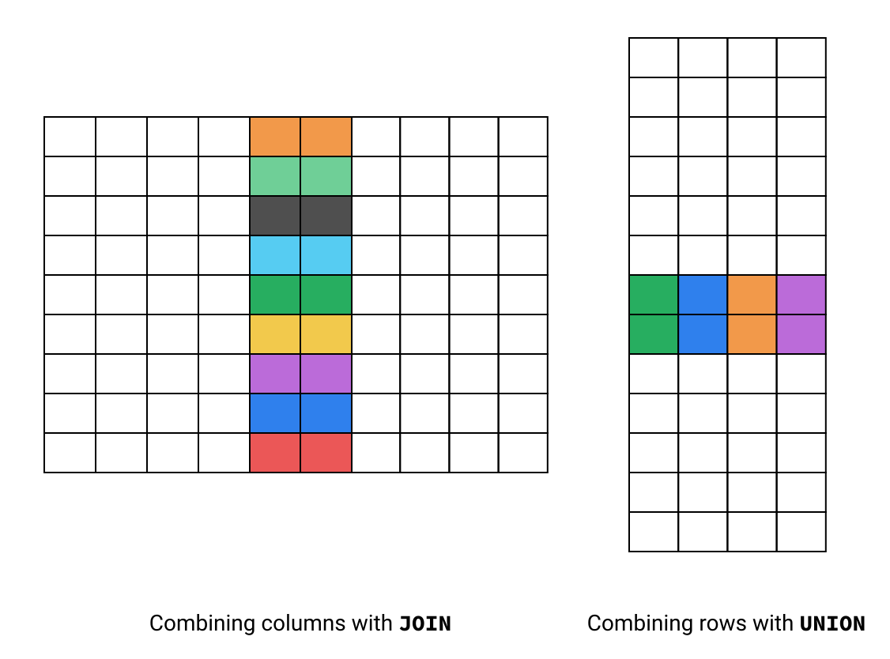

The syntax for the union operator is composed of two or more `SELECT` statements:

```sql
[select_statement_one]
UNION
[select_statement_two]
```

Rather than using the `ON` keyword, the statements before and after `UNION` must have the same number of columns, with compatible types in order. We'll learn more about types in a later lesson, but as an example, `FLOAT` and `INT` are compatible types, but `FLOAT` and `TEXT` are not).

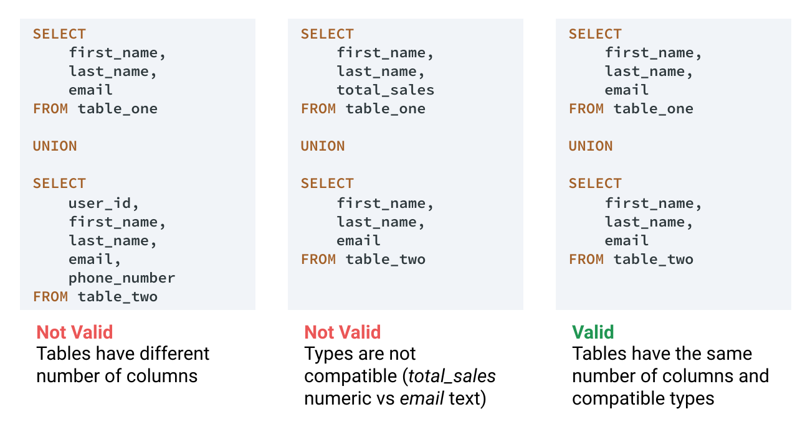

Because we created `customer_usa` and `customer_gt_90_dollars` with identical column names, order, and type as `customer`, we can safely use `UNION`.

To achieve our first scenario (identify customers who are in the USA **or have** spent more than $90), the two `SELECT` statements will be very simple - we can just select all columns and rows from each of the two views.


## Combining Rows Using Intersect and Except

The three scenarios we discussed at the start of the previous screen were:

- Customers who are in the USA **or have** spent more than $90
- Customers who are in the USA **and have** spent more than $90
- Customers who are in the USA **and have not** spent more than $90

We just successfully used `UNION` for the first, but what about the other two? There are two other operators that will help us with these - **intersect** and **except**. Combined, these three operators allow us to perform [set operations](https://en.wikipedia.org/wiki/Set_(mathematics)#Basic_operations) in SQL. Here's a diagram and explanation of how these compare with union.

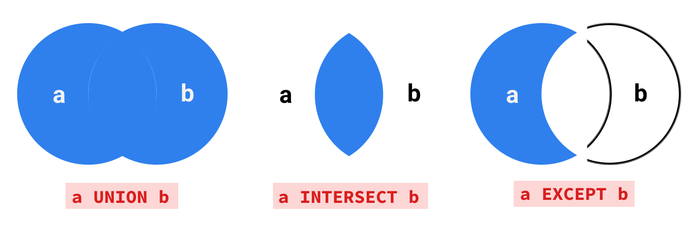

| Operator    | What it Does                                                 | Python Equivalent |
| ----------- | ------------------------------------------------------------ | ----------------- |
| `UNION`     | Selects rows that occur in either statement.                 | `or`              |
| `INTERSECT` | Selects rows that occur in both statements.                  | `and`             |
| `EXCEPT`    | Selects rows that occur in the first statement, but don't occur in the second statement. | `and not`         |

Both the syntax and the rules about column number and ordering of similar types are the same for `INTERSECT` and `EXCEPT` as they are for `UNION`. This means that identifying customers who are in the USA and have spent more than $90 can be done with the following query:

```sql
SELECT * from customer_usa

INTERSECT

SELECT * from customer_gt_90_dollars;
```

Identifying customers who are in the USA and have not spent $90 can be done with the following query:

```sql
SELECT * from customer_usa

EXCEPT

SELECT * from customer_gt_90_dollars;
```

The results of `UNION`, `INTERSECT` and `EXCEPT` conform to the 'everything in SQL is a table' concept we learned in the SQL fundamentals course. The results of these operations can be used in subqueries and joined to other tables for more complex analysis. Let's look at a scenario where we'll need to join the results of a set operation to another table:


```sql
WITH customers_usa_gt_90 AS
(
    SELECT * from customer_usa

    INTERSECT

    SELECT * from customer_gt_90_dollars
)

SELECT 
    e.first_name || " " || e.last_name employee_name,
    COUNT(c.customer_id) customers_usa_gt_90
FROM employee e
LEFT JOIN customers_usa_gt_90 c ON c.support_rep_id = e.employee_id
WHERE e.title = "Sales Support Agent"
GROUP BY 1
ORDER BY 1
```


## Multiple Named Subqueries

When we learned about `WITH`, we said *with clauses allow you to define one or more named subqueries*, but we didn't show you the syntax for creating more than one named subquery. To do this, you use a single `WITH` clause and multiple, comma-separated alias/subquery pairs:

```sql
WITH
    [alias_name] AS ([subquery]),
    [alias_name_2] AS ([subquery_2]),
    [alias_name_3] AS ([subquery_3])

SELECT [main_query]
```

While each subquery can be independent, we can actually use the result of the first subquery in subsequent subqueries, and so on. This can be a useful way of building readable complex queries.

Let's look at a simple example where we create three named subqueries that build on each other.

```sql
WITH
    usa AS
        (
        SELECT * FROM customer
        WHERE country = "USA"
        ),
    last_name_g AS
        (
         SELECT * FROM usa
         WHERE last_name LIKE "G%"
        ),
    state_ca AS
        (
        SELECT * FROM last_name_g
        WHERE state = "CA"
        )

SELECT
    first_name,
    last_name,
    country,
    state
FROM state_ca
```

| first_name | last_name | country | state |
| ---------- | --------- | ------- | ----- |
| Tim        | Goyer     | USA     | CA    |

In reality, we'd usually write this as a single query using multiple `AND` operators in our `WHERE` clause, but it helps us demonstrate how multiple subqueries can be defined with a single `WITH` clause. Let's use a more 'real life' example to gather total sales data on customers from India.