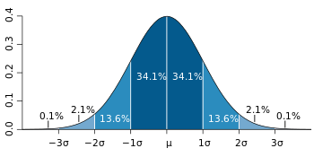

# Dispersion

https://www.statisticshowto.com/dispersion/

Dispersion in statistics is a way of describing how spread out a set of data is. When a data set has a large value, the values in the set are widely scattered; when it is small the items in the set are tightly clustered. Very basically, this set of data has a small value:
1, 2, 2, 3, 3, 4
…and this set has a wider one:
0, 1, 20, 30, 40, 100

The spread of a data set can be described by a range of descriptive statistics including [variance](https://www.statisticshowto.com/probability-and-statistics/variance/), [standard deviation](https://www.statisticshowto.com/probability-and-statistics/standard-deviationon/), and [interquartile range](https://www.statisticshowto.com/probability-and-statistics/interquartile-range/). Spread can also be shown in graphs: [dot plots](https://www.statisticshowto.com/what-is-a-dot-plot/), [boxplots](https://www.statisticshowto.com/probability-and-statistics/descriptive-statistics/box-plot/), and [stem and leaf plots](https://www.statisticshowto.com/stemplot/) have a greater distance with samples that have a larger dispersion and vice versa.


# **Interquartile range**

https://www.statisticshowto.com/probability-and-statistics/interquartile-range/

The **interquartile range** is a measure of where the “[middle fifty](https://www.statisticshowto.com/middle-fifty/)” is in a data set. Where a [range ](https://www.calculushowto.com/types-of-functions/domain-and-range-of-a-function/)is a measure of where the beginning and end are in a set, **an interquartile range is a measure of where the bulk(większość) of the values lie.** That’s why it’s preferred over many other [measures of spread](https://www.statisticshowto.com/measures-of-spread/) when reporting things like school performance or SAT scores.

The interquartile range formula is the first [quartile ](https://www.statisticshowto.com/probability-and-statistics/statistics-definitions/what-are-quartiles/)subtracted from the third [quartile](https://www.statisticshowto.com/probability-and-statistics/statistics-definitions/what-are-quartiles/):

**IQR = Q3 – Q1.**

# Standard Deviation

https://www.statisticshowto.com/probability-and-statistics/standard-deviation/

https://www.scribbr.com/statistics/outliers/

Standard deviation is a measure of dispersement in statistics. “Dispersement” tells you how much your data is spread out. Specifically, it shows you how much your data is spread out around the [mean](https://www.statisticshowto.com/probability-and-statistics/statistics-definitions/mean-median-mode/#mean) or [average](https://www.statisticshowto.com/arithmetic-mean/). For example, are all your scores close to the average? Or are lots of scores way above (or way below) the average score?

The following graph of a [normal distribution](https://www.statisticshowto.com/probability-and-statistics/normal-distributions/) represents a great deal of data in real life. The [mean](https://www.statisticshowto.com/probability-and-statistics/statistics-definitions/mean-median-mode/#mean), or average, is represented by the Greek letter μ, in the center. Each segment (colored in dark blue to light blue) represents one standard deviation away from the mean. For example, 2σ means two standard deviations from the mean.

[](https://www.statisticshowto.com/probability-and-statistics/standard-deviation/)


The Σ sign in the formula means “to add up” (see: [Sigma notation](https://calculushowto.com/what-is-sigma-summation-notation/)). 

# Outliers

https://towardsdatascience.com/5-ways-to-detect-outliers-that-every-data-scientist-should-know-python-code-70a54335a623

**In statistics**, outliers are data points  that don’t belong to a certain population. It is an abnormal observation that lies far away from other values. An outlier is an observation that diverges from otherwise well-structured data.

Being an outlier in itself does not make a data value invalid or erroneous (as in the previous example with Bill Gates). Still, outliers are often the result of data errors such as mixing data of different units (kilometers versus meters) or bad readings from a sensor. When outliers are the result of bad data, the **mean** will result in a poor estimate of location, while the **median** will be still be valid. In any case, outliers should be identified and are usually worthy of further investigation.

## **Method 1 — Standard Deviation:**

In statistics, If a data distribution is approximately normal then about  68% of the data values lie within one standard deviation of the mean and about 95% are within two standard deviations, and **about 99.7%** lie within three standard deviations


Therefore, if you have any data point that is more than 3 times the  standard deviation, then those points are very likely to be anomalous or outliers.

```python
import numpy as np
import matplotlib.pyplot as plt
seed(1)


# multiply and add by random numbers to get some real values
data = np.random.randn(50000)  * 20 + 20

# Function to Detection Outlier on one-dimentional datasets.
def find_anomalies(data):
    #define a list to accumlate anomalies
    anomalies = []
    
    # Set upper and lower limit to 3 standard deviation
    random_data_std = std(random_data)
    random_data_mean = mean(random_data)
    anomaly_cut_off = random_data_std * 3
    
    lower_limit  = random_data_mean - anomaly_cut_off 
    upper_limit = random_data_mean + anomaly_cut_off
    print(lower_limit)
    # Generate outliers
    for outlier in random_data:
        if outlier > upper_limit or outlier < lower_limit:
            anomalies.append(outlier)
    return anomalies

find_anomalies(data)
```

## Method 2 — Boxplots


Box plots are a graphical depiction of numerical data through their  quantiles. It is a very simple but effective way to visualize outliers.  Think about the lower and upper whiskers as the boundaries of the data  distribution. Any data points that show above or below the whiskers, can be considered outliers or anomalous. Here is the code to plot a box  plot:

<iframe src="https://towardsdatascience.com/media/74248bc899cd30db3ebd9b4229d8952b" allowfullscreen="" title="boxplot.py" class="fq aq as ag cf" scrolling="auto" width="692" height="127" frameborder="0"></iframe>

The above code displays the plot below. As you can see, it considers  everything above 75 or below ~ -35 to be an outlier. The results are  very close to method 1 above.


### Boxplot Anatomy:

The concept of the I**nterquartile Range** (**IQR**) is used to build the boxplot graphs. IQR is a concept in statistics  that is used to measure the statistical dispersion and data variability  by dividing the dataset into quartiles.

In simple words, any dataset or any set of observations is divided into  four defined intervals based upon the values of the data and how they  compare to the entire dataset. A quartile is what divides the data into  three points and four intervals.


Interquartile Range (IQR) is important because it is used to define the outliers. It  is the difference between the third quartile and the first quartile (IQR = Q3 -Q1). Outliers in this case are defined as the observations that  are below (Q1 − 1.5x IQR) or *boxplot lower whisker* or above (Q3 + 1.5x IQR) or *boxplot upper whisker*.


## Method 3 - Using the Interquartile Rule to Find Outliers

Though it's not often affected much by them, the interquartile range can be used to detect outliers. This is done using these steps:

1. Sort your data from low to high
2. Identify the first quartile (Q1), the median, and the third quartile (Q3).
3. Calculate your IQR = Q3 – Q1
4. Calculate your upper fence = Q3 + (1.5 * IQR) // 1.5 (a constant used to discern outliers).
5. Calculate your lower fence = Q1 – (1.5 * IQR)
6. Use your fences to highlight any outliers, all values that fall outside your fences.

Remember that the interquartile rule is only a rule of thumb that generally holds but does not apply to every case. In general, you should always follow up your outlier analysis by studying the resulting outliers to see if they make sense. Any potential outlier obtained by the interquartile method should be examined in the context of the entire set of data.

## Dealing with outliers

Once you’ve identified outliers, you’ll decide what to do with them. Your main options are retaining or removing them from your dataset. This is similar to the choice you’re faced with when [dealing with missing data](https://www.scribbr.com/statistics/missing-data/).

For each outlier, think about whether it’s a true value or an error before deciding.

- Does the outlier line up with other measurements taken from the same participant?
- Is this data point completely impossible or can it reasonably come from your population?
- What’s the most likely source of the outlier? Is it a natural variation or an error?

In general, you should try to accept outliers as much as possible unless it’s clear that they represent errors or bad data.

### Retain outliers

Just like with missing values, the most conservative option is to keep outliers in your dataset. Keeping outliers is usually the better option when you’re not sure if they are errors.

With a large sample, outliers are expected and more likely to occur. But each outlier has less of an impact on your results when your sample is large enough. The [central tendency](https://www.scribbr.com/statistics/central-tendency/) and [variability](https://www.scribbr.com/statistics/variability/) of your data won’t be as affected by a couple of extreme values when you have a large number of values.

If you have a small dataset, you may also want to retain as much data as possible to make sure you have enough [statistical power](https://www.scribbr.com/statistics/statistical-power/). If your dataset ends up containing many outliers, you may need to use a statistical test that’s more robust to them. Non-parametric statistical tests perform better for these data.

### Remove outliers

Outlier removal means deleting extreme values from your dataset before you perform analyses. You aim to delete any dirty data while retaining true extreme values.

It’s a tricky procedure because it’s often impossible to tell the two types apart for sure. Deleting true outliers may lead to a biased dataset and an inaccurate conclusion.

For this reason, you should only remove outliers if you have legitimate reasons for doing so. It’s important to document each outlier you remove and your reasons so that other researchers can follow your procedures.