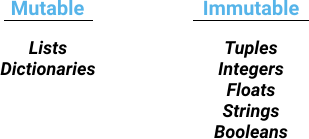
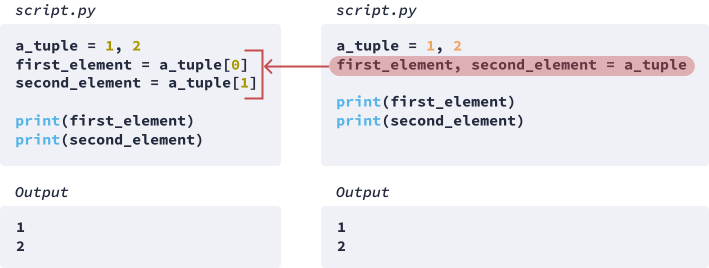
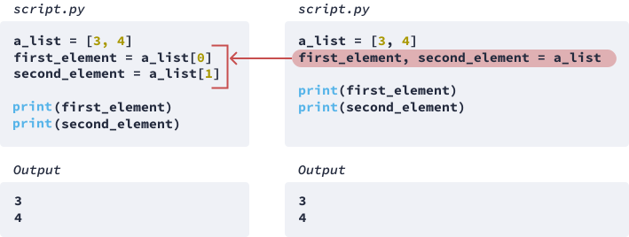

# Python doc search

https://docs.python.org/3/search.html


# list() Syntax

https://www.programiz.com/python-programming/methods/built-in/list

The syntax of `list()` is:

```
list([iterable])
```

------

## list() Parameters

The `list()` constructor takes a single argument:

- **iterable (optional)** - an object that could be a sequence ([string](https://www.programiz.com/python-programming/string), [tuples](https://www.programiz.com/python-programming/tuple)) or collection ([set](https://www.programiz.com/python-programming/set), [dictionary](https://www.programiz.com/python-programming/dictionary)) or any iterator object

## list() Return Value

The `list()` constructor returns a list.

- If no parameters are passed, it returns an empty list
- If iterable is passed as a parameter, it creates a list consisting of iterable's items.


# with statement

https://www.educative.io/edpresso/the-with-statement-in-python

The **`with` statement** in Python is used for resource management and exception handling. You’d most likely find it when working with file streams. For example, the statement ensures that the file stream process doesn’t block other processes if an exception is raised, but terminates properly.

The code block below shows the `try`-`finally` approach to file stream resource management.

```python
file = open('file-path', 'w') 
try: 
    file.write('Lorem ipsum') 
finally: 
    file.close() 
```

Normally, you’d want to use this method for writing to a file, but the `with` statement offers a cleaner approach:

```python
with open('file-path', 'w') as file: 
    file.write('Lorem ipsum') 
```

The `with` statement simplifies our `write` process to just two lines.

It is also used in database CRUD processes. This example was taken from [this site](https://mherman.org/blog/flask-for-node-developers/):

```python
def get_all_songs():
    with sqlite3.connect('db/songs.db') as connection:
        cursor = connection.cursor()
        cursor.execute("SELECT * FROM songs ORDER BY id desc")
        all_songs = cursor.fetchall()
        return all_songs
```

Here, `with` is used to query an SQLite database and return its content.


# Dictionaries

https://www.dataquest.io/blog/python-dictionary-tutorial/

# Tuple

Recall that the structure of the output `(20, 10)` is a **tuple**, which is a data type that is similar to a list.

```python
def sum_and_difference (a, b):
    a_sum = a + b
    difference = a - b
    return a_sum, difference
    # We switched the order of return values

sum_diff = sum_and_difference(15, 5)
print(type(sum_diff))
```

Copy

```python
Output
<class 'tuple'>
```

Just like a list, we usually use a tuple to store multiple values. Creating a tuple is like creating a list, except we need to use parentheses instead of brackets.

```python
a_list = [1, 'a', 10.5]
a_tuple = (1, 'a', 10.5)

print(a_tuple)
print(type(a_tuple))
```

Copy

```
Output
(1, 'a', 10.5)
<class 'tuple'>
```

Just like lists, tuples support positive and negative indexing.

```python
a_list = [1, 'a', 10.5]
a_tuple = (1, 'a', 10.5)

print(a_tuple[0])
print(a_list[0])
print(a_tuple[-1])
print(a_list[-1])
```

Copy

```
Output
1
1
10.5
10.5
```

The main difference between tuples and lists is whether we can modify the existing values or not. In the case of tuples, we can't modify the existing values, while in the case of lists, we can. Below, we're trying to modify the first value of a list and a tuple.

```python
a_list = [1, 'a', 10.5]
a_list[0] = 99
print(a_list)
```

Copy

```python
Output
[99, 'a', 10.5]
a_tuple = (1, 'a', 10.5)
a_tuple[0] = 99
print(a_tuple)
```

Copy

```
Output
TypeError: 'tuple' object does not support item assignment
```

We call tuples **immutable** data types, because we can't change their state after we've created them. We call lists **mutable** data types, because we can change their state after we've created them. The only way we could modify tuples and immutable data types is by recreating them. This is a list of all the mutable and immutable data types we've learned so far.





### How we can create tuple

When we create a tuple, surrounding the values with parentheses is optional. It's enough to write the individual values and separate each with a comma. Below, we see two ways of creating a tuple, with parentheses and without:

```python
a_tuple = (1, 'a')
print(a_tuple)
print(type(a_tuple))
```

Copy

```
Output
(1, 'a')
<class 'tuple'>
a_tuple = 1, 'a'
print(a_tuple)
print(type(a_tuple))
```

Copy

```
Output
(1, 'a')
<class 'tuple'>
```

### Returning tuple

With this in mind, remember the syntax we used in the `return` statement to return multiple values:

```python
def sum_and_difference (a, b):
    a_sum = a + b
    difference = a - b
    return a_sum, difference
    # Separate variable names with a comma

sum_diff = sum_and_difference(15, 5)
print(sum_diff)
```

Copy

```
Output
(20, 10)
```

When we use `return a_sum, difference`, Python thinks we want the tuple `a_sum, difference` returned. This is why multiple variables return as tuples. If we want to return a list instead of a tuple, we need to use brackets:

```
def sum_and_difference (a, b):
    a_sum = a + b
    difference = a - b
    return [a_sum, difference]
    # Use brackets to return a list

sum_diff = sum_and_difference(15, 5)
print(sum_diff)
print(type(sum_diff))
```

Copy

```
Output
[20, 10]
<class 'list'>
```

When we work with tuples, we can assign their individual elements to separate variables in a single line of code.

### Assigning tuple to multiple variables




We can do the same with lists — we can assign individual list elements to separate variables in a single line of code:





We can use this variable assignment technique with functions that return multiple variables.

```python
def sum_and_difference(a, b, do_sum=True):
    a_sum = a + b
    difference = a - b
    return a_sum, difference

a_sum, a_diff = sum_and_difference(15, 5)
print(a_sum)
print(a_diff)
```

Copy

```
Output
20
10
```


# Built-in Functions

https://docs.python.org/3/library/functions.html

# Functions

## Default arguments

When we initiate parameters with default arguments, passing arguments to those parameters when we call the function becomes optional. If we don't pass in an argument, Python uses the default argument. However, if a parameter doesn't have a default argument, we must pass in an argument — otherwise we'll get an error.

```python
def add_value(x, constant=10):
    return x + constant

print(add_value())
```

Copy

```python
Output
TypeError: add_value() missing 1 required positional argument: 'x'
```

Default arguments are easy to modify when we call a function:

```python
def add_value(x, constant=10):
    return x + constant

print(add_value(3, constant=50))
print(add_value(3, constant=26))
print(add_value(3, constant=97))
```

If all parameters have default arguments, then we can call a function without passing in an argument:

```python
def add_value(x=9, constant=10):
    return x + constant

print(add_value())
```

Copy

```python
Output
19
```

Default arguments come in handy when we anticipate that we'll use an argument frequently — this can save us some time when we reuse the functions. Default arguments are also very useful for building complex functions, as we'll see on the next screen.

## return statement

Note that there's more than one way to make the `sum_or_difference()` function work. Below, we redefine the function without using an `else` clause:

```python
def sum_or_difference(a, b, return_sum=True):
    if return_sum:
        return a + b

    return a - b

print(sum_or_difference(10, 5, return_sum=True))
print(sum_or_difference(10, 5, return_sum=False))
```

Copy

```python
Output
15
10
```

The above approach works because a function stops executing its definition code as soon as a `return` statement executes. If there's any remaining code after that `return` statement, it won't execute.

Above, if `return_sum` is `True`, then `return a + b` executes, so the function stops, and it doesn't execute any of the remaining code. If `return_sum` is `False`, then `return a + b` doesn't execute, so the function moves forward and eventually reaches the next `return` statement, which returns `a - b`.

## Returning multiple variables

Fortunately, Python allows us to build functions that return more than one variable. This means that we can create a function that returns a sum and a difference.

```python
def sum_and_difference (a, b):
    a_sum = a + b
    difference = a - b
    return a_sum, difference
    # Separate variable names with a comma

sum_diff = sum_and_difference(15, 5)
print(sum_diff)
```

Copy

```
Output
(20, 10)
```

Above, we passed `15` and `5` as arguments to the `sum_and_difference()` function. The function returned `(20, 10)`, where `20` is the sum, and `10` is the difference. The order of the returned values matches the order of the variables in the `return` statement.

```python
def sum_and_difference (a, b):
    a_sum = a + b
    difference = a - b
    return difference, a_sum
    # We switched the order of return values

sum_diff = sum_and_difference(15, 5)
print(sum_diff)
```

Copy

```
Output
(10, 20)
```

It may seem odd that the structure of the output `(20, 10)`. `(20, 10)` is a **tuple**, which is a data type that is very similar to a list (examples of data types include integers, strings, lists, dictionaries, etc.). 

## Functions without return

So far, we've been using parameters and `return` statements for all our functions. However parameters and `return` statements are optional:

```python
def print_constant():
    x = 3.14
    print(x)

print_constant()
```

Copy

```
Output
3.14
```

Functions without a `return` statement don't return any value. Strictly speaking, they return a `None` value which represents the absence of a value. The `None` value is an instance of the `NoneType` data type (just like `5.321` is an instance of the `float` data type).

```python
def print_constant():
    x = 3.14
    print(x)

j = print_constant()
print(j)
print(type(j))
```

Copy

```
Output
3.14
None
<class 'NoneType'>
```

We'll discuss more applications of the `None` value in the next course.

In the function above, notice that we assigned `3.14` to a variable named `x`. Although we clearly defined `x`, it turns out that we can't access `x` outside the function definition — Python raises a `NameError` and says that `x` isn't defined.

```python
def print_constant():
    x = 3.14
    print(x)

print(x)
```

Copy

```
Output
NameError: name 'x' is not defined
```

To debug the code above, let's start by mentioning that Python doesn't run the code we write inside a function's definition until we call that function. In the code example above, `x = 3.14` is never run. This behavior applies to every function we create. We'll discuss this in more detail soon. For now, let's practice what we've learned.

# Scope

The error from the previous exercise may have been completely unexpected. After all, we called the `print_constant()` function, which means that `x = 3.14` must have executed. So why did we still get an error telling us that `x` is undefined?

```
def print_constant():
    x = 3.14
    print(x)

print(x)
```

Copy

```
Output
NameError: name 'x' is not defined
```

When we call `print_constant()`, `x = 3.14` executes, but the quirk is that Python only saves the `x` variable *temporarily*. Python saves `x` into a kind of **temporary memory**, which is immediately *erased* after the `print_constant()` finishes running.

This explains why `x` is still undefined even after we call `print_constant()` — the temporary memory associated with `print_constant()` is immediately erased after the function finishes running and freed up for later use.

This kind of temporary memory storage doesn't apply to the code that is running outside function definitions. If we define `x = 3.14` in our **main program** (outside function definitions), we can use `x` later on without having to worry that it was erased from memory.

```
x = 3.14

print('random code')
print('more random code')

print(x)
```

Copy

```
Output
random code
more random code
3.14
```

The temporary memory associated with a function is *isolated* from the memory associated with the main program. As a result, we can initialize a variable `x = 10` in the main program, and then execute `x = 3.14` in the body of a function without overwriting the `x` variable of the main program.

```
x = 10

def print_constant():
    x = 3.14
    print(x)

print_constant()
print(x)
```

Copy

```
Output
3.14 # Function
10 # Main program
```

This memory isolation is useful because we don't have to worry about overwriting variables from the main program when we write functions — or vice-versa. This is especially helpful when it becomes difficult to remember all the variable names used while writing large programs.

This memory isolation also means that some variables can be accessed only from certain parts of a program. We've already seen in one of the examples above that we couldn't access `x` from the main program, because it was only defined in the function definition which is memory-isolated from the main program.

```
def print_constant():
    x = 3.14
    print(x)

print_constant()
print(x)
```

Copy

```
Output
NameError: name 'x' is not defined
# There's no 'x' variable defined in the main program
```

We often call the part of a program where we can access a variable the **scope**. The variables defined in the main program are in the **global scope**, while the variables defined inside a function are in the **local scope**.

Let's practice scopes before resuming the discussion on the next screen. For the exercise below, we've already defined three variables in the code editor: `e`, `a_sum`, and `length`. We've also disabled answer-checking to encourage you to experiment more with running code.