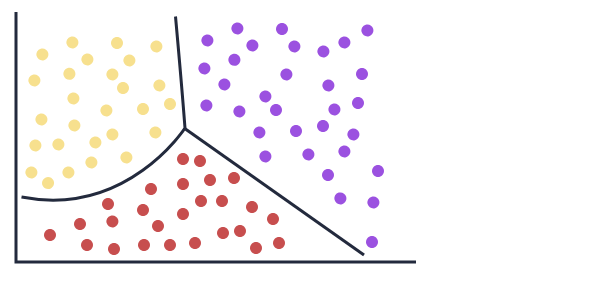

# The Workflow


Sample data set

https://scikit-learn.org/stable/datasets/toy_dataset.html#breast-cancer-dataset

https://archive.ics.uci.edu/dataset/17/breast+cancer+wisconsin+diagnostic

## **Feature**

* How many lessons students have completed on the website.
* How many courses they've completed so far.
* How many exercises they've successfully passed.
* How many hours they've spent on each lesson.

Each of the above is called a  **feature** . They all describe or are a property of our data. When we work with tabular data, each column name corresponds to a feature -- except one:

* Whether or not a learner has already completed the course. (Target variable)

## Features in terms of dataframe

Features are all the columns without the "target"" column

```python
X = cancer_df.drop(["target"], axis=1)
```

## **target variable**

Whether or not a learner has already completed the course. - this is target variable

The column corresponding to the above is called the **target variable** because that's what we want our model to predict. That's our target.

* There are two **classes** in the target variable:
  * `WDBC-Malignant`
  * `WDBC-Benign`

## **observation** or a **feature vector**

Every row for the above would contain information related to an individual learner. Each of these rows is called an **observation** or a  **feature vector** . It's an n-dimensional vector of features

# What is a machine learning Model

A machine learning model is a file that has been trained to recognize certain types of patterns. You train a model over a set of data, providing it an algorithm that it can use to reason over and learn from those data.

Once you have trained the model, you can use it to reason over data that it hasn't seen before, and make predictions about those data. For example, let's say you want to build an application that can recognize a user's emotions based on their facial expressions. You can train a model by providing it with images of faces that are each tagged with a certain emotion, and then you can use that model in an application that can recognize any user's emotion. See the [Emoji8 sample](https://github.com/Microsoft/Windows-Machine-Learning/tree/master/Samples/Emoji8/UWP/cs) for an example of such an application.


# Supervised vs. Unsupervised Learning

https://towardsdatascience.com/supervised-vs-unsupervised-learning-14f68e32ea8d

The main difference between the two types is that supervised learning is done using a  **ground truth** , or in other words, we have prior knowledge of what the output values for our samples should be. Therefore, the goal of supervised learning is to learn a function that, given a sample of data and desired outputs, best approximates the relationship between input and output observable in the data.

Unsupervised learning, on the other hand, does not have labeled outputs, so its goal is to infer the natural structure present within a set of data points.

# Supervised Machine Learning: Classification

Even though classification and regression are both from the category of supervised learning, they are not the same.

* The prediction task is a ***classification*** when the target variable is discrete. An application is the identification of the underlying sentiment of a piece of text.
* The prediction task is a ***regression*** when the target variable is continuous. An example can be the prediction of the salary of a person given their education degree, previous work experience, geographical location, and level of seniority.


## Labeling

Lableling in Machine Learning (ML) refers to the process of assigning labels or classifications to data samples in a dataset. This is an essential step in supervised learning, as it allows the ML model to learn the relationship between input features and output labels.

# Classification

https://www.datacamp.com/blog/classification-machine-learning

Classification is a supervised machine learning method where the model tries to predict the correct label of a given input data. In classification, the model is fully trained using the training data, and then it is evaluated on test data before being used to perform prediction on new unseen data.

#### Eager vs Lazy

Eager learners may require more guidance and support, while lazy learners may need more space and autonomy to learn

#### Eager

Most machine learning algorithms are eager learners, and below are some examples:

* Logistic Regression.
* Support Vector Machine.
* Decision Trees.
* Artificial Neural Networks.

#### Lazy

Let's say we don't know what a giraffe looks like. Someone shows us a  photo of a giraffe and we are able to identify some features that we think are unique to a giraffe. The next time we see a photo of a giraffe, even if it's a completely different one than before, we are highly likely to know that it's a giraffe. Our innate pattern-matching abilities could fail us, and we might confuse it for an ostrich just because of the long neck. But that's unlikely.


We were supplied with a label, along with a set of features, and our brains learned to associate that label with those features. The next time we saw a similar set of features, we were able to predict the correct label. That's the intuition behind the subset of machine learning we'll learn about in this course-- **supervised machine learning** .

### Continuous labels.

 For example, we could be working with a dataset that contains features that describe different types of cars, and the labels could be the price of those cars. Our model would then learn to predict the price of a car, given those features as input.

### Categorical labels.

Our breast cancer dataset has only two labels--benign and malignant, or 0 and 1. Each observation is categorized by its own label or class.

If the label or target we want to predict is a categorical value, we call it a **classification task**. The model, a **classifier**, will try to classify a given set of inputs into a category. There are other types of machine learning models that can be used for different kinds of tasks. We'll learn about those later.

## So, what exactly does the model learn from the data?


### feature space, decision boundary

The points on the charts above are our features in a two-dimensional space. This space is called a **feature space** and the colors represent the labels. The line that we see is a **decision boundary** and it divides the feature space into two. Points on one side of the boundary belong to one class, and points on the other side of the boundary belong to the other class.

### binary classifier, multi-class classifier

That decision boundary is our classifier. Since we only have two labels, it's called a  **binary classifier** . If we had more labels, it would be a  **multi-class classifier** .



### decision boundary where does it come from?

We know that a line or a curve can be defined using a parametric equation. That's what the model tries to learn - the parameters of that equation. The model estimates those parameters from the data, and those estimated parameters define the decision boundary.

# sklearn

## User Guide

https://scikit-learn.org/stable/supervised_learning.html

## train_test_split

The function will split the dataset into a training set and a test set based on a proportion that we decide. Usually, the test set's size is about `15` to `20` percent of the dataset's. Different factors, such as the original dataset's size, can also play a part in deciding that percentage.

* The function splits the data randomly into each set. We'll learn why that's relevant in a future lesson.
* The output of `train_test_split()` is a list containing 4 elements:
  * The training set features.
  * The test set features.
  * The training set labels.
  * The test set labels.

```python
X_train, X_test, y_train, y_test = train_test_split(
    X, y, test_size=0.33, random_state=42)
X_train
y_train
X_test
y_test
```

```python
import pandas as pd

from sklearn.datasets import load_breast_cancer
from sklearn.model_selection import train_test_split

cancer_data = load_breast_cancer(as_frame = True)
cancer_df = cancer_data.data
cancer_df['target'] = cancer_data.target

X = cancer_df.drop(["target"], axis=1)
y = cancer_df['target']

X_train, X_test, y_train, y_test = train_test_split(X,y, test_size=0.15, random_state=417)
```
