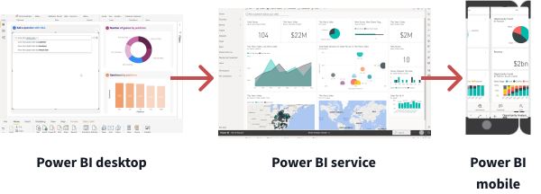
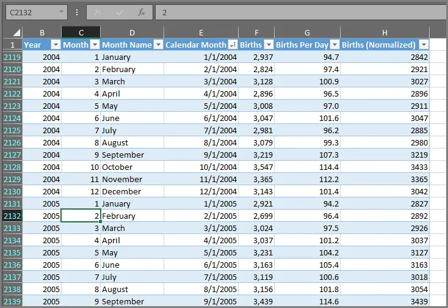
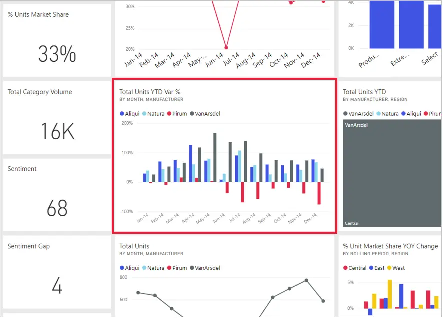
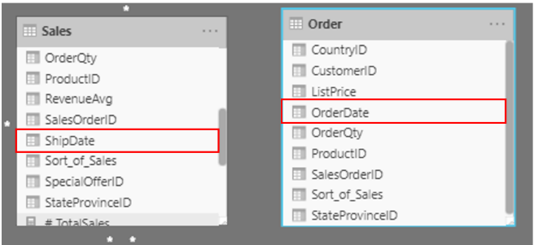
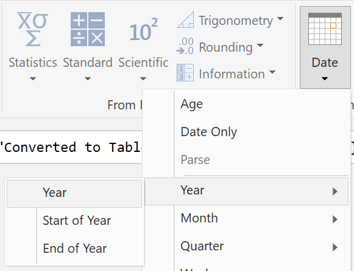
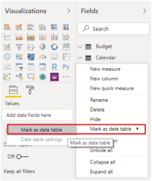
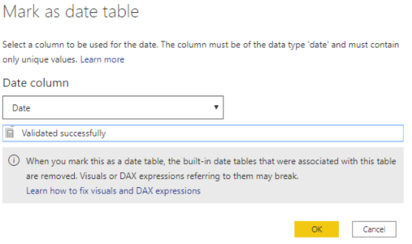
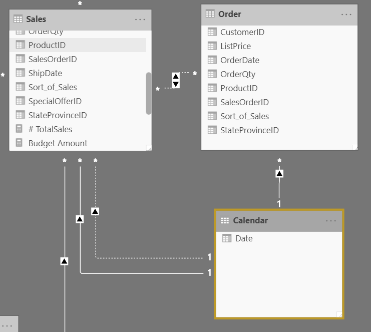

# Power BI Introduction

## Power BI Workflow

Now that we've introduced the basics of Microsoft Power BI, let's jump into some hands-on experience and a guided tour.

The Power BI activities and analyses that you'll learn generally follow a common flow. It looks like this:

1. Bring data into Power BI Desktop, and create a report.
2. Publish to the Power BI service, where you can create new visualizations or build dashboards.
3. Share dashboards with others, especially people who are on the go.
4. View and interact with shared dashboards and reports in Power BI Mobile apps.





You might spend all your time in the Power BI service, reviewing visuals and reports created by others. And that's fine. Someone else on your team might spend their time in Power BI Desktop, which is fine too. To help you understand the full continuum of Power BI and what it can do, we'll show you all the possibilities, then you can decide how to best use it to your advantage.


## Building Blocks of Power BI: Visualizations

Everything you do in Microsoft Power BI breaks down into a few basic **building blocks**. After you understand these building blocks, you can expand on each of them and begin creating elaborate and complex reports. After all, even seemingly complex things are built from basic building blocks. For example, we create buildings with wood, steel, concrete and glass, and we create cars from metal, fabric, and rubber. Of course, buildings and cars can also be basic or elaborate, depending on the arrangements of those basic building blocks.

Let's look at these basic building blocks, discuss some simple things that we can build with them, and then examine how we can also create complex things.

Here are the basic building blocks in Power BI:

- Visualizations
- Datasets
- Reports
- Dashboards
- Tiles

A **visualization** (sometimes also referred to as a visual) is a visual representation of data, like a chart, a color-coded map, or other interesting graphical displays you can create to represent your data. Power BI includes all sorts of visualizations, and more are coming all the time. The following image shows a collection of different visualizations created in Power BI:


Visualizations can be simple, like a single number that represents something significant, or they can be visually complex, like a gradient-colored map that shows voter sentiment about a certain social issue or concern. The goal of a visual is to present data in a way that provides context and insights, both of which would probably be difficult to discern from a raw table of numbers or text.


## Building Blocks of Power BI: Datasets

A **dataset** is a collection of data that Power BI uses to create its visualizations.

You can have a simple dataset that's based on a single table from a **Microsoft Excel workbook**, similar to what we see in the following image.



Datasets can also be a combination of many different sources, which you can filter and combine to create a unique collection of data (a dataset) to use in Power BI.

For example, you can create a dataset from three different data sources, one website table, an Excel table, and online results of an email marketing campaign. That unique combination is still considered a single dataset, even though it comes from many different sources.

Filtering data before bringing it into Power BI lets you focus on the data that matter to you. For example, you can filter your contact database so that only customers who received emails from the marketing campaign are included in the dataset. You can then create visuals based on that subset (the filtered collection) of customers who were included in the campaign. Filtering helps you focus your data — and your efforts.

An important and enabling part of Power BI is its multitude of data **connectors**. Whether the data you want is in *Excel* or a *Microsoft SQL Server database*; in *Azure* or *Oracle*; or in a *service* like Facebook, Salesforce, or MailChimp, **Power BI has built-in data connectors that let you easily connect to that data, filter it if necessary, and bring it into your dataset**. We'll learn more about loading data into Power BI in future lessons.


## Building Blocks of Power BI: Dashboard and Tiles

When you're ready to share a report, or a collection of visualizations, you create a **dashboard**. A Power BI dashboard is a collection of visuals from a single page that you can share with others. Often, it's a selected group of visuals that provide quick insights into the data or story you're trying to present.

A dashboard must fit on a single page, often called a **canvas** (the canvas is the blank backdrop in Power BI Desktop — or the service — where you put visualizations). Think of it like the canvas that an artist or painter uses — a workspace where you create, combine, and rework interesting and compelling visuals.

You can share dashboards with other users or groups, who can then interact with your dashboards when they're in the Power BI service or on their mobile device.

In Power BI, a **tile** is a single visualization on a dashboard. It's the rectangular box that holds an individual visual. In the following image, you see one tile surrounded by other tiles.




# Profiling Data in Power BI

## Finding Data Anomalies and Data Statistics

After you've created a connection to a data source and selected **Transform Data**, you are brought to Power Query Editor, where you can determine if anomalies exist within your data. Data anomalies are outliers within your data. Determining what those anomalies are can help.

You identify what the normal distribution of your data looks like and whether specific data points exist that you need to investigate further. Power Query Editor determines data anomalies by using the **Column Distribution** feature.

Select **View** on the ribbon, and under **Data Preview**, you can choose from a few options. To understand data anomalies and statistics, check the **Column Distribution**, **Column Quality**, and **Column Profile** options. The following figure shows the statistics that appear.

Column quality and Column distribution are shown in the graphs above the columns of data. Column quality shows you the percentages of data that is valid, in error, and empty. In an ideal situation, you want 100 percent of the data to be valid.


> **Note**: By default, Power Query examines the first 1,000 rows of your dataset. To change this, select the profiling status in the status bar and select Column profiling based on entire dataset.

- **Column distribution** shows you the distribution of the data within the column and the counts of distinct and unique values, both of which can tell you details about the data counts. Distinct values are all values in a column, including duplicates and null values, while unique values don't include duplicates or nulls. Therefore, **distinct** in this table tells you the total count of how many values are present, while **unique** tells you how many of those values only appear once.
- **Column profile** gives you a more in-depth look into the statistics within the columns for the first 1,000 rows of data. This column provides several different values, including the count of rows, which is important when verifying whether the importing of your data was successful. For example, if your original database had 100 rows, you could use this row count to verify that 100 rows were, in fact, imported correctly. Additionally, this row count will show how many rows that Power BI has deemed as being outliers, empty rows and strings, and the min and max, which will tell you the smallest and largest values in a column, respectively. This distinction is particularly important in the case of numeric data because it will immediately notify you if you have a maximum value that is beyond what your business identifies as a "maximum." This value calls your attention to these values, which means that you can then focus your efforts when delving deeper into the data. In the case where data was in the text column, as seen in the previous image, the minimum value is the first value, and the maximum value is the last value when in alphabetical order.

Additionally, the Value distribution graph tells you the counts for each distinct value in that specific column. When looking at the graph in the previous image, notice that the value distribution indicates that "Anthony Grosse" appears the greatest number of times within the SalesPerson column and that "Lily Code" appears the least number of times. This information is particularly important because it identifies outliers. If a value appears far more than other values in a column, the Value distribution feature allows you to pinpoint a place to begin your investigation into why this is so.

On a numeric column, **Column Statistics** will also include how many zeroes and null values exist, along with the average value in the column, the standard deviation of the values in the column, and how many even and odd values are in the column. These statistics give you an idea of the distribution of data within the column. They're important because they summarize the data in the column and serve as a starting point to determine the outliers.

For example, while looking through invoice data, you notice that the Value distribution graph shows that a few salespeople in the `SalesPerson` column appear the same number of times within the data. Additionally, you notice the same situation has occurred in the Profit column and in a few other tables as well. During your investigation, you discover that the data you were using was bad data and needed to be refreshed, so you immediately complete the refresh. Without viewing this graph, you might not have seen this error so quickly. This is why value distribution is essential.

After we have completed our edits in Power Query Editor and are ready to begin building visuals, we return to **Home** on the Power Query Editor ribbon and select **Close & Apply**, which will return us to Power BI Desktop and any column edits/transformations will also be applied.

We have now determined the elements that make up profiling data in Power BI, which include loading data in Power BI, interrogating column properties to gain clarity about and make further edits to the type and format of data in columns, finding data anomalies, and viewing data statistics in Power Query Editor.


------


# Data Modeling

https://www.youtube.com/watch?v=PMSN7evZFFE

## Best Practices

- avoid wide tables - wide tables mean also few relations and this can lead to the potential errors 

- Use narrow tables - star schema 

  https://learn.microsoft.com/en-us/power-bi/guidance/star-schema

## **Fact tables**

**Fact tables** contain observational or event data values: sales orders, product counts, prices, transactional dates and times, and quantities. Fact tables can contain several repeated values. For example, one product can appear multiple times in multiple rows, for different customers on different dates. These values can be aggregated to create visuals. For instance, a visual of the total sales orders is an aggregation of all sales orders in the fact table. With fact tables, it is common to see columns that are filled with numbers and dates. The numbers can be units of measurement, such as sale amount, or they can be keys, such as a customer ID. The dates represent time that is being recorded, like order date or shipped date.

## **Dimension tables**

**Dimension tables** contain the details about the data in fact tables: products, locations, employees, and order types. These tables are connected to the fact table through key columns. Dimension tables are used to filter and group the data in fact tables. The dimension tables, by contrast, contain unique values, for instance, one row for each product in the Products table and one row for each customer in the Customer table. For the total sales orders visual, you could group the data so that you see total sales orders by product, in which product is data in the dimension table.

## **Dimension tables** vs **Fact tables**

Fact tables are usually much larger than dimension tables because many events occur in fact tables, such as individual sales. Dimension tables are typically smaller because you are limited to the number of items that you can filter and group on. For instance, a year contains only so many months, and the United States is comprised of only a certain number of states.

Considering this information about fact tables and dimension tables, you might wonder how you can build this visual in Power BI.

The pertinent data resides in two tables, `Employee` and `Sales`, as shown in the following data model. Because the `Sales` table contains the sales order values, which can be aggregated, it is considered a fact table. The `Employee` table contains the specific employee name, which filters the sales orders, so it would be a dimension table. The common column between the two tables, which is the primary key in the `Employee` table, is `EmployeeID`, so we can establish a relationship between the two tables based on this column.


When creating this relationship, we can build the visual according to the requirements, as shown in the following figure. If we didn't establish this relationship, while keeping in mind the commonality between the two tables, we would have had more difficulty building our visual.


Generally, dimension tables contain a relatively small number of rows.  Fact tables, on the other hand, can contain a very large number of rows  and continue to grow over time.


## Normalization vs. denormalization

To understand some star schema concepts described in this article,  it's important to know two terms: normalization and denormalization.

*Normalization* is the term used to describe data that's  stored in a way that reduces repetitious data. Consider a table of  products that has a unique key value column, like the product key, and  additional columns describing product characteristics, including product name, category, color, and size. A sales table is considered normalized when it stores only keys, like the product key. In the following image, notice that only the **ProductKey** column records the product.


If, however, the sales table stores product details beyond the key, it's considered *denormalized*. In the following image, notice that the **ProductKey** and other product-related columns record the product.


When you source data from an export file or data extract, it's likely that it represents a denormalized set of data. In this case, use [Power Query](https://learn.microsoft.com/en-us/training/modules/clean-data-power-bi/) to transform and shape the source data into multiple normalized tables.

As described in this article, you should strive to develop optimized  Power BI data models with tables that represent normalized fact and  dimension data. However, there's one exception where a [snowflake dimension](https://learn.microsoft.com/en-us/power-bi/guidance/star-schema#snowflake-dimensions) should be denormalized to produce a single model table.

## Working with Tables

A simple table structure will have the following features:

- Simple to navigate because of column and table properties that are specific and user-friendly
- Merged or appended tables to simplify the tables within your data structure
- Good-quality relationships between tables (that make sense)

There are two ways to work with tables:

- Configuring data models and building relationships between tables
- Configuring table and column properties


## Star schema relevance to Power BI models

Consider that each Power BI report visual generates a query that is  sent to the Power BI model (which the Power BI service calls a dataset). These queries are used to filter, group, and summarize model data. A  well-designed model, then, is one that provides tables for filtering and grouping, and tables for summarizing. This design fits well with star  schema principles:

- Dimension tables support *filtering* and *grouping*
- Fact tables support *summarization*

There's no table property that modelers set to configure the table  type as dimension or fact. It's in fact determined by the model  relationships. A model relationship establishes a filter propagation  path between two tables, and it's the **Cardinality** property of the relationship that determines the table type. A common relationship cardinality is *one-to-many* or its inverse *many-to-one*. The "one" side is always a dimension-type table while the "many" side  is always a fact-type table. For more information about relationships,  see [Model relationships in Power BI Desktop](https://learn.microsoft.com/en-us/power-bi/transform-model/desktop-relationships-understand).


## Why Date Tables

https://www.datacamp.com/tutorial/how-to-create-date-tables-in-power-bi-tutorial

```
It doesn't "need" one but it's helpful to express dates in many different ways. You can use a script to generate one rather than load a CSV though.

It also comes in handy to join many different tables when working with dates across different sources too. I won't go into the detail here but it's very common to see. Don't feel like you MUST have one though if you're scenario is super simple / single table kind of a set up
```

During report creation in Power BI, a common business requirement is to make calculations based on date and time. Organizations want to know how their business is doing over months, quarters, fiscal years, and so on. For this reason, it's crucial that these time-oriented values are formatted correctly. Power BI autodetects for date columns and tables; however, situations can occur when you will need to take extra steps to get the dates in the format that your organization requires.

For example, suppose that you are developing reports for the sales team at your organization. The database contains tables for sales, orders, products, and more. You notice that many of these tables, including Sales and Orders, contain their own date columns, as shown by the `ShipDate` and `OrderDate` columns in the `Sales` and `Orders` tables. You are tasked with developing a table of the total sales and orders by year and month.

How can you build a visual with multiple tables, each referencing their own date columns?



To solve this problem, you can create a common date table that can be used by multiple tables. Ways to do this include the following:

- Source data
- Data Analysis eXpression (DAX)
- Power Query

## Create a common date table

**Source data**

Occasionally, source databases and data warehouses already have their own date tables. If the administrator who designed the database did a thorough job, these tables can be used to perform the following tasks:

- Identify company holidays
- Separate calendar and fiscal year
- Identify weekends versus weekdays

Source date tables are mature and ready for immediate use. If you have a table as such, bring it into your data model, and don't use any other methods that are outlined in this section. We recommend that you use a source date table because it's likely shared with other tools that you might be using in addition to Power BI.

If you don't have a source date table, you can use other ways to build a common date table.

## Create a Common Date Table Using DAX

You can use **Data Analysis Expression (DAX)** functions to build your common date table. DAX is a programming language that is used throughout Microsoft Power BI for creating calculated columns, measures, and custom tables. It's a collection of functions, operators, and constants that can be used in a formula, or expression, to calculate and return one or more values. We'll learn all about DAX in another lesson, so we won't employ it just yet, but let's cover the basics of how to use DAX functions to build common date tables.

The `CALENDAR()` function returns a contiguous range of dates based on a start and end date that are entered as arguments in the function. Alternatively, the `CALENDARAUTO()` function returns a contiguous, complete range of dates that are automatically determined from your dataset. The starting date is chosen as the earliest date that exists in your dataset, and the ending date is the latest date that exists in your dataset plus data that has been populated to the fiscal month that you can choose to include as an argument in the `CALENDARAUTO()` function.

For the purposes of this example, the `CALENDAR()` function is used because you only want to see the data from **May 31, 2011** (the first day that the sales team began tracking this data) and forward for the next 10 years.

In Power BI Desktop, we go to the **Data** view, select **New table**, and then enter in the following DAX formula:

```
Dates  = CALENDAR(DATE(2011, 5, 31), DATE(2022, 12, 31))
```

Copy


Now, we have a column of dates that we can use. However, this column is slightly sparse. We also want to see columns for just the year, the month number, the week of the year, and the day of the week. We can accomplish this task by selecting **New Column** on the ribbon and entering the following DAX equation, which will retrieve the year from your `Dates` table.

```
Year = YEAR(Dates[Date])
```

Copy


Let's break down the syntax above. `Year` is the new column we created. `YEAR` is one of many built-in date functions used for working with dates. `Dates` is the table we created with the `CALENDAR()` function. And `Date` is the column of dates in the new table we created - we did not specify this name ourselves, it was created by default.

```
Year = YEAR(Dates[Date])
Column_Name = FUNCTION(Table_Name[Column_Name])
```

We can perform the same process to retrieve the month number, week number, and day of the week (selecting **New Column** on the ribbon each time):

```
MonthNum = MONTH(Dates[Date])
```

```
WeekNum = WEEKNUM(Dates[Date])
```

```
DayoftheWeek = FORMAT(Dates[Date], "DDDD")
```


When we have finished, our table will contain the columns that we see in the following figure.


We have now created a common date table by using DAX. Let's now practice with the **Financial Sample** data.


## Create a Common Date Table Using Power Query

We can use **M-language**, the development language that is used to build queries in Power Query, to define a common date table.

We select **Transform Data** in Power BI Desktop, which will direct us to Power Query. In the blank space of the left **Queries** pane, we can right-click to open the following drop-down menu, where we'll select **New Query > Blank Query**.


In the resulting **New Query** view, enter the following **M-formula** to build a calendar table:

```
= List.Dates(#date(2011,05,31), 365*10, #duration(1,0,0,0))
```

Copy


For our sales data, we want the start date to reflect the earliest date that we have in our data: May 31, 2011. Additionally, we want to see dates for the next 11 years, including dates in the future. This approach ensures that, as new sales data flows in, we won't have to re-create this table. We can also change duration. In this case, we want a data point for every day, but we can also increment by hours, minutes, and seconds. The following figure shows the result.


After we have realized success in the process, we notice that we have a list of dates instead of a table of dates. To correct this error, go to the **Transform** tab on the ribbon, and select **Convert > To Table**. As the name suggests, this feature will convert our list into a table. We can also rename the column to `DateCol`.


Next, we want to add columns to our new table to see dates in terms of year, month, week, and day so that we can build a hierarchy in our visual. Our first task is to change the column type by selecting the icon next to the name of the column and, in the resulting drop-down menu, selecting the **Date** data type.


After we have finished selecting the **Date** type, we can add columns for year, months, weeks, and days. For that, we go to **Add Column**, select the drop-down menu under **Date**, and then select **Year**, as shown in the following figure.



Notice that Power BI has added a column of all years that are pulled from `DateCol`.


Complete the same process for months, weeks, and days. After we have finished this process, the table will contain the columns that we see in the following figure.


We have now successfully used Power Query to build a common date table.

The previous steps show how to get the table into the data model. Now, we need to mark our table as the **official date table** so that Power BI can recognize it for all future values and ensure that formatting is correct.


## Mark as the Official Date Table


This process of creating a date table with DAX or M-Code only adds our new table to the data model; we'll still need to establish relationships between our date table and the `Sales` and `Order` tables, and then mark our table as the official date table of our data model.

Your first task in marking your table as the official date table is to find the new table on the **Fields** pane. **Right-click the name of the table**, and then select **Mark as date table**, as we see in the following figure.





When you mark your table as a date table, Power BI performs validations to ensure that the data contains zero null values, is unique, and contains continuous date values over a period. You can also choose specific columns in your table to mark as the date, which can be useful when you have many columns within your table. Right-click the table, select **Mark as date table**, and then select **Date table settings**. The following window will appear, where you can choose which column should be marked as **Date**.





Selecting **Mark as date** table will remove autogenerated hierarchies from the Date field in the table that you marked as a date table. For other date fields, the auto hierarchy will still be present until you establish a relationship between that field and the date table or until you turn off the **Auto Date/Time** feature. You can manually add a hierarchy to your common date table by right-clicking the year, month, week, or day columns in the Fields pane and then selecting New hierarchy. We'll discuss this process later in this module.


## Power BI Hierarchy

https://radacad.com/what-a-power-bi-hierarchy-is-and-how-to-use-it#:~:text=What%20is%20a%20hierarchy%20in,down%20to%20the%20lower%20level.


Power BI hierarchies are a useful structure for drill-down and data exploration in reports. A hierarchy can be created simply and can add great value for you as a developer and end-users for better data analysis. In this article and video, I’ll explain what a Power BI hierarchy is and how to create it.

## Define Data Granularity

### 

**Data granularity** is the detail represented in your data, meaning that the more granularity your data has, the greater the level of detail within your data.

Data granularity is an important topic for all data analysts. Defining the correct data granularity can influence the performance and usability of your Power BI reports and visuals.

Consider a scenario wherein your company manages 1,000 refrigerated semi-trucks. Every few minutes, each truck uses an application to record its current temperature. This temperature is important to your organization because, if the refrigeration were to malfunction, it could spoil the entire load, costing thousands of dollars. All of these trucks, with all these sensors, generates extensive data every day. Your report users don't want to sift through numerous records to find the ones that interest them.

**How can you change the granularity of the data to make the dataset more usable?**

In this scenario, you might want to import the data by using a daily average for each truck. That approach would reduce the records in the database to one record for each truck for each day. If you decide that the approach was acceptable enough for tracking costs and errors, then you could use that data granularity. Alternatively, you could select the last recorded temperature, or you could only import records that are above or below a normal range of temperatures. Any of these methods will reduce the total records that you import, while still bringing in data that is comprehensive and valuable.

For different scenarios, you could settle on data granularity defined weekly, monthly, or quarterly. Generally, the fewer the records that you're working with, the faster your reports and visuals will function. This approach translates to a faster refresh rate for the entire dataset, which might mean that you can refresh more frequently.

However, that approach has a drawback. If your users want to drill into every single transaction, summarizing the granularity will prevent them from doing so, which can have a negative effect on the user experience. It's important to negotiate the level of data granularity with report users so they understand the implications of these choices.


------


# **Hierarchies**


When building a star schema, you'll have **dimension** and **fact** tables.

- Fact tables contain information about events like sales orders, shipping dates, resellers, and suppliers.
- Dimension tables store details about business entities, such as products or time, and connect back to fact tables through a relationship.

You can use **hierarchies** as one source to help you find detail in dimension tables. These hierarchies form through natural segments in your data. For instance, you can have a hierarchy of dates segmented into years, months, weeks, and days. Hierarchies are useful because they allow you to drill down into the specifics of your data.


## Parent-child Hierarchy

The process of viewing multiple child levels based on a top-level parent is known as **flattening the hierarchy**. In this process, you're creating multiple columns in a table to show the hierarchical path of the parent to the child in the same record. You will use `PATH()`, a simple DAX function that returns a text version of the managerial path for each employee, and `PATHITEM()` to separate this path into each level of managerial hierarchy.


While on the table, go to the **Modeling** tab, and select **New Column**. In the resulting formula bar, enter the following function, which creates the text path between the employee and manager. This action creates a calculated column in DAX.

```
Path = PATH(Employee[Employee ID], Employee[Manager ID])
```

Copy


The completed path between the employee and the manager appears in the new column, as we see in the following screenshot.


If you look at Roger M, the path of IDs is `1010 | 1011 | 1013`, which means that one level above Roger M (ID `1013`) is his manager, Pam H (ID `1011`), and one level above Pam H is her manager Roy F (ID `1010`). In this row, Roger M is on the bottom of the hierarchy, at the child level, and Roy F is at the top of the hierarchy and is at the parent level. This path is created for every employee. To flatten the hierarchy, you can separate each level by using the `PATHITEM()` function.

To view all three levels of the hierarchy separately, you can create four columns in the same way that you did previously, by entering the following equations. You will use the `PATHITEM()` function to retrieve the value that resides in the corresponding level of your hierarchy.

```
Level 1 = PATHITEM(Employee[Path],1)
Level 2 = PATHITEM(Employee[Path],2)
Level 3 = PATHITEM(Employee[Path],3)
```

Copy


After you're finished, notice that you now have each level of hierarchy within your table. Roy F (not shown here) is at the top of the hierarchy and, as you go through Levels 2-3, notice that the managers and employees map with each other.


Now, you can create a hierarchy on the **Fields** pane, as you did previously. Right-click Level 1, because this is the first hierarchy level, and then select **New Hierarchy**. Then, drag and drop Level 2 and Level 3 into this hierarchy.


You have now successfully flattened a hierarchy so that you can view individual levels.


## Role-Playing Dimensions


Role-playing dimensions have multiple valid relationships with fact tables, meaning that we can use the same dimension to filter multiple columns or tables of data. As a result, you can filter data differently depending on what information you need to retrieve. This topic is complex, so we're only introducing it in this section. Working with role-playing dimensions requires complex DAX functions that we will discuss in later sections.



The preceding visual shows the `Calendar`, `Sales`, and `Order` tables. `Calendar` is the dimension table, while `Sales` and `Order` are fact tables. The dimension table has two relationships: one with `Sales` and one with `Order`. This is an example of a role-playing dimension because we can use the `Calendar` table to group data in both `Sales` and `Order`. If you want to build a visual in which the `Calendar` table references the `Order` and the `Sales` tables, the `Calendar` table would act as a role-playing dimension.

------


# **Data Analysis Expression (DAX)** 

You can use **Data Analysis Expression (DAX)** functions to build your common date table. DAX is a programming language that is used throughout Microsoft Power BI for creating calculated columns, measures, and custom tables. It's a collection of functions, operators, and constants that can be used in a formula, or expression, to calculate and return one or more values. We'll learn all about DAX in another lesson, so we won't employ it just yet, but let's cover the basics of how to use DAX functions to build common date tables.

The `CALENDAR()` function returns a contiguous range of dates based on a start and end date that are entered as arguments in the function. Alternatively, the `CALENDARAUTO()` function returns a contiguous, complete range of dates that are automatically determined from your dataset. The starting date is chosen as the earliest date that exists in your dataset, and the ending date is the latest date that exists in your dataset plus data that has been populated to the fiscal month that you can choose to include as an argument in the `CALENDARAUTO()` function.


## Example Measures


Avg_time_outside_codebusters_days = CALCULATE(AVERAGE(all_combined_kpi[time_outside_codebusters_hours])/60 / 24)

avg_ticekt_age_SR = CALCULATE(AVERAGE(all_tickets_appended[ticket_age]) /60 / 24, FILTER(all_tickets_appended, all_tickets_appended[type_of_reuqest_id] == 2))

avg_codebusters_time_IR = CALCULATE(AVERAGE(all_tickets_appended[time_on_codebusters]) /60 / 24, FILTER(all_tickets_appended, all_tickets_appended[type_of_reuqest_id] == 1))


Date = CALENDAR(DATE(2022, 12, 01), DATE(2023, 05, 23))

Date = CALENDAR(MIN(all_tickets_appended[Resolved]), MAX(all_tickets_appended[Resolved]))


# My Issues

## Issue with not matching  relationship

change the data type in "transform data" option

1. Power Query Editor: This is where you can perform data transformations and apply various operations to shape and clean your data before loading it into Power BI. When you change the data type of a column in the Power Query Editor, you are modifying the data type at the source, before it gets loaded into the data model.
2. Model view: This is where you define relationships between tables, create measures, and design your visuals. In the Model view, you work with the data that has already been loaded into the data model. You can see the columns, their data types, and modify properties related to how the data is used within Power BI.

In your case, when you changed the data type in the Model view, it didn't reflect the desired changes because the data type conversion had already taken place during the data loading process from Power Query. Changing the data type in the Model view only affects how the column is treated within Power BI, but it doesn't modify the underlying data.

To address the issue, you needed to go back to the Power Query Editor and modify the data type there. By changing the data type in the Power Query Editor, you ensure that the correct data type is applied at the source, and the updated data will be loaded into the data model.

It's important to note that any changes made in the Power Query Editor will impact the entire data loading process, including any subsequent transformations and operations. Therefore, it's recommended to make necessary data type changes early in the data preparation stage, in the Power Query Editor, to ensure consistency and accuracy throughout your data model and visualizations in Power BI.