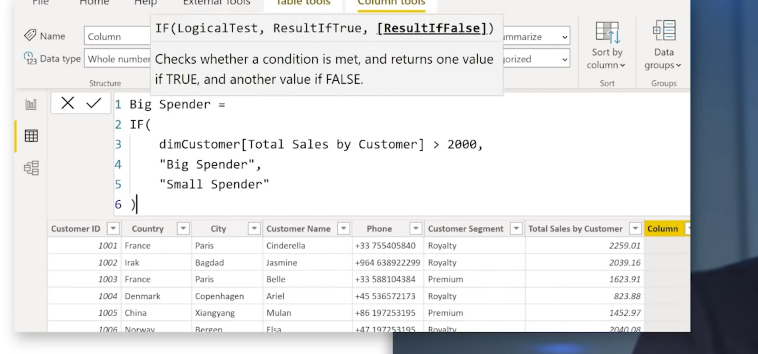

Filter context with "Calculate"

Variables are constant

Row Context

Context Transition (row context to filter context)

Measure automaticly wrap the expresson in calculate function

Measures vs Calculated Column

We use calculated column if we need a break down like:

Measure is needed when we want to calculate proportion amount
