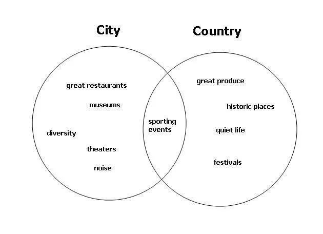

# The Levenshtein distance algorithm

https://www.educative.io/answers/the-levenshtein-distance-algorithm

The **Levenshtein distance (a.k.a edit distance)** is a measure of similarity between two strings. It is defined as the minimum number of changes required to convert string `a` into string `b` (this is done by inserting, deleting or replacing a character in string `a`). The smaller the Levenshtein distance, the more similar the strings are. This is a very common problem in the application of [Dynamic Programming](https://www.educative.io/edpresso/what-is-dynamic-programming).

# What Is a Venn Diagram?

https://www.investopedia.com/terms/v/venn-diagram.asp

A Venn diagram is an illustration that uses circles to show the  relationships among things or finite groups of things. Circles that  overlap have a commonality while circles that do not overlap do not  share those traits.

Venn diagrams help to visually represent the similarities and  differences between two concepts. They have long been recognized for  their usefulness as educational tools. Since the mid-20th century, Venn  diagrams have been used as part of the introductory logic curriculum and in elementary-level educational plans around the world.

##   Understanding Venn Diagrams  

Venn diagrams are useful for illustrating how different concepts or  factors intersect with one another. They can show, at a glance, how  things are similar or different and where and how they overlap. Often,  the center of a Venn diagram (the intersection of two or more circles)  represents some nexus or main idea that can be decomposed into the  various other circles, with labels on the outer portions more general  and distinct ideas than those toward the center.

The overlapping areas can also be used to show where two otherwise  disparate contexts share commonalities. For instance, in the example  diagram below we see that while the urban and rural contexts are  distinct with their own set of acivities, they also do share sporting  events.

