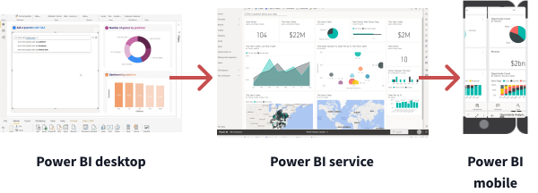
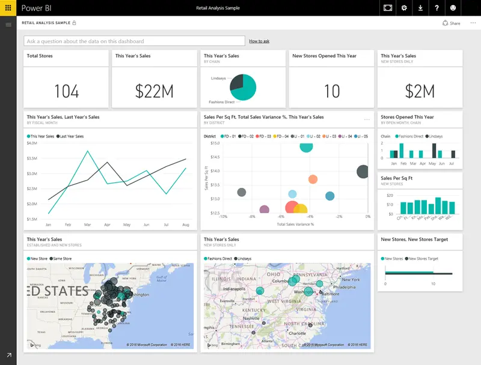
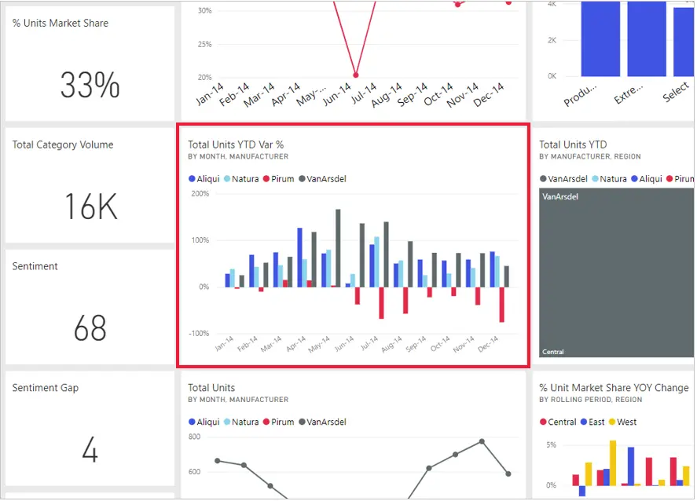

# Power BI Introduction

## Power BI Workflow

Now that we've introduced the basics of Microsoft Power BI, let's jump into some hands-on experience and a guided tour.

The Power BI activities and analyses that you'll learn generally follow a common flow. It looks like this:

1. Bring data into Power BI Desktop, and create a report.
2. Publish to the Power BI service, where you can create new visualizations or build dashboards.
3. Share dashboards with others, especially people who are on the go.
4. View and interact with shared dashboards and reports in Power BI Mobile apps.

You might spend all your time in the Power BI service, reviewing visuals and reports created by others. And that's fine. Someone else on your team might spend their time in Power BI Desktop, which is fine too. To help you understand the full continuum of Power BI and what it can do, we'll show you all the possibilities, then you can decide how to best use it to your advantage.

## Building Blocks of Power BI: Visualizations

Everything you do in Microsoft Power BI breaks down into a few basic **building blocks**. After you understand these building blocks, you can expand on each of them and begin creating elaborate and complex reports. After all, even seemingly complex things are built from basic building blocks. For example, we create buildings with wood, steel, concrete and glass, and we create cars from metal, fabric, and rubber. Of course, buildings and cars can also be basic or elaborate, depending on the arrangements of those basic building blocks.

Let's look at these basic building blocks, discuss some simple things that we can build with them, and then examine how we can also create complex things.

Here are the basic building blocks in Power BI:

- Visualizations
- Datasets
- Reports
- Dashboards
- Tiles

A **visualization** (sometimes also referred to as a visual) is a visual representation of data, like a chart, a color-coded map, or other interesting graphical displays you can create to represent your data. Power BI includes all sorts of visualizations, and more are coming all the time. The following image shows a collection of different visualizations created in Power BI:

Visualizations can be simple, like a single number that represents something significant, or they can be visually complex, like a gradient-colored map that shows voter sentiment about a certain social issue or concern. The goal of a visual is to present data in a way that provides context and insights, both of which would probably be difficult to discern from a raw table of numbers or text.

## Building Blocks of Power BI: Datasets

A **dataset** is a collection of data that Power BI uses to create its visualizations.

You can have a simple dataset that's based on a single table from a **Microsoft Excel workbook**, similar to what we see in the following image.

Datasets can also be a combination of many different sources, which you can filter and combine to create a unique collection of data (a dataset) to use in Power BI.

For example, you can create a dataset from three different data sources, one website table, an Excel table, and online results of an email marketing campaign. That unique combination is still considered a single dataset, even though it comes from many different sources.

Filtering data before bringing it into Power BI lets you focus on the data that matter to you. For example, you can filter your contact database so that only customers who received emails from the marketing campaign are included in the dataset. You can then create visuals based on that subset (the filtered collection) of customers who were included in the campaign. Filtering helps you focus your data — and your efforts.

An important and enabling part of Power BI is its multitude of data **connectors**. Whether the data you want is in *Excel* or a *Microsoft SQL Server database*; in *Azure* or *Oracle*; or in a *service* like Facebook, Salesforce, or MailChimp, **Power BI has built-in data connectors that let you easily connect to that data, filter it if necessary, and bring it into your dataset**. We'll learn more about loading data into Power BI in future lessons.

## Building Blocks of Power BI: Dashboard and Tiles

When you're ready to share a report, or a collection of visualizations, you create a **dashboard**. A Power BI dashboard is a collection of visuals from a single page that you can share with others. Often, it's a selected group of visuals that provide quick insights into the data or story you're trying to present.

A dashboard must fit on a single page, often called a **canvas** (the canvas is the blank backdrop in Power BI Desktop — or the service — where you put visualizations). Think of it like the canvas that an artist or painter uses — a workspace where you create, combine, and rework interesting and compelling visuals.

You can share dashboards with other users or groups, who can then interact with your dashboards when they're in the Power BI service or on their mobile device.

In Power BI, a **tile** is a single visualization on a dashboard. It's the rectangular box that holds an individual visual. In the following image, you see one tile surrounded by other tiles.

